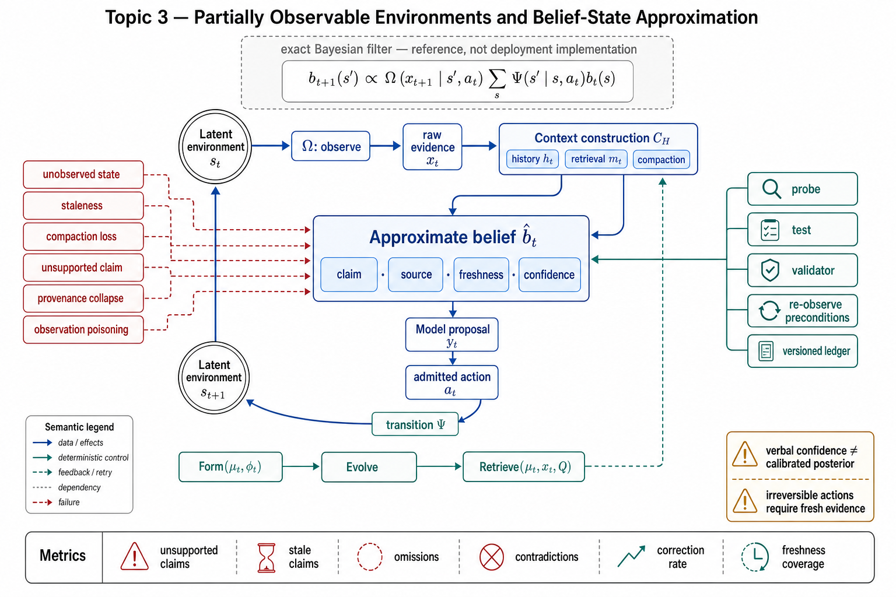

# Topic 3 — Partially Observable Environments and Belief-State Approximation

## 1. Problem and objective

Topic 2 separated latent state $s_t$, raw observation $x_t$, and policy-visible context $c_t=C_H(x_t,h_t,m_t,\mathcal Q)$. Full observability is a valid special case, but most repository, browser, operating-system, and service environments expose only queried slices of state through interfaces with truncation, latency, permissions, and failure modes. The objective here is to make belief maintenance a first-class engineering concern: define the exact Bayesian object, show what deployed LLM systems approximate instead, identify corruption mechanisms, and specify measurements and recovery controls.

## 2. Intuition first

A coding agent asked to fix failing tests does not perceive an entire repository. It observes selected test output, files it chose to read, and notes preserved by its harness. A relevant unread file, a flaky test, a pending process, or a concurrent edit remains outside the policy-visible context until an observation exposes it. Long-running reliability therefore depends on disciplined state estimation: acquiring evidence, preserving provenance, expiring stale claims, and re-observing before consequential actions.

## 3. Formalization

### 3.1 Exact belief state

For a single-agent POMDP, the belief state is the posterior over latent environment state conditioned on raw observations and executed actions:

$$
b_t(s)
\mathrel{=}
P\!\left(
s_t=s
\mid
x_{0:t},a_{0:t-1},\mathcal Q
\right).
$$

Given transition kernel $\Psi$ and observation kernel $\Omega$, the Bayesian filter is:

$$
b_{t+1}(s')
\mathrel{=}
\frac{1}{\mathsf{Norm}_{t+1}}
\Omega(x_{t+1}\mid s',a_t,\mathcal Q)
\sum_{s\in\mathcal S}
\Psi(s'\mid s,a_t,\mathcal Q)b_t(s),
$$

where $\mathsf{Norm}_{t+1}$ is the sum or integral of the unnormalized numerator over $s'$, so the posterior has unit mass. [POMDP]

This equation makes three assumptions explicit: a specified latent-state space, calibrated transition and observation models, and exact conditioning on the required history. Most deployed LLM agents have none of these objects numerically, so the equation is a reference semantics rather than an implementation description.

For multi-agent systems, each agent has a belief conditioned on its own visibility history and the joint-action information available to it. Different agents can therefore hold different, individually rational posteriors even before model error is introduced.

### 3.2 The deployed approximation

LLM-based agents usually maintain a lossy working state estimate rather than a normalized posterior:

$$
\hat b_t^i
\mathrel{=}
\operatorname{ApproxBelief}_{H}^{i}(c_t^i),
\qquad
c_t^i=C_H^i(x_t^i,h_t^i,m_t^i,\mathcal Q),
$$

where $C_H^i$ performs context construction and $\operatorname{ApproxBelief}_{H}^{i}$ denotes the decision-relevant state view induced by that context: summaries, retrieved evidence, provenance annotations, and any structured state ledger. The latter is an analytical projection, not a second harness gate. The model then samples a proposal from:

$$
y_t^i\sim\pi_{M_i}(\cdot\mid c_t^i,\mathcal Q).
$$

$\hat b_t^i$ may be represented by prose, structured records, embeddings, or a hybrid inside $c_t^i$; it is not the latent environment state itself. It is not automatically a sufficient statistic, and a model's verbal confidence is not a calibrated posterior probability. The engineering question is whether the representation retains the decision-relevant facts, uncertainty, provenance, and freshness required for the next proposal.

### 3.3 Memory operators

The memory survey characterizes formation, evolution, and retrieval [MEM §2.2]:

$$
\mathcal M^{\mathrm{form}}_{t+1}
\mathrel{=}
F_M(\mathcal M_t,\phi_t),
$$

$$
\mathcal M_{t+1}
\mathrel{=}
E_M(\mathcal M^{\mathrm{form}}_{t+1}),
$$

$$
m_t
\mathrel{=}
R_M(\mathcal M_t,x_t,\mathcal Q).
$$

The subscripts distinguish memory evolution $E_M$ from the environment $\mathcal E$ and retrieval $R_M$ from a complete run $R$. The artifacts $\phi_t$ may include tool results, plans, state deltas, validator outputs, or model-generated notes. Retrieval once at initialization, trigger-based retrieval, and continuous retrieval implement different belief-maintenance schedules; none is universally optimal.

### 3.4 Compaction

Context compaction is a bounded-capacity, lossy transformation inside $C_H$. The reference runtime summarizes older history and warns that early details may not be preserved [CAL]. Durable task invariants therefore require a versioned, re-injected or re-readable representation. Compaction summaries should preserve provenance and uncertainty rather than convert unverified hypotheses into unqualified facts.

## 4. Corruption mechanisms

| # | Mechanism | Formal signature | Concrete instance |
|---|---|---|---|
| 1 | **Unobserved state** | Decision-relevant state component never affects any acquired $x_t$ | Relevant file or service never queried |
| 2 | **Staleness** | Claim derived from $x_{t-k}$ is used after $\Psi$ or an exogenous process changes its referent | Workspace changed after an earlier test |
| 3 | **Compaction or retrieval loss** | Evidence was present in prior history or memory but absent from current $\hat b_t$ | Early constraint omitted by summary or retrieval |
| 4 | **Unsupported state claim** | $\hat b_t$ asserts a proposition with no traceable observation or validator | Model reports testing or deployment health without evidence [FSC §2.3.3] |
| 5 | **Provenance collapse** | Observation, inference, and model proposal are stored as the same fact type | A tentative diagnosis becomes a durable memory entry |
| 6 | **Observation poisoning** | Adversarial or erroneous interface content enters $\hat b_t$ as trusted evidence | Prompt injection in a document or unsupported peer-agent message |

The system-card incidents establish that unsupported state claims occur at frontier capability [FSC §2.3.3]. They do not estimate a universal prevalence rate; deployment-specific measurement is still required.

## 5. Architecture: engineering the working state estimate

**Observation actions are information investments.** Read, search, probe, and status-check operations can reduce uncertainty before state-changing actions. Their value depends on freshness, coverage, and decision relevance; redundant reads can spend context without improving the estimate.

**Verification is targeted re-observation.** Executable tests, deterministic validators, and state queries compare a specific claim in $\hat b_t$ with observable behavior. Code provides strong instruments when tests cover the relevant specification [CAH §1–2], but passing an incomplete or flaky suite is not an oracle for the whole task.

**External ledgers are durable state estimates.** Progress files, task ledgers, manifests, hashes, and validated checkpoints move selected facts outside the lossy conversational window [CAH §1]. Each entry should record source event, observation time, validation status, and invalidation condition.

**Retrieval schedules are observation policies.** Retrieve-once assumes slow change; continuous retrieval assumes higher drift and pays more latency/context cost [MEM §2.2]. Trigger retrieval from state version changes, phase transitions, uncertainty, or action consequence rather than one global cadence.

**Irreversible actions require fresh evidence.** Freshness is action-relative: a minute-old dependency lockfile can be adequate for drafting a plan but unacceptable for approving a production release.

## 6. Measurement

Belief quality is only partially observable, so measurements must specify the proxy:

- **Trace–artifact consistency.** Harness-Bench's Consistency component asks whether actions, observations, intermediate state, outputs, workspace state, and constraints agree [HB §3.4]. Because an LLM judge supplies this score, it is a proxy with judge error, not ground-truth posterior divergence.
- **Oracle-checkable claims.** Deterministic validators compare selected claims against observable artifacts. Harness-Bench and ALE require checkable outcomes or explicit rubrics [HB §3.2; ALE §2.1].
- **Fact probes.** At fixed checkpoints, derive required facts from an external oracle and compare them with the agent's structured state ledger. Report unsupported-claim, stale-claim, omission, and contradiction rates separately. Querying only the model measures reported belief and can be affected by the probe.
- **Freshness and provenance coverage.** Report the fraction of consequential actions whose preconditions have a recent, source-linked observation or validator result.
- **Fault injection.** Corrupt files, return stale service data, omit tool output, or inject conflicting peer messages; measure detection, correction, and residual contamination.

## 7. Failure modes and mitigations

- **Action on stale evidence** → attach versions or timestamps to state claims; re-observe action-specific preconditions.
- **Summarized-away invariant** → maintain durable, versioned task constraints and re-inject them through $C_H$ [CAL].
- **Self-report substituting for verification** → require external evidence for claims that admit a validator; label judgment-only claims.
- **Poisoned observation channel** → type content by trust boundary, preserve provenance, and prevent untrusted text from redefining system policy.
- **Multi-agent belief divergence** → use shared versioned artifacts, explicit conflict resolution, and per-agent visibility logs; do not assume a shared transcript creates identical beliefs.
- **Recovery over corrupted state** → restore a verified checkpoint before retrying when the failure may have changed environment state.

## 8. Limitations

- Exact belief states are unavailable in most production environments. The practical metrics above evaluate selected claims and traces, not total variation or KL divergence from an unknown posterior.
- A textual or structured ledger may omit information that the model still encodes latently, and a fact probe may change the model's response. Internal-state measurement and operational-state verification answer different questions.
- Sandboxed benchmarks suppress important staleness sources such as concurrent edits and live-service drift [HB §3.2]; their consistency measurements may not transfer unchanged to production.
- Retrieval and compaction are coupled to policy behavior. Improving factual retention can still degrade action quality by increasing context length or surfacing irrelevant evidence.

## 9. Production implications

1. **Specify required state claims per action class.** Treat every unobserved precondition as an explicit assumption.
2. **Store durable truth with provenance, freshness, and validation status.** Do not preserve model inference and external evidence as the same record type.
3. **Gate consequential actions on action-specific fresh evidence.** Consequence and drift rate determine the acceptable age.
4. **Instrument divergence proxies.** Unsupported claims, omissions, contradictions, stale claims, and successful corrections reveal different failure mechanisms.
5. **Design retrieval against measured drift and context cost.** Re-evaluate the schedule when moving from sandboxed to live environments.

## 10. Connections

- Topic 2 supplies $(\rho_0,\Psi,\Omega,C_H,\pi_M,\pi_{\mathrm{exec}})$; this topic explains state estimation between observation and proposal/action selection.
- Topic 6 separates state observability from outcome verifiability; Topic 8 models detection and recovery.
- Chapter 6 engineers $C_H$; Chapter 7 owns $\mathcal M_t$ and $(F_M,E_M,R_M)$; Chapter 10 handles long-horizon checkpointing; Chapter 12 handles adversarial observation channels.

## Sources

[POMDP] Kaelbling, Littman, and Cassandra, "Planning and Acting in Partially Observable Stochastic Domains," *Artificial Intelligence* 101, 1998 — https://doi.org/10.1016/S0004-3702(98)00023-X
[MEM] Memory in the Age of AI Agents, arXiv:2512.13564 (Knowledge_source/2512.13564v2.pdf) §2.1–2.2
[CAL] Claude Agent SDK, "How the agent loop works" — https://code.claude.com/docs/en/agent-sdk/agent-loop
[CAH] Code as Agent Harness, arXiv:2605.18747 (Knowledge_source/2605.18747v1.pdf) §1–2
[HB] Harness-Bench, arXiv:2605.27922 (Knowledge_source/2605.27922v1.pdf) §3.2, §3.4
[FSC] Claude Fable 5 & Mythos 5 System Card, June 9 2026 (Knowledge_source/Claude Fable 5 & Claude Mythos 5 System Card.pdf) §2.3.3
[ALE] Agents' Last Exam, arXiv:2606.05405 (Knowledge_source/2606.05405v2.pdf) §2.1
