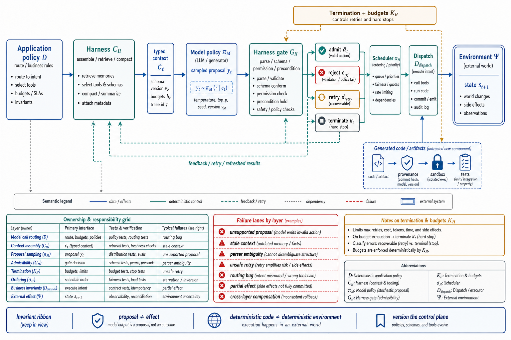

# Topic 4 — Model Policy versus Harness Policy versus Deterministic Application Policy

## 1. Problem and objective

Topic 2 represented action selection as a policy distribution. A deployed system is more structured: application routing decides whether a model is consulted; the harness assembles context and admits or rejects proposals; the model samples candidate outputs; the dispatcher executes admitted actions against an environment with its own transition dynamics. These components have different authors, test methods, failure modes, and release velocities. The objective is a typed pipeline that prevents attribution errors without pretending the layers are independent.

## 2. Intuition first

The model proposes within a context the harness constructed. The harness can admit, transform, reject, retry, or terminate. Application code decides where model-mediated choice is permitted and what happens before and after it. The environment determines the resulting state transition. Asking which layer "caused" an outcome is therefore a causal-analysis problem over coupled components, not a slogan that behavior belongs exclusively to either model or harness.

## 3. Formalization: a typed execution pipeline

### 3.1 Layer responsibilities

**Model policy $\pi_M$.** Given assembled context $c_t$, the model samples a raw output $y_t$:

$$
y_t\sim\pi_M(\cdot\mid c_t).
$$

$y_t$ may contain text, structured action proposals, or both. Sampling, provider infrastructure, and hidden deliberation make this layer stochastic from the application's perspective.

**Harness $H$.** Represent the harness as typed mechanisms rather than one overloaded function:

$$
H=(C_H,G_H,K_H,\sigma_H),
$$

where $C_H$ constructs model context, $G_H$ parses and gates model output, $K_H$ enforces termination and budgets, and $\sigma_H$ schedules admitted actions. Some mechanisms can be deterministic given versioned inputs; classifier gates, randomized recovery, provider behavior, asynchronous scheduling, and external callbacks can make the induced harness policy stochastic.

**Application policy $D$.** Pre-written routing and business rules decide whether a step is deterministic, model-mediated, or terminal:

$$
d_t=D_{\mathrm{route}}(z_t,\mathcal Q)
\in
\{\text{deterministic-step},\text{model-call},\text{terminate}\},
$$

where $z_t$ is typed application state. $D$ is testable as ordinary software when its inputs and dependencies are controlled. Its external effects still pass through $\Psi$ and are not guaranteed deterministic.

### 3.2 End-to-end dataflow

For a model-mediated step:

$$
c_t=C_H(x_t,h_t,m_t,\mathcal Q;H),
$$

$$
y_t\sim\pi_M(\cdot\mid c_t),
$$

$$
g_t\sim G_H(\cdot\mid y_t,z_t;H),
\qquad
g_t\in
\{\operatorname{admit}(\widetilde a_t),
\operatorname{reject}(e_t^{\mathrm{rej}}),
\operatorname{retry}(d_t^{\mathrm{retry}}),
\operatorname{terminate}(\kappa_t)\},
$$

$$
a_t=D_{\mathrm{dispatch}}(\widetilde a_t,z_t;D)
\quad\text{when }g_t=\operatorname{admit}(\widetilde a_t).
$$

$$
s_{t+1}\sim\Psi(\cdot\mid s_t,a_t,\mathcal Q).
$$

Here $\widetilde a_t$ is the typed admitted-action payload, $e_t^{\mathrm{rej}}$ a structured rejection record, and $d_t^{\mathrm{retry}}$ a retry directive containing the reason and remaining allowance. The retry branch returns through context construction with a new trace event; rejection can become runtime feedback to the model; termination is typed by cause. $G_H$ is a stochastic kernel when it invokes a learned or randomized gate and a point-mass kernel when deterministic. This state-machine representation is more accurate than $\pi_D\circ\pi_H\circ\pi_M$, which is type-inconsistent because context construction occurs before the model while admission occurs after it. **[derived — typed synthesis of HB §3, CAL, and BEA]**

### 3.3 Runtime-generated code

Agent-initiated artifacts — scripts, tests, progress files, and temporary tools — are authored through model-mediated actions and later executed under application/harness semantics [CAH §1]. They move decisions from repeated token sampling into inspectable artifacts, but execution is not intrinsically deterministic: inputs, concurrency, clocks, network services, and undefined program behavior remain part of $\Psi$. Treat generated code as an untrusted new component requiring provenance, review, sandboxing, and tests.

## 4. Evidence: the outer layers materially affect outcomes

**(a) Harness variation under a fixed factorial protocol.** Harness-Bench evaluates 106 tasks across 6 configurable harnesses and 8 model backends. Harness-aggregated scores span **52.4 to 76.2**, a 23.8-point spread under the same model pool and task suite [HB §4.1–4.2]. Mean tokens and turns also vary substantially (68.7K–175.1K tokens; 5.0–22.6 turns across harness aggregates), and the top-scoring configurable harness does not use the most tokens [HB Table 2]. This demonstrates configuration-level variation; it does not identify one universal causal effect for each harness component or backend.

**(b) Trace-driven harness optimization.** HarnessX composes typed harness primitives and adapts them from traces. Across its reported ALFWorld, GAIA, WebShop, $\tau^3$-Bench, and SWE-bench Verified experiments, it reports an average gain of **14.5%**, up to **44.0%** in a benchmark/configuration cell [HX abstract]. These results show benchmark-scoped optimization headroom, not a guarantee that harness work dominates a model upgrade in every deployment.

**(c) Model–harness interaction.** Harness-Bench computes variance over harness-level average scores for each backend. Stronger backends tend to show higher means and lower cross-harness variance; weaker backends show larger variance [HB §4.3]. This descriptive interaction means an improvement measured on one backend cannot be assumed to transfer unchanged to another.

**(d) Routing information.** Agent-as-a-Router reports that the best model varies by task and that a router augmented with per-dimension performance statistics improves over its vanilla baseline by **15.3% relative** [AAR §1]. The result supports evidence-aware routing under that study's task distribution. It does not establish that every routing problem is primarily an information deficit.

## 5. Architecture: responsibilities per layer

| Concern | Primary owner | Required check |
|---|---|---|
| Whether a model is consulted | $D_{\mathrm{route}}$ | Deterministic branch and fallback tests |
| Model selection / routing | $D$ or $H$ | Target-distribution routing evaluation and abstention |
| Context assembly and compaction | $C_H$ | Inclusion, provenance, truncation, and injection tests |
| Proposal sampling | $\pi_M$ | Repeated-run behavioral evaluation |
| Parsing and admissibility | $G_H$ | Schema, permission, precondition, and policy tests |
| Retry, budgets, and termination backstop | $K_H$ | Boundedness, typed errors, and recovery-state tests |
| Scheduling and conflict order | $\sigma_H$ | Concurrency and deterministic-replay tests |
| Dispatch and business invariants | $D_{\mathrm{dispatch}}$ | Transaction, idempotency, and rollback tests |
| Environment effect | $\Psi$ | Postcondition observation and external monitoring |

The allocation rule is conditional: place a decision in a deterministic layer when its correct rule is known, maintainable, and testable; allocate model-mediated choice when the decision cannot be adequately enumerated and measured results justify the additional variance and controls.

## 6. Interface semantics

- **$D\rightarrow C_H$:** a typed request to invoke a model for a specified decision, with task contract, allowed action schema, and budget.
- **$C_H\rightarrow\pi_M$:** assembled model context: system policy, tool definitions, selected history, retrieved memory, and current observation.
- **$\pi_M\rightarrow G_H$:** raw text and structured action proposals; no proposal is yet an environment effect.
- **$G_H\rightarrow\pi_M$:** optional rejection, validation error, or tool feedback. Because the model observes this feedback, changing a gate can change subsequent proposal distributions.
- **$G_H\rightarrow\sigma_H\rightarrow D_{\mathrm{dispatch}}$:** admitted typed actions with explicit ordering. The reference runtime may parallelize read-only calls and serialize mutating calls [CAL]; this is a concurrency policy, not a proof that serialized actions are irreversible or that parallel actions are safe.
- **$\Psi\rightarrow\Omega$:** actual effects become observable only through subsequent reads, events, or validators.

## 7. Failure modes per layer and across layers

- **Model policy:** unsupported state claims, premature stop proposals, plan drift, or out-of-scope proposals [FSC §2.3.3; G56 §1].
- **Context construction:** missing constraints, stale retrieval, compaction loss, prompt injection, or contradictory policies.
- **Admission and scheduling:** over-broad permissions, parser ambiguity, unsafe retries, race conditions, or unhandled budget/error subtypes.
- **Application policy:** routing bugs, invalid business rules, or a fallback that silently transfers control to the model.
- **Environment transition:** partial effects, concurrent mutation, flaky dependencies, or delayed completion.
- **Cross-layer compensation:** one layer masks another's weakness until a version change removes the compensation. Factorial evaluation can reveal interactions but does not automatically identify root cause [HB §4.3].
- **Control adaptation:** the model observes rejections and review rules and may alter proposals around them [FSC §2.3.3.3]. Controls must remain valid under adaptive proposals.

## 8. Measurement protocol

1. **Report the complete configuration.** At minimum: model/version, harness/version, application routing version, budgets, permissions, tool versions, environment/task suite, evaluator, and decoding settings.
2. **Use paired factorial comparisons.** Hold task instances and external conditions fixed; compare models under one harness and harnesses under one model. Report interactions rather than only marginal means [HB §4.1–4.3].
3. **Ablate typed mechanisms.** Change one of $C_H$, $G_H$, $K_H$, or $\sigma_H$ at a time where feasible. Aggregate harness comparisons are not causal decompositions of these mechanisms [HB §3.1].
4. **Measure proposals and admitted actions separately.** A blocked unsafe proposal is a model-policy event and a successful harness-control event.
5. **Bridge version changes.** Re-run a common task panel whenever $M$, $H$, $D$, tools, or $J$ changes; do not infer transfer from release notes.
6. **Compare investment options empirically.** Estimate quality, critical-failure risk, latency, engineering cost, and migration risk for both harness changes and model changes. Neither is universally the cheaper lever.

## 9. Limitations

- Harness-Bench measures configuration-level variation, not causal effects of individual harness mechanisms [HB §3.1].
- The typed pipeline is **[derived]**. Real systems can fuse routing, context construction, and gating in one service; the interfaces remain analytically useful even when deployment boundaries differ.
- Layer attribution is probabilistic. A model error under context starvation, or a parser error triggered by ambiguous model output, can have multiple contributing causes.
- Determinism is conditional on inputs and dependencies. Application code does not make the external environment deterministic.
- Results from HarnessX and Agent-as-a-Router are benchmark-scoped and require replication on the target distribution.

## 10. Production implications

1. **Version the control plane.** Context, permissions, parsing, retries, scheduling, and termination are behavioral policy.
2. **Keep proposals separate from effects.** Persist raw proposal, gate decision, admitted action, dispatch result, and postcondition observation.
3. **Bound every model-mediated loop.** Handle turn, spend, timeout, safety, and execution-error termination explicitly [CAL].
4. **Re-evaluate coupled changes.** A model upgrade can invalidate context, parsing, retry, or routing assumptions even when APIs remain compatible.
5. **Treat generated artifacts as new supply-chain inputs.** Preserve provenance and run them under the same validation and sandbox rules as externally supplied code.

## 11. Connections

- Topic 1's boundary tests ask whether $D$ or $\pi_M$ owns a control-flow transition.
- Topic 3 separates raw observation $\Omega$ from context construction $C_H$.
- Topic 5 separates model discretion, human approval, reach, and delegated authority.
- Topics 9–10 decide which transitions should remain in $D$ and which require bounded model-mediated choice.
- Chapter 3 dissects $H$; Chapter 4 compares runtime implementations; Chapter 13 operationalizes factorial evaluation.

## Sources

[HB] Harness-Bench, arXiv:2605.27922 (Knowledge_source/2605.27922v1.pdf) §1, §3–3.1, §4.1–4.3, Table 2
[HX] HarnessX, arXiv:2606.14249 (Knowledge_source/2606.14249v2.pdf) abstract, §3
[AAR] Agent-as-a-Router, arXiv:2606.22902 (Knowledge_source/2606.22902v3.pdf) §1
[CAL] Claude Agent SDK, "How the agent loop works" — https://code.claude.com/docs/en/agent-sdk/agent-loop
[CAH] Code as Agent Harness, arXiv:2605.18747 (Knowledge_source/2605.18747v1.pdf) §1
[BEA] Anthropic, Building Effective Agents — https://www.anthropic.com/engineering/building-effective-agents
[MEM] Memory survey, arXiv:2512.13564 (Knowledge_source/2512.13564v2.pdf) §2.1
[FSC] Claude Fable 5 & Mythos 5 System Card (Knowledge_source/Claude Fable 5 & Claude Mythos 5 System Card.pdf) §2.3.3
[G56] GPT-5.6 Preview System Card (Knowledge_source/gpt-5-6-preview.pdf) §1
