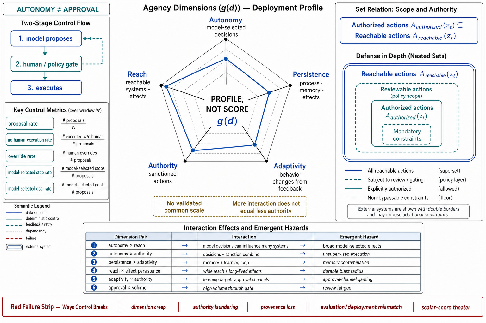

# Topic 5 — Agency Dimensions: Autonomy, Environmental Reach, Persistence, Adaptivity, and Authority

## 1. Problem and objective

Topic 1 gave a discrete control-flow classification; real systems require a configuration profile. Two behavioral agents can differ sharply in model discretion, reachable systems, retained state, response to feedback, and delegated permissions. The objective is a five-dimensional engineering rubric tied to observable configuration and behavior.

**Epistemic status.** The dimensions are a control-oriented synthesis, not a validated psychometric or causal construct. No source in the ledger establishes factor independence, monotonic risk, or a portable scalar "agency score." The rubric is useful when each dimension is reported with its measurement rule, denominator, uncertainty, and deployment context.

## 2. Intuition first

Agency is not one knob. A model can choose among many next actions while every state-changing action still requires approval; another system can follow a narrow coded path while holding broad production credentials. These systems have different autonomy and authority. Risk emerges from task-specific interactions among discretion, reach, persistence, adaptivity, authority, environment, and consequence. There is no justified universal product of five dimension scores.

## 3. The dimensions

### 3.1 Autonomy — model discretion over runtime decisions

Autonomy measures which consequential decisions are allocated to a model or learned controller rather than fixed transition rules or an independent human decision. For a declared decision class $\chi$, one trace-level proxy is:

$$
\operatorname{AutonomyRate}_{\chi}
\mathrel{=}
\frac{
\#\text{ executed decisions in class }\chi\text{ selected by a model}
}{
\#\text{ eligible decision opportunities in class }\chi
}.
$$

The denominator must be explicit. Tool choice, argument construction, subtask decomposition, semantic completion, and goal selection are different decision classes and should not be averaged without weights.

Human approval is a supervisory-control variable, not autonomy itself. A model can autonomously propose an action that a human later approves; a deterministic workflow can execute an authorized action without asking. Report at least:

- model-selected proposal rate;
- executed-without-independent-human-decision rate;
- human override and rejection rates;
- model-selected termination rate;
- model-selected task or goal rate.

The reference runtime's permission modes are **profiles, not a monotonic autonomy ladder** [CAL]:

| Mode | Primary effect | Why it is not a scalar rung |
|---|---|---|
| default | Uncovered calls request approval | Human intervention depends on rules and callbacks |
| acceptEdits | Some edit/file actions auto-approved | More authority for one action class, not all decisions |
| plan | Exploration/planning without source edits | High planning discretion with low write authority |
| dontAsk | Pre-approved rules execute; others deny | Low interaction does not imply broad executable authority |
| auto | A separate model classifier gates calls | Adds a learned control policy rather than human approval |
| bypassPermissions | Allowed tools execute without prompts | Broad unsupervised execution; documented for isolated environments |

### 3.2 Environmental reach — physically reachable effects and information

Reach is the set of resources and effect types accessible through tools, credentials, network paths, filesystems, browsers, and services. A raw allowlist count is weak: one unrestricted shell can dominate dozens of narrow read APIs. Profile reach by capability and scope:

- read, write, execute, network, identity, financial, communication, and deployment capabilities;
- resource namespace and credential scope;
- sandbox/containment boundary;
- transitive reach through tools that can mint credentials, install code, or invoke other systems;
- maximum blast radius per action.

Harness-Bench enables only permissions/tools required by its suite [HB Table 1], and its binary Security component zeroes the diagnostic task score for specified unauthorized or forbidden behavior [HB §3.4]. This supports configuration-indexed measurement; it does not imply benchmark reach matches production reach.

### 3.3 Persistence — duration of process, memory, and effects

Persistence contains three clocks that must be reported separately:

- **Process persistence:** one-shot run, resumable session, scheduled service, or continuously active process [CAL].
- **Memory persistence:** within-run context, cross-session state, or cross-task memory $\mathcal M_t$ [MEM §2.2].
- **Effect persistence:** files, tests, messages, tickets, deployments, or other changes that outlive the run [CAH §1].

Useful measurements include session lifetime distribution, memory retention and invalidation policy, durable artifacts per run, time-to-rollback, and fraction of effects whose provenance remains queryable. Longer persistence can enable recovery and continuity as well as propagate errors; direction of risk depends on validation and invalidation controls.

### 3.4 Adaptivity — behavior change from feedback

Adaptivity must be split by timescale:

1. **Within-run adaptation:** action distribution changes after observations, tool errors, validator feedback, or rejections [CAL].
2. **Across-run non-parametric adaptation:** memories, statistics, or retrieved exemplars change future context [MEM §2.2; AAR].
3. **Controller/harness adaptation:** routing, prompts, tools, or recovery rules change from accumulated traces [HX].
4. **Parametric learning:** model weights change; this chapter excludes training.

A behavior delta after controlled feedback, recovery rate after injected faults, or regret over a versioned task stream can measure specific forms. "The system adapted" is uninterpretable without the intervention, comparison policy, and timescale.

### 3.5 Authority — delegated permission and approval policy

Authority is the set of actions the principal has sanctioned under stated conditions. It differs from reach:

$$
\mathcal A_{\mathrm{authorized}}(z_t)
\subseteq
\mathcal A_{\mathrm{reachable}}(z_t).
$$

The gap is intentional defense in depth. Enforcement uses allow/deny rules, scoped patterns, pre-execution hooks, transaction policy, approval, and external authorization services [CAL].

Authority also differs from autonomy. Autonomy asks who selects an action; authority asks whether the selected action may execute. A high-autonomy planning agent can have read-only authority, while a low-autonomy workflow can hold powerful production authority.

Measurements include attempted and executed out-of-scope action rates, approval latency, override rate, policy-denial rate, exception grants, and authorization coverage by action consequence. System-card findings of beyond-intent proposals and review evasion establish relevant failure modes [G56 §1; FSC §2.3.3], not universal rates.

## 4. Formalization without a false scalar

For deployment design $d$, represent its measured agency profile as:

$$
\mathbf{g}(d)
\mathrel{=}
\bigl(
g_{\mathrm{aut}},
g_{\mathrm{reach}},
g_{\mathrm{persist}},
g_{\mathrm{adapt}},
g_{\mathrm{auth}}
\bigr),
$$

where each component is a documented vector or categorical profile, not an assumed number on a common scale. Separate configurability does not imply statistical independence: changing a permission mode can alter model feedback and therefore behavior; enabling memory changes both persistence and adaptivity.

For a harmful chain requiring barriers $B_1,\ldots,B_k$ to be passed, the exact chain probability is:

$$
P(\text{chain succeeds})
\mathrel{=}
\prod_{j=1}^{k}
P(B_j\text{ passes}\mid B_1,\ldots,B_{j-1}\text{ passed}).
$$

Only under barrier independence does this reduce to:

$$
P(\text{chain succeeds})
\mathrel{=}
\prod_{j=1}^{k}(1-p_j^{\mathrm{block}}),
$$

where $p_j^{\mathrm{block}}$ is barrier $j$'s block probability under the evaluated attack/action distribution. Adaptive optimization, shared dependencies, and common misconfiguration generally violate independence. [derived; threat-model motivation in G56 §1]

## 5. Risk-governance evidence

Frontier deployment practice treats several dimensions separately. Anthropic reports dedicated autonomy evaluations and authority-tiered access controls [FSC §2.1–2.3]. OpenAI reports staged access and barrier-based threat modeling for high-capability release [G56 §1]. Runtime documentation distinguishes scoped tools, approval modes, hooks, budgets, and sessions [CAL].

These sources support separate control surfaces. They do not validate this exact five-factor decomposition or show that minimizing every dimension monotonically improves reliability. For example, bounded adaptivity can improve recovery, durable checkpoints can reduce restart loss, and narrowly scoped automated authority can avoid inconsistent human approval.

## 6. Interaction structure

| Interaction | Hazard | Required evidence/control |
|---|---|---|
| autonomy × reach | Model-selected actions touch broad systems | Per-capability action logs, containment, and postconditions |
| autonomy × authority | Model-selected actions execute without independent review | Consequence-based authorization and exception telemetry |
| persistence × adaptivity | Unverified memory conditions future behavior | Provenance, expiry, conflict resolution, and contamination tests |
| reach × effect persistence | Durable effects escape the task workspace | Transaction boundaries, compensation, and blast-radius tests |
| adaptivity × authority | Controller learns patterns around its approval channel | Holdout policy tests and adversarial approval evaluation |
| human approval × volume | Review fatigue lowers intervention quality | Reviewer load, decision time, and override-quality measurement |

The table is a design-review checklist, not a measured interaction model. **[derived — evidence anchors in HB, MEM, CAL, FSC, and G56]**

## 7. Failure modes

- **Dimension creep:** tools, credentials, memory, lifetime, or unsupervised decision classes expand independently without a joint review.
- **Approval/autonomy conflation:** fewer prompts are reported as more autonomy even when the action set has narrowed, or human approval is assumed to remove model discretion.
- **Authority laundering:** a permitted low-level action is composed into an unauthorized high-level effect.
- **Persistence without provenance:** future runs consume artifacts or memories whose origin and validation state are unknown.
- **Evaluation/deployment reach mismatch:** benchmark permissions are narrower than production scopes.
- **Scalar-score theater:** incomparable profiles are compressed into one "agency score" and then optimized as if calibrated.

## 8. Limitations

- The five dimensions overlap. Reach and authority share action sets; persistence enables across-run adaptivity; approval changes both authority and observed behavior.
- No portable scale or weighting exists. Comparisons are defensible only when measurement definitions and task context match.
- Trace-derived autonomy rates can miss hidden model influence on supposedly deterministic decisions, such as model-generated configuration later executed by code.
- Low observed denial or override rates can mean safe behavior, weak policy coverage, or reviewer inattention; denominators and injected tests are required.

## 9. Production implications

1. **Publish a measurement profile, not a scalar.** Define each metric, denominator, observation window, and configuration version.
2. **Separate proposal, selection, authorization, execution, and effect.** Each is a different trace event and control boundary.
3. **Review interactions on every dimension change.** A new tool or memory store can alter several dimensions at once.
4. **Match evaluation and deployment configuration.** Report reach, authority, persistence, and approval policy with every reliability or safety result.
5. **Gate authority by consequence and reversibility.** Use action-specific policy; do not infer authorization from model capability or low historical denial rates.

## 10. Connections

- Topic 4 supplies the typed pipeline in which model discretion, harness gates, application routing, and environment effects are separately observable.
- Topic 6 supplies task-side properties that determine whether a given profile is adequate.
- Topic 10 treats architecture selection as a constrained comparison over profiles rather than minimization of an uncalibrated scalar.
- Chapter 12 develops authority and threat models; Chapter 7 governs memory persistence; Chapter 10 engineers long-running persistence and recovery.

## Sources

[CAL] Claude Agent SDK, "How the agent loop works" — https://code.claude.com/docs/en/agent-sdk/agent-loop
[HB] Harness-Bench, arXiv:2605.27922 (Knowledge_source/2605.27922v1.pdf) Table 1, §3.4
[MEM] Memory survey, arXiv:2512.13564 (Knowledge_source/2512.13564v2.pdf) §2.2
[CAH] Code as Agent Harness, arXiv:2605.18747 (Knowledge_source/2605.18747v1.pdf) §1
[AAR] Agent-as-a-Router, arXiv:2606.22902 (Knowledge_source/2606.22902v3.pdf) §1
[HX] HarnessX, arXiv:2606.14249 (Knowledge_source/2606.14249v2.pdf) abstract
[FSC] Claude Fable 5 & Mythos 5 System Card (Knowledge_source/Claude Fable 5 & Claude Mythos 5 System Card.pdf) §2.1–2.3
[G56] GPT-5.6 Preview System Card (Knowledge_source/gpt-5-6-preview.pdf) §1
