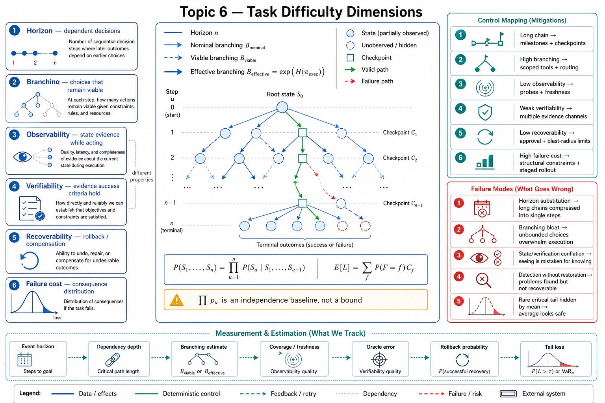

# Topic 6 — Task Horizon, Effective Branching, Observability, Verifiability, Reversibility/Recoverability, and Failure Cost

## 1. Problem and objective

Topic 5 profiles the deployed system; this topic profiles the task and environment. Reliability depends on their interaction. The task properties here are horizon, action branching, state observability, outcome verifiability, reversibility/recoverability, and failure cost. The objective is to define each property operationally, identify what it can and cannot predict, and derive only the probability expressions justified by stated assumptions.

These properties are not validated independent latent factors. They are an engineering profile: useful for experiment design and control selection when definitions, units, and task distributions are explicit.

## 2. Intuition first

The same Codex with GPT-5.5 configuration is reported at 82% on Terminal-Bench, below 50% on ALE's easiest tier, and under 10% on ALE's hardest tier [ALE §1]. The benchmark contrast is evidence of distribution dependence, not a causal decomposition. ALE differs in task length, applications, interfaces, domains, deliverables, and scoring. A task profile turns those differences into hypotheses that matched experiments can test.

## 3. Task and environment properties

### 3.1 Horizon — how many dependent decisions must compose

Horizon is a distribution over the number of decision events required for verified completion, not merely the number of natural-language instructions or model turns. Report at least:

- total event/action horizon $n$;
- model-mediated decision horizon $n_{\mathrm{model}}$;
- number and length of dependency chains;
- number of verified milestones;
- empirical horizon distribution across task instances.

CompWoB combines two to eight MiniWoB subtasks into 50 compositional tasks. Prompted agents average **94.0%** on the base suite and **24.9%** on the compositional suite; transferred models average **85.4%** and **54.8%** respectively [CompWoB]. These aggregate rates are not matched per-step probabilities and cannot be compared to $0.94^n$ for one chosen $n$. They establish a compositional-generalization gap. Estimating a horizon effect requires per-composition base rates, composition length/type, and uncertainty.

ALE admits end-to-end professional deliverables rather than a few interface operations [ALE §2.1]. On its hardest tier, the average full pass rate across mainstream harness/backbone configurations is below 1% [ALE abstract]. This is consistent with difficult long-horizon execution but does not isolate horizon from domain, interface, or scoring differences.

### 3.2 Nominal, viable, and effective branching

Raw tool count is not the task's branching factor. Distinguish:

$$
B_t^{\mathrm{nominal}}
\mathrel{=}
|\mathcal A_t^{\mathrm{joint,allowed}}|,
$$

$$
B_t^{\mathrm{viable}}
\mathrel{=}
\left|
\{\mathbf a\in\mathcal A_t^{\mathrm{joint,allowed}}:
\operatorname{preconditions}(\mathbf a,s_t,\mathcal Q)\}
\right|.
$$

$B_t^{\mathrm{viable}}$ is latent when $s_t$ is unknown, so an evaluator may estimate it from an oracle or annotated task graph. Using the canonical joint-action signature $\pi_{\mathrm{exec}}(\mathbf a\mid\mathbf c_t,\hat\tau_{0:t-1},\mathcal Q)$, a policy-specific diagnostic is entropy-based effective branching, with $0\log 0$ defined as zero:

$$
B_t^{\mathrm{effective}}
\mathrel{=}
\exp\!\left(
-\sum_{\mathbf a\in\mathcal A_t^{\mathrm{joint}}}
\pi_{\mathrm{exec}}(\mathbf a\mid\mathbf c_t,\hat\tau_{0:t-1},\mathcal Q)
\log\pi_{\mathrm{exec}}(\mathbf a\mid\mathbf c_t,\hat\tau_{0:t-1},\mathcal Q)
\right).
$$

For a uniform policy over $b$ joint actions this equals $b$; for a concentrated policy it is smaller. A single-agent system is the special case where each joint action contains one non-no-op component. In a regular depth-$n$ tree where every node at depth $t$ has the same branching $B_t$, the number of root-to-leaf action sequences is:

$$
N_{\mathrm{paths}}
\mathrel{=}
\prod_{t=1}^{n}B_t,
$$

and reduces to $B^n$ only for constant branching. In a non-regular tree, one must sum over actual leaves; a product of average branching factors need not equal the path count. This is a combinatorial count, not a probability model. Adding a tool increases nominal branching but can improve success by exposing a missing capability or reduce it through selection confusion; direction must be measured.

### 3.3 State observability — evidence available during action

State observability concerns how $\Omega$ exposes decision-relevant environment state:

- coverage of required state variables;
- observation noise, truncation, and latency;
- acquisition cost in time, tokens, or external calls;
- freshness under environment drift;
- whether the agent can choose informative probes.

A repository with deterministic state queries may be highly observable for one task and poorly observable for another whose requirements are implicit. GUI pixels can expose visible state while hiding application semantics; a DOM can expose structure while omitting server-side effects. Observability is task-relative, not a fixed property of a modality.

### 3.4 Outcome verifiability — evidence that success criteria hold

Verifiability is distinct from observability. A task can expose rich intermediate state but lack a complete success oracle, or expose little state while providing a definitive final validator.

Use a verification profile:

- deterministic oracle;
- partial deterministic checks plus rubric;
- versioned human/LLM rubric;
- judgment-only outcome;
- no operationally specified success criterion.

Harness-Bench requires deterministic checks or a specified rubric [HB §3.2]; ALE requires deterministic checking or an unambiguous rubric tied to observable artifacts [ALE §2.1]. These are task-admission and measurement properties. They do not make the acting environment fully observable.

### 3.5 Mutation, reversibility, and recoverability

Mutation answers whether an action changes state. Reversibility asks whether a known inverse or snapshot restoration can return the relevant system to an acceptable prior state. Recoverability includes compensation when exact reversal is impossible.

For action class $c$, report:

- probability of successful rollback or compensation;
- time to restore;
- maximum data loss or recovery-point objective;
- scope restored atomically;
- residual external effects;
- whether rollback has been tested under injected failure.

The reference runtime's parallelization of read-only tools and serialization of mutating tools [CAL] is a concurrency policy, not a reversibility type system. A serialized email send can be irreversible; a mutating repository edit can be cheaply reverted. Sandboxed benchmark reset provides experiment-level repeatability [HB §3.2], but production rollback depends on the actual external systems.

### 3.6 Failure cost — loss distribution, not one severity label

Failure cost is the consequence conditional on a failure mode, independent of the mode's probability. Represent expected loss over mutually exclusive outcome classes $f\in\mathcal F$:

$$
\mathbb E[L]
\mathrel{=}
\sum_{f\in\mathcal F}
P(F=f)\,C_f.
$$

For heavy-tailed or safety-critical domains, the mean is insufficient; report critical-failure probability, worst credible loss, and a tail measure such as conditional value at risk where defensible. Harness-Bench's binary Security component makes specified security violations lexically dominant in its diagnostic score [HB §3.4]. System cards use stronger access and release controls for high-consequence capability classes [FSC; G56]. These are examples of consequence-sensitive policy, not proof that structural controls make every high-cost failure impossible.

## 4. Reliability expressions

Let $S_u$ be the event that step $u$ satisfies the condition required for the task to remain on a successful path. The exact chain rule is:

$$
P(S_1,\ldots,S_n)
\mathrel{=}
\prod_{u=1}^{n}
P(S_u\mid S_1,\ldots,S_{u-1}).
$$

If step-success events are independent with $P(S_u)=p_u$, this becomes the **independence baseline**:

$$
P(\text{task success})
\mathrel{=}
\prod_{u=1}^{n}p_u.
$$

It is neither an upper nor a lower bound without assumptions about dependence. Shared state, heterogeneous task difficulty, recovery, and positive or negative correlations can move observed success in either direction.

For a separate simple independent-step model, let $p_u=P(S_u)$, let $d_u=P(\text{error detected}\mid S_u^c)$, and define an undetected-error event $U_u$. Then:

$$
q_u=P(U_u)=(1-p_u)(1-d_u).
$$

The exact probability of at least one undetected error is:

$$
P\!\left(\bigcup_{u=1}^{n}U_u\right)
\mathrel{=}
1-
\prod_{u=1}^{n}
\left[
1-P\!\left(
U_u
\mid
U_1^c,\ldots,U_{u-1}^c
\right)
\right].
$$

If the $U_u$ are independent, this reduces to:

$$
P(\text{at least one undetected error})
\mathrel{=}
1-\prod_{u=1}^{n}(1-q_u).
$$

$\prod_u q_u$ would be the probability that every step leaks an undetected error, not that at least one does. Detection also does not imply recovery. A separate parameter

$$
r_u
\mathrel{=}
P(\text{state restored and retry admissible}\mid
\text{error detected at }u)
$$

is required before crediting a detected error as non-fatal. Topic 8 develops bounded retries and checkpoint recovery; this topic does not assume unlimited fresh attempts.

The task profile enters these probabilities empirically:

- horizon determines how many conditional factors appear;
- viable/effective branching and observability are candidate predictors of the conditional $p_u$, not guaranteed monotonic causes;
- verifiability affects measurable detection power $d_u$;
- reversibility/recoverability affects $r_u$ and residual loss;
- failure mode determines $C_f$.

## 5. Matching task properties to controls

| Task property | Engineering response | Required evidence |
|---|---|---|
| Long dependency chains with checkable subgoals | Decompose, validate milestones, checkpoint verified state | Matched horizon curve and checkpoint recovery tests |
| Long horizon without intermediate verification | Reduce scope, add instrumentation, constrain authority, or require human review | Explicit residual-risk argument; do not infer safety from final self-report |
| High viable/effective branching | Phase-specific tool scopes, typed plans, routing, or search | Branching estimate and ablation showing no lost necessary actions |
| Low state observability | Add probes, state APIs, freshness/version metadata | Coverage and stale-observation fault injection |
| Weak outcome verifiability | Tighten specification, use multiple evidence channels, retain human adjudication | Judge agreement, rubric error, and unresolved-claim rate |
| Low reversibility/recoverability | Rehearsal, transaction/compensation design, approval, blast-radius limits | Tested rollback/compensation and residual-effect inventory |
| High or heavy-tailed failure cost | Structural constraints, narrow authority, independent monitoring, staged rollout | Upper confidence bound on critical failures and safety-case evidence |

## 6. Measurement: profile before architecture selection

A useful task profile records distributions and definitions, not five unsupported scalar scores:

1. **Horizon:** event and model-mediated horizon distributions, dependency depth, and milestone locations.
2. **Branching:** nominal tool/action count, oracle-estimated viable actions, and policy-effective branching under the evaluated configuration.
3. **Observability:** required-state coverage, latency, noise, truncation, freshness, and acquisition cost.
4. **Verifiability:** oracle/rubric type, coverage of success criteria, false acceptance/rejection, and judge agreement.
5. **Reversibility/recoverability:** per-action rollback probability, restore time, data loss, compensation coverage, and residual effects.
6. **Failure cost:** named failure modes, consequence distribution, critical threshold, and tail metric.

Estimates should carry task-sample size and uncertainty. Expert estimates are hypotheses; validate them through traces, fault injection, and matched task families where feasible.

## 7. Failure modes

- **Horizon substitution:** using turns as steps even when one turn contains several actions or asynchronous events.
- **Aggregate composition arithmetic:** comparing one aggregate base success rate with a heterogeneous compositional suite as though all compositions had identical length and component difficulty.
- **Branching bloat or over-pruning:** enabling everything increases nominal choice; restricting too aggressively removes necessary actions. Use ablations.
- **Observability/verifiability conflation:** treating a final oracle as proof the policy had adequate state while acting, or treating rich observations as proof the deliverable is correct.
- **Mutation/reversibility conflation:** assuming serialized writes are irreversible or version-controlled writes are automatically safe.
- **Detection without restoration:** a validator catches failure after an external side effect that cannot be undone.
- **Cost-blind averaging:** high mean success conceals a rare critical failure.

## 8. Limitations

- The properties interact. Better probes can increase horizon; stronger verification can add mutating setup; checkpoints can add persistent state.
- Viable branching depends on latent state and task semantics, so evaluator estimates can be wrong.
- Expert horizon and consequence estimates are domain-dependent and should not be compared across organizations without common definitions.
- The probability equations are structural identities or explicitly assumed baselines. They do not predict production success until $p_u$, $d_u$, dependence, recovery, and loss are measured on the target distribution.
- Benchmark contrasts such as ALE versus Terminal-Bench identify distribution sensitivity but do not isolate one task property.

## 9. Production implications

1. **Profile task and environment before selecting control allocation.**
2. **Measure conditional decay, not an unmatched aggregate product.** Construct matched families by horizon and composition type.
3. **Separate observation, verification, and recovery budgets.** A test can detect an error without revealing all state or restoring it.
4. **Place approval and structural controls by action-specific expected and tail risk.** Reversibility matters, but high-impact reversible actions can still require gating.
5. **Report the full profile with results.** A success rate is not transferable without task distribution, configuration, horizon unit, evidence model, and consequence definition.

## 10. Connections

- Topic 5 supplies the system-side configuration profile; this topic supplies task/environment measurements.
- Topic 8 extends the conditional-success, detection, and recovery calculus.
- Chapter 5 engineers action surfaces and branching; Chapter 10 implements checkpoints; Chapter 12 designs authority by consequence; Chapter 13 develops task sampling and statistical inference.

## Sources

[POMDP] Kaelbling, Littman, and Cassandra, "Planning and Acting in Partially Observable Stochastic Domains," *Artificial Intelligence* 101, 1998 — https://doi.org/10.1016/S0004-3702(98)00023-X
[CompWoB] Furuta et al., TMLR — https://deepmind.google/research/publications/46840/
[ALE] Agents' Last Exam, arXiv:2606.05405 (Knowledge_source/2606.05405v2.pdf) abstract, §1, §2.1–2.3
[HB] Harness-Bench, arXiv:2605.27922 (Knowledge_source/2605.27922v1.pdf) §3.2, §3.4, Table 1
[MEM] Memory survey, arXiv:2512.13564 (Knowledge_source/2512.13564v2.pdf) §2.1
[CAH] Code as Agent Harness, arXiv:2605.18747 (Knowledge_source/2605.18747v1.pdf) §1
[CAL] Claude Agent SDK, "How the agent loop works" — https://code.claude.com/docs/en/agent-sdk/agent-loop
[FSC] Claude Fable 5 & Mythos 5 System Card (Knowledge_source/Claude Fable 5 & Claude Mythos 5 System Card.pdf) Exec. Summary
[G56] GPT-5.6 Preview System Card (Knowledge_source/gpt-5-6-preview.pdf) §1
