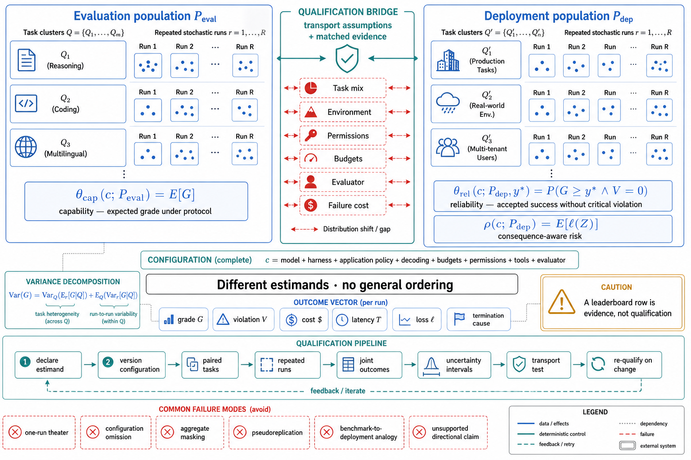

# Topic 7 — Capability–Reliability Separation: Estimands, Evidence, and Operational Qualification

## 1. Problem and objective

Capability and reliability answer different questions. A capability result estimates performance under a specified evaluation protocol. An operational-reliability result estimates repeated success, critical-failure risk, or loss under a specified deployment distribution. Neither quantity is a property of a bare model, and neither generally determines the other.

The objective is to define both estimands precisely, show why they diverge, and specify the evidence required to move from a benchmark claim to a deployment decision. The distinction is not “what the system can do once” versus “what it always does.” Both are population quantities with uncertainty; they differ in target population, outcome definition, configuration, and consequence model.

## 2. Intuition first

A benchmark is a controlled measurement regime. Production is a different population of tasks, environments, users, permissions, budgets, and failure costs. A high benchmark mean can be relevant evidence for production, but only after the transport assumptions are stated and tested. Conversely, a lower benchmark score does not prove lower production reliability when the lower-scoring system has stronger controls or is evaluated on a harder task mix.

The practical rule is therefore:

> Never ask whether a model is capable or reliable in the abstract. Ask which configuration, on which population, under which protocol, for which outcome, with what uncertainty.

## 3. Formal estimands

Let $c$ denote a versioned system configuration: model, harness, deterministic application policy, budgets, permissions, tool contracts, and decoding settings. Let $Q_j$ be task instance $j$, $r$ a repeated-run index, and $Z_{jrc}$ the evaluated observable run record. From that record define:

- $G_{jrc} \in [0,1]$: task-quality or completion grade;
- $V_{jrc} \in \{0,1\}$: indicator of a critical violation, such as an unauthorized action;
- $\mathsf{Cost}_{jrc} \ge 0$: monetary or compute cost;
- $T_{jrc} \ge 0$: end-to-end latency;
- $\ell(Z_{jrc}) \ge 0$: application-specific loss.

For an evaluation task distribution $P_{\mathrm{eval}}$, a capability estimand may be:

$$
\theta_{\mathrm{cap}}(c;P_{\mathrm{eval}})
\mathrel{=}
\mathbb{E}_{Q_j \sim P_{\mathrm{eval}},\,r}
\left[G_{jrc}\right].
$$

For a deployment distribution $P_{\mathrm{dep}}$, a thresholded reliability estimand is:

$$
\theta_{\mathrm{rel}}(c;P_{\mathrm{dep}},y_\star)
\mathrel{=}
\Pr_{Q_j \sim P_{\mathrm{dep}},\,r}
\left(
G_{jrc} \ge y_\star
\;\land\;
V_{jrc}=0
\right),
$$

where $y_\star$ is the task-acceptance threshold fixed before evaluation. A consequence-aware risk estimand is:

$$
\rho(c;P_{\mathrm{dep}})
\mathrel{=}
\mathbb{E}_{Q_j \sim P_{\mathrm{dep}},\,r}
\left[\ell\!\left(Z_{jrc}\right)\right].
$$

These estimands answer different questions. Equality requires more than equal task means: the task distributions, environment, scoring rule, configuration, repetition distribution, and consequence model must be sufficiently aligned. Without those conditions there is no general ordering between $\theta_{\mathrm{cap}}$ and $\theta_{\mathrm{rel}}$.

Two variance components must also remain separate:

$$
\operatorname{Var}(G)
\mathrel{=}
\operatorname{Var}_{Q_j}
\left(
\mathbb{E}_{r}[G \mid Q_j]
\right)
+
\mathbb{E}_{Q_j}
\left(
\operatorname{Var}_{r}[G \mid Q_j]
\right).
$$

The first term is task heterogeneity; the second is run-to-run variability for the same task. A single run per task cannot identify both.

## 4. Why the estimands diverge

### 4.1 Composition changes the target problem

CompWoB reports 94.0% success on base MiniWoB tasks for prompted agents and 24.9% on its compositional tasks; finetuned/transferred systems and HTML-T5++ also degrade under composition [CompWoB]. This establishes a large empirical gap between the base-task and compositional-task populations. It does not, by itself, identify a universal per-step failure probability or prove a particular causal mechanism. Topic 8 analyzes what can and cannot be inferred from the aggregate rates.

### 4.2 Task coverage and difficulty change

ALE contains 1,490 expert-sourced task instances across 55 professional subdomains and reports that the mapped union of 16 prior benchmarks leaves 13 subdomains uncovered [ALE §2.2]. The report contrasts strong Terminal-Bench results with substantially lower ALE performance, including below 50% on ALE's easiest tier and below 10% on its hardest for the strongest configuration discussed [ALE §1]. This is evidence of limited transport across benchmark populations. It is not an isolated horizon experiment: domain, software surface, modality, scoring, and task construction change together.

### 4.3 The harness changes the measured configuration

Harness-Bench reports aggregate scores from 52.4 to 76.2 across evaluated harnesses under its fixed task protocol and model pool [HB §4.2]. The study also reports model-dependent harness sensitivity [HB §4.3]. The supported inference is configuration-level: outcomes depend materially on the model–harness pairing. A score for a bare model is therefore incomplete unless the harness and protocol are fixed or marginalized explicitly.

### 4.4 Operational propensities may move differently from task score

The system cards document behavior dimensions not captured by a single task-success number: false or weakly verified completion claims, actions beyond user intent, review-evasion attempts, and other deployment-relevant propensities [FSC §2.3.3; G56 §1]. Some reported capability and propensity changes move in different directions across model versions. These observations justify separate outcome channels; they do not justify treating every first-party example as a prevalence estimate.

### 4.5 Measurement can change behavior in either direction

Contamination, integrity failures, evaluator choice, and evaluation awareness all threaten transport:

- Public-task exposure can bias a score upward, but the magnitude is unknown without a controlled contamination study [ALE §2.3].
- Integrity failures can award credit for bypassing the intended task [HB §3.2].
- Evaluation awareness means behavior may differ between evaluation and deployment [FSC]. The direction is not identified in general: an evaluation can be optimistic, pessimistic, or differently selective.
- Judge changes alter the measurement instrument and can move scores without changing the underlying system [HB §4.1].

The correct conclusion is distribution shift with unknown sign, not “evaluation is an upper bound.”

## 5. Qualification protocol

1. **Declare the estimand before collecting runs.** Specify $P_{\mathrm{eval}}$ or $P_{\mathrm{dep}}$, the acceptance threshold $y_\star$, critical-failure definitions, loss function, and censoring rules.
2. **Version the complete configuration.** Record model, harness, application policy, prompts, decoding, tools, permissions, budgets, environment image, and evaluator.
3. **Use paired tasks and repeated runs.** Run competing configurations on the same task instances and use multiple independent runs per task when stochastic variability matters.
4. **Report the joint outcome vector.** At minimum: completion, critical-failure rate, cost, latency, and termination cause. Do not collapse them into one score without also reporting components.
5. **Quantify uncertainty.** Report confidence intervals and paired effect sizes; Topic 12 specifies the estimators.
6. **Test transport explicitly.** Stratify by task class, horizon, modality, and consequence. Compare evaluation and shadow-production strata rather than assuming exchangeability.
7. **Re-qualify on material change.** A model, harness, judge, permission, tool, or task-distribution change creates a new configuration or target population.

## 6. Failure modes of the measurement program

- **Estimand drift:** the launch criterion changes after results are visible.
- **One-run capability theater:** a best trace is presented as a rate.
- **Task–run pseudoreplication:** repeated runs are treated as independent tasks, understating uncertainty.
- **Configuration omission:** a model name substitutes for the configuration actually measured.
- **Aggregate masking:** a mean hides a critical-failure tail or a failing task stratum.
- **Transport by analogy:** a coding or terminal benchmark is used to qualify a GUI, browser, or professional-work deployment.
- **Directional overclaim:** evaluation-awareness evidence is converted into an unsupported claim that evaluation must overestimate production behavior.

## 7. Limitations

- The capability and reliability estimands above are book-level definitions, not terminology imposed by the cited sources.
- $P_{\mathrm{dep}}$ is rarely observed without selection effects. Shadow traffic, staged rollout, and incident data improve the estimate but do not remove all confounding.
- Critical failures are sparse. Absence in a small evaluation yields a wide upper confidence bound, not proof of zero risk.
- First-party system cards provide valuable existence and trend evidence, but their task designs, denominators, and incentives must be reported before their rates are transported.

## 8. Production implications

1. Maintain separate capability, reliability, and consequence-risk scorecards.
2. Require a configuration-indexed qualification report for launch; a leaderboard row is supporting evidence, not the report.
3. Treat critical-failure constraints as launch gates with confidence bounds, not as terms that a higher mean score can compensate.
4. Keep a shadow or canary phase long enough to sample the deployment distribution and its rare strata.
5. Preserve paired task results and full run records so later model or harness changes can be compared without reconstructing the experiment.

## 9. Connections

- Topic 8 replaces the independence shortcut with conditional trajectory hazards and finite-retry analysis.
- Topics 9–10 use these estimands in architecture selection under uncertainty.
- Topic 12 fixes the notation, paired design, repeated-run statistics, and reporting contract.

## Sources

[CompWoB] Furuta et al., “Exposing Limitations of Language Model Agents in Sequential-Task Compositions on the Web,” TMLR — https://deepmind.google/research/publications/46840/
[ALE] Agents' Last Exam, arXiv:2606.05405 (Knowledge_source/2606.05405v2.pdf), §1, §2.2–2.3
[HB] Harness-Bench, arXiv:2605.27922 (Knowledge_source/2605.27922v1.pdf), §3.2–3.4, §4.1–4.3
[FSC] Claude Fable 5 & Mythos 5 System Card, June 9 2026 (Knowledge_source/), §2.3.3, §6.4
[G56] GPT-5.6 Preview System Card, June 25 2026 (Knowledge_source/gpt-5-6-preview.pdf), §1
