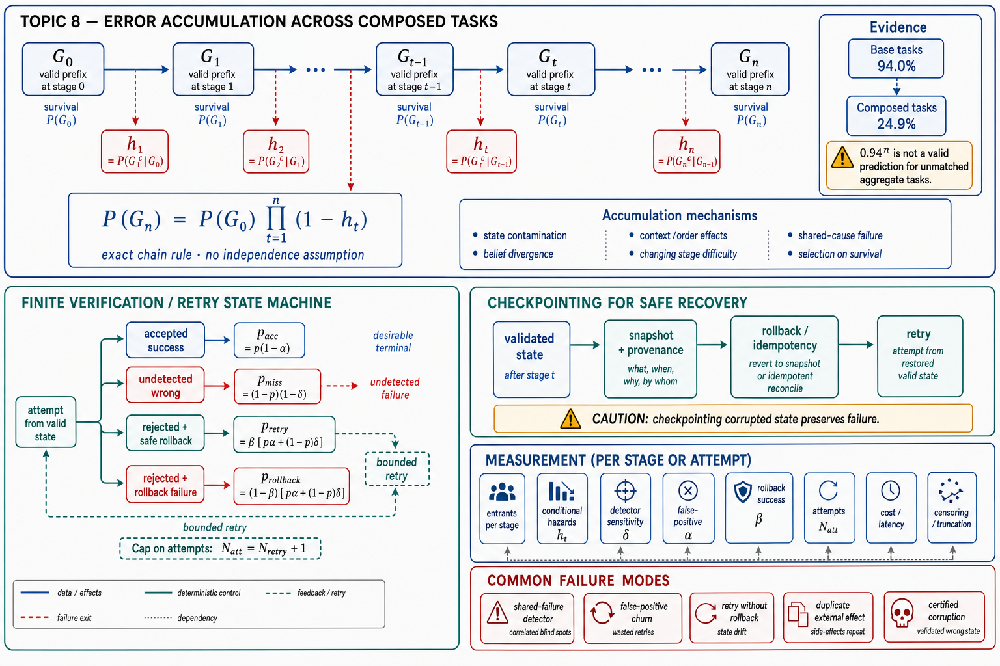

# Topic 8 — Error Accumulation Across Composed Tasks

## 1. Problem and objective

Long tasks fail through conditional, stateful sequences. The correct starting point is therefore the probability chain rule, not an independence approximation. This topic develops:

1. an exact conditional-hazard representation of trajectory success;
2. a careful interpretation of the CompWoB aggregate results;
3. finite retry equations with detector false positives, false negatives, and rollback failure;
4. measurement procedures for hazards, detection, recovery, cost, and censoring.

The purpose is not to predict a production success rate from one short-task average. It is to identify which quantities must be measured before such a prediction is defensible.

## 2. Exact trajectory decomposition

Let $G_t$ be the event that, after stage $t$, the run remains in a valid prefix state: required invariants hold, no unrecovered critical failure has occurred, and the work completed so far is acceptable. The events are nested:

$$
G_n \subseteq G_{n-1} \subseteq \cdots \subseteq G_0.
$$

Define the conditional stage hazard:

$$
h_t
\mathrel{=}
\Pr\!\left(
G_t^{\,c}
\mid
G_{t-1}
\right).
$$

Then the chain rule gives the exact identity:

$$
\Pr(G_n)
\mathrel{=}
\Pr(G_0)
\prod_{t=1}^{n}
\Pr(G_t \mid G_{t-1})
\mathrel{=}
\Pr(G_0)
\prod_{t=1}^{n}
(1-h_t).
$$

No independence assumption is required. History dependence, shared state, compaction, tool errors, and earlier observations are already represented because each $h_t$ is conditional on reaching stage $t$ with a valid prefix.

If one additionally assumes a constant conditional hazard $h_t=h$, then:

$$
\Pr(G_n \mid G_0)=(1-h)^n.
$$

That homogeneous model is a diagnostic reference line, not a bound. Depending on how task populations and conditional hazards change, an independence-style extrapolation can be optimistic or pessimistic.

## 3. What CompWoB establishes—and what it does not

CompWoB reports 94.0% success on its base MiniWoB tasks for prompted agents and 24.9% on its compositional task set; finetuned/transferred systems and HTML-T5++ also show substantial degradation, and instruction order affects performance [CompWoB].

The valid inference is:

- performance on the base-task population does not transport directly to the compositional-task population;
- composition and ordering materially change the effective decision problem;
- local success rates are insufficient statistics for end-to-end success.

The calculation $0.94^2 \approx 0.884$ is only a hypothetical reference for two independent, exchangeable subevents, each with success probability 0.94. The reported 94.0% is an aggregate over base tasks; the compositions vary in length and difficulty; and their subevents share instructions, state, and policy context. Those assumptions are not established. Therefore $0.94^2$ is neither a valid prediction nor an upper bound for the CompWoB aggregate, and the ratio $0.884/0.249$ should not be interpreted as an identified “composition penalty.”

Instruction-order sensitivity supports the narrower claim that the policy is not invariant to semantically related reorderings [CompWoB]. It is consistent with context interference, but it does not isolate context interference from other order-dependent mechanisms.

## 4. Conditional mechanisms of accumulation

The hazard representation accommodates several mechanisms without pretending they are independent:

1. **State contamination.** An accepted but wrong action changes the environment on which later actions condition.
2. **Belief divergence.** The environment remains correct while the model's reconstructed state becomes stale or unsupported.
3. **Context and order effects.** The same facts presented in a different sequence change the policy distribution.
4. **Changing stage difficulty.** Later stages may have higher hazards because the context is larger, budgets are depleted, or remaining steps are intrinsically harder.
5. **Shared-cause failures.** One missing dependency, poisoned observation, or invalid plan can raise several later hazards simultaneously.
6. **Selection on survival.** Runs reaching late stages are not a random sample of initial runs; their task mix and prior trajectories differ.

These mechanisms are hypotheses to test with traces and interventions. Aggregate success rates alone do not identify their contributions.

## 5. Finite retry and verification mathematics

Consider one stage with retry allowance $N_{\mathrm{retry}}\in\{0,1,\ldots\}$. The maximum number of attempts is:

$$
N_{\mathrm{att}}=N_{\mathrm{retry}}+1.
$$

For an attempt made from a valid pre-stage state, define:

- $p=\Pr(\text{candidate is correct})$;
- $\alpha=\Pr(\text{detector rejects}\mid\text{candidate is correct})$, the false-positive rate;
- $\delta=\Pr(\text{detector rejects}\mid\text{candidate is wrong})$, the detection sensitivity;
- $\beta=\Pr(\text{rollback restores a valid retry state}\mid\text{candidate is rejected})$.

The four mutually exclusive per-attempt probabilities are:

$$
p_{\mathrm{acc}}=p(1-\alpha)
$$

for accepted success,

$$
p_{\mathrm{miss}}=(1-p)(1-\delta)
$$

for an undetected wrong candidate,

$$
p_{\mathrm{retry}}
=\beta\left[p\alpha+(1-p)\delta\right]
$$

for a rejected candidate followed by a safe retry, and

$$
p_{\mathrm{rollback}}
=(1-\beta)\left[p\alpha+(1-p)\delta\right]
$$

for a rejected candidate whose rollback does not restore the retry invariant. They satisfy $p_{\mathrm{acc}}+p_{\mathrm{miss}}+p_{\mathrm{retry}}+p_{\mathrm{rollback}}=1$.

Under stationary attempt probabilities and conditionally fresh retry draws after successful rollback:

$$
\Pr(\text{stage success by attempt }N_{\mathrm{att}})
\mathrel{=}
p_{\mathrm{acc}}
\sum_{j=0}^{N_{\mathrm{att}}-1}p_{\mathrm{retry}}^j
\mathrel{=}
\begin{cases}
p_{\mathrm{acc}}
\dfrac{1-p_{\mathrm{retry}}^{N_{\mathrm{att}}}}
{1-p_{\mathrm{retry}}},
& p_{\mathrm{retry}}\neq 1,\\
0, & p_{\mathrm{retry}}=1,
\end{cases}
$$

$$
\Pr(\text{undetected stage failure})
\mathrel{=}
p_{\mathrm{miss}}
\sum_{j=0}^{N_{\mathrm{att}}-1}p_{\mathrm{retry}}^j,
$$

$$
\Pr(\text{rollback failure})
\mathrel{=}
p_{\mathrm{rollback}}
\sum_{j=0}^{N_{\mathrm{att}}-1}p_{\mathrm{retry}}^j,
$$

and

$$
\Pr(\text{retry exhaustion})
=p_{\mathrm{retry}}^{N_{\mathrm{att}}}.
$$

The four probabilities sum to one. The expected number of attempts is:

$$
\mathbb{E}[N_{\mathrm{used}}]
\mathrel{=}
\sum_{j=0}^{N_{\mathrm{att}}-1}p_{\mathrm{retry}}^j
\mathrel{=}
\begin{cases}
\dfrac{1-p_{\mathrm{retry}}^{N_{\mathrm{att}}}}
{1-p_{\mathrm{retry}}},
& p_{\mathrm{retry}}\neq 1,\\
N_{\mathrm{att}}, & p_{\mathrm{retry}}=1.
\end{cases}
$$

### Edge cases

- $N_{\mathrm{att}}=1$: no retry; stage success is $p_{\mathrm{acc}}$.
- $\delta=0$: wrong candidates are never detected; retries occur only through false positives.
- $\alpha=1$: every correct candidate is rejected; success is impossible unless the detector policy changes.
- $\beta=0$: no rejected attempt is safely retryable; verification may detect errors but cannot recover.
- $p=0$: retries cannot create capability; stage success remains zero.
- $p_{\mathrm{retry}}=1$: every attempt is rejected and safely rolled back; the process exhausts its retry budget with probability one.

The stationary formula must not be used when retries reuse a corrupted state, the detector adapts, prompts change, or failure causes persist. In the nonstationary case, let $p_{\mathrm{acc},\ell}$ and $p_{\mathrm{retry},\ell}$ be the conditional accepted-success and safe-retry probabilities on attempt $\ell$. Then:

$$
\Pr(\text{stage success by }N_{\mathrm{att}})
\mathrel{=}
\sum_{\ell=1}^{N_{\mathrm{att}}}
p_{\mathrm{acc},\ell}
\prod_{u=1}^{\ell-1}p_{\mathrm{retry},u}.
$$

This form makes the required conditioning explicit.

## 6. Checkpointing and recovery

A checkpoint is useful only if it defines a recoverable state. A valid checkpoint requires:

- an atomic or otherwise well-defined snapshot boundary;
- durable provenance for the state and validator results;
- a rollback operation whose success is measured;
- idempotency or deduplication for externally visible effects;
- a rule for effects that cannot be rolled back.

Checkpointing can reduce expected rework and consequence by localizing recovery. It can also improve success if it enables safe retries. It does not automatically reduce failure probability: a checkpoint that records corrupted state or cannot reverse external effects can certify and preserve the failure.

If stage $t$ has conditional accepted-success probability $p_t^{\mathrm{stage}}$ after its finite retry policy, then the exact valid-prefix probability remains:

$$
\Pr(G_n \mid G_0)
\mathrel{=}
\prod_{t=1}^{n}
p_t^{\mathrm{stage}},
$$

where each $p_t^{\mathrm{stage}}=\Pr(G_t\mid G_{t-1})$ is conditional and may differ by stage and history.

## 7. Measurement protocol

1. **Estimate conditional hazards, not only final success.** Define stage boundaries and report the number entering each stage, failures by cause, and the conditional hazard estimate.
2. **Use repeated runs on matched tasks.** Separate task heterogeneity from run-to-run variability.
3. **Measure detector sensitivity and false-positive rate.** Inject known faults and known-good controls; report $\delta$ and $\alpha$ with confidence intervals.
4. **Test rollback empirically.** After each rejected mutation, verify hashes, versions, external side effects, and idempotency records; estimate $\beta$.
5. **Record all terminal outcomes.** Accepted success, undetected failure discovered later, rollback failure, retry exhaustion, timeout, and budget exhaustion are distinct outcomes.
6. **Treat budget termination as censoring when appropriate.** If a run is stopped before the event of interest is observed, report time-to-success or time-to-failure with a censoring-aware estimator rather than counting every censored run as the same failure mode [KM].
7. **Compare policies at matched budgets.** Verification changes both quality and cost. Report success, critical failures, attempts, tokens, latency, and cost jointly.

## 8. Failure modes in verification design

- **Shared-failure detector:** the checker uses the same evidence and model failure mode as the candidate generator.
- **False-positive retry churn:** correct work is repeatedly discarded, increasing cost and the chance of later regression.
- **Retry without rollback:** a new sample is drawn over corrupted state; the retry equations no longer apply.
- **Ambiguous external effects:** a timeout occurs after a remote action may have committed; retry without idempotency can duplicate the effect.
- **Certified corruption:** a weak milestone check records an invalid state as the recovery point.
- **Budget-dependent selection:** only easy runs reach verification, making detector performance appear better than it is.

## 9. Production implications

1. Replace “per-step accuracy” dashboards with conditional stage hazards and terminal-cause counts.
2. Bound retries explicitly; unlimited-retry formulas hide cost, nonstationarity, and exhaustion.
3. Require measured detector sensitivity, false-positive rate, and rollback success before crediting a verification loop.
4. Compare capability improvements and verification improvements at matched end-to-end budgets; neither dominates universally.
5. Put idempotency and effect reconciliation ahead of retry for state-changing tools.

## 10. Connections

- Topic 7 defines the repeated-run reliability estimand that the conditional hazards compose.
- Topic 9 uses measured hazards and costs to compare workflow and agent architectures.
- Topic 10 treats verification, rollback, and authority as separate decision dimensions rather than a single autonomy rung.
- Topic 12 standardizes repeated-run, paired, censoring-aware reporting.

## Sources

[CompWoB] Furuta et al., “Exposing Limitations of Language Model Agents in Sequential-Task Compositions on the Web,” TMLR — https://deepmind.google/research/publications/46840/
[HB] Harness-Bench, arXiv:2605.27922 (Knowledge_source/2605.27922v1.pdf), §3.2–3.4, Table 2
[CAH] Code as Agent Harness, arXiv:2605.18747 (Knowledge_source/2605.18747v1.pdf), §1–2
[CAL] Claude Agent SDK, “How the agent loop works” — https://code.claude.com/docs/en/agent-sdk/agent-loop
[MEM] Memory in the Age of AI Agents, arXiv:2512.13564 (Knowledge_source/2512.13564v2.pdf), §2.2
[KM] Kaplan and Meier, “Nonparametric Estimation from Incomplete Observations,” JASA 53(282), 1958 — https://doi.org/10.1080/01621459.1958.10501452
