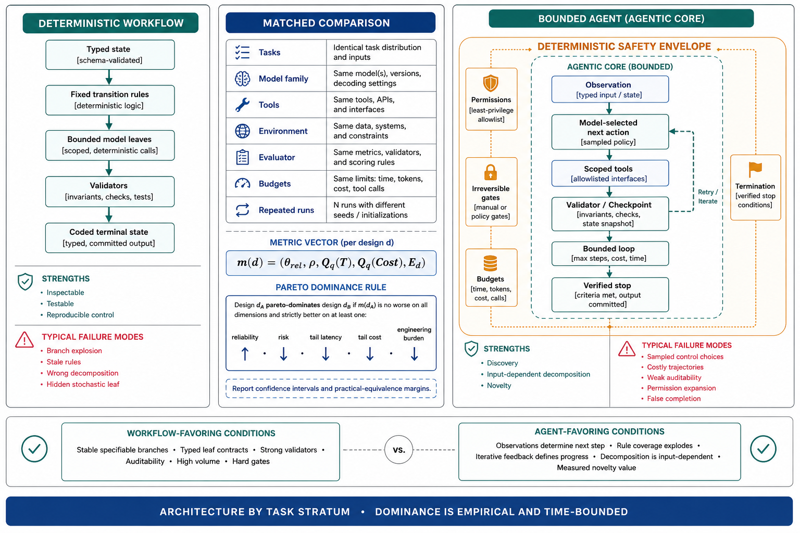

# Topic 9 — When Deterministic Workflows Dominate Agents

## 1. Problem and objective

Deterministic control and agentic control are alternative allocations of runtime decisions. Neither is universally superior. A deterministic workflow can dominate when the relevant control structure is specifiable, the implementation is correct, and measured outcomes meet the deployment constraints. An agent can be preferable when runtime observations determine which actions are useful and a fixed controller would require excessive coverage logic or fail on material task strata.

The objective is to turn that trade into a falsifiable comparison. “Workflow dominates” will mean empirical Pareto dominance under a declared task distribution and confidence level—not an architectural slogan.

## 2. What deterministic means here

A deterministic workflow fixes sequencing, gates, and branch rules in application code. It may still contain stochastic model calls at its leaves. Therefore:

- deterministic control flow does not imply deterministic end-to-end output;
- ordinary software can contain bugs;
- tools and external services can be nondeterministic;
- a workflow with model leaves remains a versioned model–harness configuration requiring repeated evaluation.

Moving a decision from the model policy to application code removes one sampled control choice. It does not make that decision correct with probability one. The gain is that the rule becomes inspectable, testable, and reproducible conditional on its inputs.

## 3. Evidence and its limits

Anthropic's engineering guidance recommends starting with the simplest pattern that satisfies the need and distinguishes predefined workflows from systems in which the model dynamically directs tool use [BEA]. Its catalog—prompt chaining, routing, parallelization, orchestrator–workers, and evaluator–optimizer—shows that substantial model capability can be embedded in bounded control structures.

CompWoB demonstrates that performance on base tasks does not transport directly to its compositional task set [CompWoB]. This supports evaluating long control paths end to end. It does not establish that every deterministic decomposition will outperform an agent, because CompWoB is not a randomized workflow-versus-agent comparison.

Harness-Bench demonstrates material variation across model–harness configurations and reports tokens and turns alongside quality [HB §4.2–4.3]. It supports configuration-level evaluation and efficiency measurement. Its aggregate harness differences do not isolate deterministic control flow as the causal factor.

Accordingly, the decision rules below are hypotheses and design priors. The deployment decision must come from a matched comparison on the target task distribution.

## 4. Decision-theoretic formulation

Let $\mathcal{D}_{\mathrm{cand}}$ be the set of candidate deployment designs. For $d\in\mathcal{D}_{\mathrm{cand}}$ and a declared tail-quantile level $q\in(0,1)$, define:

$$
\mathbf{m}(d)
\mathrel{=}
\left(
\theta_{\mathrm{rel}}(d),
\rho(d),
\operatorname{Quantile}_{q}(T_d),
\operatorname{Quantile}_{q}(\mathsf{Cost}_d),
E_d
\right),
$$

where:

- $\theta_{\mathrm{rel}}$ is the reliability estimand from Topic 7;
- $\rho$ is expected consequence-weighted loss;
- $\operatorname{Quantile}_{q}(T_d)$ and $\operatorname{Quantile}_{q}(\mathsf{Cost}_d)$ are latency and cost quantiles at level $q$;
- $E_d$ is engineering and operational burden over the decision horizon.

Design $d$ Pareto-dominates design $e$ if:

$$
\theta_{\mathrm{rel}}(d)\ge\theta_{\mathrm{rel}}(e),
\quad
\rho(d)\le\rho(e),
\quad
\operatorname{Quantile}_{q}(T_d)\le \operatorname{Quantile}_{q}(T_e),
\quad
\operatorname{Quantile}_{q}(\mathsf{Cost}_d)\le \operatorname{Quantile}_{q}(\mathsf{Cost}_e),
\quad
E_d\le E_e,
$$

with at least one strict inequality. In finite samples, a launch review should require confidence intervals or a predeclared practical-equivalence margin, not point-estimate dominance.

When no design dominates, let $Z_d=(G_d,V_d,L_d,\mathsf{Cost}_d,T_d)$ denote its random per-run outcome on the target task distribution and let $U_{\mathrm{app}}$ be the application-owned utility mapping. Choose by the declared model:

$$
d^\star
\in
\arg\max_{d\in\mathcal{F}}
\mathbb{E}\!\left[
U_{\mathrm{app}}\!\left(Z_d\right)
\right],
$$

where $\mathcal{F}\subseteq\mathcal{D}_{\mathrm{cand}}$ contains only designs satisfying hard safety, latency, cost, and compliance constraints. Utility weights must be owned by the application, not inferred from benchmark rank.

## 5. Conditions favoring a workflow baseline

These conditions raise the prior probability that a workflow will be efficient, but they do not prove dominance:

| Condition | Operational test | Residual risk |
|---|---|---|
| Branch structure is stable and specifiable | Domain experts can enumerate material states and transitions; holdout coverage remains high | Unseen states and rule drift |
| Variability is local to bounded model calls | Model outputs fit typed leaf contracts | Leaf errors still propagate |
| Intermediate states have strong validators | Each stage has acceptance and rejection criteria | Validator blind spots |
| Control decisions require auditability | Every branch is traceable to a versioned rule | Rules can still encode bad policy |
| Volume makes exploratory turns expensive | Matched tests show lower tail latency or cost | Fixed engineering cost may dominate at low volume |
| Failure cost demands hard gates | Forbidden transitions can be blocked before execution | Gate correctness and bypass paths |

The strongest case is a stable process with typed state, programmatic checks, and material consequences for unauthorized branching.

## 6. Conditions favoring bounded agentic control

| Condition | Operational signature | Required control |
|---|---|---|
| Useful actions depend on observations discovered during execution | Workflow failures cluster on “unknown next step,” not leaf quality | Bounded loop with verified stop |
| Branch coverage grows faster than maintainable rules | Special-case growth and uncovered-state rate remain high | Minimal tool set and consequence-aware permissions |
| The environment supplies iterative feedback as the specification | Progress is defined by tests, diagnostics, or search results | Checkpoints, rollback, and budget |
| Subtask decomposition is input-dependent | Fixed decompositions fail on distinct task families | Dynamic delegation inside a deterministic outer envelope |
| Novelty has measurable value | Agent improves target utility beyond equivalence margin | Repeated paired evaluation |

Agentic control should be scoped to the decisions that need it. A common architecture is a deterministic outer state machine with bounded agentic regions and verified transitions at the boundaries [BEA; CAH].

## 7. Matched comparison protocol

1. Define one task sample and run every candidate architecture on every task.
2. Match model family, tool access, environment, evaluator, and budgets where the comparison question requires it; document unavoidable semantic differences.
3. Repeat runs per task to estimate stochastic variance.
4. Report paired reliability difference, critical-failure difference, latency and cost quantile differences, and engineering burden.
5. Use a noninferiority or equivalence margin when the objective is “same quality with less risk/cost,” rather than testing a zero difference.
6. Stratify by task shape. A workflow may dominate stable strata while an agent dominates discovery-shaped strata.
7. Keep the losing architecture as a control or fallback only if its maintenance cost is justified.

## 8. Failure modes on both sides

### Workflow failure modes

- branch explosion and silent coverage gaps;
- stale rules after task-distribution drift;
- deterministic propagation of an incorrect decomposition;
- false confidence from unit tests that omit model-leaf variability;
- fallback branches that silently delegate unbounded judgment to a model.

### Agent failure modes

- unnecessary sampled control choices;
- long and costly trajectories with no added utility;
- weakly auditable branch decisions;
- permission and tool-surface expansion;
- model-declared completion without verified task state.

### Comparison failure modes

- a deliberately weak workflow baseline;
- unmatched tools, budgets, or validators;
- one run per task;
- average-only reporting that hides critical tails;
- counting engineering cost for one candidate but not the other.

## 9. Production implications

1. Build a credible bounded baseline before claiming that open-ended control is necessary.
2. Select architecture by task stratum; do not require one global winner.
3. Keep safety invariants, budgets, and irreversible transitions in deterministic control even when local action selection is agentic.
4. Re-run the paired comparison after material model, harness, tool, or task-distribution changes.
5. Treat “workflow dominates” as an empirical result with uncertainty and a validity period.

## 10. Connections

- Topic 7 supplies the reliability and risk estimands.
- Topic 8 supplies conditional hazards and finite-retry costs.
- Topic 10 generalizes binary workflow-versus-agent comparison into Pareto-constrained architecture selection.
- Topic 12 defines the paired statistics and reporting contract.

## Sources

[BEA] Anthropic, “Building Effective Agents” — https://www.anthropic.com/engineering/building-effective-agents
[CompWoB] Furuta et al., “Exposing Limitations of Language Model Agents in Sequential-Task Compositions on the Web,” TMLR — https://deepmind.google/research/publications/46840/
[HB] Harness-Bench, arXiv:2605.27922 (Knowledge_source/2605.27922v1.pdf), §3.2, §4.1–4.3, Table 2
[CAH] Code as Agent Harness, arXiv:2605.18747 (Knowledge_source/2605.18747v1.pdf), §1–3
