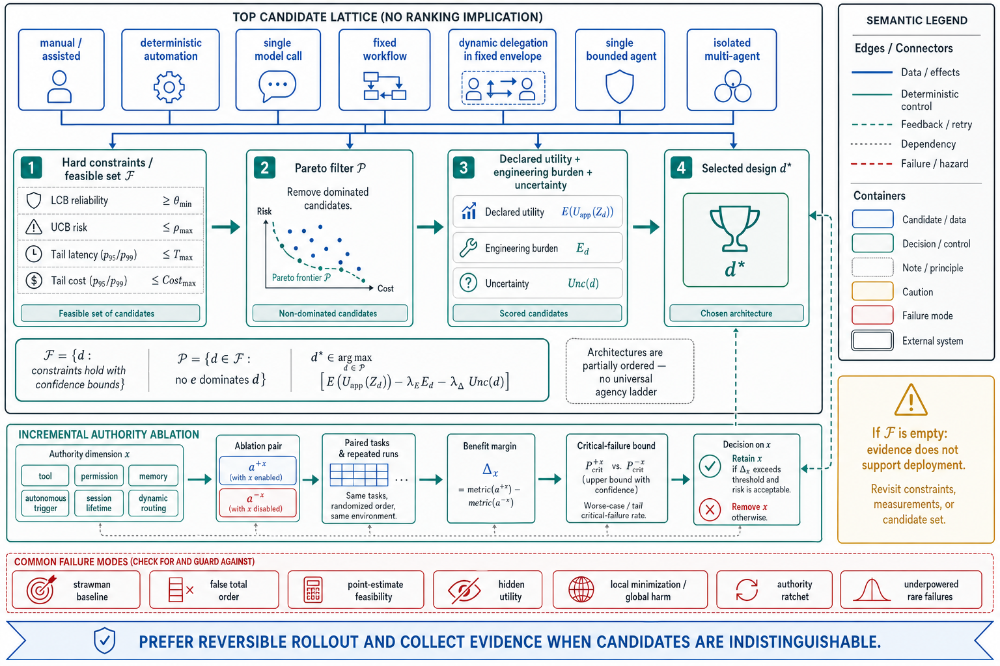

# Topic 10 — The Minimal-Agent Principle: Evidence-Constrained Architecture Selection

## 1. Problem and objective

“Use the least autonomous architecture” is useful only if “least” and “satisfies the task” are operational. Agency is multidimensional, candidate architectures are often incomparable, and measured performance is uncertain. A single vector argmin or universal rung order therefore gives false precision.

This topic replaces that total-order interpretation with a decision framework:

1. hard constraints define which architectures are admissible;
2. dominated architectures are removed;
3. the remaining Pareto frontier is compared by declared expected utility;
4. authority is removed component by component when ablation shows no material benefit.

The principle is not “always choose less agency.” It is:

> Do not retain an agentic capability, permission, persistence mechanism, or control choice unless measured benefit justifies its incremental risk and operating cost.

## 2. Why architectures are only partially ordered

Topic 5 represents agency by:

$$
\mathbf{g}(d)
\mathrel{=}
\left(
g_{\mathrm{aut}},
g_{\mathrm{reach}},
g_{\mathrm{persist}},
g_{\mathrm{adapt}},
g_{\mathrm{auth}}
\right).
$$

These coordinates have no validated common scale. One architecture may have more runtime autonomy but less environmental reach; another may have low autonomy but broad production credentials. Neither is “smaller” without an application-specific consequence model.

The familiar sequence—manual process, automation, single model call, workflow, bounded agent, multi-agent system—is therefore a menu of baselines, not a mathematical ladder. Dynamic delegation can be safer than a brittle fixed workflow if it operates in a narrower sandbox; a single agent with broad authority can be riskier than several isolated agents. Architecture labels do not determine the ordering.

## 3. Evidence base and epistemic status

Anthropic recommends simple composable patterns and increasing complexity only when it improves outcomes [BEA]. Harness-Bench shows that configuration choices materially affect quality and resource use [HB §4.1–4.3]. HarnessX and Agent-as-a-Router report gains from harness adaptation and execution-grounded routing in their evaluated domains [HX; AAR]. System cards and runtime documentation motivate authority tiering, budget limits, and permission constraints [FSC; G56; CAL].

These sources support evaluation-driven minimization and least privilege as design priors. They do not establish a universal ordering over architecture classes, nor do they show that the lowest-autonomy design always maximizes utility.

## 4. Formal decision framework

Let $\mathcal{D}_{\mathrm{cand}}$ be the set of credible candidate deployment designs for a declared population. For each $d\in\mathcal{D}_{\mathrm{cand}}$ and a predeclared tail-quantile level $q\in(0,1)$, estimate:

$$
\mathbf{m}(d)
\mathrel{=}
\left(
\theta_{\mathrm{rel}}(d),
\rho(d),
\operatorname{Quantile}_{q}(T_d),
\operatorname{Quantile}_{q}(\mathsf{Cost}_d),
E_d,
\mathbf{g}(d)
\right),
$$

using the definitions from Topics 7 and 9.

### 4.1 Confidence-constrained feasibility

Let $\operatorname{LCB}_{\gamma}[\theta_{\mathrm{rel}}(d)]$ be a one-sided lower confidence bound at coverage $\gamma$, and let $\operatorname{UCB}_{\gamma}[\rho(d)]$ be the corresponding upper bound on consequence-weighted risk. The feasible set is:

$$
\mathcal{F}
\mathrel{=}
\left\{
d\in\mathcal{D}_{\mathrm{cand}}:
\operatorname{LCB}_{\gamma}[\theta_{\mathrm{rel}}(d)]\ge\theta_{\min},
\;
\operatorname{UCB}_{\gamma}[\rho(d)]\le\rho_{\max},
\;
\operatorname{Quantile}_{q}(T_d)\le T_{\max},
\;
\operatorname{Quantile}_{q}(\mathsf{Cost}_d)\le \mathsf{Cost}_{\max}
\right\}.
$$

If $\mathcal{F}$ is empty, the evidence does not support deployment at the requested constraints. Near-threshold point estimates are not enough.

### 4.2 Pareto filtering

Remove $d$ if another feasible design $e$ is no worse on every declared objective and strictly better on at least one. This produces the Pareto set:

$$
\mathcal{P}
\mathrel{=}
\left\{
d\in\mathcal{F}:
\nexists e\in\mathcal{F}
\text{ such that }
e\prec d
\right\}.
$$

Agency dimensions may participate in dominance only where their ordering is operationally defined. For example, a strict subset of permissions is less reach under the same tool semantics; “one agent versus three agents” is not intrinsically less agency.

### 4.3 Expected utility on the frontier

When multiple candidates remain, let $Z_d=(G_d,V_d,L_d,\mathsf{Cost}_d,T_d)$ be design $d$'s random per-run outcome on the target distribution:

$$
d^\star
\in
\arg\max_{d\in\mathcal{P}}
\left\{
\mathbb{E}[U_{\mathrm{app}}(Z_d)]
\mathbin{-}
\lambda_E E_d
\mathbin{-}
\lambda_{\Delta}\,\mathsf{Unc}(d)
\right\},
$$

where:

- $U_{\mathrm{app}}$ prices task value, failures, latency, and cost;
- $E_d$ is lifecycle engineering burden;
- $\mathsf{Unc}(d)$ is a declared uncertainty or model-risk penalty, distinct from the observation kernel $\Omega$;
- $\lambda_E$ and $\lambda_{\Delta}$ are application-owned weights.

The decision record must show the utility assumptions and sensitivity analysis. A hidden scalarization is still a policy choice.

## 5. Candidate baseline lattice

Candidate generation should cover structurally distinct designs rather than force every system through a fixed ascent:

| Candidate family | Control allocation | Typical reason to include |
|---|---|---|
| Manual or assisted process | Human selects and executes consequential actions | Ground-truth workflow and labeled failure corpus |
| Deterministic automation | Code selects all actions | Stable, fully specifiable process |
| Single model call | One bounded stochastic transformation | Variable content without open-ended control |
| Fixed workflow with model leaves | Code owns sequencing; models handle bounded steps | Typed decomposition with local variability |
| Dynamic delegation in a fixed envelope | Model decomposes; application owns outer state machine | Input-dependent subtasks with hard outer invariants |
| Single bounded agent | Model selects actions inside tool, budget, and authority constraints | Discovery-shaped tasks |
| Isolated multi-agent system | Several policies coordinate through typed state | Specialization or parallel search demonstrated to add value |

Candidates can be added or removed in any order. The required comparison is against the strongest credible simpler or safer alternative, not the label immediately below it.

## 6. Incremental authority ablation

A direct way to minimize unnecessary agency is local ablation. For each capability $x$—a tool, permission, memory store, autonomous trigger, session lifetime, or dynamic routing decision—compare:

$$
a^{+x}
\quad\text{versus}\quad
a^{-x}
$$

on the same tasks and repeated runs.

Retain $x$ only when:

1. the benefit exceeds a predeclared practical margin;
2. the confidence interval excludes unacceptable degradation;
3. the incremental critical-failure surface is within its bound;
4. operational and evaluation costs are accepted by the owner.

This converts “least agency” into a sequence of falsifiable component decisions.

## 7. Review procedure

### Step 1 — Define the target

Specify task distribution, acceptance threshold, critical failures, latency/cost limits, and decision horizon.

### Step 2 — Build credible candidates

Include the current system, a bounded baseline, and any candidate whose additional flexibility addresses an observed failure class.

### Step 3 — Equalize the experiment

Use paired tasks, repeated runs, matched environments, and explicit budgets. Give baselines comparable engineering effort.

### Step 4 — Estimate and constrain

Compute the metrics in $\mathbf{m}(d)$, uncertainty intervals, and the feasible set $\mathcal{F}$.

### Step 5 — Remove dominated candidates

Construct $\mathcal{P}$; do not scalarize prematurely.

### Step 6 — Decide and stress-test

Apply expected utility, vary material weights and constraints, and report whether the winner changes.

### Step 7 — Schedule re-evaluation

Trigger on model, harness, permission, tool, evaluator, or task-distribution changes; also trigger after incidents and material near misses.

## 8. Failure modes of the principle

- **Strawman baseline:** the safer candidate receives less engineering effort.
- **False total order:** labels or the agency vector are treated as scalar ranks.
- **Point-estimate feasibility:** a candidate barely clears a threshold without uncertainty bounds.
- **Hidden utility:** cost or delivery pressure is embedded informally rather than declared.
- **Local minimization, global harm:** removing a tool reduces reach but forces riskier workarounds through a general shell.
- **Authority ratchet:** capabilities are added after incidents but never re-ablated.
- **Measurement blind spot:** rare critical failures are unobserved because the evaluation is underpowered.

## 9. Production implications

1. Maintain a Pareto-frontier decision record, not a one-dimensional autonomy score.
2. Treat permissions and tool access as ablatable configuration, with owners and expiry dates.
3. Use one-sided confidence bounds for launch constraints and two-sided intervals for comparative effects.
4. Reassess both promotion and demotion after material changes; neither direction is presumed.
5. If the evidence cannot distinguish candidates, prefer reversible rollout and collect more information rather than claiming dominance.

## 10. Connections

- Topic 7 defines the estimands and uncertainty target.
- Topic 8 supplies retry, rollback, and conditional-hazard costs.
- Topic 9 supplies the matched architecture comparison.
- Topic 11 supplies class-specific hypotheses without turning them into universal rankings.
- Topic 12 standardizes confidence intervals, power, paired designs, and multiple-comparison control.

## Sources

[BEA] Anthropic, “Building Effective Agents” — https://www.anthropic.com/engineering/building-effective-agents
[HB] Harness-Bench, arXiv:2605.27922 (Knowledge_source/2605.27922v1.pdf), §4.1–4.3
[HX] HarnessX, arXiv:2606.14249 (Knowledge_source/2606.14249v2.pdf), abstract, §3–5
[AAR] Agent-as-a-Router, arXiv:2606.22902 (Knowledge_source/2606.22902v3.pdf), §1, §3
[FSC] Claude Fable 5 & Mythos 5 System Card (Knowledge_source/), Executive Summary
[G56] GPT-5.6 Preview System Card (Knowledge_source/gpt-5-6-preview.pdf), §1
[CAL] Claude Agent SDK, “How the agent loop works” — https://code.claude.com/docs/en/agent-sdk/agent-loop
