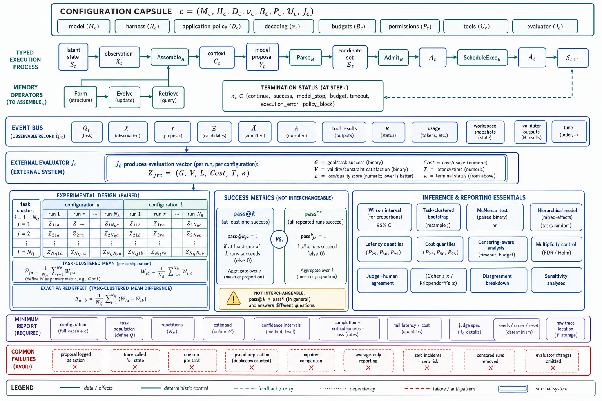

# Topic 12 — Scientific Notation and Measurement Framework Used Throughout the Book

## 1. Problem and objective

This topic is the book's notation and reporting contract. It distinguishes latent environment dynamics from observable run records, model emissions from executed actions, and task instances from repeated stochastic runs. It also defines the minimum statistical design for comparing agent configurations.

The contract has four goals:

1. every globally reserved symbol has one role, while explicitly scoped dummy indices and local parameters must not create neighboring ambiguity;
2. every reported number identifies its configuration, task population, and evaluator;
3. stochastic systems are evaluated with repeated, paired runs and uncertainty intervals;
4. quality, critical failures, latency, and cost remain visible rather than being hidden in one aggregate.

## 2. Indices, objects, and configuration

Use separate indices for separate levels:

| Symbol | Meaning |
|---|---|
| $i\in\{1,\ldots,N_A\}$ | agent or role index |
| $t\in\{0,\ldots,K\}$ | within-run decision-event index; $K$ is the final event and its resulting state is $S_{K+1}$ |
| $j\in\{1,\ldots,N_Q\}$ | task-instance index |
| $r\in\{1,\ldots,N_R(j,c)\}$ | repeated-run index for task $j$ and configuration $c$ |
| $c\in\mathcal{C}$ | complete versioned configuration |

A configuration is:

$$
c
\mathrel{=}
\left(
M_c,
H_c,
D_c,
\nu_c,
B_c,
P_c,
\mathcal{U}_c,
J_c
\right),
$$

where $M_c$ is the model, $H_c$ the harness, $D_c$ the deterministic application policy, $\nu_c$ the decoding and model-version settings, $B_c$ budgets, $P_c$ permissions, $\mathcal{U}_c$ tool contracts, and $J_c$ the evaluator specification. Environment image and task fixtures are attached to each task instance.

“Agent = Model + Harness” remains useful structural shorthand [HB §3]. The measured deployed system is broader: application routing, permissions, budgets, tools, environment, and evaluator must also be versioned.

## 3. Latent process and observable execution

### 3.1 Latent environment process

Let $\mathcal{S}$ be the environment state space and $S_t\in\mathcal{S}$ the latent state. For task specification $Q_j$, agent $i$ receives a raw observation $X_t^i$ through observation kernel $\Omega_i$:

$$
X_t^i
\sim
\Omega_i\!\left(
\cdot
\mid
S_t,
A_{t-1},
Q_j
\right).
$$

Define $A_{-1}=A_{\varnothing}$ as the initialization no-op sentinel. A domain with different initialization semantics may instead declare a separate kernel $\Omega_{i,0}(\cdot\mid S_0,Q_j)$.

Let $\mathbf X_t=(X_t^1,\ldots,X_t^{N_A})$ denote the joint raw-observation object at event $t$; components unavailable to a given agent remain absent from that agent's own context.

The environment transitions after an executed joint action $A_t$:

$$
S_{t+1}
\sim
\Psi\!\left(
\cdot
\mid
S_t,
A_t,
Q_j
\right).
$$

This is a model of the world, not a claim that $S_t$ is logged. In most deployments, the evaluator sees only projections of state through tools, workspace snapshots, and validators.

The latent trajectory is:

$$
\tau^\star
\mathrel{=}
\left(
S_0,
\mathbf X_0,
A_0,
\ldots,
\mathbf X_K,
A_K,
S_{K+1}
\right).
$$

It is generally not recoverable from logs.

### 3.2 Memory and visible history

Let $\mathcal{H}_t^i$ be the history visible to agent $i$, $\mu_t^i$ its external memory state, and $\Phi_t^i$ newly observed artifacts. Spell out memory operators to avoid collision with environment or run symbols:

$$
\mu_{t+1}^{i,\mathrm{form}}
\mathrel{=}
\operatorname{Form}
\left(
\mu_t^i,
\Phi_t^i
\right),
$$

$$
\mu_{t+1}^{i}
\mathrel{=}
\operatorname{Evolve}
\left(
\mu_{t+1}^{i,\mathrm{form}}
\right),
$$

$$
R_t^i
\mathrel{=}
\operatorname{Retrieve}
\left(
\mu_t^i,
X_t^i,
Q_j
\right).
$$

$R_t^i$ is retrieved content, not a run object.

### 3.3 Typed harness stages

The harness first assembles model context:

$$
C_t^i
\mathrel{=}
\operatorname{Assemble}_{H_c}
\left(
Q_j,
X_t^i,
\mathcal{H}_t^i,
R_t^i,
\mathcal{U}_c,
B_c,
P_c
\right).
$$

The model emits a sampled proposal:

$$
Y_t^i
\sim
\pi_{M_c}
\left(
\cdot
\mid
C_t^i,
\nu_c
\right).
$$

$Y_t^i$ may contain text, candidate tool calls, planning content, or communication. It is not yet an environment action.

Uppercase Latin symbols denote random variables or typed process objects in this contract. Lowercase $s_t$, $x_t$, $c_t$, $y_t$, and $a_t$ denote realized values in worked examples and topic prose. Greek symbols retain their declared functional roles—for example, transition kernel $\Psi$, observation kernel $\Omega$, model proposal policy $\pi_M$, induced executable policy $\pi_{\mathrm{exec}}$, and terminal-control status $\kappa_t$—rather than following the Latin case convention.

The harness parses, validates, and adjudicates proposals:

$$
\Xi_t
\mathrel{=}
\operatorname{Parse}_{H_c}
\left(
Y_t^{1:N_A}
\right),
$$

$$
\widetilde{A}_t
\mathrel{=}
\operatorname{Admit}_{H_c}
\left(
\Xi_t,
P_c,
B_c
\right),
$$

$$
A_t
\mathrel{=}
\operatorname{ScheduleExec}_{H_c}
\left(
\widetilde{A}_t,
\mathcal{U}_c
\right).
$$

$\Xi_t$ is a typed candidate-action set, $\widetilde{A}_t$ the admitted set, and $A_t$ the actions actually executed. Rejection, timeout, parse failure, and no-op are explicit outcomes. This decomposition replaces the ill-typed shortcut $\pi_D\circ\pi_H\circ\pi_M$: the harness acts both before and after the model and is a stateful transducer, not a single post-model function.

Let:

$$
\kappa_t
\in
\left\{
\mathrm{continue},
\mathrm{success},
\mathrm{model\_stop},
\mathrm{budget},
\mathrm{timeout},
\mathrm{execution\_error},
\mathrm{policy\_block}
\right\}
$$

be the terminal-control status evaluated after decision event $t$. A provider-specific subtype may refine this set. “No tool call” is a model emission pattern; whether it terminates the application is a harness or application-policy decision. When termination has no environment effect, $A_t=A_{\varnothing}$ is recorded explicitly; otherwise $S_{t+1}$ records the final admitted effect.

## 4. The observable run record

For task $j$, repetition $r$, and configuration $c$, define:

$$
\mathsf{R}_{jrc}
\mathrel{=}
\operatorname{Run}
\left(
c,
Q_j,
\mathcal{E}_j
\right).
$$

Its observable record is:

$$
\hat{\tau}_{jrc}
\mathrel{=}
\left(
Q_j,
\mathbf X_{0:K},
Y_{0:K},
\Xi_{0:K},
\widetilde{A}_{0:K},
A_{0:K},
\text{tool results},
\kappa_{0:K},
\text{usage},
\text{workspace snapshots},
\text{validator outputs}
\right).
$$

The record should include final workspace state, execution trace, usage, and validator outputs where those objects exist [HB §3.3]. Domains without a workspace must define equivalent evidence. Logging $\hat{\tau}$ does not reveal the full latent trajectory $\tau^\star$, internal model computation, or uninstrumented external effects.

The evaluator produces a vector, not only a scalar:

$$
\mathbf{Z}_{jrc}
\mathrel{=}
\operatorname{Eval}
\left(
\hat{\tau}_{jrc};
J_c
\right)
\mathrel{=}
\left(
G_{jrc},
V_{jrc},
L_{jrc},
\mathsf{Cost}_{jrc},
T_{jrc},
\kappa_{K}
\right),
$$

where $G$ is completion grade, $V$ a critical-violation indicator, $L$ consequence-weighted loss, $\mathsf{Cost}$ monetary or compute cost, and $T$ latency.

Harness-Bench's multiplicative TaskScore is a benchmark-specific diagnostic [HB §3.4]. It may be reported when reproducing that protocol, but it is not the universal reliability definition.

## 5. Estimands and estimators

### 5.1 Task-clustered reliability

For acceptance threshold $y_\star$, define:

$$
W_{jrc}
\mathrel{=}
\mathbf{1}
\left\{
G_{jrc}\ge y_\star
\land
V_{jrc}=0
\right\}.
$$

The per-task repeated-run mean is:

$$
\overline{W}_{jc}
\mathrel{=}
\frac{1}{N_R(j,c)}
\sum_{r=1}^{N_R(j,c)}
W_{jrc}.
$$

For equally weighted tasks:

$$
\widehat{\theta}_{\mathrm{rel}}(c)
\mathrel{=}
\frac{1}{N_Q}
\sum_{j=1}^{N_Q}
\overline{W}_{jc}.
$$

If deployment frequencies differ, predeclare weights $w_j$ with $\sum_j w_j=1$ and use $\sum_j w_j\overline{W}_{jc}$. Do not weight after viewing outcomes.

### 5.2 Paired configuration effects

When configurations $a$ and $b$ run on the same tasks, estimate the paired reliability difference:

$$
\widehat{\Delta}_{a-b}
\mathrel{=}
\frac{1}{N_Q}
\sum_{j=1}^{N_Q}
\left(
\overline{W}_{ja}
\mathbin{-}
\overline{W}_{jb}
\right).
$$

Report the absolute risk difference as the primary effect. Relative risk or odds ratios may be secondary, but become unstable when the reference rate is near zero. For one binary run per task, McNemar's test addresses paired proportions [MCN]. With repeated runs, use task-clustered bootstrap intervals or a predeclared hierarchical model; treating all runs as independent is pseudoreplication.

### 5.3 Confidence intervals

- For one unclustered binary proportion, use a Wilson score interval rather than the unstable Wald interval [WILSON].
- For paired or repeated-run metrics, resample task instances as clusters and retain all within-task repetitions [EFRON].
- For skewed cost and latency quantiles, use task-clustered bootstrap intervals.
- State interval type, coverage, number of bootstrap resamples, random seed, and treatment of failed or censored runs.

When zero critical failures are observed in $n$ independent opportunities, the one-sided exact upper bound is:

$$
p_{\max}
\mathrel{=}
1-(1-\gamma)^{1/n}
$$

at confidence level $\gamma$. Zero observations therefore imply a bound, not zero risk. With clustered or unequal opportunities, use a cluster-aware model or simulation.

### 5.4 Effect sizes and practical margins

Every comparison reports:

- paired absolute reliability difference;
- critical-failure risk difference;
- median and tail latency/cost differences;
- a predeclared smallest effect of practical interest;
- confidence interval relative to that margin.

Statistical significance without a practical margin is insufficient for architecture selection.

## 6. Repetition metrics: pass@k is not pass^k

### 6.1 pass@k: at least one success

pass@k measures candidate-generation capability when up to $k$ attempts may be searched and an oracle can select a correct result. Under independent per-attempt success probability $p$:

$$
\operatorname{pass@}k
\mathrel{=}
1-(1-p)^k.
$$

When $n$ samples are generated for a task and $c$ are correct, the unbiased estimator used by Chen et al. is:

$$
\widehat{\operatorname{pass@}k}
\mathrel{=}
1-
\frac{\binom{n-c}{k}}
{\binom{n}{k}},
\qquad
n-c\ge k,
$$

with value $1$ when $n-c<k$ [PASSK]. pass@k increases with search budget and assumes a mechanism can identify a successful candidate. It is not repeated-run reliability.

### 6.2 pass^k: all repeated runs succeed

Define pass^k explicitly as the probability that all $k$ repeated runs of the same task/configuration satisfy the acceptance criterion. If runs are conditionally independent with task-specific success probability $p_j$:

$$
\operatorname{pass}^{k}_j=p_j^k.
$$

Across heterogeneous tasks:

$$
\operatorname{pass}^{k}
\mathrel{=}
\mathbb{E}_{Q}
\left[p_Q^k\right],
$$

which is generally not equal to:

$$
\left(
\mathbb{E}_{Q}[p_Q]
\right)^k.
$$

In observed data, report the fraction of tasks for which all $k$ prespecified repeated runs pass, with a task-level interval. If runs share state, seeds, or provider-side caching, do not invoke the independence formula; report the empirical joint event.

## 7. Latency, cost, and censoring

Means alone hide the operational tail. Report:

$$
\operatorname{Quantile}_{0.50}(T),
\quad
\operatorname{Quantile}_{0.90}(T),
\quad
\operatorname{Quantile}_{0.95}(T),
\quad
\operatorname{Quantile}_{0.99}(T),
$$

and the corresponding cost quantiles where sample size supports them. Report tokens, tool calls, turns, and wall-clock latency separately.

Cost per accepted success is:

$$
\widehat{\mathsf{Cost}}_{\mathrm{per\ success}}
\mathrel{=}
\frac{\sum_{j,r} \mathsf{Cost}_{jrc}}
{\sum_{j,r} W_{jrc}},
$$

with failure spend retained in the numerator. Also report unconditional cost, because the ratio is undefined when no run succeeds and can hide capacity load.

Timeout and budget termination require explicit treatment:

- for service-level completion, they may count as failures;
- for time-to-event analysis, they may be right-censored if censoring assumptions are defensible;
- report both the product outcome and the censoring-aware time-to-event view [KM].

## 8. Experimental design

### 8.1 Paired, randomized execution

Use the same task instances for every configuration. Randomize or rotate configuration order within task to reduce temporal drift, cache, and rate-limit effects. Reset mutable environments between runs and isolate concurrent runs.

### 8.2 Repeated runs

Choose $N_R$ from the required precision and the expected within-task variance. Use independent seeds where supported, but record that provider-side sampling may remain nondeterministic even with a seed. Repetitions must not share mutable state unless persistence is the treatment.

### 8.3 Prospective power

Before running:

1. declare the primary endpoint and practical effect $\Delta_{\min}$;
2. estimate baseline rate and within-task correlation from pilot data;
3. simulate the planned paired, clustered design;
4. select $N_Q$ and $N_R$ to achieve the desired power;
5. inflate for expected invalid, censored, or missing runs.

For rare critical failures, power is driven by the number of genuine exposure opportunities, not the number of easy tasks. If the required upper bound is below what the design can resolve, the evaluation is underpowered by construction.

### 8.4 Multiple comparisons

Predeclare one primary comparison. For a confirmatory family of secondary hypotheses, control family-wise error with Holm's sequential procedure [HOLM]. For clearly labeled exploratory screening, control false discovery rate with Benjamini–Hochberg under its stated dependence assumptions [BH]. Report unadjusted effect sizes and intervals alongside adjusted decisions.

## 9. Evaluator and judge validation

When an LLM judge contributes to $J_c$:

1. pin model, prompt, rubric, decoding, and retry policy;
2. draw a stratified sample across task class, score range, and failure type;
3. obtain blinded independent human labels with adjudication;
4. report the judge–human confusion matrix and per-class sensitivity/specificity;
5. report raw agreement and an agreement statistic appropriate to the scale; $\operatorname{CohenKappa}$ is one option for two nominal raters [COHEN];
6. report score bias and calibration by stratum;
7. repeat validation when the judge or rubric changes.

A high correlation is not sufficient agreement. A judge can preserve ranking while being systematically lenient. Judge disagreement is measurement uncertainty, not automatically agent failure.

## 10. Task-set construction and contamination

Task admission requires documented realism, solvability, checkability, and integrity controls [HB §3.2]. ALE adds expert sourcing, professional-task coverage, staged review, and public/private task management [ALE §2.1–2.3].

ALE reports 1,490 task instances across 55 professional subdomains and finds 13 subdomains uncovered by the mapped union of 16 prior benchmarks [ALE §2.2]. Its public/private protocol is evidence of contamination control, not proof of an uncontaminated surface. Report the exact split and benchmark version used; do not infer that every held-out task is unseen or that public-task exposure has a known directional effect.

For any internal suite:

- preserve a private, access-controlled test set;
- rotate only under a versioned policy;
- deduplicate against training, prompt, and incident corpora where feasible;
- record task provenance and exposure;
- separate development, validation, and final test use.

## 11. Minimum reporting artifact

Every result table includes:

1. configuration $c$ and environment/task-suite versions;
2. task sampling frame, $N_Q$, repetitions $N_R$, and missing/censored counts;
3. primary estimand and acceptance threshold;
4. paired effect sizes with confidence intervals;
5. completion, critical failures, and consequence loss separately;
6. latency and cost quantiles;
7. judge specification and judge–human agreement;
8. multiplicity correction and power assumptions;
9. seeds, run ordering, reset/isolation protocol, and raw trace location;
10. limitations on transport to deployment.

## 12. Failure modes of measurement

- model proposals logged as if they were executed actions;
- observable traces described as complete environment state;
- one run per task for a stochastic configuration;
- repeated runs treated as independent tasks;
- unpaired comparisons on different task samples;
- average-only reporting;
- pass@k presented as reliability;
- judge scores reported without human agreement;
- many slices searched without multiplicity control;
- zero observed incidents reported as zero risk;
- censored runs silently removed;
- evaluator, permission, or budget changes omitted from the configuration identity.

## 13. Connections

This framework closes Chapter 1 and supplies the contract for later chapters:

- Chapter 2 uses realized context $c_t$, sampled proposal $y_t$, admitted action $\widetilde a_t$, and executed action $a_t$; these are lowercase realizations of the corresponding typed variables defined here.
- Chapter 3 decomposes the typed harness stages.
- Chapters 8–10 use conditional hazards and repeated-run reliability.
- Chapter 13 expands the experimental-design and evaluator-validation protocol.
- Chapter 14 operationalizes the run record, latency, cost, and censoring fields.

## Sources

[MEM] Memory in the Age of AI Agents, arXiv:2512.13564 (Knowledge_source/2512.13564v2.pdf), §2.1–2.2
[HB] Harness-Bench, arXiv:2605.27922 (Knowledge_source/2605.27922v1.pdf), §3.1–3.4, §4.1–4.3
[ALE] Agents' Last Exam, arXiv:2606.05405 (Knowledge_source/2606.05405v2.pdf), §1, §2.1–2.3
[CAL] Claude Agent SDK, “How the agent loop works” — https://code.claude.com/docs/en/agent-sdk/agent-loop
[PASSK] Chen et al., “Evaluating Large Language Models Trained on Code,” 2021 — https://arxiv.org/abs/2107.03374
[WILSON] Wilson, “Probable Inference, the Law of Succession, and Statistical Inference,” JASA 22(158), 1927 — https://doi.org/10.1080/01621459.1927.10502953
[MCN] McNemar, “Note on the Sampling Error of the Difference Between Correlated Proportions or Percentages,” Psychometrika 12, 1947 — https://doi.org/10.1007/BF02295996
[EFRON] Efron, “Bootstrap Methods: Another Look at the Jackknife,” Annals of Statistics 7(1), 1979 — https://doi.org/10.1214/aos/1176344552
[KM] Kaplan and Meier, “Nonparametric Estimation from Incomplete Observations,” JASA 53(282), 1958 — https://doi.org/10.1080/01621459.1958.10501452
[HOLM] Holm, “A Simple Sequentially Rejective Multiple Test Procedure,” Scandinavian Journal of Statistics 6(2), 1979 — https://www.jstor.org/stable/4615733
[BH] Benjamini and Hochberg, “Controlling the False Discovery Rate: A Practical and Powerful Approach to Multiple Testing,” JRSS B 57(1), 1995 — https://doi.org/10.1111/j.2517-6161.1995.tb02031.x
[COHEN] Cohen, “A Coefficient of Agreement for Nominal Scales,” Educational and Psychological Measurement 20(1), 1960 — https://doi.org/10.1177/001316446002000104
