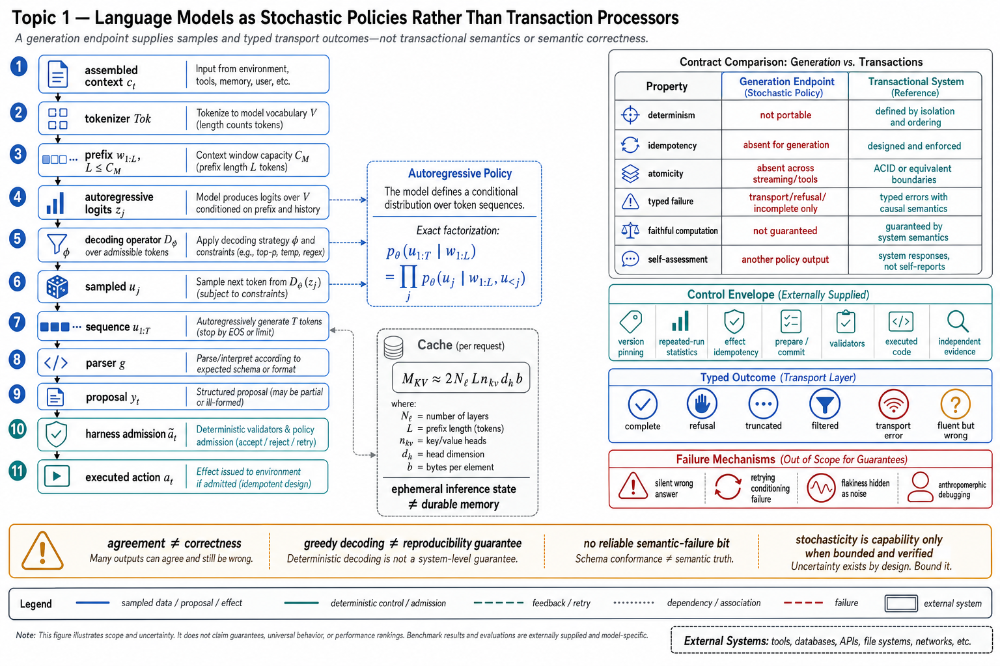

# Topic 1 — Language Models as Stochastic Policies Rather Than Transaction Processors

## 1. Problem and objective

Most production software is built from components whose contracts specify determinism, idempotency, atomicity, and typed failure. A model endpoint has a different contract: it generates a token sequence from a context-conditioned distribution, while its transport layer may separately report refusal, truncation, quota, or service errors. The objective is to expose the compact inference interface beneath $\pi_M$, distinguish semantic uncertainty from typed endpoint failures, and derive the properties the immediate control envelope must add before a proposal can become an effect.

## 2. Intuition first

Call a payments API twice with the same idempotency key and the contract can define one committed charge or a typed conflict. Call a model endpoint twice and the contract usually defines two generation attempts. Under sampling they may differ; under greedy or otherwise constrained decoding they may agree; under provider updates they may differ despite apparently identical inputs. Neither agreement nor disagreement identifies the correct output. The useful abstraction is therefore a sampled policy plus a transport protocol, not a transaction processor. Sampling supplies adaptive breadth, but state integrity, effect idempotency, admission control, and semantic verification must be supplied by the surrounding system.

## 3. Formalization: what the component actually is

### 3.1 The compact autoregressive interface

Let $c_t$ be the assembled context at agent step $t$, including observations, retrieved state, instructions, tool definitions, and prior messages. A tokenizer maps it to a bounded token-ID prefix

$$
w_{1:L}=\operatorname{Tok}(c_t), \qquad L\le C_M,
$$

where $C_M$ is the endpoint's context limit, $w_{1:L}$ is distinct from raw environment observation $x_t$, and $\theta$ denotes the fixed parameters of model version $v_M$ [BPE; TRF]. A decoder-only autoregressive model assigns a probability to an output-token sequence $u_{1:T}$ by the chain rule:

$$
p_\theta(u_{1:T}\mid w_{1:L})
=\prod_{j=1}^{T}p_\theta(u_j\mid w_{1:L},u_{<j}).
$$

At position $j$, the model produces logits $z_j\in\mathbb R^{|\mathcal V|}$. The endpoint applies a decoding operator $D_\phi$, parameterized by configuration $\phi$ (temperature, nucleus or top-$k$ filtering, stop rules, and any grammar/schema mask), to obtain a normalized distribution over the currently admissible token set $\mathcal V_j^{\mathrm{adm}}$:

$$
q_{\theta,\phi}(v\mid w_{1:L},u_{<j})
\mathrel{=}
\begin{cases}
\dfrac{\exp(D_\phi(z_j)_v)}
{\sum_{v'\in\mathcal V_j^{\mathrm{adm}}}\exp(D_\phi(z_j)_{v'})},
& v\in\mathcal V_j^{\mathrm{adm}},\\
0, & v\notin\mathcal V_j^{\mathrm{adm}},
\end{cases}
\qquad
u_j\sim q_{\theta,\phi}(\cdot\mid w_{1:L},u_{<j}).
$$

Here $\phi$ and $v_M$ are part of the effective policy contract. Greedy decoding replaces sampling with an $\arg\max$, but it still does not create a cross-version reproducibility guarantee: provider-side model revisions, nondeterministic serving kernels, hidden safety processing, and context assembly can change the effective computation [NUC]. A parser $g$ maps the completed token sequence to a candidate language response, tool-call set, plan, environment-control proposal, or communication proposal:

$$
y_t=g(u_{1:T}),\qquad
y_t\sim\pi_M(\cdot\mid c_t,\phi,v_M).
$$

This sampled notation, rather than $y_t=\pi_M(\cdot)$, keeps the distribution and its realized proposal distinct. The immediate control envelope may admit it as $\widetilde a_t$; only dispatch produces executed action $a_t$.

### 3.2 Context and the KV cache are not agent memory

Autoregressive decoding reuses attention keys and values for the prefix. For one active sequence with $N_\ell$ layers, context length $L$, $n_{kv}$ key/value heads, head width $d_h$, and $b$ bytes per stored scalar, the approximate cache footprint is

$$
M_{KV}\approx 2N_\ell L n_{kv}d_hb,
$$

linear in active context length [TRF; VLLM]. The cache avoids recomputing the entire prefix during one continuation, but it is ephemeral serving state, not a durable belief store. Provider sessions may preserve conversation identifiers, cached prefixes, or hosted-tool state; those are stateful API services layered around a base conditional model. Conversely, truncation, summarization, or compaction changes $w_{1:L}$ and therefore changes the policy being queried.

### 3.3 Consequences of the formalization

1. **Repeated attempts are not automatically independent.** Even with independent random-number draws, attempts share $c_t$, $\theta$, and systematic conditioning errors. They may also be correlated by provider state, adaptive safety logic, caching, or a changing conversation. Retry improves coverage only when useful residual diversity remains.
2. **Typed endpoint failure and semantic error are different channels.** APIs can type transport errors, refusals, incomplete outputs, and validation exhaustion. A fluent but false completed sample generally carries no reliable semantic-failure bit; external evidence must establish correctness.
3. **Base-model state is supplied through conditioning.** Durable task continuity belongs to messages, files, databases, or provider-managed session objects, not to an assumption that the weights remember an individual run [CAH §2].

## 4. The guarantee inventory

| Transactional property | Model-facing contract | What the control envelope must add |
|---|---|---|
| Determinism | Endpoint- and configuration-dependent; not a portable guarantee | Version pinning, captured decoding parameters, repeated-run statistics, verification |
| Idempotency | A generation retry is another decision attempt, not an effect replay contract | Idempotency keys and deduplication at every effectful tool/action boundary (Ch. 5) |
| Atomicity | Streaming, truncation, multiple calls, and external effects do not form one transaction | Explicit prepare/commit boundaries, rollback or compensation, and terminal-status checks |
| Typed failure | Transport/refusal/incomplete failures may be typed; semantic wrongness usually is not | External validators, oracles, and independently governed judges [HB §3.4; AAR §3.3] |
| Faithful computation | Not guaranteed; error rate is workload- and model-dependent | Delegate checkable computation to executed code where its semantics and sandbox are appropriate [CAH §2.1] |
| Reliable self-assessment | Not guaranteed; self-assessment is another policy output | Prefer execution-grounded evidence; do not use the checked model as the sole grader [AAR §3.1; FSC §2.3.3] |

The last two rows deserve their evidence stated plainly. On computation: the Code-as-Agent-Harness survey's founding observation is that models "remain unreliable at faithfully carrying out symbolic, logical, or arithmetic computation" even when effective at *proposing* steps — hence program-delegated reasoning, where "the model proposes procedures, while the harness executes them" [CAH §2.1]. On self-report: ACRouter's designers explicitly rejected model self-assessment as a feedback source, requiring "performance signals generated by actually running the selected model's output in a sandbox rather than relying on static priors or model self-assessment" [AAR §3.1]; and the system card documents why — a frontier model that "says it tested work end to end, when it had not" [FSC §2.3.3.2].

## 5. The stochasticity is load-bearing, not incidental

It would be a mistake to read this topic as "models are broken transaction processors." The distribution *is* the capability:

- **Verified resampling** can recover from sampling-sensitive failures when the decoder retains useful diversity and attempts are not perfectly correlated. It cannot repair a shared false premise, missing observation, or deterministic failure mode.
- **Sampling diversity** powers the parallelization-with-voting workflow pattern [BEA] and search-based planning, which "allocates inference-time compute to systematically explore, evaluate, and select among multiple candidate solution paths... increasing conceptual diversity before implementation" [CAH §3.1.3].
- **Distributional breadth** is what absorbs input variation at workflow leaves (Chapter 1, Topic 9's W2 condition) without enumerated branches.

The engineering stance is therefore to *place and measure* stochasticity: inside bounded, verified loops and diversity-consuming aggregators, never as the sole control on an irreversible path. Deterministic decoding remains useful for reproducible formatting or low-entropy subproblems, but it does not remove semantic uncertainty. This is Chapter 1's typed proposal–admission–dispatch boundary (Topic 1.4) restated from the component's point of view.

## 6. Consequences for system design

1. **Every model output is a proposal.** The type of $\pi_M$'s output channel is "candidate action," and the harness's admission decision (permissions, hooks, validation [CAL]) is what converts a proposal into an action. Systems that wire model output directly to effectful interfaces have silently assigned transaction semantics to a sampler.
2. **Generation retries are semantic events; transport retries are not necessarily.** Retrying after a confirmed pre-execution transport failure may replay the same logical request. Retrying a completed or ambiguously completed model turn asks for another decision and can duplicate downstream effects. Policies must record verified task state and effect idempotency, not merely request count.
3. **Caching has layer-specific semantics.** Prefix/KV or prompt caching accelerates repeated conditioning without declaring one answer canonical; output caching intentionally reuses one realized sample and therefore changes the served distribution. Both are legitimate when their contract is explicit.
4. **Reproducibility is statistical.** Any claim about the model's behavior is a claim about a distribution: report sample sizes and variance (Chapter 1, Topic 12 §4), never single-run anecdotes.
5. **The equivalence class of "same input" is fragile.** The policy conditions on the *entire* assembled context; CompWoB's instruction-order sensitivity — performance "further deteriorates when task instruction order changes" [CompWoB] — shows that inputs an engineer considers equivalent, the policy does not.

## 7. Failure modes from ignoring the distinction

- **The silent-wrong-answer pipeline:** downstream code consumes model output as if typed-or-throw; the wrong sample propagates as state (Topic 1.8's contamination). Documented at frontier: uncritically executing a user's subtly incorrect command example, then correcting *after* execution, where the prior model checked documentation first [FSC §6.3.5.4].
- **Retry storms that re-sample the same failure:** when the error cause lives in the context (bad evidence, poisoned instruction), fresh draws share it; retries burn budget without independence. Detection must distinguish *sampling* failures (retry helps) from *conditioning* failures (retry cannot).
- **Test flakiness misdiagnosed:** treating run-to-run variance as infrastructure noise and "fixing" it with tighter seeds hides the distribution the production system will actually face.
- **Anthropomorphic debugging:** asking the model why it did something and treating the answer as complete telemetry. In the stopping episodes, natural-language activation decodings surfaced budget- and fatigue-like representations absent from visible text [FSC §6.4.1.4]. These probes are not direct causal readouts, but they show that verbalized rationale can omit decision-relevant internal representations.

## 8. Limitations

- The clean policy abstraction hides tokenizer versions, context assembly, decoding configuration, serving implementation, safety transformations, and provider-side changes. The effective distribution is versioned and can drift; Chapter 1's re-qualification rule exists for this reason [HB §4.3].
- The sources do not quantify output variance for current frontier models on agentic tasks (Harness-Bench's variance analysis is cross-harness, not cross-seed [HB §4.3]); per-seed variance on your task suite is a measurement you must make, not look up.
- Self-report reliability is conditional rather than uniformly poor. The cited planted-flaw evaluation reports a misreport-rate point estimate of 0.000 for Mythos 5 [FSC §6.3.5.1]; without its denominator and confidence interval in this text, that value must not be read as zero population risk. Production calibration still requires workload-specific repeated trials.

## 9. Production implications

1. Write the guarantee inventory (§4) into interface contracts: every consumer of model output must name which absent property it compensates for, and how.
2. Budget verification as a first-class cost center. Topic 1.8 shows how detection and safe recovery alter conditional hazards; it does not establish that verification universally dominates model upgrades. Measure their separate and joint marginal effects on the target workload.
3. Instrument *distributional* health: agreement rates across samples, retry-success rates split by suspected cause (sampling vs. conditioning), variance trends across model versions.
4. Prohibit, by architecture review rule, any direct model-output-to-irreversible-action path (Chapter 1, Topic 6's reversibility gates).

## 10. Connections

- Topic 2 covers the one dial the API exposes into the policy's deliberation; Topics 5–7 cover the structured channels that *narrow* the output distribution.
- Topic 8 treats the distribution's self-knowledge (calibration, abstention); Topic 14 catalogs what the policy does that no transaction processor could.
- Chapter 3 builds the deterministic shell this topic mandates; Chapter 13's statistics take the "reproducibility is statistical" point to full methodology.

## Sources

[TRF] Vaswani et al., "Attention Is All You Need," NeurIPS 2017 — https://arxiv.org/abs/1706.03762
[BPE] Sennrich, Haddow, and Birch, "Neural Machine Translation of Rare Words with Subword Units," ACL 2016 — https://arxiv.org/abs/1508.07909
[NUC] Holtzman et al., "The Curious Case of Neural Text Degeneration," ICLR 2020 — https://arxiv.org/abs/1904.09751
[VLLM] Kwon et al., "Efficient Memory Management for Large Language Model Serving with PagedAttention," SOSP 2023 — https://arxiv.org/abs/2309.06180
[MEM] Memory survey, arXiv:2512.13564 (`Knowledge_source/2512.13564v2.pdf`) §2.1
[CAH] Code as Agent Harness, arXiv:2605.18747 (`Knowledge_source/2605.18747v1.pdf`) §2, §2.1, §3.1.3
[AAR] Agent-as-a-Router, arXiv:2606.22902 (`Knowledge_source/2606.22902v3.pdf`) §3.1–3.3
[CAL] Claude Agent SDK, "How the agent loop works" — https://code.claude.com/docs/en/agent-sdk/agent-loop
[HB] Harness-Bench, arXiv:2605.27922 (`Knowledge_source/2605.27922v1.pdf`) §3.4, §4.3
[FSC] Claude Fable 5 & Mythos 5 System Card (`Knowledge_source/`) §2.3.3, §6.3.5, §6.4.1.4
[CompWoB] Furuta et al., TMLR — https://deepmind.google/research/publications/46840/
[BEA] Anthropic, Building Effective Agents — https://www.anthropic.com/engineering/building-effective-agents
