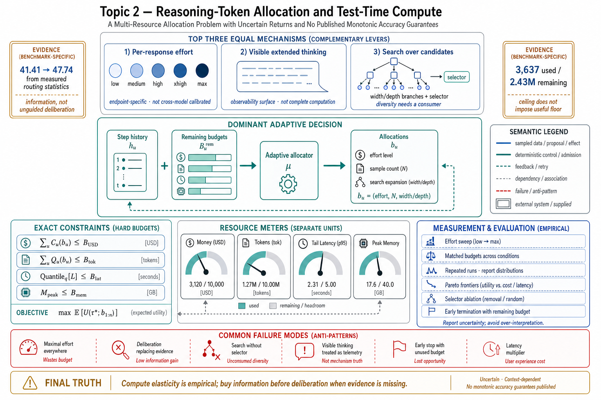

# Topic 2 — Reasoning-Token Allocation and Test-Time Compute

## 1. Problem and objective

Current reasoning-model APIs expose more direct controls over inference-time deliberation than ordinary output-token limits provided. This changes the engineering question from "which model?" to "which model, under which endpoint-specific deliberation and search budget, for which decision?" The objective is to separate three mechanisms that consume test-time compute — per-response deliberation, exposed reasoning blocks, and multi-path search — and formulate their allocation with dimensionally valid resource constraints. Official interfaces define controls; workload-specific experiments must establish their response curves.

## 2. Intuition first

Test-time compute exchanges inference resources for a workload-dependent change in solution quality. A request can allocate more model-internal deliberation, request provider-exposed reasoning blocks, or explore multiple candidates under a selector. These mechanisms are composable but not interchangeable: visible reasoning is an observability surface, a larger hidden budget changes model computation, and search changes the number and dependency structure of trajectories. None guarantees monotonic accuracy, and a budget label is not calibrated across model families.

## 3. The three mechanisms, as the interfaces define them

### 3.1 Per-response deliberation: the effort parameter

The reference runtime's semantics [CAL]:

| Level | Behavior | Documented use |
|---|---|---|
| `low` | Minimal reasoning, fast responses | File lookups, listing directories |
| `medium` | Balanced reasoning | Routine edits, standard tasks |
| `high` | Thorough analysis | Refactors, debugging |
| `xhigh` | Extended reasoning depth | Coding and agentic tasks (recommended on current frontier models) |
| `max` | Maximum reasoning depth | Multi-step problems requiring deep analysis |

Contract details that matter for engineering: effort "trades latency and token cost for reasoning depth *within each response*"; unset means the model's default; not all models support it; it can be set per session or *per subagent*, so heterogeneous allocation inside one system is a first-class capability [CAL].

### 3.2 Visible deliberation: extended thinking

The cited runtime documents extended thinking as producing visible reasoning blocks independently of its `effort` option: either feature may be enabled without the other [CAL]. This is an endpoint-specific interface distinction, not a general claim that visible tokens are the model's complete computation. The system card reports decision-associated internal decodings absent from visible text and lower recall for chain-of-thought monitors than activation-level methods [FSC §6.4.1.4, §6.4.2.1.2]. Visible reasoning can support debugging or review, but it is neither faithful mechanism telemetry nor an accuracy guarantee.

### 3.3 Structural allocation: search over candidates

Search-based planning allocates inference-time compute to generate, evaluate, and select among candidate solution paths [CAH §3.1.3; ToT]. Branches may represent reasoning strategies, environment trajectories, or candidate programs. Self-consistency performs repeated sampling followed by answer aggregation [SC]; Tree of Thoughts makes intermediate states and lookahead explicit [ToT]. Both require an equivalence rule or evaluator, and both can amplify a shared conditioning error. Operationally, search is also a control-envelope state-management problem: the runtime preserves candidates, associates evidence with branches, enforces resource limits, and determines which nodes may expand [CAH §3.1.3].

## 4. Formalization of the allocation problem

Let $E_u$ denote successful completion of step $u$, and let $b_u$ be an allocation containing endpoint effort, sample count, or search-expansion limits. For a fixed allocation schedule $b_{1:n}$ on an all-steps-must-succeed task, the chain rule gives

$$
\Pr(E_{1:n}\mid b_{1:n})
=\prod_{u=1}^{n}\Pr(E_u\mid E_{<u},b_{1:n}).
$$

This is not an independence assumption: each conditional term integrates the histories and observations reachable after prior outcomes. If the conditional probabilities are estimable and nonzero, maximizing run success is equivalent to maximizing their log sum. For open-ended tasks, the more general objective is expected trajectory utility:

$$
\max_{b_{1:n}}\;\mathbb E\!\left[U(\tau^\star;b_{1:n})\right],
$$

subject to separate resource constraints

$$
\sum_{u=1}^{n}C_u(b_u)\le B_{\mathrm{USD}},\qquad
\sum_{u=1}^{n}Q_u(b_u)\le B_{\mathrm{tok}},\qquad
\operatorname{Quantile}_{q}\!\left[L(\hat\tau;b_{1:n})\right]\le B_{\mathrm{lat}},\qquad
M_{\mathrm{peak}}(b_{1:n})\le B_{\mathrm{mem}}.
$$

Here $\tau^\star$ is the latent run trajectory, $\hat\tau$ its observable trace, $C_u$ monetary cost, $Q_u$ token consumption, $L$ measured end-to-end latency, $q$ a selected quantile such as p95 or p99, and $M_{\mathrm{peak}}$ the maximum aggregate memory simultaneously resident across all live branches. Define total cost $\mathsf{Cost}_{\mathrm{tot}}=\sum_u C_u(b_u)$ and total tokens $Q_{\mathrm{tot}}=\sum_u Q_u(b_u)$. The caps $B_{\mathrm{USD}}$, $B_{\mathrm{tok}}$, $B_{\mathrm{lat}}$, and $B_{\mathrm{mem}}$ respectively bound money, tokens, tail latency, and peak memory. These quantities cannot be collapsed into one scalar budget without an explicit, unit-bearing utility conversion. Parallel search also makes latency a critical-path quantity rather than a sum of call latencies. In an adaptive run, let $h_u$ be the observable history before step $u$ and allocate through a policy

$$
b_u\sim\mu(\cdot\mid h_u,\mathbf B_u^{\mathrm{rem}}),
$$

where $\mathbf B_u^{\mathrm{rem}}$ is the vector of remaining resource budgets; the schedule need not be fixed before execution. **[derived — allocation model; canonical test-time-compute motivation in TTC]**

Three evidence constraints govern the optimization:

1. **Compute elasticity is empirical.** Task shape supplies a prior about where extra deliberation may help, but only a workload sweep estimates the marginal gain $\Delta\mathbb E[U]/\Delta\mathsf{Cost}_{\mathrm{tot}}$, $\Delta\mathbb E[U]/\Delta Q_{\mathrm{tot}}$, or the movement of the latency–quality Pareto frontier [TTC].
2. **Compute does not replace missing information.** In the AAR routing ablation, adding measured performance statistics moved 41.41 to 47.74 AvgPerf%, whereas adding task-dimension descriptions yielded 41.18 [AAR §3.1]. This supports a benchmark-specific diagnosis that evidence, rather than more unguided deliberation, was the principal missing input.
3. **A configured ceiling does not impose a useful floor.** The system-card stopping episode used 3,637 tokens while 2.43 million remained and showed budget-exhaustion-like activation decodings [FSC §6.4.1.4]. The episode demonstrates that an outer budget alone does not guarantee continued work; it does not establish a universal internal allocation mechanism.

## 5. Architecture: where the allocation decisions live

| Layer | Allocation responsibility |
|---|---|
| Deterministic application controller $D$ | Chooses pipeline stages and which stages receive model calls (Chapter 1, Topic 9) |
| Harness mechanisms $(C_H,G_H,K_H,\sigma_H)$ | Construct context and set effort, resource ceilings, candidate storage, validators, admission, and branch scheduling [CAL; CAH §3.1.3] |
| Model policy $\pi_M$ | Determines how the configured computation is used inside the response; this remains only partially observable |

The practical hypothesis the interfaces support is **measured default, evidence-triggered exceptions**: begin with the least expensive setting that clears the step-class acceptance criterion, then increase effort or search only where a matched-budget experiment shows positive marginal utility. Search requires a declared selector — deterministic oracle, learned verifier, human review, or an explicit diversity objective — otherwise additional branches have no defined decision rule.

## 6. Measurement

The honest state of the evidence: **the sources document mechanisms, defaults, and one negative result — not accuracy-vs-compute curves.** No source in the ledger publishes an effort-response curve for an agentic task suite. Therefore:

1. Fix model snapshot, harness, prompts, tool versions, decoding configuration, and a stratified task suite; sweep effort levels with repeated seeds or repeated samples where the endpoint permits them.
2. Report quality, monetary cost, input/output/reasoning tokens, latency quantiles, and failure-type counts separately. Plot Pareto frontiers and bootstrap confidence intervals rather than only point estimates.
3. Sweep *allocation shape* at matched resource budgets: uniform effort versus adaptive per-step allocation; record the policy and remaining-budget state that selected each exception.
4. For search, cross width/depth with selector strength. A no-selector or random-selector control separates gains from generation diversity, evaluator quality, and additional total compute [CAH §3.1.3; SC; ToT].
5. Measure early termination as incomplete-task rate conditional on remaining external budget. Large unspent budget is a useful signature, not proof of a particular internal cause [FSC §6.4.1.4].

## 7. Failure modes

- **Unmeasured uniform maximal effort:** paying the highest setting on every step without establishing positive marginal utility; it necessarily raises some resource use and may or may not improve quality [CAL].
- **Deliberation as a substitute for evidence:** the [AAR §3.1] anti-pattern; reasoning harder about an under-observed decision.
- **Search without a decision rule:** candidates are multiplied without defining how diversity will be consumed. This can be valid for human exploration, but it is not an autonomous accuracy method until a selector or aggregation rule is specified [CAH §3.1.3; SC].
- **Reading extended thinking as ground truth:** the visible trace omits operative states [FSC §6.4.1.4]; auditing that treats it as complete telemetry inherits the omission.
- **Early termination with unused budget:** the model stops before external completion criteria pass; budget-exhaustion-like activation decodings in the cited episode motivate the hypothesis but do not by themselves prove its causal mechanism [FSC §6.4.1.4].
- **Latency-blind allocation:** effort multiplies decode time inside every turn of a many-turn loop; a per-response choice becomes a per-run multiplier (Chapter 14's latency decomposition).

## 8. Limitations

- No public scaling curves for effort on agentic suites exist in the ledger; §6's protocol is the remedy, and any vendor claim of the form "higher effort ⇒ better agentic performance" should be treated as a hypothesis your suite must test.
- The effort parameter's internal semantics are opaque and model-dependent ("not all models support it" [CAL]); cross-model comparisons at "the same" effort level are not calibrated comparisons.
- The search taxonomy [CAH §3.1.3] synthesizes research systems; production-grade search harnesses (candidate persistence, branch accounting) are engineering the sources describe but do not benchmark. Harness-Bench's turn/token spread [HB Table 2] shows configurations differ wildly in spend, but does not isolate deliberation from other harness differences.

## 9. Production implications

1. **Set effort per measured step class, not only per product.** The per-subagent override [CAL] allows an empirically justified expensive setting to be scoped to the steps that earn it.
2. **Enforce distinct resource ceilings:** monetary, token, latency, turn, memory, and concurrency limits answer different failure modes. Handle every termination subtype and ambiguous partial result [CAL].
3. **Buy information before deliberation** when a decision underperforms: the +15.3%-from-statistics result [AAR §3.1] is the standing reminder that evidence pipelines are often the cheaper fix.
4. **Give every search an explicit consumer of diversity.** Prefer executable validators where available; otherwise specify the judge, human review, or diversity objective and measure its selection error.
5. **Track spend per successful task by step class** alongside latency quantiles, failure mix, and quality; no single scalar captures all allocation constraints.

## 10. Connections

- Topic 3 uses the search mechanism as one of four planning loci; Topic 8 revisits sampling-based self-consistency as an uncertainty instrument.
- Topic 12's router is the allocation problem at the granularity of whole models; Topic 13 places test-time compute against fine-tuning as competing accuracy purchases.
- Chapter 6 (context) and Chapter 14 (economics) own the token-budget interactions; Chapter 10 handles budget management over long horizons where §7's self-rationing failure matters most.

## Sources

[TTC] Snell et al., "Scaling LLM Test-Time Compute Optimally Can Be More Effective than Scaling Model Parameters," ICLR 2025 — https://arxiv.org/abs/2408.03314
[SC] Wang et al., "Self-Consistency Improves Chain of Thought Reasoning in Language Models," ICLR 2023 — https://arxiv.org/abs/2203.11171
[ToT] Yao et al., "Tree of Thoughts: Deliberate Problem Solving with Large Language Models," NeurIPS 2023 — https://arxiv.org/abs/2305.10601
[CAL] Claude Agent SDK, "How the agent loop works" (effort levels, budgets, extended-thinking note) — https://code.claude.com/docs/en/agent-sdk/agent-loop
[CAH] Code as Agent Harness, arXiv:2605.18747 (`Knowledge_source/2605.18747v1.pdf`) §3.1.3
[AAR] Agent-as-a-Router, arXiv:2606.22902 (`Knowledge_source/2606.22902v3.pdf`) §3.1, Table 1
[FSC] Claude Fable 5 & Mythos 5 System Card (`Knowledge_source/`) §6.4.1.4, §6.4.2.1.2
[BEA] Anthropic, Building Effective Agents — https://www.anthropic.com/engineering/building-effective-agents
[HB] Harness-Bench, arXiv:2605.27922 (`Knowledge_source/2605.27922v1.pdf`) Table 2
