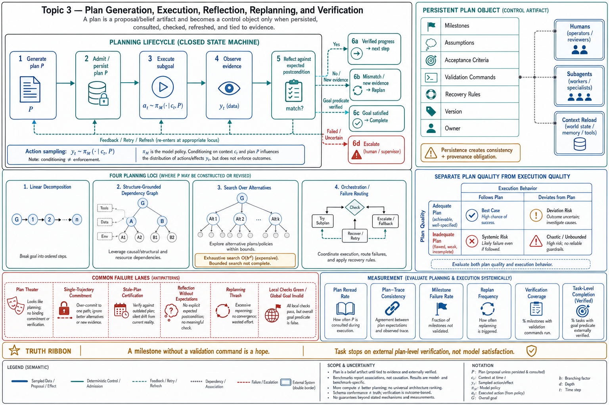

# Topic 3 — Plan Generation, Execution, Reflection, Replanning, and Verification

## 1. Problem and objective

A plan is a **planning action** but not necessarily an environment-changing action: it proposes a decomposition or policy scaffold whose later influence depends on whether the control envelope persists, validates, and consults it. This topic treats the five-stage lifecycle — generate, execute, reflect, replan, verify — as an engineering object. Planning may occur inside model inference, as an externalized artifact, or as harness-managed search [CAH §3.1]. The objective is to distinguish those mechanisms, connect them to canonical planning/search foundations, and state what turns a generated plan into a useful control object rather than authoritative prose.

## 2. Intuition first

Without an externalized task model, an agent can commit early, rediscover work, or lose dependency and acceptance-criterion state. The Code-as-Agent-Harness survey frames explicit planning as one response to this coordination problem [CAH §3.1]. The response is conditional, not universal: a stale or ungrounded plan can be worse than reactive execution, and tasks whose structure is revealed only through action require contingent replanning rather than a fixed up-front sequence.

## 3. Formalization: the plan in the formal model

In Chapter 1's terms, a planning action is action type 3: an output that decomposes tasks or specifies subgoals to guide later behavior [MEM §2.1]. Let $P$ be a generated plan and $c_t$ the ordinary model context. If the envelope admits and re-injects $P$, the next candidate action is sampled from

$$
y_t\sim\pi_M(\cdot\mid c_t,P).
$$

This equation describes conditioning, not enforcement. A plan constrains behavior only through its content, the model's instruction-following behavior, and any deterministic checks the harness attaches to it. Three consequences follow **[derived — framing ours; components sourced]**:

1. **A plan is only as available as its persistence.** If $P$ lives solely in conversational history, compaction can remove or distort it [CAL]. Persistence makes consultation possible; it does not make compliance certain.
2. **A plan is a belief-state artifact.** It encodes assumptions about the environment made at generation time; environment drift or discovery invalidates it, which is why *replanning* is a first-class operation, not an exception path.
3. **Plan quality is assessable separately from execution quality when criteria exist.** A run can fail from an invalid decomposition, execution deviation, or both. The distinction is observable only when $P$, its assumptions, and its expected postconditions are recorded.

### 3.1 Canonical planning and search foundations

In deterministic state-space planning, a problem can be written as $(\mathcal S,\mathcal A,T,s_0,G)$: states $\mathcal S$, actions $\mathcal A$, transition function $T$, initial state $s_0$, and goal predicate $G$. A finite plan $P=(a_1,\ldots,a_H)$ is valid only if every precondition holds along the induced trajectory and $G(s_H)=1$. In a partially observable or stochastic environment, the corresponding object is generally a contingent policy over observations or beliefs, not one fixed sequence [SB]. Natural-language agent plans approximate these objects but usually lack complete transition models, soundness, or completeness guarantees.

Search methods make alternatives explicit. With branching factor $b$ and depth $d$, exhaustive tree search has $O(b^d)$ node expansions and $O(bd)$ depth-first or $O(b^d)$ breadth-first frontier memory in the usual worst cases. Tree of Thoughts bounds this explosion with generated successors and model- or rule-based state evaluation [ToT]; Language Agent Tree Search combines environment actions, reflection, and Monte Carlo tree-search-style selection [LATS]. ReAct instead interleaves reasoning, action, and new observation along a trajectory [ReAct], while Reflexion records evaluative feedback to influence later trials [Reflexion]. These are distinct algorithms, not interchangeable labels for "more reasoning."

## 4. The lifecycle, stage by stage

**Generate.** The model produces a decomposition. The documented spectrum runs from a natural-language outline translated to steps (Self-Planning: "decompose the intent into concise, high-level numbered steps, then generate code step by step under the guidance of this plan" [CAH §3.1.1]) to graph-structured plans derived from dependency analysis (CodePlan "constructs a plan graph over edit obligations and derives new steps through dependency analysis and change-impact propagation" [CAH §3.1.2]).

**Execute.** Plan-conditioned proposals $y_t$ enter the ordinary admission and dispatch loop; admitted proposals become executed actions $a_t$. A current subgoal can narrow the model's effective proposal distribution, but whether this improves success is empirical; an invalid plan can narrow the distribution around the wrong trajectory.

**Reflect.** Execution feedback — runtime exceptions, test results, state deltas, or critiques [CAH Table 4] — is compared with explicit expectations. Reflection is informative only to the extent the evidence and comparator are informative; self-generated narrative without a postcondition or external signal is not verification [Reflexion].

**Replan.** Plan-And-Act's mechanism is the documented pattern: a separated planner "repeatedly refreshes the linear scaffold as new observations arrive, allowing the planning strategy to preserve task-level control while adapting to environmental feedback" [CAH §3.1.1]. Replanning is where the linear paradigm's known weakness bites: these methods "typically commit to a single decomposition trajectory: when the initial plan is incomplete or misaligned, the harness can improve persistence and auditability, but it still provides limited exploration beyond the chosen path" [CAH §3.1.1]. Escaping the committed path requires search (multiple candidate trajectories, backtracking [CAH §3.1.3]) or orchestration (failure-driven re-routing [CAH §3.1.4]).

**Verify.** Step verification checks an observed postcondition; plan verification checks whether the remaining preconditions, dependencies, and goal path are still plausible. Neither is automatically deterministic: executable tests may be partial or flaky, and human or model judges may be noisy. The survey recommends deterministic sensors and review gates where available [CAH §3, §3.4]. Verification can accept, reject, escalate, or trigger another replan, so the five labels describe a state machine rather than a one-pass pipeline.

## 5. The plan as a persistent harness object

The most consequential engineering development the survey records: lifting the plan "from an ephemeral prompt artifact to a persistent harness object." In long-horizon workflows, "files such as `PLAN.md`, `Implement.md`, and status logs record milestones, acceptance criteria, validation commands, and recovery rules, allowing the agent to reload, update, verify, and document progress across context resets or multi-session execution... planning is no longer merely an internal reasoning trace, but a filesystem-backed control object: it can be reviewed by humans, versioned with Git, consumed by subagents, and used as the source of truth for implementation" [CAH §3.1.1].

This move addresses three problems: it makes the plan recoverable after compaction, gives collaborators a common reference, and permits review independently of the action trace. It does not solve them automatically: consumers can ignore the artifact, concurrent writers can diverge, and an outdated plan can mislead downstream work. Persistence therefore creates a consistency and provenance obligation.

**What a production plan object minimally contains**, per the documented pattern [CAH §3.1.1]: milestones; acceptance criteria per milestone; validation commands (the executable form of "how we'll know"); recovery rules (what to do when a milestone fails). Note what this list is: Chapter 1's Topic 8 verification algebra, serialized.

## 6. Evidence that the lifecycle earns its cost

- CompWoB reports severe degradation under sequential task composition, and ALE reports low hard-tier success for long, heterogeneous computer-use tasks [CompWoB; ALE §1]. These benchmarks motivate explicit state and verification, but they do **not** isolate planning as the causal treatment.
- The survey synthesizes systems that externalize repository/dependency structure and argues that inspectable plan objects improve dependency awareness [CAH §3.1.2]. This is design evidence and cross-system synthesis, not a matched plan/no-plan effect size.
- ReAct, Plan-and-Solve, Tree of Thoughts, Reflexion, and LATS report gains on their respective reasoning or interactive benchmarks [ReAct; PlanSolve; ToT; Reflexion; LATS]. Their tasks, model calls, search budgets, and evaluators differ, so the results establish that planning/search can help under particular protocols, not that one lifecycle dominates all agentic workloads.
- The premature-stopping episode motivates external completion checks, but activation decodings are interpretive evidence rather than proof of a false internal budget belief causing the stop [FSC §6.4.1.4].
- No source here provides a controlled, matched-budget ablation of all five lifecycle stages on the chapter's target workload. A production team should ablate: no explicit plan; plan only; plan plus executable step checks; bounded replanning; and full plan-level verification, with repeated runs and confidence intervals.

## 7. Failure modes

- **Plan-as-theater:** a generated plan that execution never consults; all cost, no constraint. Detection: no references to plan steps in the trace; plan file never re-read after creation.
- **Single-trajectory commitment:** the documented linear-paradigm limitation [CAH §3.1.1]; the initial decomposition is wrong and every subsequent step is faithful to the wrong thing. Mitigations: search-based exploration before commitment; replanning triggers wired to failure signals, not just to step completion.
- **Stale-plan certification:** persistent plan diverges from actual state; subagents and humans consume fiction (§5). Mitigation: plan updates as part of the step-completion transaction, verified by the validation commands the plan itself carries.
- **Reflection without expectations:** "reflection" that re-narrates the transcript instead of diffing against acceptance criteria; fluent, useless, and vulnerable to the self-report failures of [FSC §2.3.3].
- **Replanning thrash:** every minor surprise triggers full replan. Damping requires explicit triggers, cooldowns or minimum evidence thresholds, and a bounded replan budget; scheduled refresh is one option, not a universally optimal mechanism.
- **Verification asymmetry:** step checks pass while plan-level verification is never run; locally green, globally lost — the agent completes milestones toward a goal the environment has already invalidated.

## 8. Limitations

- The five-stage lifecycle is a rational reconstruction; real traces interleave stages, skip reflection, verify before replanning, or perform several stages inside one model call. The load-bearing distinction is whether assumptions, decisions, and evidence are externally inspectable.
- Plan-quality metrics are underdeveloped in the sources: Table 4 records interfaces and feedback types [CAH §3.1], not plan-accuracy measurements. Proxy metrics (replan frequency, milestone-failure rate, plan-trace consistency) are **[derived]** suggestions, not sourced standards.
- Everything here presumes the task *admits* decomposition with checkable milestones; Chapter 1 Topic 6's "long horizon, no intermediate checks" row remains the shape where planning helps least and redesign helps most.

## 9. Production implications

1. **Externalize consequential plans.** A file or typed state object should record milestones, assumptions, acceptance criteria, validation commands, recovery rules, version, and current owner [CAH §3.1.1]. A file is a persistence mechanism, not evidence of use.
2. **Wire acceptance criteria to executable checks** at plan-generation time; a milestone without a validation command is a hope, not a milestone.
3. **Separate the stop condition from the model's satisfaction:** task ends when plan-level verification passes, not when the model declares completion [FSC §6.4.1.4; Chapter 10].
4. **Set a workload-derived replan policy:** triggers, maximum attempts, minimum new evidence, and escalation behavior. Both zero and high replan rates are diagnostic inputs, not standalone failure proofs.
5. **Choose the planning locus by task shape** (next topic's decision table): linear for known structure, graph-grounded for dependency-heavy repositories, search where validators can arbitrate, orchestration where failure-routing is the real control problem.

## 10. Connections

- Topic 4 compares the two ends of the plan-control spectrum (interleaved vs. separated); Topic 2 supplied the search machinery this lifecycle invokes at the replan stage.
- Chapter 1's Topics 3 (belief), 8 (verification algebra), and 10 (minimal agency) are the theory this lifecycle operationalizes.
- Chapter 8 implements plan structures as workflow graphs; Chapter 10 owns plan persistence across sessions; Chapter 11 shows the lifecycle at home in coding agents, where validation commands are native.

## Sources

[SB] Sutton and Barto, *Reinforcement Learning: An Introduction*, 2nd ed., 2018, Chapters 3–8 — http://incompleteideas.net/book/the-book-2nd.html
[ReAct] Yao et al., "ReAct: Synergizing Reasoning and Acting in Language Models," ICLR 2023 — https://arxiv.org/abs/2210.03629
[PlanSolve] Wang et al., "Plan-and-Solve Prompting: Improving Zero-Shot Chain-of-Thought Reasoning by Large Language Models," ACL 2023 — https://arxiv.org/abs/2305.04091
[ToT] Yao et al., "Tree of Thoughts: Deliberate Problem Solving with Large Language Models," NeurIPS 2023 — https://arxiv.org/abs/2305.10601
[Reflexion] Shinn et al., "Reflexion: Language Agents with Verbal Reinforcement Learning," NeurIPS 2023 — https://arxiv.org/abs/2303.11366
[LATS] Zhou et al., "Language Agent Tree Search Unifies Reasoning, Acting, and Planning in Language Models," ICML 2024 — https://arxiv.org/abs/2310.04406
[CAH] Code as Agent Harness, arXiv:2605.18747 (`Knowledge_source/2605.18747v1.pdf`) §3, §3.1.1–3.1.4, §3.4, Table 4
[MEM] Memory survey, arXiv:2512.13564 (`Knowledge_source/2512.13564v2.pdf`) §2.1
[CAL] Claude Agent SDK, "How the agent loop works" — https://code.claude.com/docs/en/agent-sdk/agent-loop
[FSC] Claude Fable 5 & Mythos 5 System Card (`Knowledge_source/`) §2.3.3, §6.4.1.4
[CompWoB] Furuta et al., TMLR — https://deepmind.google/research/publications/46840/
[ALE] Agents' Last Exam, arXiv:2606.05405 (`Knowledge_source/2606.05405v2.pdf`) §1
