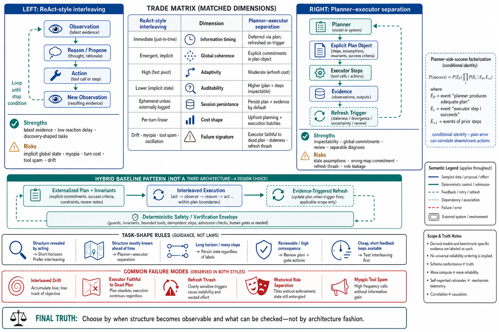

# Topic 4 — ReAct-Style Interleaving versus Explicit Planner–Executor Separation

## 1. Problem and objective

Topic 3 established the plan lifecycle; this topic compares two control organizations inside it: interleaving reasoning and acting in one observation-driven trajectory, or externalizing a plan that a logically separate executor consumes. Neither organization is universally dominant, and practical systems can combine them. The objective is to define each mechanism, connect it to the primary literature, expose its conditional trade-offs, and specify what must be measured before selecting a design.

## 2. Intuition first

Interleaving decides after each newly incorporated observation; its strength is low reaction delay, while its risk is that global commitments remain implicit or repeatedly reconstructed. Planner–executor externalizes global structure before or during execution; its strength is inspectability, while its risk is commitment to stale or invalid assumptions. The relevant variable is not architectural fashion but when task structure becomes observable, how cheaply plans and actions can be checked, and how much coordination state must survive turns or sessions.

## 3. The two mechanisms, as documented

### 3.1 ReAct-style interleaving

ReAct interleaves model-generated reasoning traces, environment actions, and returned observations so later decisions condition on newly acquired evidence [ReAct]. The survey interprets each externalized subgoal as a local control scaffold [CAH §3.1.1], and the reference runtime's evaluate–act–observe loop realizes the same broad interaction shape [CAL]. A generic tool loop is not automatically the ReAct algorithm: implementations differ in prompt format, visibility of reasoning, observation handling, and stopping rules.

Properties: each new decision can condition on the latest observation admitted to context; adaptation incurs another model turn and its latency/cost; and no separately reviewable global plan exists unless the implementation adds one. Control state may still be persisted through checkpoints, summaries, or workflow state, so poor session robustness is not intrinsic to every interleaved system.

### 3.2 Planner–executor separation

The documented pattern: Self-Planning ("the model first decomposes the intent into concise, high-level numbered steps, and then generates code step by step under the guidance of this plan") and, one step further, Plan-And-Act, which "makes this harness explicit by separating a planner, which produces structured high-level plans," from execution, with the planner "repeatedly refresh[ing] the linear scaffold as new observations arrive, allowing the planning strategy to preserve task-level control while adapting to environmental feedback" [CAH §3.1.1]. The formal model names planner–executor as a standard multi-agent configuration [MEM §2.1] — the separation can be two roles for one model, two calls, or two models.

Properties: global structure is explicit, inspectable, and potentially verifiable when machine-checkable constraints or qualified reviewers exist; persistence is an implementation choice ([CAH §3.1.1]'s `PLAN.md` pattern); execution conditions on a possibly stale artifact; and adaptivity depends on refresh triggers, evidence, and replan budget. A single generated plan remains a single-trajectory commitment unless search or alternative generation is added [ToT; LATS].

### 3.3 The rest of the dial

The survey's four-way taxonomy [CAH §3.1] distinguishes linear decomposition, structure-grounded planning, search-based planning, and orchestration-based planning. Canonical methods occupy different points: Plan-and-Solve performs explicit decomposition before solution [PlanSolve]; Tree of Thoughts searches generated intermediate states [ToT]; LATS combines environment interaction with tree search and reflection [LATS]. These axes are partly independent: an executor can interleave observations while following a structure-grounded plan, and a planner can search several plans before selecting one.

## 4. The trade space

| Property | Interleaved (ReAct) | Planner–executor |
|---|---|---|
| Information at decision time | Latest admitted observation after each turn | Plan-time assumptions plus whatever observations the executor receives |
| Global coherence | Emergent unless separately externalized | Explicit; verifiability depends on checks and plan representation |
| Adaptivity to surprise | Low reaction delay; incurs another model/tool turn | Mediated by executor authority and replan/refresh policy |
| Failure signature | Myopia: locally sensible steps, global drift | Commitment: faithful execution of a wrong map [CAH §3.1.1] |
| Auditability | Trajectory only | Plan object + trajectory (separable diagnosis: bad plan vs. bad execution — Topic 3 §3.3) |
| Compaction/session robustness | Poor if state lives only in history; recoverable with checkpoints | Better if the plan and actual progress are persisted consistently |
| Cost shape | Repeated decision cost after observations | Planning cost plus execution and refresh costs; constrained steps are not guaranteed cheaper |
| Stochastic failure structure | Sequential action errors and shared-context correlations | Plan-generation/verification error plus conditional execution errors |

No generic reliability ordering follows from counting stochastic calls. For planner–executor, let $E_P$ denote admission of an adequate plan and $E_i$ correct execution of step $i$. The unconditional chain rule is

$$
\Pr(\text{success})
=\Pr(E_P)\prod_{i=1}^{n}\Pr(E_i\mid E_P,E_{<i}).
$$

Each conditional probability integrates over the observable histories reachable after the preceding events. A history-conditioned model may instead introduce random history $H_i$ and marginalize $\Pr(E_i\mid E_P,E_{<i},H_i)$ over $H_i\mid E_P,E_{<i}$; inserting one realized $h_i$ directly into the product would no longer be the unconditional identity. Plan errors can correlate every downstream action; action feedback can expose them; and a plan verifier has false-accept and false-reject rates. Interleaving has no $E_P$ gate but still accumulates conditional action errors. **[derived]** Early plan review can be economically valuable when it is cheaper than downstream execution and has sufficient defect-detection power. The resulting decision rule is conditional: prefer external planning when global structure is useful *and* can be reviewed or maintained; prefer tighter interleaving when decisive information arrives only through action; combine them when both conditions hold.

## 5. Decision rules by task shape

Keyed to Chapter 1, Topic 6's axes:

- **Structure discoverable primarily by acting** (debugging, incident diagnosis, exploratory research) → use short planning horizons and frequent observation. A coarse plan can still encode safety bounds, hypotheses, and stopping criteria; it should not freeze unknown details.
- **Structure knowable in advance** (repository edits with a dependency graph, migrations, multi-file refactors) → planner–executor, ideally structure-grounded: derive the plan from the dependency graph rather than free-form generation — "improves coherence, dependency awareness, and long-horizon consistency" [CAH §3.1.2].
- **Long horizon** → externalize goals, constraints, progress, and evidence regardless of decision style. A persisted plan is one implementation; an interleaved system with typed checkpoints can preserve the same state. Persistence, not role naming, supplies session robustness.
- **High-consequence, reviewable global commitments** → externalize and review the plan before effects [CAH §3.4]. Interleaved execution still requires action-level gates because a reviewed plan cannot pre-authorize unforeseen concrete actions.
- **Cheap steps, fast feedback, short horizon** → test interleaving first; measure whether a separate plan improves success enough to repay coordination cost.

## 6. The production hybrid

The cited systems illustrate hybrids rather than establishing industry convergence. The reference runtime provides an interleaved tool loop plus a plan permission mode and persistent instruction files [CAL]; the survey records persistent `PLAN.md`-style artifacts [CAH §3.1.1]. A useful hybrid is **externalized plan and invariants, interleaved execution, evidence-triggered refresh**. Its benefit must be measured, and its core obligation is consistency between intended, observed, and completed state. “Planner–executor” should therefore name the actual role, state, and authority boundaries, not imply one standardized production architecture.

## 7. Failure modes

- **Interleaved drift:** each step is locally plausible while the trajectory diverges from the goal. CompWoB's composition collapse motivates measuring this class but does not isolate drift or interleaving as its cause [CompWoB].
- **Executor fidelity to a dead plan:** the single-trajectory commitment [CAH §3.1.1]; the executor's very obedience becomes the failure amplifier. Mitigation: refresh triggers wired to failure signals (Topic 3 §7).
- **Refresh thrash:** replan on every surprise; structure never stabilizes (Topic 3 §7's damping).
- **Role confusion in one context:** planner and executor as the same model in the same context window bleed into each other — the "executor" silently re-plans, the "planner" silently executes. The mitigation is mechanical isolation: separate calls, subagents with scoped tools [CAL], or the plan file as the only shared channel.
- **Myopic tool spam:** interleaving's pathological form — act-look-act loops that substitute observation for thought; rising turn counts at flat progress ([HB Table 2]'s turn accounting is the instrument; Ch.1 Topic 9 §6 noted the top-scoring harness used *fewer* turns).

## 8. Limitations

- Primary studies evaluate ReAct, explicit decomposition, and tree-search methods on different tasks and budgets [ReAct; PlanSolve; ToT; LATS]. No study in this ledger provides a matched-budget, production-workload head-to-head across the complete architectural choices in §4. Harness-Bench measures whole configurations, so planning locus remains confounded [HB §3.1].
- The reliability factorization in §4 requires conditional probabilities. Plan narrowing helps only when the admitted plan is adequate, remains current, and is actually followed; the sources do not provide those joint distributions.
- "ReAct" in the literature spans everything from the original pattern to any tool loop; claims imported from outside this ledger about "ReAct performance" should be checked for which sense they measure.

## 9. Production implications

1. **Evaluate the hybrid (§6) as a strong baseline:** persistent typed plan state, interleaved execution, and evidence-triggered refresh are supported by the reference mechanisms [CAL; CAH §3.1.1], but still require a matched-budget ablation against simpler control.
2. **Choose the pure forms deliberately:** pure interleaving for discovery-shaped tasks; pure separation where plans must be pre-approved (Chapter 12's approval gates attach to plan objects, not to token streams).
3. **Place a qualified verifier at the plan boundary when defects are detectable there.** Record its coverage and false-accept rate; retain action-level verification because a plan check cannot certify all environment outcomes.
4. **Isolate roles mechanically, not rhetorically** (§7.4): separate calls or subagents, scoped tools, plan file as interface.
5. **Instrument the signatures:** turns-per-milestone (myopia), plan-refresh rate (thrash/theater), plan–trace consistency (dead-plan execution) — all computable from the Chapter 1, Topic 12 run record.

## 10. Connections

- Topic 3 supplied the lifecycle this topic's architectures implement; Topic 2's search is the escape hatch from single-trajectory commitment.
- Chapter 8 generalizes the planner–executor split into orchestration patterns (supervisor–worker and beyond); Chapter 9 treats the multi-agent version, where the plan file becomes shared state with concurrency semantics.
- Chapter 10 depends on the persistence argument (§5): long-horizon continuity is planner–executor separation stretched across sessions.

## Sources

[ReAct] Yao et al., "ReAct: Synergizing Reasoning and Acting in Language Models," ICLR 2023 — https://arxiv.org/abs/2210.03629
[PlanSolve] Wang et al., "Plan-and-Solve Prompting: Improving Zero-Shot Chain-of-Thought Reasoning by Large Language Models," ACL 2023 — https://arxiv.org/abs/2305.04091
[ToT] Yao et al., "Tree of Thoughts: Deliberate Problem Solving with Large Language Models," NeurIPS 2023 — https://arxiv.org/abs/2305.10601
[LATS] Zhou et al., "Language Agent Tree Search Unifies Reasoning, Acting, and Planning in Language Models," ICML 2024 — https://arxiv.org/abs/2310.04406
[CAH] Code as Agent Harness, arXiv:2605.18747 (`Knowledge_source/2605.18747v1.pdf`) §3.1, §3.1.1–3.1.4, §3.4
[MEM] Memory survey, arXiv:2512.13564 (`Knowledge_source/2512.13564v2.pdf`) §2.1
[CAL] Claude Agent SDK, "How the agent loop works" (loop, plan mode, persistent context, compaction) — https://code.claude.com/docs/en/agent-sdk/agent-loop
[CompWoB] Furuta et al., TMLR — https://deepmind.google/research/publications/46840/
[HB] Harness-Bench, arXiv:2605.27922 (`Knowledge_source/2605.27922v1.pdf`) §3.1, Table 2
