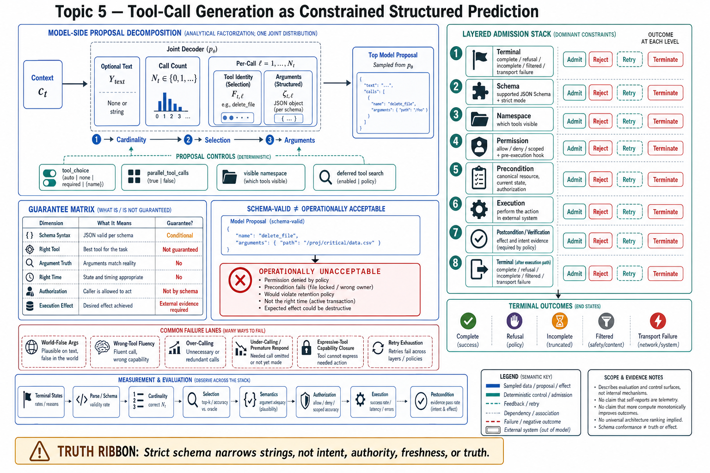

# Topic 5 — Tool-Call Generation as Constrained Structured Prediction



## 1. Problem and objective

For developer-defined functions, a model does not execute the implementation: it emits zero, one, or multiple structured call proposals that the application parses, authorizes, schedules, and may execute [OFC]. Toolformer provides an early model-side formulation in which API calls and returned results are inserted into an autoregressive sequence [Toolformer]. Hosted tools can place execution elsewhere, but the prediction problem remains. The objective is to factor call cardinality, tool selection, argument generation, and optional response content; state the conditional guarantees of constrained decoding; and separate syntactic acceptance from semantic authorization and truth.

## 2. Intuition first

Think of the tool schema as a machine-checkable form. On supported endpoints, strict constrained decoding can ensure that a **completed function-call item** conforms to the supported schema subset. It does not guarantee that a call will be emitted, that generation will complete, that the endpoint will not refuse or filter the request, that several calls are mutually consistent, or that a schema-valid value is authorized and true. A conformant `delete_file` proposal can therefore be syntactically valid and operationally unacceptable. Syntax has stronger tooling than semantics; neither class is universally solved.

## 3. Formalization: cardinality, selection, and arguments

Let $c_t$ be the assembled context, $N_t\in\{0,1,2,\ldots\}$ the number of function calls emitted in the response, $Y_t^{\mathrm{text}}$ any language-response payload, $F_{t,\ell}$ the $\ell$th function identity, and $\zeta_{t,\ell}$ its structured argument object. These are components of the model proposal $Y_t$, not raw observation $X_t$ or an executed action. A chain-rule factorization of the model-side joint distribution $p_M$ is

$$
\begin{aligned}
&p_M(Y_t^{\mathrm{text}},N_t,F_{t,1:N_t},\zeta_{t,1:N_t}\mid c_t)\\
&\quad=p_M(Y_t^{\mathrm{text}},N_t\mid c_t)
\prod_{\ell=1}^{N_t}
p_M(F_{t,\ell}\mid c_t,Y_t^{\mathrm{text}},N_t,F_{t,<\ell},\zeta_{t,<\ell})\\
&\qquad\qquad\cdot
p_M(\zeta_{t,\ell}\mid c_t,Y_t^{\mathrm{text}},N_t,F_{t,\le \ell},\zeta_{t,<\ell}).
\end{aligned}
$$

**[derived — analytical factorization; the model may implement one joint decoder]** This representation covers zero, one, or multiple calls, allows response content and calls to coexist where an endpoint permits it, and exposes dependencies among same-turn calls. OpenAI's `parallel_tool_calls: false` constrains $N_t\in\{0,1\}$ for function calling; it does not execute developer functions or prescribe application scheduling [OFC].

Each factor has distinct controls and failure modes:

**Cardinality and continuation.** `tool_choice` controls call eligibility or selection, while `parallel_tool_calls` controls whether multiple function calls may be emitted in one response [OFC]. In the cited runtime, a turn with no tool call normally terminates the built-in loop [CAL], but applications can impose a separate verified stop condition.

**Which.** Selection is conditioned on the visible namespace: tool and parameter names, descriptions, schemas, system instructions, examples, prior tool results, and learned model priors. Deferred loading changes the task into retrieve-then-select; retrieval recall becomes a prerequisite for selection accuracy [OAT; CAL ToolSearch].

**With-what.** Strict function calling constrains completed arguments to an endpoint-supported JSON-Schema subset when strict mode is active. Requests with incompatible strict schemas can be rejected; Responses may otherwise fall back to non-strict behavior, and strict mode can be disabled for multiple calls on some fine-tuned-model paths [OFC]. Refusal, maximum-output truncation, and content filtering remain distinct terminal outcomes [OSO].

## 4. What the constraints buy, precisely

The guarantee inventory, in the spirit of Topic 1 §4:

| Property | Guaranteed by machinery? | Mechanism / residual |
|---|---|---|
| Syntactic/schema validity of arguments | Conditional | Strict mode on a supported schema, a completed call, and a successful terminal status [OFC; OSO] |
| Tool name represented by the advertised protocol | Endpoint-specific | Protocol restriction or application parse-and-reject; semantic applicability remains unproved |
| Argument *semantic* truth (path exists, ID refers to what the model thinks) | **No** | Preconditions, validation hooks (Ch. 5); `PreToolUse` interception [CAL] |
| Right tool for the intent | No | Measured, not enforced: Harness-Bench scores ToolUse — "whether tools are selected and applied appropriately" — as a judged process dimension [HB §3.4] |
| Right time (call vs. respond; continue vs. stop) | No | Budgets and verified stop conditions [CAL; Ch. 10] |
| Authorized call | Not by the schema | Permission layer: allow/deny rules, scoped patterns, hooks [CAL] |

The reference runtime exposes `error_max_structured_output_retries` when validation never succeeds [CAL]. This is rejection-and-retry, not the same mechanism as token-level constrained decoding. A wrong-tool or semantically wrong argument may instead execute successfully and return an apparently informative result. The application must therefore retain terminal-status, parse, authorization, precondition, execution, and postcondition outcomes as separate typed states.

## 5. Architecture: the constraint stack around one prediction

```
terminal layer    — complete / refusal / incomplete / filtered / transport failure [OSO]
schema layer      — supported JSON Schema + active strict mode shapes arguments [OFC]
namespace layer   — which tools are visible at all: minimal enablement [HB Table 1],
                    deferred loading/tool search [OAT; CAL]
permission layer  — which predicted calls may execute: allow/deny/scoped rules,
                    permission modes, PreToolUse hooks that block pre-execution [CAL]
verification layer— whether the executed call did what the intent required:
                    result validation, oracles, judged ToolUse/Consistency [HB §3.4]
```

Reading the stack top-down: terminal handling determines whether a complete candidate exists; schema narrows argument syntax; namespace narrows selectable identities; permissions decide whether a proposal may execute; preconditions establish local admissibility; and postconditions gather evidence about effect and intent. A rejected call can become an observation to the model [CAL], so rejection messages must reveal enough to recover without leaking sensitive policy details.

Namespace size, ambiguity, and description quality are testable factors, not monotonic laws: a larger namespace can improve coverage while increasing confusion or context cost. Harness-Bench enables only required tools as an experimental control [HB §4.1], but its cross-harness ToolUse range (79.5–93.8 [HB Table 2]) does not isolate namespace size. Names, descriptions, schemas, examples, and system instructions should therefore be treated as policy inputs and ablated jointly.

## 6. Measurement

1. **Split metrics by terminal state and factor.** Record refusal, incomplete/filter/transport outcomes, parse and schema conformance, call cardinality, tool selection, argument semantics, authorization, execution, and postcondition correctness separately [OFC; OSO; CAL].
2. **Selection accuracy needs a denominator design:** evaluate on tasks with known valid tool sets, including legitimate no-call cases and tasks with several equivalent tools. In deferred loading, report retrieval recall before selection precision.
3. **Timing failures are trace metrics:** calls-after-task-completion, responses-without-needed-calls, and stop-without-verification — all computable from the Chapter 1 Topic 12 run record.
4. **Adversarial argument tests** must include schema-valid injection strings, path traversal, Unicode confusables, duplicate/canonical identifiers, boundary numerics, oversized values, symlink/alias targets, stale versions, and authorization changes between validation and use. Validate canonicalized values and bind authorization to the executed resource to control TOCTOU races.

## 7. Failure modes

- **Schema-valid, world-false arguments:** a precondition is absent, stale, or checked against a different canonical resource than execution uses.
- **Wrong-tool fluency:** confident selection of a plausible but inapplicable tool; namespace size and ambiguity are candidate causes to test, not assumed monotonic predictors [HB §3.4].
- **Over-calling:** tools invoked where a text answer was the task — observation substituted for thought (Topic 4 §7's tool spam); token cost and, for write tools, risk.
- **Under-calling / premature respond:** the *whether* factor failing toward inaction — answering from stale belief instead of re-observing (Ch. 1 Topic 3), or stopping on false completion [FSC §6.4.1.4].
- **Constraint-evasion through an expressive tool:** a shell, browser, code interpreter, or remote service may reproduce capabilities denied under narrower tool names. Permission analysis must consider the reachable capability closure, while avoiding the claim that any one tool is literally universal.
- **Retry exhaustion as silent degradation:** structured-output retries fail, a fallback model "retract[s] the completed output" [CAL], and the caller sees only a terminal error subtype — handle it; it is the interface telling you the constraint machinery gave up.

## 8. Limitations

- Strict-mode guarantees are provider-, model-, schema-subset-, terminal-status-, and feature-scoped [OFC; OSO]. Schema compilation and constrained decoding can add first-use latency or decoding overhead, and unsupported schemas can be rejected or normalized to weaker behavior.
- The factorization in §3 is an analytical device; the model computes one joint distribution, and factors interact (a bloated namespace degrades argument quality too, not just selection). Metrics by factor (§6) remain useful even where the factors are not causally separable.
- ToolUse and Consistency scores in the ledger are LLM-judged [HB §3.4, §4.1] with the judge biases Chapter 13 catalogs; no source provides human-verified tool-selection accuracy at scale.

## 9. Production implications

1. **Prefer strict mode where the endpoint and schema support it, then measure it.** Treat fallback to non-strict behavior as an explicit compatibility decision; measure first-schema latency, decode latency, refusal/incomplete rates, and semantic quality [OFC; OSO].
2. **Design the namespace as a prediction problem:** minimal enablement per phase [HB Table 1], descriptions written as decision criteria (when to use, when not), deferred loading once the namespace outgrows the context budget [OAT; CAL].
3. **Put semantic validation at the execution boundary:** a `PreToolUse` hook is only an interception point; it catches a world-false or unauthorized argument only when supplied with canonicalization, current-state preconditions, authorization checks, and race-safe execution semantics [CAL].
4. **Handle every typed failure subtype** — retry exhaustion and rejection paths are part of the interface contract [CAL], and unhandled they become silent task failures.
5. **Report tool metrics by factor and terminal state** (§6.1); “tool calling works” comprises generation, syntax, selection, authorization, execution, and postcondition claims.

## 10. Connections

- Topic 6 covers the *execution ordering* of emitted calls; Topic 7 generalizes the schema machinery to all structured outputs; Topic 9 asks who executes the call at all.
- Chapter 5 owns the full engineering of schemas, descriptions, and contracts this topic could only frame; Chapter 12 owns the authorization layer and the evasion problem (§7.5).
- The *whether* factor's stop-side reappears as Chapter 10's termination discipline.

## Sources

[OFC] OpenAI, Function calling guide (client execution, `tool_choice`, zero/one/multiple calls, strict-mode interactions) — https://developers.openai.com/api/docs/guides/function-calling
[OSO] OpenAI, Structured Outputs guide (schema subset, refusals, incomplete and filtered responses) — https://developers.openai.com/api/docs/guides/structured-outputs
[OAT] OpenAI, Tools guide (hosted tools and tool search) — https://developers.openai.com/api/docs/guides/tools
[Toolformer] Schick et al., "Toolformer: Language Models Can Teach Themselves to Use Tools," NeurIPS 2023 — https://arxiv.org/abs/2302.04761
[CAL] Claude Agent SDK, "How the agent loop works" (tool execution, permissions, hooks, structured-output retry subtype) — https://code.claude.com/docs/en/agent-sdk/agent-loop
[HB] Harness-Bench, arXiv:2605.27922 (`Knowledge_source/2605.27922v1.pdf`) §3.4, §4.1, Tables 1–2
[FSC] Claude Fable 5 & Mythos 5 System Card (`Knowledge_source/`) §6.4.1.4
