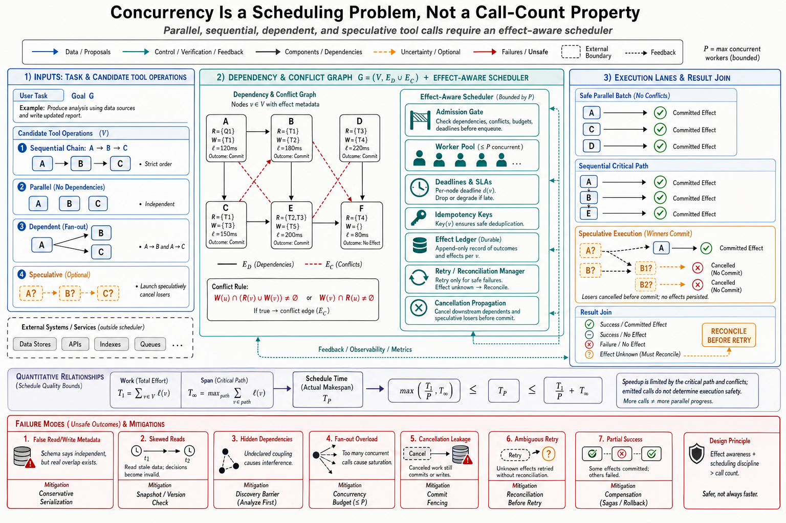

# Topic 6 — Parallel, Sequential, Speculative, and Dependent Tool Calls



## 1. Problem and objective

A response may contain zero, one, or multiple tool-call proposals; a run may contain many responses. Call **emission cardinality** belongs to the model/API contract, while execution order, isolation, cancellation, and partial-failure handling belong to the immediate control envelope. The objective is to separate these layers and replace the unsafe read/write binary with a dependency-and-conflict DAG over declared resources, side-effect properties, and consistency requirements.

## 2. Intuition first

Concurrency is safe when operations are independent or the resource system supplies appropriate isolation — not merely because an operation is labelled “read.” Parallel reads can overload a service or observe different versions; parallel writes can be safe when they touch disjoint resources, commute, are idempotent, or execute in isolated transactions. Dependencies can be data dependencies, control dependencies, or conflicts over shared state. Speculation adds work whose result may be discarded and therefore requires cancellation and effect containment. Because the proposer is stochastic and tool metadata can be wrong, the executor must validate rather than trust the proposed schedule.

## 3. The four regimes, with their controlling layer

### 3.1 Parallel calls — model proposes, harness disposes

OpenAI's function-calling interface uses `parallel_tool_calls` to control **emission cardinality**: setting it to `false` ensures that a response contains zero or one function call. For developer-defined functions, the application must execute calls and return their results; the parameter is not an execution scheduler [OFC]. The current guide also documents feature interactions, including strict-mode limitations for multiple calls on some fine-tuned-model paths [OFC].

The cited Claude Agent SDK does implement an executor policy: built-in read-only tools and MCP tools marked read-only may run concurrently; mutating tools run sequentially; custom tools default to sequential unless annotated with `readOnlyHint` [CAL]. This is a conservative runtime heuristic, not a proof of conflict freedom. A production contract should additionally declare resource read/write sets, consistency requirements, idempotency, commutativity, isolation support, timeout behavior, and maximum safe concurrency.

### 3.2 Sequential calls — the safety default

Serialization imposes program order within one executor and creates a point where a postcondition can run before the next local operation. It does not by itself guarantee isolation from other agents, external writers, eventual consistency, or an ambiguous timeout whose effect may already have committed. For $k$ serialized calls with latencies $\ell_i$, local scheduler latency is approximately $\sum_{i=1}^{k}\ell_i$ plus orchestration overhead; whether that cost is necessary depends on conflicts and the resource's transaction model.

### 3.3 Dependent calls — the turn boundary as data dependency

If call $B$ requires the previously unknown result of call $A$ to construct its arguments, both cannot be emitted as ordinary fully bound same-turn calls. The runtime can either return $A$ to the model for another decision [CAL], or execute a harness-defined dataflow graph whose placeholders and transformations were declared in advance. A dependency chain of length $k$ that repeatedly returns through the model incurs $k$ tool-result round trips and their model latencies.

Generated code can move a dependency chain into one sandboxed program [CAH §2.2], reducing model round trips. That is a trade, not a universal optimum: the program gains data-local control flow but may reduce per-step authorization, observability, cancellation granularity, and fault isolation. Use it only when the sandbox, resource scopes, timeouts, and returned evidence preserve the required invariants.

### 3.4 Speculative calls — the honest gap

Speculation executes work before its necessity is known. No interface in this chapter's ledger defines general speculative tool execution with cancellation and commit semantics. Even speculative reads consume money, quota, network capacity, and data-access authority; they can disclose sensitive identifiers or observe a non-repeatable version. Speculative writes require stronger containment: an isolated branch/transaction, deferred commit, or an idempotent and compensatable effect. Parallel candidate reasoning [CAH §3.1.3] is safer only because discarded branches need not cross an external effect boundary.

## 4. Formalization: dependency and conflict DAG

Represent proposed operations as a directed acyclic graph $G=(V,E)$ with $E=E_D\cup E_C$, where $E_D$ contains data/control dependencies and $E_C$ contains serialization constraints induced by resource conflicts. Each node $v\in V$ declares input bindings, a resource read set $R_v$, write/effect set $W_v$, expected version or precondition, idempotency key, commutativity class, timeout, and cancellation semantics. Add a data/control edge $(u,v)\in E_D$ when $v$ requires $u$'s result or success. Add or resolve a conflict between $u$ and $v$ when

$$
W_u\cap(R_v\cup W_v)\ne\varnothing
\quad\text{or}\quad
W_v\cap(R_u\cup W_u)\ne\varnothing,
$$

unless the operations commute or the resource supplies sufficient isolation. A legal schedule is a topological order of $G$ that executes only conflict-free ready nodes concurrently and checks resource versions at the admission/commit boundary. **[derived — standard dependency/conflict-serializability construction applied to tool calls; CCRS]**

For node latency $\ell_v$, total work and critical-path span are

$$
T_1=\sum_{v\in V}\ell_v,
\qquad
T_\infty=\max_{p\in\operatorname{Paths}(G)}\sum_{v\in p}\ell_v.
$$

Let $T_P$ be the makespan of a schedule using at most $P\ge1$ identical workers under this idealized DAG model. Any such schedule satisfies

$$
T_P\ge\max\!\left(\frac{T_1}{P},T_\infty\right).
$$

Under the idealized work–span model, a greedy scheduler also satisfies

$$
T_P\le\frac{T_1}{P}+T_\infty,
$$

up to constant scheduling overhead [BRENT]. Real rate limits, locks, network queues, and cancellation delays add terms outside this ideal bound. The dominant structural latency is therefore the critical path under a concurrency bound, not raw call count. A naïve pairwise conflict construction costs $O(|V|^2)$ set checks; a resource-indexed implementation costs $O(N_{\mathrm{ann}}+|E|)$ expected bookkeeping for $N_{\mathrm{ann}}=\sum_v(|R_v|+|W_v|)$ resource annotations, excluding alias resolution and resource-specific lock/version checks.

Execution results must preserve uncertainty about effects. A useful discriminated union is `Succeeded(evidence)`, `Rejected(reason)`, `Failed(error, effect=none|committed|unknown)`, `TimedOut(effect=none|committed|unknown)`, and `Cancelled(effect=none|committed|unknown)`. Downstream nodes run only when their dependency predicates accept the predecessor result. On fail-fast cancellation, already committed effects require compensation or a saga [SAGA]; an `unknown` effect requires idempotent reconciliation before retry.

A later model turn is **not** a memory barrier. Read-after-write consistency follows only from the tool/resource contract — for example, a committed version token, transaction, linearizable API, or an explicit polling condition. External writers and eventually consistent stores remain outside per-turn ordering.

```text
INPUT: proposed calls, versioned tool contracts, worker bound P, deadline
PRECONDITION: every effectful tool declares idempotency and effect-status semantics

canonicalize resource identities and validate argument bindings
construct data/control edges and resource-conflict edges
reject cyclic graphs, unresolved bindings, or unauthorized resources
initialize ready queue with zero-predecessor nodes

while unfinished nodes remain and deadline has not expired:
    revalidate versions, authorization, and preconditions for ready nodes
    dispatch at most P pairwise conflict-free nodes
    await the next typed terminal result
    append result and any committed effect to the durable effect ledger

    if result is accepted by all outgoing dependency predicates:
        release newly ready descendants
    else:
        cancel unscheduled descendants
        request cancellation of running descendants
        compensate committed effects when policy requires it
        reconcile every effect=unknown before permitting retry

return complete result map, effect ledger, and unresolved-effect set
```

## 5. Evidence and efficiency

Across Harness-Bench configurations, mean turns ranged from **5.0 to 22.6** and mean tokens from 68.7K to 175.1K; longer trajectories alone did not determine performance [HB Table 2, §4.2]. This establishes that turn and token counts vary materially, but it does not isolate batching, dependency structure, model latency, tool latency, or other harness differences as the cause. A workload-specific scheduler study should replay the same call DAG under serial, metadata-only, and conflict-aware bounded-parallel schedulers, measuring wall-clock latency, rate-limit errors, stale-version conflicts, duplicated effects, cancellation delay, and cost.

## 6. Failure modes

- **Incomplete or false metadata:** a custom tool marked `readOnlyHint` mutates state, or declared resource sets omit aliases and indirect effects. Metadata is a safety contract and must be generated from or checked against implementation behavior where possible [CAL].
- **Version-skewed reads:** concurrent calls observe different snapshots or a read races a committed write. Require version tokens or snapshot/transaction semantics when consistency matters.
- **Hidden dependencies:** the model proposes calls as independent even though one consumes another's effect. The scheduler must derive dependencies from declared bindings and resource conflicts rather than natural-language confidence.
- **Turn fragmentation:** issuing one call per model turn where a verified batch or declared dataflow was available. The incremental latency must be measured; it is not automatically $k$ times end-to-end latency because calls and inference costs vary.
- **Unbounded fan-out:** parallel read storms (dozens of concurrent fetches) as a cost and rate-limit event; concurrency needs the same budgeting as any other resource (Chapter 14's admission control).
- **Cancellation leakage:** fail-fast returns while already-started operations continue or commit; a cancelled parent is not evidence that child effects stopped.
- **Ambiguous retry:** a timeout is retried without reconciling whether the first effect committed, producing duplicates unless an idempotency key binds both attempts.
- **Partial-success loss:** successful independent results are discarded because one sibling failed, or downstream code consumes them without recording that the batch is incomplete.

## 7. Limitations

- The emission semantics [OFC] and executor heuristic [CAL] belong to different layers and specific interface versions. Other runtimes make different choices; portability requires conformance tests, not name matching.
- The conflict-DAG model assumes sufficiently accurate resource and effect annotations. Dynamic resource discovery, hidden transitive effects, external writers, and non-transactional services can invalidate the graph.
- No source quantifies the latency gain of parallel reads or the cost of turn-fragmentation on agentic suites; §5's turn-count spread is consistent with, but does not isolate, the effect.

## 8. Production implications

1. **Compile proposals into a validated DAG:** resolve resource aliases, add data/control/conflict edges, reject cycles or unresolved bindings, and apply a bounded worker pool.
2. **Make effect semantics explicit:** idempotency key, expected version, isolation level, timeout, cancellation behavior, and compensation owner for every effectful tool.
3. **Obtain consistency from the resource contract:** transaction or version tokens, not model-turn boundaries. Reconcile `effect=unknown` before retry.
4. **Propagate cancellation and preserve partial results:** stop unscheduled descendants, request cancellation of running nodes, await terminal states within a deadline, and record every committed effect.
5. **Use generated programs selectively:** move dependencies into code only when sandboxing and evidence preserve authorization, observability, and recovery [CAH §2.2].
6. **Measure scheduler value:** report work, span, realized parallelism $T_1/T_P$, queue time, conflict rate, rate-limit failures, cancellation latency, and duplicate-effect incidents alongside turn count.
7. **Contain speculation:** allow it only within a stated cost/data-access budget and an isolation, deferred-commit, idempotency, or compensation boundary appropriate to the effect.

## 9. Connections

- Topic 5 factored the *emission* of calls; this topic scheduled them; Topic 7 constrains their payloads; Topic 9 decides which side of the API executes them.
- Chapter 5 owns tool contracts (including idempotency, which turns retry-after-ambiguous-failure from hazard to routine); Chapter 9 owns multi-agent write conflict; Chapter 14 owns the latency decomposition where turn count dominates.
- The read/write asymmetry is Chapter 1 Topic 6's reversibility axis, now operating as a scheduler — one more instance of the chapter-1 axes reappearing as runtime mechanics.

## Sources

[OFC] OpenAI, Function calling guide (`parallel_tool_calls`, client execution, multiple-call strict-mode interaction) — https://developers.openai.com/api/docs/guides/function-calling
[CAL] Claude Agent SDK, "How the agent loop works" (parallel execution rules, readOnlyHint, turn structure, context accumulation) — https://code.claude.com/docs/en/agent-sdk/agent-loop
[CCRS] Bernstein, Hadzilacos, and Goodman, *Concurrency Control and Recovery in Database Systems*, 1987 — https://www.microsoft.com/en-us/research/people/philbe/book/
[BRENT] Brent, "The Parallel Evaluation of General Arithmetic Expressions," JACM 1974 — https://doi.org/10.1145/321812.321815
[SAGA] Garcia-Molina and Salem, "SAGAS," SIGMOD 1987 — https://doi.org/10.1145/38713.38742
[CAH] Code as Agent Harness, arXiv:2605.18747 (`Knowledge_source/2605.18747v1.pdf`) §2.2, §3.1.3
[HB] Harness-Bench, arXiv:2605.27922 (`Knowledge_source/2605.27922v1.pdf`) §3.4, §4.2, Table 2
