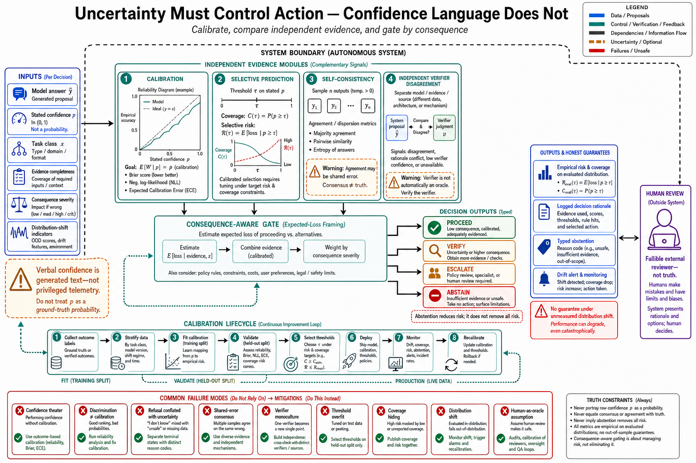

# Topic 8 — Uncertainty Estimation: Calibration, Abstention, Self-Consistency, and Verifier Disagreement



## 1. Problem and objective

An agent does not need perfect self-knowledge to behave conservatively. It needs an uncertainty signal that predicts error well enough to choose among **proceed**, **verify**, **escalate**, and **abstain**. Those are different requirements from producing persuasive confidence language.

This topic separates four mechanisms that are often collapsed into the word *confidence*: probability estimates, selective abstention, repeated-sample agreement, and external-verifier evidence. It then defines how each must be evaluated. The objective is not to claim that current model APIs expose a calibrated probability of action correctness—they generally do not—but to show how a deployment can construct, validate, and use uncertainty features without misnaming ranking quality as calibration.

## 2. Intuition first

A weather forecast of 70% rain is calibrated if rain occurs on roughly 70% of comparable forecasts. An agent saying “I am 70% confident” has made the same numerical claim, whether or not the product intended it that way. If 70%-confidence actions succeed only 45% of the time, the number is miscalibrated. If higher scores merely tend to be more accurate, the score may still be useful for ranking, but it is **discriminative**, not calibrated.

That distinction matters operationally. Ranking can decide which cases deserve review. Calibration can support expected-loss calculations. Abstention controls coverage. Verification provides evidence about the world. A reliable system names and measures each quantity separately.

## 3. Four uncertainty instruments

### 3.1 Reported or model-derived confidence

Confidence may come from a requested probability, token log probabilities where available, a learned auxiliary head, or features derived from the trajectory. None is trustworthy by construction. Each is a predictor whose relationship to task correctness must be estimated on labeled, deployment-matched data.

Visible rationales are particularly weak evidence about operative causes. The system-card examples include completion claims unsupported by execution and stopping decisions associated with internal states that did not appear in visible text [FSC §2.3.3, §6.4.1.4]. This does not prove that every verbalized probability is useless; it proves that verbalized confidence receives no privileged epistemic status. Evaluate it like any other model output.

### 3.2 Abstention and selective prediction

Abstention is an action: the system declines to commit, requests more evidence, or transfers control. It is evaluated by the trade between **coverage**—the fraction of cases handled automatically—and **selective risk**—the error rate on those handled cases.

Safety refusal, policy blocking, and epistemic abstention are different events:

- **Epistemic abstention:** evidence is insufficient to support a correct answer or action.
- **Safety refusal:** policy prohibits assistance even if the model may know the answer.
- **Harness rejection:** an otherwise proposed action violates an authorization or invariant.
- **Capability failure:** the model attempts the task and fails without abstaining.

The FSC evaluations show that confidently wrong behavior and refusal rates can change substantially across model versions [FSC §6.3.4–6.3.5]. They establish the need for version-specific regression tests; they do not establish a universal abstention threshold.

### 3.3 Self-consistency and semantic dispersion

Sampling $K$ outputs and measuring their agreement exposes variation under the chosen decoding process. For discrete answers with a reliable equivalence function, one simple agreement statistic is

$$
A_K = \max_y \frac{1}{K}\sum_{k=1}^{K}\mathbf{1}\{g(Y_k)=y\},
$$

where $Y_k$ is sample $k$ and $g$ maps surface forms to semantic answer classes. For open-ended outputs, lexical equality is inadequate; answers must be clustered by meaning, which introduces an additional model or human judgment layer. Semantic-entropy methods formalize this grouping [SEM-ENT].

Agreement measures decoding dispersion under shared conditioning. It does not guarantee truth. A false premise, poisoned tool output, or systematic model bias can produce unanimous error. Repeated samples are therefore complementary to independent evidence, not a substitute for it.

### 3.4 Verifier scores and disagreement

Execution, deterministic validators, domain rules, independent models, and humans can all produce verifier signals. AAR’s router uses execution-grounded signals rather than model self-assessment [AAR §3.1–3.3]; Harness-Bench combines deterministic and judged evidence [HB §3.3–3.4]. These are strong patterns because the evidence channel differs from the generation channel.

Verifier output is not automatically ground truth. A test suite can be incomplete, two judges can share training biases, and a human reviewer can be affected by automation bias. Record verifier identity, version, coverage, false-positive and false-negative rates, and correlations between verifiers. Disagreement is informative only after the verifiers themselves are characterized.

## 4. Formalization

Let $W\in\{0,1\}$ indicate whether an externally evaluated action or answer is correct, and let $\hat p\in[0,1]$ be a predicted probability of correctness. For empirical metrics, use a held-out set of $N$ labeled pairs $\{(w_n,\hat p_n)\}_{n=1}^{N}$ drawn under the declared evaluation protocol. This correctness variable is distinct from proposal sample $Y_k$ in §3.3.

### 4.1 Calibration

Perfect calibration satisfies

$$
\mathbb{E}[W\mid \hat p=p]=p
$$

for probability values with support. Two proper scoring rules are the Brier score and negative log-likelihood:

$$
\operatorname{Brier}=\frac{1}{N}\sum_{n=1}^{N}(\hat p_n-w_n)^2,
$$

$$
\operatorname{NLL}
=-\frac{1}{N}\sum_{n=1}^{N}
\left[w_n\log \hat p_n+(1-w_n)\log(1-\hat p_n)\right].
$$

For NLL, use the extended-real conventions $0\log 0=0$ and $-\log 0=+\infty$ for a zero-probability realized class. Numerical clipping changes the reported score and must declare its clipping level.

Partition $[0,1]$ into $N_{\mathrm{bin}}$ declared bins and let $I_b=\{n:\hat p_n\text{ falls in bin }b\}$ and $\mathcal B_+=\{b:|I_b|>0\}$. For $b\in\mathcal B_+$, define $\operatorname{acc}(I_b)=|I_b|^{-1}\sum_{n\in I_b}w_n$ and $\operatorname{conf}(I_b)=|I_b|^{-1}\sum_{n\in I_b}\hat p_n$. Expected calibration error (ECE) is useful diagnostically but depends on that binning:

$$
\operatorname{ECE}
=\sum_{b\in\mathcal B_+}\frac{|I_b|}{N}
\left|\operatorname{acc}(I_b)-\operatorname{conf}(I_b)\right|.
$$

Report the binning scheme and reliability diagram; do not use ECE alone to rank systems [CALIB].

### 4.2 Selective risk and coverage

For a decision threshold $\eta\in[0,1]$ and declared correctness loss $\ell(W)$,

$$
\operatorname{Cov}(\eta)=\Pr(\hat p\ge \eta),
$$

$$
\operatorname{SelRisk}(\eta)
=\mathbb{E}[\ell(W)\mid \hat p\ge\eta].
$$

$\operatorname{Cov}(\eta)$ is coverage and $\operatorname{SelRisk}(\eta)$ is selective risk; for ordinary error rate, set $\ell(W)=1-W$. The risk–coverage curve and its area summarize whether abstention removes genuinely difficult cases [SELECT]. Monotonic error reduction across score buckets demonstrates ranking utility; it is not, by itself, probability calibration.

### 4.3 Decision-theoretic routing

Let gate decision $d$ belong to $\mathcal D_{\mathrm{gate}}=\{\mathrm{proceed},\mathrm{verify},\mathrm{escalate},\mathrm{abstain}\}$. Given uncertainty-feature vector $u$, consequence class $\chi$, and a unit-consistent application loss $L_{\mathrm{gate}}(d,W,\chi)$, the Bayes decision is:

$$
d^*(u,\chi)
=\arg\min_{d\in\mathcal D_{\mathrm{gate}}}
\mathbb{E}[L_{\mathrm{gate}}(d,W,\chi)\mid u,\chi],
$$

where the loss includes task error, verification or review cost, delay, and residual harm in application-owned units. Verification and human review are not free or perfect. High-consequence classes should therefore use different loss matrices and thresholds from reversible, low-impact tasks.

Conformal methods can provide finite-sample marginal coverage under exchangeability assumptions [CONFORMAL]. Distribution shift, adaptive trajectories, and dependent agent actions weaken those assumptions, so conformal coverage must be revalidated rather than advertised as pointwise certainty.

## 5. Architecture: an uncertainty gate with typed evidence

```text
candidate output/action
    → collect model-derived features
    → collect independent verifier evidence where required
    → estimate calibrated probability or risk rank
    → apply consequence-specific decision rule
    → proceed | verify-more | escalate | abstain/replan
    → record outcome for later recalibration
```

The gate belongs in the harness because it combines signals, policy and consequence information that the model alone does not possess. Its output must be typed: “abstained for insufficient evidence” is observably different from “blocked by policy” and “verification infrastructure unavailable.”

## 6. Measurement methodology

1. **Define the estimand.** Specify correctness for assertions, tool calls, plans and completion decisions separately; a single confidence score across all four is rarely meaningful.
2. **Collect deployment-matched labels.** Prefer deterministic or execution-grounded outcomes. Where humans or model judges are necessary, measure inter-rater agreement and adjudicate a blinded sample.
3. **Split fitting from evaluation.** Fit temperature, isotonic or other calibration mappings on a calibration split; report metrics on untouched data. Never evaluate a threshold on the cases used to choose it.
4. **Report uncertainty.** Bootstrap by task—not by individual correlated step—to obtain confidence intervals for Brier score, ECE, coverage and selective risk.
5. **Stratify.** Report by task family, horizon, consequence, modality and model–harness version. Aggregate calibration can hide severe subgroup miscalibration.
6. **Stress distribution shift.** Re-evaluate after model, prompt, tool, retrieval, policy or environment changes. Include adversarially misleading context and corrupted-verifier tests.
7. **Price the gate.** Measure added tokens, verifier latency, human-review time and residual critical-failure probability at each operating point.

## 7. Failure modes

- **Confidence theater:** a fluent probability is accepted without a reliability diagram or proper score.
- **Calibration/discrimination confusion:** monotonic buckets are described as calibrated probabilities.
- **Refusal conflation:** safety-policy refusals are counted as successful epistemic abstentions.
- **Consensus on shared error:** additional samples repeat a conditioning failure.
- **Semantic-clustering leakage:** the same model family generates and clusters answers, producing correlated judgments.
- **Verifier monoculture:** supposedly independent validators share data, implementation or incentives.
- **Threshold overfitting:** a risk threshold is tuned and reported on the same evaluation set.
- **Coverage hiding:** low error is achieved by abstaining on most cases without reporting coverage.
- **Shift-induced miscalibration:** a model or harness update invalidates old thresholds.
- **Human escalation as assumed oracle:** reviewer mistakes, latency and automation bias are omitted from the loss model.

## 8. Limitations

- Agent correctness is often structured and delayed; a binary $W$ may compress partial success, reversible errors and critical violations. Use task-specific loss functions where consequence matters.
- Token probabilities describe sequence generation, not directly the probability that an environment action is correct.
- Calibration is distribution-specific. No finite evaluation proves calibration under arbitrary deployment shift.
- Self-consistency and verifier ensembles can be expensive and correlated. Diversity must be measured, not inferred from component names.
- The FSC measurements are model- and evaluation-specific. They support existence and regression testing, not universal production rates.

## 9. Production implications

1. Treat every confidence source as an empirically evaluated predictor.
2. Report calibration, discrimination, coverage and selective risk as separate quantities.
3. Give abstention an explicit product path and a typed reason.
4. Prefer execution-grounded evidence for effectful actions, while measuring verifier coverage and failure.
5. Choose thresholds from expected consequence, verification cost and residual risk—not from a universal confidence number.
6. Version calibration artifacts with the full $(M,H)$ configuration and invalidate them on relevant changes.
7. Preserve disagreement cases: they are high-value data for error analysis and future gate improvement.

## 10. Connections

- Topic 1 supplies the stochastic outputs whose uncertainty is being estimated.
- Topic 7 supplies typed abstention and validation outcomes.
- Topic 12 uses these estimates for model routing and escalation.
- Topic 14 distinguishes the failure mechanisms the gate is intended to detect.
- Chapters 10, 12 and 13 apply selective risk to termination, authorization and evaluation respectively.

## Sources

[FSC] Claude Fable 5 & Mythos 5 System Card (`Knowledge_source/Claude Fable 5 & Claude Mythos 5 System Card.pdf`) §2.3.3, §6.3.4–6.4.2
[AAR] Agent-as-a-Router, arXiv:2606.22902 (`Knowledge_source/2606.22902v3.pdf`) §3.1–3.3
[HB] Harness-Bench, arXiv:2605.27922 (`Knowledge_source/2605.27922v1.pdf`) §3.3–3.4
[CAH] Code as Agent Harness, arXiv:2605.18747 (`Knowledge_source/2605.18747v1.pdf`) §3.1.3
[BEA] Anthropic, “Building Effective Agents” — https://www.anthropic.com/engineering/building-effective-agents
[CALIB] Guo et al., “On Calibration of Modern Neural Networks,” ICML 2017 — https://proceedings.mlr.press/v70/guo17a.html
[SELECT] Geifman and El-Yaniv, “Selective Classification for Deep Neural Networks,” 2017 — https://arxiv.org/abs/1705.08500
[CONFORMAL] Angelopoulos and Bates, “A Gentle Introduction to Conformal Prediction and Distribution-Free Uncertainty Quantification” — https://arxiv.org/abs/2107.07511
[SEM-ENT] Kuhn, Gal, and Farquhar, “Detecting Hallucinations in Large Language Models Using Semantic Entropy,” Nature 2024 — https://www.nature.com/articles/s41586-024-07421-0
