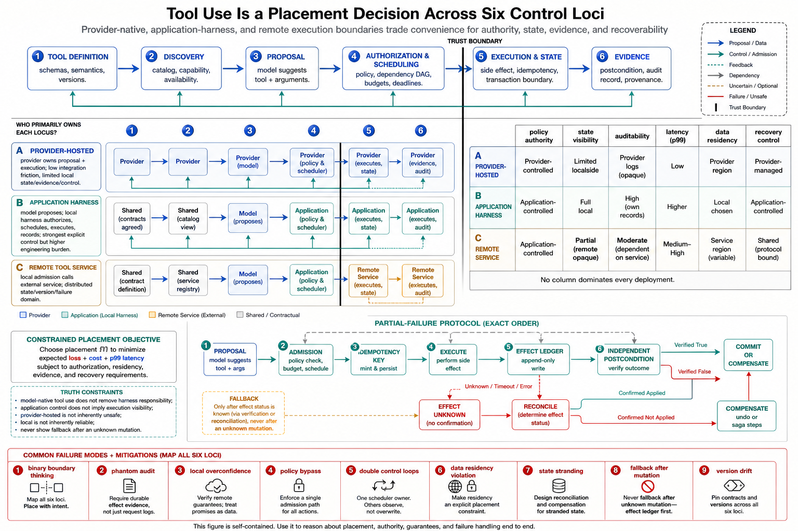

# Topic 9 — Model-Native Tool Use versus Harness-Implemented Control Flow

## 1. Problem and objective

“The model used a tool” hides several independent placement decisions. The model may propose the call, the provider may schedule or execute it, a remote service may hold the state, and the application may still authorize or audit it. Treating all of these as one hosted-versus-local switch produces incorrect security, latency and recovery assumptions.

The objective is to decompose tool use into explicit loci—proposal, orchestration, authorization, execution, state and evidence—then choose each locus from the required assurance level. The topic concerns the model’s immediate control envelope; Chapter 3 owns the full harness implementation.

## 2. Intuition first

Two systems can display the same three-line trace—call, result, answer—while having completely different operational properties. In one, the application sees and approves every proposed effect before executing it inside its own transaction boundary. In another, a provider runs a hosted capability and returns structured events after the fact. A third calls a remote MCP server: authorization may be local or provider-mediated, execution is remote, and state belongs to the service.

The meaningful question is therefore not “hosted or local?” It is: **who decides, who authorizes, who executes, who owns the state, and what evidence survives?**

## 3. A six-locus decomposition

For each tool capability, record the following functions separately:

1. **Definition:** who publishes the tool contract, schema and semantic description?
2. **Discovery:** who decides which tool definitions enter the model context?
3. **Proposal:** which model or deterministic rule selects a tool and arguments?
4. **Authorization and scheduling:** who admits, orders, limits or rejects proposed calls?
5. **Execution and state:** where does the effect occur, under whose credentials, and where is state retained?
6. **Evidence:** which party records proposals, approvals, inputs, outputs, side effects, costs and failures?

These functions can be placed independently. A provider may discover a client-defined function while the application authorizes and executes it. A remote MCP server executes outside both processes while the application requires approval. A hosted search tool can execute at the provider while returning citations and structured events sufficient for a particular audit standard [OAT].

### 3.1 Provider-hosted capabilities

Hosted tools such as web search, file search, code interpretation or computer use execute within provider-managed infrastructure [OAT]. Their exact controls, trace detail, data handling and failure semantics are endpoint- and version-specific. Hosted does **not** mean unobservable or uncontrolled; it means the application’s assurance depends partly on a provider contract and telemetry it does not implement itself.

### 3.2 Application-executed functions

For client functions, the application receives the proposed name and arguments and decides whether and how to execute them. Permission rules and pre-execution hooks can provide complete mediation when every effectful path passes through them [CAL]. This gives the application more control, but not automatic correctness: authorization code, tool implementations, credentials, retries and logs can still fail.

### 3.3 Remote services and MCP tools

Remote tools occupy a distinct trust boundary. The application or provider may gate the call, but execution and some state live in another administrative domain. Treat remote tool output as untrusted input, authenticate both parties, propagate the minimum identity and authority, and document data retention and failure semantics.

## 4. Property matrix

| Property | Provider-hosted execution | Application execution | Remote-service execution |
|---|---|---|---|
| Pre-execution control | Provider controls plus exposed approval/scope knobs | Application policy with complete mediation if correctly implemented | Application/provider gate plus remote authorization |
| Trace fidelity | Contract-dependent provider events and metadata | Application can record proposal through side effect | Split across caller and service; correlation required |
| Data movement | Inputs move into provider boundary | Model context still moves to provider; tool data can remain local | Relevant inputs move to remote service |
| Credentials | Provider-scoped or delegated | Application-managed | Delegated or service-specific |
| State ownership | Provider service/session | Application stores and tools | Remote service, often partially opaque |
| Failure and retry | Provider-defined; inspect documented events | Application-defined, including idempotency and compensation | Distributed failure; ambiguous outcomes are common |
| Portability | Coupled to hosted semantics | Tool implementation can be model-portable | Coupled to remote contract and protocol version |
| Engineering burden | Lower locally; assurance work shifts to vendor review | Higher implementation and operations burden | Shared burden plus cross-domain coordination |

No column dominates. A hosted tool can be the most reliable choice when its contract and isolation are stronger than an application team could build. An application tool can be necessary when local authorization, data residency or transactional integration is load-bearing.

## 5. Assurance and placement rules

Placement is a constrained decision rather than a slogan. For capability $k$, let $Z_k$ be the feasible set of **complete placement configurations** over the six execution/control loci defined in §3; one $z\in Z_k$ specifies where inference, tool execution, control flow, authorization, state, and evidence reside. Let $L_k(z)$ be consequence-weighted operational loss in declared application-loss units, $C_k(z)$ monetary cost, and $\operatorname{Latency}_k(z)$ latency in seconds. Conversion weights $\lambda_c$ (loss units per currency unit) and $\lambda_\ell$ (loss units per second) make the scalarization dimensionally explicit:

$$
z_k^\star = \arg\min_{z\in Z_k}
\left(
\mathbb{E}[L_k(z)]
+\lambda_c C_k(z)
+\lambda_\ell \operatorname{Quantile}_{0.99}(\operatorname{Latency}_k(z))
\right),
$$

subject to authorization, residency, audit, availability and recovery requirements. If stakeholders reject this scalarization, retain a Pareto frontier instead. The quantities are measured under a specific provider and version; they are not generic properties of “hosted” or “local.”

Practical rules:

1. **Place enforcement where complete mediation can be demonstrated.** For effects on internal systems, this is often the application or an internal policy gateway, but a provider-managed control can qualify if its contract and evidence meet the requirement.
2. **Keep invariant-bearing sequencing outside model discretion.** Approval-before-deploy and verify-before-report should be explicit harness/application transitions [BEA; CAH §3.1.4].
3. **Follow data gravity and classification.** “Read-only” does not mean safe to export. Include prompts, tool arguments, results, logs, retention and training-use terms in the data-flow review.
4. **Treat hosted loops as nested runtimes.** Record which layer owns retries, tool iterations, cancellation and terminal status. Give the composition one global budget and a defined precedence order.
5. **Design evidence before placement approval.** For each locus, state which events are available, their integrity, retention and correlation IDs. If a required fact cannot be reconstructed, either add compensating evidence or reject the placement.
6. **Version the placement contract.** Provider behavior, tool implementations and remote services change. Re-qualify on material changes.

## 6. Failure and recovery semantics

The placement decision becomes most visible during partial failure:

- A timeout does not prove that an effect did not occur.
- Retrying an effectful call without an idempotency key may duplicate it.
- Provider fallback after a partial side effect is different from fallback before execution.
- Cancellation may stop model generation while a remote operation continues.
- A successful tool response may precede eventual consistency in the target system.

Effectful operations therefore require an effect identifier, an execution ledger, explicit commit status, and either rollback or compensation. “Fallback to another model” is safe only when the new model receives a verified summary of already-committed effects.

## 7. Measurement

For every placement candidate, measure:

- task success and critical-failure rate;
- authorization bypass and over-denial rates;
- trace completeness against a predefined evidence schema;
- p50/p95/p99 latency, including network and queue time;
- cost per verified successful action;
- timeout-after-effect and duplicate-effect rates;
- recovery time and state-reconciliation success;
- data classes crossing each trust boundary;
- behavior under provider outage, degraded telemetry and version change.

Compare placements on matched tasks and equivalent authority. A cross-harness aggregate difference does not isolate placement causally [HB §3.1].

## 8. Failure modes

- **Binary-boundary thinking:** proposal, authorization and execution are assumed co-located when they are not.
- **Phantom auditability:** a product claims end-to-end traces without verifying that hosted or remote events cover required effects.
- **Local-control overconfidence:** application execution is assumed safe despite flawed authorization, credentials or retry logic.
- **Permission asymmetry:** one execution path bypasses the policy gateway used by the others.
- **Double-loop amplification:** nested retries and budgets multiply latency and effects.
- **Data-residency omission:** read-only inputs cross a prohibited boundary.
- **State stranding:** active sessions or artifacts cannot be migrated or reconstructed.
- **Fallback after mutation:** a substitute repeats or contradicts partially committed work.
- **Version drift:** a hosted or remote capability changes semantics without requalification.

## 9. Limitations

- Provider interfaces evolve; every property in the matrix must be checked against the deployed endpoint and contract.
- Client execution still depends on a hosted model unless inference is local. This decomposition controls tool effects, not model provenance.
- Trace completeness does not prove trace truth. Evidence integrity and independent reconciliation remain necessary.
- The available sources describe mechanisms but do not provide a controlled hosted-versus-client benchmark. Placement recommendations are assurance arguments to be validated locally.

## 10. Production implications and connections

1. Maintain an execution map with all six loci for every tool and loop.
2. Attach an assurance contract: invariant, enforcement point, assumptions, evidence and residual risk.
3. Treat remote and hosted state as explicit dependencies in recovery and migration design.
4. Commit effectful work through idempotent, ledgered interfaces before any model fallback.
5. Revisit placement when authority, data classification, provider contract or task consequence changes.

Topics 5–7 define proposals and structured outputs; this topic locates execution and control. Chapter 3 builds the client control plane, Chapter 5 defines tool contracts, Chapter 12 owns authorization and Chapter 14 owns production failover and observability.

## Sources

[OAT] OpenAI, Tools and function-calling documentation — https://developers.openai.com/api/docs/guides/tools
[CAL] Claude Agent SDK, “How the agent loop works” — https://code.claude.com/docs/en/agent-sdk/agent-loop
[HB] Harness-Bench, arXiv:2605.27922 (`Knowledge_source/2605.27922v1.pdf`) §3.1–3.4
[CAH] Code as Agent Harness, arXiv:2605.18747 (`Knowledge_source/2605.18747v1.pdf`) §3.1.4
[BEA] Anthropic, “Building Effective Agents” — https://www.anthropic.com/engineering/building-effective-agents
