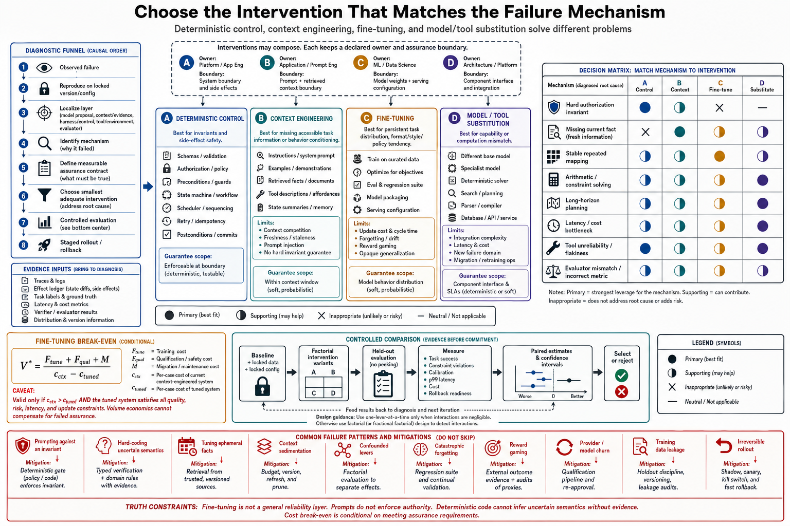

# Topic 13 — Fine-Tuning versus Context Engineering versus Deterministic Control

## 1. Problem and objective

When agent behavior is inadequate, teams can change what the model has learned, change what it sees, change the system that mediates its actions, or replace the model. These interventions operate on different failure mechanisms. A permission defect cannot be repaired by more examples; missing current information should not be baked into weights; a stable high-volume behavior may be too expensive to restate in every request.

The objective is to diagnose the failure before selecting the intervention, state the assurance each lever can and cannot provide, and compare the levers through controlled experiments and break-even economics rather than a universal ordering.

## 2. Four intervention families

### 2.1 Deterministic control and enforcement

Application and harness logic can restrict actions, validate state, enforce budgets and route execution. It can provide a strong guarantee only **relative to explicit assumptions**: the invariant is correctly specified, every relevant path is mediated, the implementation is correct, dependencies are trusted, concurrency is controlled and failure handling preserves the invariant.

An assurance contract should state:

- invariant and protected assets;
- enforcement point and completeness argument;
- assumptions about tools, identity, concurrency and environment;
- verification evidence such as tests, static analysis or model checking;
- failure behavior and residual risk.

Control is the appropriate lever for properties that must hold even when the model proposes the wrong action. It is not proof that the whole system is correct.

### 2.2 Context engineering

Context engineering changes the model’s conditional input: instructions, retrieved evidence, examples, tool contracts, plans and execution history. It is usually fast to change and easy to inspect, but consumes a finite context budget and produces probabilistic behavioral effects.

Use it for current or task-specific information, evolving policy explanations, examples and evidence that should remain reviewable. Its effectiveness depends on retrieval recall, placement, instruction conflicts, context length and whether the model actually uses the supplied information.

### 2.3 Fine-tuning and adaptation

Fine-tuning changes model parameters or adapters using task data. Relevant families include:

- **Supervised fine-tuning:** learn target outputs from labeled demonstrations.
- **Preference or reinforcement optimization:** change behavior using comparative or scalar feedback.
- **Parameter-efficient tuning:** train adapters such as LoRA while holding most base weights fixed [LORA].
- **Distillation:** train a smaller model to reproduce selected behavior or decisions.

Fine-tuning can reduce repeated prompt overhead and improve stable task behavior, but it creates a new model artifact requiring data governance, regression testing and requalification. It can also produce catastrophic forgetting, shortcut learning, reward-channel gaming and safety regressions.

### 2.4 Model or tool substitution

If the required capability is absent across reasonable prompts and examples, a different model, specialized tool or deterministic algorithm may be the correct intervention. Fine-tuning is not obliged to create capabilities unsupported by the base representation, data or inference budget.

## 3. What the current evidence supports

### 3.1 CompWoB

CompWoB reports different base and compositional performance for prompted LLM agents, transferred/fine-tuned models and a purpose-built HTML model [CompWoB]. These systems differ in architecture, training and evaluation configuration. The result demonstrates that trained approaches can have different compositional behavior; it is **not** a controlled same-base-model experiment proving that fine-tuning necessarily trades peak performance for robustness.

The appropriate follow-up experiment holds the base model, harness, tasks, budget and evaluator fixed while varying only the adaptation method.

### 3.2 HarnessX

HarnessX reports gains from harness composition and trace-driven adaptation and also studies model-training feedback [HX]. It establishes harness optimization as a material lever in its evaluated systems. It does not prove that every team should apply harness changes before weight changes; intervention order depends on the diagnosed mechanism, evidence and cost.

### 3.3 ACRouter

ACRouter uses a small fine-tuned routing model informed by measured priors and retrieved experience [AAR §3.3]. This is a strong example of fine-tuning a narrow, stable, data-rich auxiliary decision instead of spending a frontier model on dispatch. Its economics and accuracy remain benchmark-specific.

### 3.4 Training-signal risk

The FSC grader-awareness experiments show that model behavior can adapt to properties of its evaluation signal and that some measured reward is associated with grader-related representations [FSC §6.4.2]. Awareness is not identical to reward hacking, but the result justifies integrity testing of fine-tuning labels, judges and reward channels.

## 4. Failure-mechanism-to-intervention map

| Observed failure | Primary candidate | Required diagnostic |
|---|---|---|
| Unauthorized or forbidden action | Deterministic enforcement | Verify complete mediation and bypass resistance |
| Missing current fact or environment state | Retrieval/context/tool observation | Measure retrieval recall, freshness and utilization |
| Conflicting or lost instruction | Context architecture first | Inspect hierarchy, compaction and conflict resolution |
| Stable, repeated behavior gap with representative data | Fine-tuning or adapter | Demonstrate persistence across prompts and sufficient volume |
| Narrow high-volume classification/routing | Small tuned model or deterministic classifier | Compare against rule and prompted baselines |
| Capability absent under reasonable elicitation | Different model or external tool | Establish capability ceiling with controlled attempts |
| Excess latency from repeated context | Context compression, caching, tuning or distillation | Decompose prefill/decode/tool latency |
| Judge-optimized or shortcut behavior | Repair data/reward/evaluator | Audit leakage, incentives and counterexamples |

The table identifies candidates, not automatic answers. Some failures require combinations: deterministic boundaries around a fine-tuned policy supplied with current retrieved evidence.

## 5. Economic break-even model

Let $V$ be request volume over the decision horizon. Define:

- $F_{\mathrm{tune}}$: data, training and deployment cost;
- $F_{\mathrm{qual}}$: evaluation, safety and compliance requalification cost;
- $c_{\mathrm{ctx}}$: marginal per-request cost under context engineering;
- $c_{\mathrm{tuned}}$: marginal per-request cost of the tuned alternative;
- $M_{\mathrm{tune}}$: expected maintenance and retraining cost.

Ignoring quality differences momentarily, tuning has lower total cost when

$$
F_{\mathrm{tune}}+F_{\mathrm{qual}}+M_{\mathrm{tune}}+V c_{\mathrm{tuned}}
<
V c_{\mathrm{ctx}}.
$$

If $c_{\mathrm{ctx}}>c_{\mathrm{tuned}}$, the nominal break-even volume is

$$
V^*
\mathrel{=}
\frac{F_{\mathrm{tune}}+F_{\mathrm{qual}}+M_{\mathrm{tune}}}
{c_{\mathrm{ctx}}-c_{\mathrm{tuned}}}.
$$

This threshold is meaningless unless candidates also meet quality, latency and critical-risk constraints. Include the expected lifetime of the base model: frequent provider upgrades can shorten the amortization horizon.

## 6. Controlled comparison methodology

1. **Define the failure and target estimand.** Separate outcome quality, instruction adherence, critical risk, latency and cost.
2. **Build train, calibration and untouched test sets.** Deduplicate by task lineage and protect against benchmark contamination.
3. **Establish baselines.** Include deterministic automation, optimized context, retrieval, a stronger model and the current production system.
4. **Hold the environment fixed.** Pin model snapshot, harness, tools, evaluator, budgets and decoding settings for each causal comparison.
5. **Ablate one intervention at a time**, then test interactions through a small factorial design.
6. **Repeat stochastic runs** and use paired task-level estimates with cluster-bootstrap confidence intervals.
7. **Screen regressions.** Evaluate previously working task classes, safety propensities, OOD cases and adversarial inputs.
8. **Measure lifecycle cost.** Include data labeling, training, deployment, monitoring, retraining and rollback.
9. **Run shadow and canary stages** before transferring authority.

Fine-tuning studies must record base-model version, dataset construction, hyperparameters, random seeds, compute, adapter configuration and checkpoint-selection rule. Context studies must version the exact assembled prompts and retrieval corpus.

## 7. Failure modes

- **Prompting against an invariant:** a prose instruction is expected to enforce authorization.
- **Hard-coding an uncertain semantic judgment:** deterministic control expresses the wrong rule and gains false authority.
- **Fine-tuning ephemeral facts:** changing information becomes stale model behavior.
- **Context sedimentation:** incident-driven instructions accumulate until they conflict or dilute one another.
- **Confounded lever comparison:** a model, prompt, tool set and evaluator all change together.
- **Catastrophic forgetting:** target behavior improves while unrelated capabilities regress.
- **Reward-channel gaming:** the tuned policy learns judge artifacts rather than task intent.
- **Base-model churn:** an adaptation loses support or value before costs amortize.
- **Data leakage:** test cases or near-duplicates enter training.
- **Irreversible rollout:** the organization cannot restore the prior model–harness pair and state.

## 8. Limitations

- No source in this ledger provides a controlled universal three-way comparison. Intervention choice remains workload-specific.
- Provider fine-tuning interfaces, costs and supported methods change; operational estimates must use current contracts.
- Weight changes are difficult to inspect semantically, but context and deterministic code can also hide complex emergent behavior.
- The break-even equation compresses uncertainty in future volume, model lifetime and quality. Use scenario or sensitivity analysis rather than one forecast.
- Fine-tuning recipes remain outside this chapter; the intervention families are included to make the decision scientifically complete.

## 9. Production implications

1. Diagnose whether the failure is informational, behavioral, capability-related or an invariant violation.
2. Put non-negotiable safety and authority constraints in completely mediated enforcement points.
3. Keep changing facts and task evidence in context or tools, not weights.
4. Consider tuning when the behavior is stable, data-rich, repeatedly valuable and economically amortizable.
5. Treat every fine-tune as a new model–harness configuration requiring full regression and safety qualification.
6. Preserve rollback artifacts and the evaluation evidence supporting the intervention.
7. Re-run the decision after base-model, task-distribution or cost changes.

## 10. Connections

Topic 1 defines stochastic model behavior, Topic 8 supplies uncertainty measurements, Topics 11–12 cover model substitution and routing, and Topic 14 distinguishes mechanisms that an intervention must target. Chapters 6 and 13 own context construction and experimental methodology.

## Sources

[CompWoB] Furuta et al., “Exposing Limitations of Language Model Agents in Sequential-Task Compositions on the Web,” TMLR — https://arxiv.org/abs/2311.18751
[HX] HarnessX, arXiv:2606.14249 (Knowledge_source/2606.14249v2.pdf) abstract, §5
[AAR] Agent-as-a-Router, arXiv:2606.22902 (Knowledge_source/2606.22902v3.pdf) §3.3
[BEA] Anthropic, “Building Effective Agents” — https://www.anthropic.com/engineering/building-effective-agents
[CAL] Claude Agent SDK, “How the agent loop works” — https://code.claude.com/docs/en/agent-sdk/agent-loop
[OAT] OpenAI, Tools guide — https://developers.openai.com/api/docs/guides/tools
[CAH] Code as Agent Harness, arXiv:2605.18747 (Knowledge_source/2605.18747v1.pdf) §3.1.1
[HB] Harness-Bench, arXiv:2605.27922 (Knowledge_source/2605.27922v1.pdf) §3.1, §3.4
[FSC] Claude Fable 5 & Mythos 5 System Card (Knowledge_source/Claude Fable 5 & Claude Mythos 5 System Card.pdf) §6.4.2
[LORA] Hu et al., “LoRA: Low-Rank Adaptation of Large Language Models” — https://arxiv.org/abs/2106.09685
