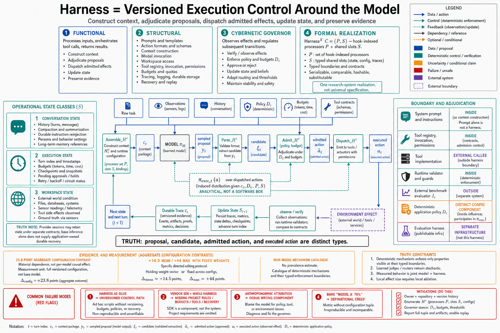

# Topic 1 — Harness Definition: The System Surrounding the Model That Enables Stateful Action

## 1. Problem and objective

"Harness" is this book's most load-bearing term, and the field uses it loosely — sometimes meaning a prompt template, sometimes an entire product. The objective of this topic is a definition with edges: what the harness is, what it is *for*, what is inside and outside it, and why the definition earns the elevated status this book gives it — including the strongest formal treatment available, in which the harness is not a metaphor but a typed, serializable, substitutable mathematical object.

## 2. Intuition first

A model endpoint is a conditional proposal generator. Its proposal may contain text, structured calls, or multimodal output; provider services may also retain session state. None of that alone supplies application-owned authorization, effect idempotency, durable recovery, or verified completion. The harness constructs $c_t$, receives $y_t\sim\pi_M(\cdot\mid c_t)$, adjudicates candidate effects, dispatches admitted action $a_t$, and persists observable evidence.

## 3. The definition, assembled from four sources

The sources converge from different angles, and the composite is stronger than any one:

**Functional** (what it does): the harness "processes inputs, orchestrates tool calls, and returns results" — it is "the system that enables a model to act as an agent" [DEM]. Anthropic's operational note attached to this definition matters: when evaluating an agent, you assess "the harness *and* the model working together as an integrated system" [DEM] — the definition arrives already fused to the measurement discipline of Chapter 1, Topic 12.

**Structural** (what it contains): "the system layer that conditions model calls and turns model outputs into actions in an external workspace," possibly including "prompt templates, action formats, context construction, tool invocation, workspace access, permissions, budget control, tracing, and recovery" — with the compact equation **Agent = Model + Harness** [HB §3].

**Cybernetic** (what role it plays): "the harness acts as a *cybernetic governor*: a control layer that observes the effects of agent actions and regulates subsequent state transitions. Rather than merely forwarding error messages to the model, it observes the repository and execution environment through deterministic sensors... The harness can then decide whether to continue execution, revise a patch, request more context, route the task to another module, reduce permissions, or escalate to a human reviewer" [CAH §3.4.1]. This is the definition's teeth: the harness does not just *enable* action; it *governs* it.

**Formal** (one research-system realization): HarnessX writes $\mathcal H=(\mathcal M,\mathcal C)$, where $\mathcal M$ is a model configuration and $\mathcal C$ a harness configuration. It further writes $\mathcal C=(P,S)$: $P$ maps eight lifecycle hooks to ordered processor lists, while $S$ contains shared slot resources. HarnessX calls $\mathcal C$ first-class because it is independently serializable, comparable, hashable, and substitutable [HX §3.1]. This book uses $H_c$ for harness configuration so $\mathcal H_t$ remains visible history.

**The composite definition this book adopts:** *the harness is the versioned execution-control system that constructs model-visible context, parses and adjudicates model proposals, dispatches admitted effects, updates run state, and records observable evidence.* Deterministic mechanisms enforce properties that must be guarantees; learned judges, routers, or randomized retry policies remain explicitly stochastic sensors or policies. The harness and model are separable configuration factors, yet their measured behavior is joint. **[derived—synthesis; each clause sourced above]**

For one realized decision event, the boundary is:

$$
c_t=\operatorname{Assemble}_{H_c}(\cdot),\qquad
y_t\sim\pi_M(\cdot\mid c_t),\qquad
\widetilde a_t=\operatorname{Admit}_{H_c}(\operatorname{Parse}_{H_c}(y_t)),\qquad
a_t=\operatorname{Dispatch}_{H_c}(\widetilde a_t).
$$

Parse or admission may instead produce typed rejection, retry, interruption, or terminal outcomes. Marginalizing proposal sampling and harness decisions induces $\pi_{\mathrm{exec}}$ over executed actions; it does not create a separate implementation layer.

## 4. What "enables stateful action" means precisely

The README's phrase deserves unpacking. Base inference does not provide application-owned durable state for an individual run; session APIs may preserve provider-managed conversation or tool state under separate service contracts. The harness coordinates three operational state classes [CAH §2; CAL]:

1. **Conversation state:** history assembly, compaction, re-injection of durable instructions [CAL] — the belief substrate of Chapter 1, Topic 3.
2. **Execution state:** where the run *is* — turn counts, budgets consumed, checkpoints, pending approvals; the vocabulary of Topic 5. In the event-sourced form this state is a committed event log: sessions hold "complete event history, enabling state reconstruction, session rewinding, and observability" [ADK].
3. **Workspace state:** the environment's actual condition, made legible through sensors and made safe through permission tiers [CAH §3.4.3–3.4.4].

An artifact that manages none of these is a prompt or prompt template, not a complete execution harness. A minimal harness may delegate a state class, but the owner and contract must remain explicit.

## 5. The boundary cases, adjudicated

- **Is the system prompt part of the harness?** Yes — it is context construction [HB §3], and in the formal model it is exactly what the `task_start` hook may modify [HX Table 1]. But a system prompt *alone* fails §4's test.
- **Are tools part of the harness?** The registry, invocation machinery, permission gates, and result routing are harness [HB §3; HX's S slots]; the tool *implementations* are environment-facing components with their own contracts (Chapter 5). The harness owns the calling convention, not the callee.
- **Is the evaluator part of the harness?** External benchmark evaluator $J_c$ is outside the measured agent and consumes $\hat\tau$ plus artifacts [HB §3]. A runtime validator used for admission, repair, or termination is inside $H_c$. An *evaluation harness* is separate infrastructure that executes trials and graders [DEM].
- **Is workflow application code harness?** Deterministic application policy $D_c$ remains a distinct configuration component. Mechanisms that assemble $c_t$, adjudicate $y_t$, or dispatch $\widetilde a_t$ belong to the harness path. Together these components induce $\pi_{\mathrm{exec}}$.

## 6. Why the definition carries this much weight: the evidence recap

Three results, assembled across two chapters, now stated as the definition's justification:

1. **Configuration dependence:** HarnessX defines agents that differ in $\mathcal C$ as behaviorally distinct [HX §3.1]. Harness-Bench's 23.8-point aggregate contrast across harnesses under a fixed model pool and task suite is consistent with material configuration dependence, but is not a per-model causal effect [HB §4.1–4.2].
2. **Improvability under a specific protocol:** HarnessX reports a 14.5-point mean absolute gain across 15 model–benchmark configurations and a maximum gain of 44.0 points while holding model weights fixed [HX abstract]. These results are benchmark- and search-procedure-specific.
3. **Non-model failure mechanisms:** the Code-as-Agent-Harness survey identifies missing repository context, brittle tool interfaces, weak validators, token cost, retry policy, and permission boundaries as recurring harness-relevant mechanisms [CAH §3.5]. It does not estimate their production prevalence.

A layer that changes the induced behavior distribution, can be varied independently in controlled experiments, and contains documented failure mechanisms is a first-class engineering object. Local effect size still requires local ablation.

## 7. Failure modes of getting the definition wrong

- **Harness-as-afterthought:** treating $H_c$ as incidental glue; the result is an unversioned control path governing production actions [CAH §3.5].
- **Harness-as-product-boundary:** assuming the vendor SDK fully specifies the harness. The SDK is a substrate; deployed $H_c$ includes project rules, hooks, budgets, tools, permissions, recovery, and versions.
- **Model-anthropomorphic attribution:** debugging harness failures as model failures ("it forgot," "it ignored instructions") — Chapter 1 Topic 2 §6's symbol-assignment discipline exists to catch this; the fix lives in whichever component actually failed.
- **Definitional creep in reporting:** publishing “Model X: 76%” when the measured unit was the full configuration $c=(M_c,H_c,D_c,\nu_c,B_c,P_c,\mathcal U_c,J_c)$.

## 8. Limitations

- The formal object $\mathcal H=(\mathcal M,\mathcal C)$ is HarnessX's formalization [HX]. Production harnesses are not necessarily hook-indexed processor pipelines, and mapping them onto this object involves judgment. Its demonstrated value is within HarnessX; treating it as a universal specification target is a design proposal.
- The role-relativity of §5.3 (evaluation harnesses are harnesses) is conceptually clean but terminologically hazardous in mixed company; this book keeps the qualifier ("evaluation harness") explicit.
- The definition is synchronic; harnesses also *change over time*, and their change management (Evolution Agents, governed mutation [CAH §3.5.2–3.5.3]) is deferred to Topics 12 and 14.

## 9. Production implications

1. **Name a harness owner.** $H_c$ needs an owner, a repository, a version history, and a review process.
2. **Write $H_c$ down.** Enumerate prompts, action formats, context construction, tools, workspace access, permissions, budgets, tracing, and recovery [HB §3]. Components absent from the inventory cannot be controlled in an ablation.
3. **Adopt the governor stance:** every design review question of the form "will the model do X?" gets the counter-question "what does the harness do when it doesn't?" [CAH §3.4.1's decision list is the menu].
4. **Report the full configuration, always.** "Agent = Model + Harness" [HB §3] is the structural shorthand; the measured deployed system is the versioned tuple $c=(M_c,H_c,D_c,\nu_c,B_c,P_c,\mathcal U_c,J_c)$ of Chapter 1's notation contract — decoding settings, budgets, permissions, tool contracts, and evaluator included, because each can change the induced behavior distribution.

## 10. Connections

- Topic 2 decomposes $H_c$ into canonical concerns; Topic 3 animates it as a loop; Topic 11 quantifies configuration dependence; Topic 13 maps three documented systems onto the definition.
- Chapter 4 treats the SDKs as harness substrates; Chapter 15's harness garbage collection and lifecycle assume everything this topic defined.

## Sources

[DEM] Anthropic, Demystifying evals for AI agents — https://www.anthropic.com/engineering/demystifying-evals-for-ai-agents
[HB] Harness-Bench, arXiv:2605.27922 (`Knowledge_source/2605.27922v1.pdf`) §3, §4.2
[CAH] Code as Agent Harness, arXiv:2605.18747 (`Knowledge_source/2605.18747v1.pdf`) §2, §3.4.1, §3.5
[HX] HarnessX, arXiv:2606.14249 (`Knowledge_source/2606.14249v2.pdf`) abstract, §3.1, Table 1
[ADK] Google ADK runtime event-loop documentation — https://adk.dev/runtime/event-loop/
[CAL] Claude Agent SDK, "How the agent loop works" — https://code.claude.com/docs/en/agent-sdk/agent-loop
