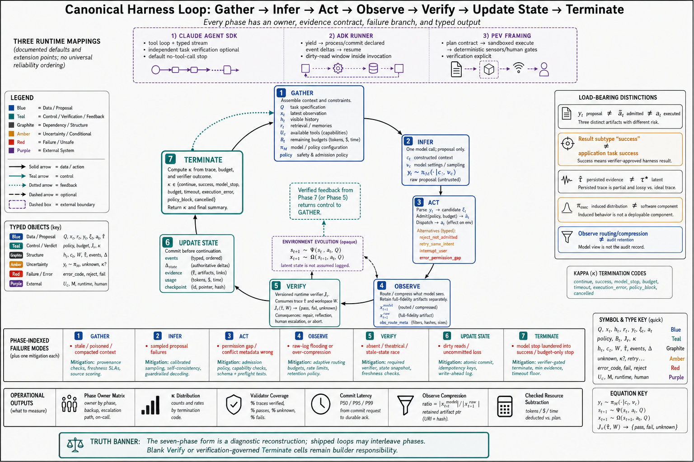

# Topic 3 — The Canonical Loop: Gather → Infer → Act → Observe → Verify → Update State → Terminate

## 1. Problem and objective

Every agent runtime, however different its API, executes some version of one loop. This topic fixes the canonical seven-phase form, maps the three documented production loops onto it phase by phase, and — the part that matters for reliability — identifies which phases the shipped loops *skip or leave optional*, because the gap between the canonical loop and the shipped loops is precisely where this book's verification discipline has to be added by the builder.

## 2. Intuition first

The loop is the agent's heartbeat, and its phases answer seven questions in order: What should the model know? (gather) What does it propose? (infer) Is the proposal allowed, and what happened when we did it? (act) What does the world look like now? (observe) Did it *work*? (verify) What must we record before continuing? (update state) Are we done — and says who? (terminate). Most agent failures in Chapters 1–2 are failures of a specific phase: hallucinated state is observe/verify skipped; premature completion is terminate trusted to the wrong party; context poisoning is gather unguarded. Naming the phase names the fix.

## 3. The canonical loop, phase by phase

**Gather.** Assemble what the model will condition on: system prompt, tool definitions, history, re-injected durable instructions, retrieved context [CAL]. In the hook formalism this is `task_start`/`step_start`/`before_model` — the events whose processors may modify the system prompt, structural history, and final user content [HX Table 1]. Gather is where context engineering (Chapter 6) plugs into the control plane, and where compaction's lossiness enters (Chapter 1, Topic 3).

**Infer.** One model call; proposals out — "text, tool call requests, or both" [CAL]. The `after_model` hook may modify "response content, tool calls" [HX Table 1] — the control plane's one chance to transform proposals before they become candidate actions.

**Act.** Parse, admission, and execution are distinct. Permission evaluation and hook interception occur before dispatch: current Claude Agent SDK documentation states that a rejecting `PreToolUse` hook prevents execution [CAL]. That SDK currently runs documented read-only tools concurrently and state-modifying tools sequentially by default; this is a provider implementation rule, not a proof that arbitrary read-only operations are conflict-free [CAL]. Sandbox and approval semantics remain runtime-specific [CAH §3.4.3; CDX].

**Observe.** Results return — but not raw: "since raw logs may be too long or noisy for the active context, the harness should parse, summarize, and offload verification traces while preserving full-fidelity artifacts for audit and replay" [CAH §3.3.4]. Observe is a *routing and compression* decision (what the model sees) layered on a *retention* decision (what the record keeps); `after_tool` owns the first [HX Table 1], the tracer slot the second.

**Verify.** The phase the canonical loop insists on and shipped loops make optional: compare the new state against explicit constraints via deterministic sensors — "compilation and static-analysis feedback provide low-cost sensors before full execution... runtime signals expose failures that only arise along concrete execution paths... test-based feedback then evaluates whether the observed behavior satisfies the intended specification" [CAH §3.4.4]. Verification's output is a *decision input*: "when a check fails, the same sensor evidence can determine whether the harness should ask the model to diagnose the failure, retrieve missing context, regenerate a localized patch, route the task to a testing or security agent, or abandon the current branch" [CAH §3.4.4]. Repair, reflection, and termination "are treated as consequences of the Verify phase rather than as an independent stage" [CAH §3.4.4].

**Update state.** Commit what happened before continuing — the discipline the event-sourced runtime makes explicit: changes packaged as `state_delta`/`artifact_delta` in a yielded event, persisted by services, with execution resuming only after commit, so that resumed code "can reliably assume that the state changes signaled in the yielded event have been committed" [ADK]. In looser runtimes this phase is implicit (history grows, files persist); Topic 4 treats the architectural difference.

**Terminate.** The exit predicate, with its authority question. The shipped default: the loop ends when the model produces a response with no tool calls, bounded by budgets [CAL]. The canonical requirement: "termination should likewise be governed by verification rather than by model confidence: a loop can stop when required checks pass, when additional attempts no longer improve the state, when the risk tier changes, or when human review is required" [CAH §3.4.4]. Topic 8 develops this in full.

## 4. The three production loops, mapped

| Canonical phase | Claude Agent SDK [CAL] | ADK Runner [ADK] | PEV framing [CAH §3.4] |
|---|---|---|---|
| Gather | Prompt + system prompt + tools + history; CLAUDE.md re-injection; compaction | Runner appends query to session via SessionService; InvocationContext binds state/services | Plan as contract: files, invariants, validation commands identified up front |
| Infer | `AssistantMessage` (text + tool-call blocks) | Agent logic runs, constructs Event | (model proposes within plan) |
| Act | Permissions → hooks → execution (parallel/serial by mutation) | Event yielded; execution pauses | Sandboxed, permissioned execution by tier |
| Observe | `UserMessage` with tool results feeds back | Runner processes event, forwards upstream | Sensors turn trajectory into "inspectable signals" |
| Verify | Base loop does not require independent task validation; `Stop` and other hooks can add it | Runner does not impose a task-specific verifier; application logic, callbacks, or plugins can add one | Verification is explicit: sensors and human-review gates |
| Update state | History accumulates; compaction summarizes | **Commit-before-continue**: services persist deltas, then resume | Traces + artifacts preserved for audit/replay |
| Terminate | No-tool-call response, or budget subtypes | Invocation completes; final event | **Verification-governed** stop conditions |

**[derived—mapping ours; each cell sourced]** The table compares documented defaults and extension points, not complete products. ADK makes yielded-event processing and state commitment explicit; the Claude Agent SDK documents a tool loop, typed result stream, limits, permissions, and hooks; PEV makes verification a design-stage obligation. None of these observations establishes a universal reliability ordering. Builders must identify which phases their chosen version enforces and which remain application responsibilities.

## 5. Formalization: the loop as typed harness stages

For one realized decision event $t$, use the Chapter 1 contract **[synthesis—stage types from Chapter 1; phase semantics sourced in §3]**:

$$
c_t
=\operatorname{Assemble}_{H_c}
\!\left(\mathcal Q,x_t,h_t,r_t,\mathcal U_c,b_t^{\mathrm{rem}},P_c\right),
\qquad
y_t\sim\pi_M(\cdot\mid c_t,\nu_c).
$$

Here $\mathcal Q$ is the task specification, $x_t$ the current raw observation, $h_t$ visible history, $r_t$ retrieved content, $\mathcal U_c$ tool contracts, $b_t^{\mathrm{rem}}$ remaining budget, and $P_c$ policy. The model emits proposal $y_t$; it does not emit an executed action.

$$
\xi_t=\operatorname{Parse}_{H_c}(y_t),\qquad
\widetilde a_t=\operatorname{Admit}_{H_c}
\!\left(\xi_t,P_c,b_t^{\mathrm{rem}}\right),\qquad
a_t=\operatorname{Dispatch}_{H_c}(\widetilde a_t,\mathcal U_c).
$$

$\xi_t$ is the typed candidate object, $\widetilde a_t$ an admitted action, and $a_t$ the action actually dispatched. Any stage may instead return a typed parse failure, rejection, retry directive, interruption, or distinguished no-op. Marginalizing proposal sampling and harness decisions yields the analytical executable policy

$$
a_t\sim\pi_{\mathrm{exec}}
\!\left(\cdot\mid c_t,\hat\tau_{0:t-1},\mathcal Q;c\right),
$$

where $c$ is the full versioned configuration. $\pi_{\mathrm{exec}}$ is induced behavior, not a fourth software component.

After dispatch, the latent environment and observation channel evolve:

$$
s_{t+1}\sim\Psi(\cdot\mid s_t,a_t,\mathcal Q),\qquad
x_{t+1}\sim\Omega(\cdot\mid s_{t+1},a_t,\mathcal Q).
$$

The state $s_{t+1}$ belongs to latent trajectory $\tau^\star$ and is not assumed logged. Verification consumes observable evidence:

$$
v_{t+1}
=\operatorname{Verify}_{J_v}
\!\left(\hat\tau_{0:t+1},\mathcal W_{t+1}\right)
\in\{\mathrm{pass},\mathrm{fail},\mathrm{unknown}\},
$$

where $J_v$ versions the runtime verifier and $\mathcal W_{t+1}$ denotes inspectable workspace/artifact evidence. The runtime appends proposal, admission, execution, observation, usage, and verifier events to $\hat\tau$; it updates remaining resources using checked subtraction rather than unchecked arithmetic. Termination is then

$$
\kappa_t
=\mathsf K
\!\left(\hat\tau_{0:t+1},b_{t+1}^{\mathrm{rem}},v_{t+1}\right)
\in
\{\mathrm{continue},\mathrm{success},\mathrm{model\_stop},\mathrm{budget},
\mathrm{timeout},\mathrm{execution\_error},\mathrm{policy\_block}\}.
$$

Three properties are load-bearing:

1. **Proposal, admission, and execution are different types.** $y_t\neq\widetilde a_t\neq a_t$ in role, even when their serialized payloads happen to match.
2. **Runtime completion is not verified task success.** A no-tool-call proposal or provider runtime subtype may cause $\mathrm{model\_stop}$; $\mathrm{success}$ requires the declared external criterion. Current Claude Agent SDK `ResultMessage(subtype="success")` means its loop completed without an SDK limit/error, not that an application-specific verifier proved the task [CAL].
3. **Trace is not trajectory.** $\hat\tau$ contains persisted evidence; $\tau^\star$ includes latent $s_t$ and uninstrumented effects. Replay and evaluation must state what is absent.

## 6. Failure modes, phase-indexed

- **Gather:** poisoned or stale context in; instructions compacted away [CAL]; the model reasons perfectly about wrong inputs (Chapter 2, Topic 2's information-deficit lesson).
- **Infer:** the Chapter 2 catalog, entering here as proposals.
- **Act:** admission gaps (over-broad permissions), mislabeled mutation types breaking the concurrency discipline (Chapter 2, Topic 6 §6).
- **Observe:** raw-log flooding (context saturation) or over-compression (evidence destroyed before verification could use it) — the routing decision failing in either direction [CAH §3.3.4].
- **Verify:** absent (the shipped default), or theatrical (judge shares the failure mode — Chapter 1, Topic 8 §7), or run against stale state (verification racing mutation — Chapter 2, Topic 6 §4).
- **Update:** dirty reads on failure — "code may read uncommitted state changes made earlier... creates risk if the invocation fails before state-carrying events are processed" [ADK]; loose runtimes have this hazard everywhere without naming it.
- **Terminate:** the false-completion family [FSC §2.3.3, §6.4.1.4]; budget backstops firing as the *only* working stop (each firing is a detection failure — Chapter 1, Topic 8 §7).

## 7. Limitations

- The seven-phase form is a rational reconstruction **[derived]**; shipped loops interleave phases (observe and update happen inside act's execution machinery; verify may be a tool call the model itself chooses). The reconstruction's value is diagnostic (§2), not descriptive purity.
- The mapping table compresses; each runtime has mechanisms the table's grain hides (Topic 13 does them justice).
- "Verify via deterministic sensors" presumes an environment that offers sensors — code's privilege (Chapter 1, Topic 11); in weak-oracle classes the verify phase exists but its instruments are judges, with judge limits (Chapter 13).

## 8. Production implications

1. **Audit your loop against the seven phases**; for each, write down what implements it and what happens when it fails. Blank cells — usually verify and terminate-by-verification — are the work plan.
2. **Make verify a phase, not a hope:** wire sensors into the loop (post-mutation checks, milestone validations) rather than trusting the model to call them; the substrate supports it (hooks [CAL]; processors [HX]) — the discipline is yours to add.
3. **Adopt commit-before-continue for state you cannot afford to lose** [ADK] — or document precisely which state is fire-and-forget and why.
4. **Log $\kappa_t$ per run and report its distribution**—separate validator-confirmed $\mathrm{success}$, unverified $\mathrm{model\_stop}$, and budget/timeout/error subtypes. Interpret the distribution with task mix and censoring; no single subtype ratio is universally diagnostic.
5. **Engineer the observe phase's two decisions separately:** what the model sees (compressed, routed) and what the record keeps (full fidelity) [CAH §3.3.4] — conflating them either drowns the model or blinds the audit.

## 9. Connections

- Topic 4 examines the architectural split the mapping table exposed (event-sourced vs. request–response); Topic 5 names the loop's units; Topic 8 expands the terminate phase; Topic 10 taxonomizes the failures each phase can throw.
- Chapter 6 owns gather's content; Chapter 5 owns act's tool contracts; Chapter 10 stretches the loop across sessions, where update-state's discipline becomes survival.

## Sources

[CAL] Claude Agent SDK, "How the agent loop works" — https://code.claude.com/docs/en/agent-sdk/agent-loop
[ADK] Google ADK runtime event-loop documentation — https://adk.dev/runtime/event-loop/
[CAH] Code as Agent Harness, arXiv:2605.18747 (`Knowledge_source/2605.18747v1.pdf`) §3.3.4, §3.4.1–3.4.4, §3.5
[HX] HarnessX, arXiv:2606.14249 (`Knowledge_source/2606.14249v2.pdf`) §3.1–3.2, Table 1
[CDX] OpenAI Codex documentation, agent approvals and security — https://learn.chatgpt.com/docs/agent-approvals-security
[FSC] Claude Fable 5 & Mythos 5 System Card (`Knowledge_source/Claude Fable 5 & Claude Mythos 5 System Card.pdf`) §2.3.3, §6.4.1.4
