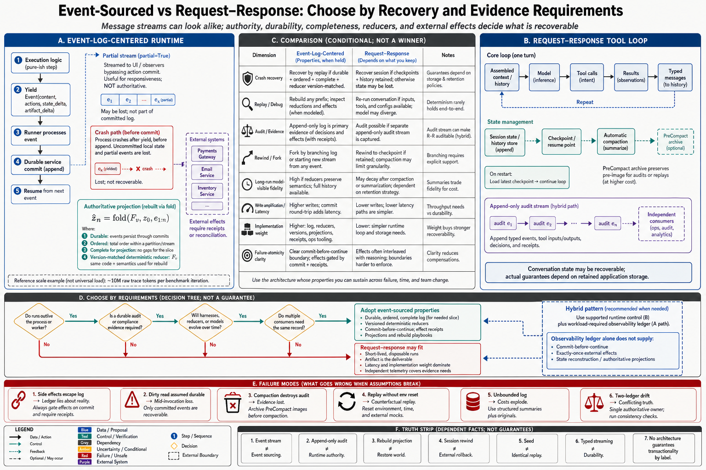

# Topic 4 — Event-Sourced versus Request–Response Runtime Architectures

## 1. Problem and objective

Topic 3 exposed two runtime emphases: an event-log-centered loop that commits declared state deltas at yield boundaries, and a conversation-centered tool loop exposed through typed messages. These are not mutually exclusive, and neither label alone guarantees replay, audit completeness, or transactionality. The objective is to separate documented mechanics from properties that require additional assumptions about durability, event completeness, reducers, external effects, and versioning.

## 2. Intuition first

A ledger analogy is useful only with its assumptions visible. If events are durable, ordered, complete for the state being reconstructed, and interpreted by a versioned deterministic reducer, a projection can be rebuilt. If tool side effects bypass the log, events are mutable, or reducer semantics change, the “ledger” cannot reconstruct reality. Conversation-centered systems can still retain a separate append-only audit stream. The architectural question is therefore which state is authoritative and what evidence is sufficient for recovery—not whether a message stream happens to look event-like.

## 3. The two architectures, as shipped

### 3.1 Event-log-centered: the documented ADK Runner

The documented mechanics [ADK]:

- **Execution communicates through events.** Execution logic constructs an `Event` containing content and actions and yields it to the Runner [ADK]. This does not imply that every external side effect is captured by an event.
- **Declared session-state changes travel with events.** `state_delta` and related actions are processed through configured services; session history can support state reconstruction and rewinding [ADK]. The documentation does not establish classical event-sourcing properties for every service implementation.
- **Commit-before-continue.** Execution pauses at each yield; "only after the Runner processes and commits the event does execution continue," so resumed code "can reliably assume that the state changes signaled in the yielded event have been committed."
- **The documented caveat:** within an invocation, "dirty reads" of uncommitted local state are possible — enabling multi-step coordination before a yield, at the risk that "the invocation fails before state-carrying events are processed" [ADK].
- **Streaming is layered on, not confused with, commitment:** partial events (`partial=True`) are forwarded for UI but skip actions processing; only final events commit [ADK] — display and durability as separate channels.

### 3.2 Conversation-centered tool loop with a typed stream: Claude Agent SDK

The current SDK documentation exposes typed messages including `SystemMessage`, `AssistantMessage`, `UserMessage`, `StreamEvent`, and `ResultMessage`, and documents session resumption plus automatic compaction [CAL]. Compaction replaces older model-visible history with a summary and may lose specific early instructions [CAL]. These facts characterize model-facing state and stream semantics; they do not prove that no separate durable event store exists in a deployment. Recovery claims must be scoped to the storage the application actually retains.

### 3.3 The spectrum, honestly

Neither system is a pure pole. ADK documents dirty-read windows inside an invocation; the Claude Agent SDK exposes `PreCompact`, which can archive a transcript before model-visible compaction [ADK; CAL]. Evaluation guidance asks for a complete trial transcript and outcome evidence [DEM; CAH §3.5.1]. That is an observability requirement, not necessarily an event-sourced runtime requirement: an audit log may be append-only without being the authoritative source of runtime state.

### 3.4 Formal recovery condition

Let $e_1,\ldots,e_n$ be committed events for a particular harness projection and let $z_0$ be its initial state. A rebuild is defined by a versioned reducer $F_v$:

$$
\widehat z_n
=\operatorname{fold}(F_v,z_0,e_{1:n}).
$$

The equality $\widehat z_n=z_n$ is justified only if the log is complete and ordered for that projection, $F_v$ matches the version that produced the events, and external effects are either represented by authoritative receipts or reconciled separately. Rebuilding $\widehat z_n$ reconstructs observable harness state; it does not reconstruct latent trajectory $\tau^\star$ or rerun stochastic $\pi_M$ identically. **[derived]**

## 4. The trade space

| Property | Event-sourced | Request–response |
|---|---|---|
| Crash recovery | Rebuild declared session projections from durable committed events; external effects still require reconciliation [ADK] | Resume from whatever session/checkpoint state the application retained |
| Replay/debugging | Re-derive projections when reducer and event versions are available; model/environment replay is separate | Requires retained messages, checkpoints, and environment evidence [CAL] |
| Audit | Event history contributes evidence; completeness and immutability must be established | A separate telemetry/audit stream can provide equivalent evidence [CAH §3.5.1] |
| Rewind/fork | "Session rewinding" native [ADK] | Fork-from-session supported [CAL]; rewind limited by compaction loss |
| Long-run state fidelity | Log grows; views stay exact | Compaction trades fidelity for context budget [CAL] |
| Write amplification / latency | Persistence on processed non-partial events in the documented loop | Deployment-specific; typed streaming does not specify durability frequency |
| Implementation weight | Runner + services + event schema | Thin loop over the model API |
| Failure-atomicity clarity | Session-state commit boundary and dirty-read window are documented [ADK] | Must be defined by the application's checkpoint and effect ledger |

**[derived — table ours; cells sourced]**

## 5. The decision rules

**Choose event-sourced (or retrofit its properties) when any of these hold** **[derived — rules ours; anchors cited]**:

1. **Runs outlive processes.** Long-horizon, multi-session work (Chapter 10) needs recovery points that don't depend on a process staying alive; commit-before-continue is the mechanical form of Chapter 10's checkpointing.
2. **Audit is a requirement, not a nicety.** Regulated actions, Chapter 12's incident forensics, and Chapter 1's observable-run-record contract ($\hat\tau$ with proposals, admitted/executed actions, $\kappa$ history, usage, workspace snapshots, validator outputs — Topic 12 §4) all consume the ledger; reconstructing it from a balance architecture after the fact is somewhere between expensive and impossible.
3. **The harness itself is under evolution.** Trace-driven harness improvement runs on structured trajectories — AEGIS's entire loop consumes "the trace store, a structured record of execution events, verifier-scored outcomes, regression signals, and shipped or rejected edits" [HX §4.3]; Evolution-Agent diagnosis attributes failures "to specific harness components" from deep telemetry [CAH §3.5.2]. No ledger, no evolution.
4. **Multiple consumers need the record:** UI, evaluator, telemetry, and future replays all reading one committed stream beats each tapping the loop ad hoc.

**Request–response earns its keep when:** runs are short-lived and disposable; the deliverable is the artifact, not the process; latency and implementation weight dominate; and a telemetry layer covers the audit demand independently. Interactive coding sessions — the SDK's home workload [CAL] — are exactly this shape, which is why the architecture is not a mistake but a fit.

**Hybrid rule:** run the loop using the substrate's supported control semantics, but retain the evidence required by the workload. An observability ledger can support audit and diagnosis; it cannot by itself provide commit-before-continue, exactly-once effects, or state reconstruction. Those remain runtime and tool-contract properties.

## 6. Failure modes

- **Ledger without discipline:** an event stream where side effects escape the events (tools writing state that no event records) — the ledger lies, which is worse than no ledger; the environment-facing effects need capture (sandbox snapshots, workspace diffs [CAH §3.5.1]) or the reconstruction is fiction.
- **Dirty-read windows treated as safe:** the documented ADK caveat [ADK] — coordination-before-yield state lost on mid-invocation failure; keep the windows short and the deltas early.
- **Compaction as silent evidence destruction:** the balance architecture's known loss [CAL] hitting *audit* rather than just belief — archive before compaction (`PreCompact` [CAL]) or accept that early-run evidence is unrecoverable.
- **Replay without environment replay:** re-deriving *agent* state against an environment that has moved on; replay needs the sandbox's reproducibility ("replay the same patch, command, seed, dependency lockfile" [CAH §3.4.3]) or it replays a counterfactual.
- **Log unboundedness:** ledgers grow; a per-iteration GAIA run generates ~10M tokens of raw traces [HX §4.3's Digester exists because of this] — the ledger needs its own compression strategy (structured summaries *plus* retained originals), distinct from the model-facing context compression.
- **Two-ledger drift:** telemetry-layer ledger and runtime state diverging (the hybrid's tax); reconcile with periodic consistency checks or nominate one as authoritative.

## 7. Limitations

- The comparison rests on two documented runtimes plus telemetry literature; performance numbers (commit overhead, replay cost) are absent from all sources — the trade table's cost rows are architectural reasoning, not measurements.
- "Event-sourced" here is the runtime-architecture sense; the term's full CQRS/ES apparatus (projections, sagas) goes beyond what any agent source documents, and importing it wholesale would be [derived] beyond the evidence.
- Codex's runtime architecture is not documented at this level in the accessible sources [CDX covers sandbox/approval semantics]; Topic 13 says so explicitly rather than guessing.

## 8. Production implications

1. **Decide with the four rules (§5), then write the decision down** — including which properties you gave up and what compensates (the hybrid's telemetry ledger, the archive-before-compaction hook).
2. **Whatever the architecture, meet the evidence floor:** four evidence streams per run [HB §3.3], transcript completeness [DEM], deep-telemetry fields [CAH §3.5.1]. This is the non-negotiable that architecture choice merely makes cheap or expensive.
3. **Name your atomicity windows.** If the substrate has dirty-read semantics, document where; if it has none stated, assume the windows are everywhere and checkpoint accordingly.
4. **Budget the ledger:** retention, compression (Digester-style structured summaries [HX §4.3]), and the storage line item — an unbudgeted ledger gets deleted by the first cost review, taking the audit trail with it.
5. **Test recovery, not just operation:** kill the process mid-run and measure what resumes; the architecture's real properties are only visible there.

## 9. Connections

- Topic 5 names the units the events carry; Topic 9 builds cancellation/resumption/replay on this topic's foundations; Topic 14's ablations consume the trace store this topic argued into existence.
- Chapter 10's checkpointing is §5-rule-1 at horizon scale; Chapter 13's trace grading and Chapter 14's event-sourced recovery are the ledger's downstream customers.

## Sources

[ADK] Google ADK runtime event-loop documentation — https://adk.dev/runtime/event-loop/
[CAL] Claude Agent SDK, "How the agent loop works" — https://code.claude.com/docs/en/agent-sdk/agent-loop
[CAH] Code as Agent Harness, arXiv:2605.18747 (`Knowledge_source/2605.18747v1.pdf`) §3.4.3, §3.5.1–3.5.2
[HX] HarnessX, arXiv:2606.14249 (`Knowledge_source/2606.14249v2.pdf`) §4.3
[DEM] Anthropic, Demystifying evals for AI agents — https://www.anthropic.com/engineering/demystifying-evals-for-ai-agents
[HB] Harness-Bench, arXiv:2605.27922 (`Knowledge_source/2605.27922v1.pdf`) §3.3
[CDX] OpenAI Codex documentation, agent approvals and security — https://learn.chatgpt.com/docs/agent-approvals-security
