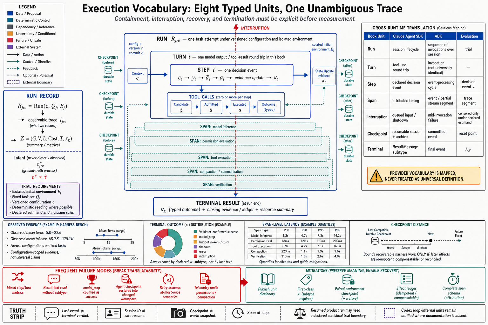

# Topic 5 — Run, Turn, Step, Span, Tool Call, Interruption, Checkpoint, and Terminal Result

## 1. Problem and objective

Execution vocabulary is where agent engineering quietly loses precision: "step" means a model call in one codebase, a tool call in another, and a UI update in a third; "done" conflates a model emission pattern with a validated outcome. Chapter 1's notation contract fixed the mathematical layer; this topic fixes the *operational* layer — the eight units every runtime manipulates — and maps each onto the typed objects and onto the three reference runtimes, so that a trace, a metric, or an incident report written in one system's vocabulary is translatable into the others'.

## 2. Intuition first

The units form a containment hierarchy with two deliberate wrinkles. A **run** contains **turns**; a turn contains **decision events** (steps); a step emits **tool calls**; every timed segment of any of these is a **span** in the trace. The wrinkles: **interruptions** can cut across the hierarchy at any level (a user message arrives mid-turn; a process dies mid-tool-call), and **checkpoints** exist precisely so that the hierarchy can be re-entered after a cut. The **terminal result** is not "the last thing that happened" — it is a typed verdict about *why* execution stopped, and treating it as an afterthought is how premature completion ships to production.

## 3. The units, typed

### 3.1 Run

The top-level unit: one complete attempt on a task specification under a versioned configuration,

$$
\mathsf R_{jrc}=\operatorname{Run}(c,\,Q_j,\,\mathcal E_j),
$$

where $Q_j$ is task $j$, $\mathcal E_j$ its environment and fixtures, $r$ a stochastic repetition, and $c$ the full versioned configuration. The run produces observable record $\hat\tau_{jrc}$ and evaluation vector $\mathbf Z_{jrc}=(G,V,L,\mathsf{Cost},T,\kappa_K)$: completion grade, critical-violation indicator, consequence-weighted loss, cost, latency, and terminal status [Ch. 1, Topic 12 §4]. The latent trajectory $\tau^\star_{jrc}$ is not identified with this record. Evaluation vocabulary calls one protocol-governed attempt a *trial* and requires an isolated initial environment [DEM].

### 3.2 Turn

One model round trip in this book. Current Claude Agent SDK documentation defines a turn as one output/tool-result round trip and states that `max_turns` counts tool-use turns [CAL]. ADK's *invocation* is a complete request–response cycle, but it is not asserted to be semantically identical across every workflow [ADK]. Provider terms are mapped to the book's unit dictionary rather than treated as universal definitions.

### 3.3 Step (decision event)

The index $t$ of the notation contract: one decision event containing $c_t\rightarrow y_t\rightarrow\widetilde a_t\rightarrow a_t$, evidence update, and $\kappa_t$ evaluation (Topic 3 §5). A provider's “turn,” “event,” or “invocation” may aggregate or split these operations. Reliability mathematics indexes declared decision events; dashboards may aggregate to provider turns only after documenting the mapping. **[synthesis]**

### 3.4 Span

Any timed, attributed segment of the trace: a model inference, a tool execution, a permission evaluation, a compaction, a verification pass. Spans are the deep-telemetry unit — the record that connects "model decisions, harness actions, environment states, and outcomes," carrying fields like "token usage and cost, model and tool latency, tool arguments, permission requests... sandbox snapshots, command outputs, test results" [CAH §3.5.1]. Spans nest inside steps and turns; they are how the latency quantiles of Chapter 1, Topic 12 §7 become computable per component rather than only per run.

### 3.5 Tool call

The unit with the most important type discipline (Chapter 2, Topic 5): candidate $\xi_{t,k}$ parsed from $y_t$, admitted action $\widetilde a_{t,k}$, and executed action $a_{t,k}$ are distinct. Parse failure, rejection, ambiguous timeout, and no-op are explicit outcomes. Read/write sets, idempotency, and isolation—not a “read-only” label alone—determine safe concurrency; the current Claude Agent SDK's read-only/serial rule is one conservative implementation [CAL].

### 3.6 Interruption

Any event that suspends the hierarchy from outside the current unit: a mid-turn user message (queued to start its own turn under streaming input [CAL]), a host shutdown (`worker_shutting_down` [CAL]), a cancellation, a mid-invocation crash. The event-sourced architecture names the exposure precisely: state modified locally but not yet carried by a committed event is lost if "the invocation fails before state-carrying events are processed" [ADK] — an interruption's damage is measured by the distance to the last commit. Interruptions are *normal* operations, not anomalies; a harness whose correctness depends on never being interrupted is incorrect (Topic 9 owns the machinery).

### 3.7 Checkpoint

A named, durable point from which execution may be re-entered under declared preconditions: a processed ADK event, a resumable SDK session, a persisted plan milestone, or a sandbox snapshot [ADK; CAL; CAH §3.1.1, §3.4.3]. A valid checkpoint records or references compatible harness state, policy/configuration versions, and environment version/effect status. It need not copy the entire environment, but it must detect or reconcile divergence before an effectful retry. **[synthesis]**

### 3.8 Terminal result

The typed verdict is $\kappa_K$ plus the closing record. Current Claude Agent SDK documentation says `ResultMessage` carries a subtype, output, usage, cost, session ID, and model-side `stop_reason`; consumers must branch on subtype [CAL]. Its `success` subtype denotes successful SDK-loop completion, not independent proof of task success. Application reporting must therefore map provider results into $\mathrm{model\_stop}$, validator-confirmed $\mathrm{success}$, or another declared $\kappa_K$ subtype [CAH §3.4.4; Ch. 1, Topic 12 §3.3].

## 4. The containment map, with its cross-runtime translation

| Unit | Claude Agent SDK [CAL] | ADK [ADK] | Evaluation vocabulary [DEM; HB] |
|---|---|---|---|
| Run | Session (single-shot query lifecycle) | Sequence of invocations over a Session | Trial; $\mathsf R_{jrc}$ [HB §3.3] |
| Turn | Turn (tool-use round trip) | Invocation (`invocation_id`) | — |
| Step | ≈ turn | Event-processing cycle | Decision event $t$ |
| Span | Message + hook/tool timings | Event (with `partial` flag for streaming) | Trace segment [CAH §3.5.1] |
| Tool call | Tool-call block → execution → `UserMessage` result | Action within event processing | $\xi/\widetilde a/a$ elements |
| Interruption | Queued mid-turn input; `worker_shutting_down` | Mid-invocation failure inside dirty-read window | Censored run (Ch. 1, Topic 12 §7) |
| Checkpoint | Session ID + restored context; `PreCompact` archive | Committed event (`append_event`) | Environment reset point [DEM] |
| Terminal result | `ResultMessage` subtype + `stop_reason` | Final (non-partial) event of last invocation | $\kappa_K$ in $\mathbf Z$ |

**[synthesis — table ours; cells sourced]** The translation's chief hazard is the step/turn ambiguity (§3.3) and the trial/run boundary: a resumed session is *one* run for product accounting and arguably *two* for statistics unless the resumption is part of the evaluated protocol — declare which, per Chapter 1 Topic 12 §11's reporting artifact.

## 5. Measurement uses of the vocabulary

- **Turns and tokens per run** are the efficiency spine (mean turns ranged 5.0–22.6 and mean tokens 68.7K–175.1K across Harness-Bench configurations at fixed tasks [HB Table 2]) — reportable only because turn and run are typed units.
- **$\kappa$ distribution per run population** (Topic 3 §8.4): the share of validator-confirmed success vs. model-stop vs. budget/timeout subtypes; interruptions surface here as censoring, to be reported under the censoring-aware view rather than silently dropped (Ch. 1, Topic 12 §7, §12).
- **Span-level latency quantiles** locate the tail: model inference vs. tool execution vs. permission overhead — undiagnosable at run granularity.
- **Checkpoint distance** (time, steps, or tokens since the last compatible committed checkpoint) measures potential re-execution exposure. It bounds recoverable harness work only when the checkpoint is durable and external effects after it are idempotent, compensatable, or reconciled. **[derived]**

## 6. Failure modes

- **Unit conflation in metrics:** "average steps" computed over mixed step/turn definitions across services; the cross-runtime table exists to prevent exactly this.
- **Terminal-result overloading:** treating `ResultMessage.result` text as the outcome without checking subtype [CAL]; or reporting $\mathrm{model\_stop}$ runs as successes — the premature-completion path from evidence to dashboard [FSC §6.4.1.4].
- **Checkpoint asymmetry:** resuming agent state into a changed workspace (or vice versa) — §3.7's pairing rule violated; detectable by post-resume divergence probes (Ch. 1, Topic 3 §6).
- **Interruption denial:** retry logic that assumes at-most-once execution of the interrupted unit; without idempotency or commit discipline, a re-entered turn can double-execute its mutations (Topic 9).
- **Span gaps:** telemetry that records model calls but not permission evaluations or compactions; incidents then hide in the unrecorded segments — the deep-telemetry field list [CAH §3.5.1] is the completeness checklist.

## 7. Limitations

- The eight-unit vocabulary is a synthesis; no single source defines all eight, and runtimes will keep inventing units (subagent invocations, background tasks) that need explicit mapping when adopted.
- The step/turn identification (§3.3) is convention where the sources are silent; systems that batch or split proposals must document their own mapping for the statistics to transport.
- Codex's loop-internal units are not documented in the accessible sources [CDX]; its row is deliberately absent from §4's table rather than guessed.

## 8. Production implications

1. **Publish the unit dictionary for your system** — §4's table with your runtime's column filled in; every dashboard, alert, and incident template cites it.
2. **Make $\kappa$ a first-class field** in run records, with validator-confirmed success distinguished from model-stop; alarm on the ratio, not just the failure count.
3. **Instrument spans to the deep-telemetry field list** [CAH §3.5.1]; anything less leaves incident forensics blind in the gaps.
4. **Track checkpoint distance** as a standing metric for interruption exposure, and test resumption (kill and re-enter) as part of acceptance, not as incident response.
5. **Declare the run/trial boundary for statistics** (resumed sessions, retried tasks) before collecting data — the paired designs of Topic 14 depend on it.

## 9. Connections

- This vocabulary is Chapter 1 Topic 12's notation made operational; Topic 3 supplied the step's internal structure; Topics 8–10 use the terminal-result and interruption types; Topic 9 builds on checkpoints.
- Chapter 14's observability stack is the span layer industrialized; Chapter 10's long-horizon continuity is checkpoint engineering at session scale.

## Sources

[CAL] Claude Agent SDK, "How the agent loop works" — https://code.claude.com/docs/en/agent-sdk/agent-loop
[ADK] Google ADK runtime event-loop documentation — https://adk.dev/runtime/event-loop/
[CAH] Code as Agent Harness, arXiv:2605.18747 (`Knowledge_source/2605.18747v1.pdf`) §3.1.1, §3.4.3–3.4.4, §3.5.1
[DEM] Anthropic, Demystifying evals for AI agents — https://www.anthropic.com/engineering/demystifying-evals-for-ai-agents
[HB] Harness-Bench, arXiv:2605.27922 (`Knowledge_source/2605.27922v1.pdf`) §3.3, Table 2
[FSC] Claude Fable 5 & Mythos 5 System Card (`Knowledge_source/Claude Fable 5 & Claude Mythos 5 System Card.pdf`) §6.4.1.4
[CDX] OpenAI Codex documentation, agent approvals and security — https://learn.chatgpt.com/docs/agent-approvals-security
