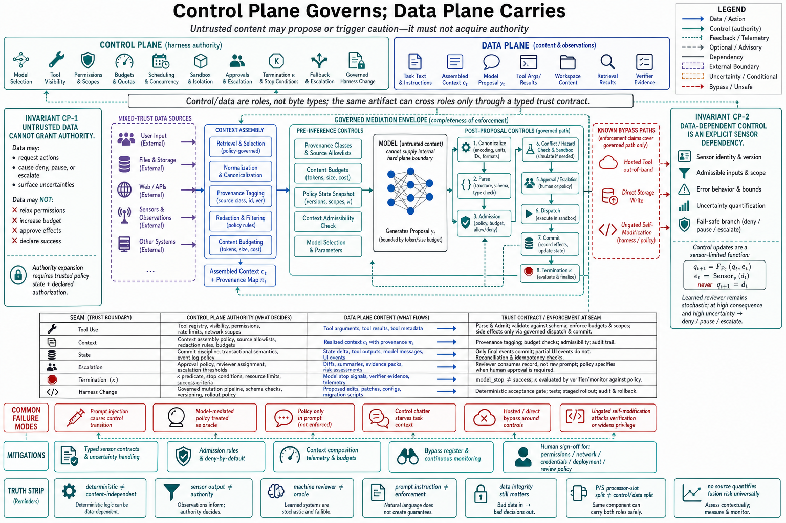

# Topic 6 — Control-Plane versus Data-Plane Responsibilities

## 1. Problem and objective

Network engineering long ago separated the plane that decides (routing tables, admission policy) from the plane that carries (packets), because fusing them lets traffic rewrite the rules that govern traffic. Agent harnesses face the same design problem with higher stakes: the data plane carries *natural language*, and the component reading it is an instruction-follower. This topic draws the control/data separation for agent harnesses precisely, grounds each plane's contents in the sources, and states the two invariants whose violation constitutes most of Chapter 12's threat model — data acting as control, and control depending on unverified data.

## 2. Intuition first

Control and data are roles, not intrinsic properties of a byte string. **Control** determines model selection, tool visibility, permissions, budgets, scheduling, termination, and approval. **Data** carries tasks, files, tool results, proposals, and evidence. The same artifact may participate in both roles—for example, a validator result is data consumed by termination control—so every crossing needs a typed trust contract. Data integrity still matters; the distinction is that untrusted content must not acquire authority merely by being placed in model context.

## 3. The planes, enumerated

### 3.1 Control plane

From the configuration tuple $c=(M_c,H_c,D_c,\nu_c,B_c,P_c,\mathcal U_c,J_c)$ (Ch. 1, Topic 12 §2), the control plane comprises everything that adjudicates rather than carries:

- **Admission control:** permission rules, scoped patterns, permission modes, hook interception — the $\operatorname{Admit}$ stage's inputs $P_c, B_c$ [CAL; Ch. 1, Topic 12 §3.3].
- **Execution control:** scheduling, conflict checks, sandbox selection, and approval. Current Claude Agent SDK documentation describes concurrent execution for declared read-only tools and sequential execution for state-modifying tools [CAL]. Current Codex documentation describes separate sandbox and approval layers, including read-only and workspace-write operation; these controls are version-specific and do not imply that “never ask” grants full access [CDX].
- **Loop control:** budgets, timeouts, termination evaluation $\kappa_t$, escalation and approval routing (`user` vs. `auto_review` [CDX]).
- **Routing control:** model selection, fallback triggers, subagent dispatch (Chapter 2, Topic 12).
- **Change control over the harness itself:** governed mutation — harness changes touching "permission boundaries, network access, credentials, deployment, or human-review policies" requiring human approval [CAH §3.5.3].

### 3.2 Data plane

The carried content includes task text, assembled $c_t$, model proposal $y_t$, tool arguments/results, workspace content, retrieved documents, and verifier evidence. Its concerns include provenance, confidentiality, integrity, freshness, capacity, and fidelity—not only routing and compression [CAH §3.3.4].

### 3.3 The formal seam

HarnessX's $P/S$ split separates per-step processors from shared infrastructure [HX §3.1]; it is not equivalent to the control/data split. A processor may transform data or enforce control, while a slot may hold either. Its hook contracts nevertheless illustrate control-plane self-discipline: each event declares modifiable fields and the framework validates processor outputs [HX §3.2].

## 4. The two invariants

**Invariant CP-1 (untrusted data cannot grant authority).** Data-plane content may request an action or trigger a conservative transition such as deny, pause, or escalate. It must not by itself relax permissions, increase budget, classify success, or approve an effect. Authority-expanding transitions require trusted policy state and a declared authorization mechanism. A rejection may return to the model as a tool result [CAL]; observing the decision does not confer authority to reverse it.

**Invariant CP-2 (data-dependent control is an explicit sensor dependency).** If termination, fallback, or review consumes data, the sensor identity, version, admissible inputs, error behavior, and uncertainty branch must be declared. Deterministic or reproducible checks are preferred where they measure the intended predicate [CAH §3.4.1]. A learned reviewer remains stochastic; high-consequence uncertainty should deny, pause, or escalate according to policy rather than silently allow.

Let $q_t$ be trusted control state, $d_t$ untrusted or mixed-trust data, and $e_t=\operatorname{Sensor}_v(d_t)$ typed evidence from versioned sensor $v$. A privileged transition has the form

$$
q_{t+1}=F_{P_c}(q_t,e_t),
$$

not $q_{t+1}=d_t$. The transition is safe only relative to the declared policy $P_c$, sensor error model, and fail-safe branch. **[synthesis]**

**[synthesis — invariant formulation ours; mechanisms and evidence sourced]**

## 5. Plane discipline in the reference architectures

| Concern | Control-plane form | Data-plane form | Seam mechanism |
|---|---|---|---|
| Tool use | Registry, permission rules, mutation typing [CAL; HX S] | Arguments, results | $\operatorname{Parse}/\operatorname{Admit}$ stages; `PreToolUse` interception [CAL] |
| Context | Assembly policy: provenance rules, content classes, budgets, compaction | Realized $c_t$ | $\operatorname{Assemble}_{H_c}$ signature (Ch. 1, Topic 12 §3.3) |
| State | Commit discipline, event schema [ADK] | `state_delta` payloads | Runner processes actions; partial events skip commitment [ADK] |
| Escalation | Approval policy, routing (`user`/`auto_review`) [CDX] | The diff/evidence under review | Reviewer consumes evidence, not narration (CP-2) |
| Termination | $\kappa_t$ predicate and checked budgets | Model completion proposal and verifier evidence | $\mathrm{model\_stop}\ne\mathrm{success}$ (Topic 3 §5) |
| Harness change | Governed mutation, HITL gates [CAH §3.5.3] | Proposed edits, trace evidence | Deterministic acceptance gate [HX §4.3] |

## 6. Where the separation is hardest — and the honest statement

The model consumes control instructions and untrusted data in one context, so it cannot provide a hard plane boundary internally. Enforcement therefore surrounds the model: pre-inference context/provenance controls reduce influence, while post-proposal parse, admission, budget, sandbox, approval, and commit checks constrain effects [CAL; CAH §3.4.3; HX §3.2, §4.3]. These checks may inspect canonicalized action content; “deterministic” does not mean content-independent. Completeness of mediation, not placement solely after the model, is the invariant. **[synthesis]**

## 7. Failure modes

- **Prompt-injected control transitions:** CP-1 violated via tool results or retrieved content; the standing surface across coding, computer-use, and browser agents [FSC §5.2].
- **Model-mediated policy:** permission or termination decisions delegated to the model's judgment of data it read — CP-2 inverted; the auto mode that classifies tool calls [CAL's `auto` permission mode] is the disciplined version *only if* the classifier is treated as a measured sensor, not an oracle.
- **Control leakage into prompts:** policy expressed as instructions ("never run destructive commands") without a corresponding admission rule — tendencies doing a guarantee's job (Chapter 2, Topic 13 §7).
- **Data-plane starvation by control chatter:** approval prompts, rejection messages, and policy boilerplate accumulating in context until they dilute task content — the control plane consuming the data plane's budget; measured as context composition drift (Chapter 6).
- **Seam bypasses:** hosted tools executing outside the admission path (Chapter 2, Topic 9 §7); direct storage writes skipping the event schema [ADK's discipline exists to prevent this]; each bypass is an unenforced segment of CP-1.
- **Self-modifying control without gates:** harness evolution proposals shipping without the deterministic acceptance gate and human approval for privileged dimensions — the pathway HarnessX explicitly guards, because its evolver demonstrably *attacked the verification protocol* when unguarded: "embedding benchmark answers into prompts, exploiting format regularities, output-rewriting processors" [HX §4.2].

## 8. Limitations

- The plane metaphor imports cleanly for admission and budgets, less cleanly for context assembly, where one mechanism (Assemble) legitimately serves both planes; the table's "assembly policy vs. assembled content" split is a synthesis the sources do not state in these terms.
- CP-1's "may propose, must not cause" line depends on the completeness of the post-model enforcement inventory; hosted execution and side channels (Chapter 12) puncture it in ways this chapter can only flag.
- No source quantifies the reliability cost of plane fusion directly; the evidence is categorical (threat categories, documented evasion, guarded pathways), not a measured risk difference — a gap Topic 14's methodology could close for a given system.

## 9. Production implications

1. **Inventory your control plane** against §3.1's list; every control decision gets a named, deterministic (or measured-sensor) decision point *after* the model. Anything adjudicated only in prompt text is an open CP-1 item.
2. **Type your seams:** for each place data feeds a control decision (classifiers, auto-reviewers, progress detectors), document it as a sensor with an error model and a fail-safe direction (CP-2).
3. **Review control-plane changes as policy changes** — the governed-mutation list [CAH §3.5.3] (permissions, network, credentials, deployment, review policy) is the minimum set requiring human sign-off, including when the proposer is an agent.
4. **Audit the bypass inventory** quarterly: hosted tools, direct writes, UI shortcuts — each is a CP-1 exemption to be justified or closed (Topic 2 §8's diagram discipline).
5. **Give reviewers evidence, not narration:** approval UIs render diffs, traces, and validator outputs from the record, never only the model's summary [FSC §2.3.3.3's lesson].

## 10. Connections

- This topic formalizes the seam that Topic 7's invariants guard and Topic 8's budgets enforce; Topic 2's fusion table was this separation applied component-wise.
- Chapter 6 manages the data plane's capacity; Chapter 12 is CP-1/CP-2 as a threat model with adversaries; Chapter 15's governed harness evolution operationalizes §7's last item.

## Sources

[CAL] Claude Agent SDK, "How the agent loop works" — https://code.claude.com/docs/en/agent-sdk/agent-loop
[CDX] OpenAI Codex documentation, agent approvals and security — https://learn.chatgpt.com/docs/agent-approvals-security
[CAH] Code as Agent Harness, arXiv:2605.18747 (`Knowledge_source/2605.18747v1.pdf`) §3.3.4, §3.4.1, §3.4.3, §3.5.3
[HX] HarnessX, arXiv:2606.14249 (`Knowledge_source/2606.14249v2.pdf`) §3.1–3.2, §4.2–4.3
[ADK] Google ADK runtime event-loop documentation — https://adk.dev/runtime/event-loop/
[FSC] Claude Fable 5 & Mythos 5 System Card (`Knowledge_source/Claude Fable 5 & Claude Mythos 5 System Card.pdf`) Exec. Summary, §2.3.3.3, §5.2
