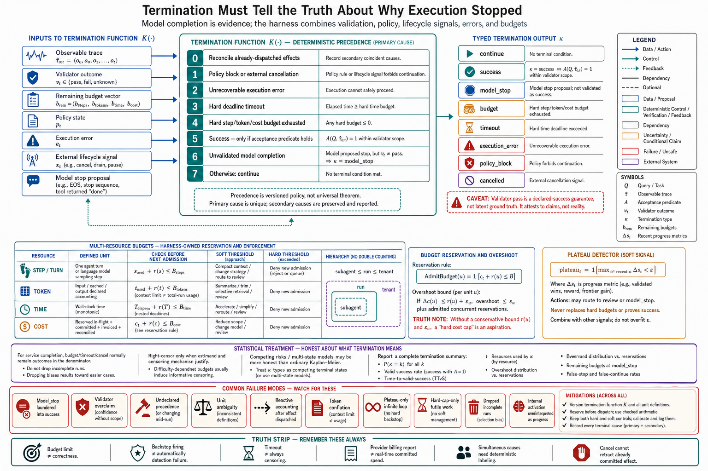

# Topic 8 — Termination Predicates, Step Budgets, Token Budgets, Time Budgets, and Cost Budgets

## 1. Problem and objective

An agent run needs an explicit rule for deciding whether to continue, declare a validated result, stop without validation, or halt because execution can no longer proceed safely. A model-generated completion signal is evidence for that decision, not the decision itself. The harness owns the decision because it can combine the observable trace $\hat\tau_{0:t}$, validator evidence, policy state, execution errors, external cancellation, and resource accounts.

This topic specifies a typed termination function, deterministic precedence for simultaneous terminal conditions, budget enforcement with explicit overshoot assumptions, and statistically correct treatment of incomplete runs. The objective is not to make every run finish successfully. It is to make every run finish with a truthful, reproducible terminal cause.

## 2. Intuition first

Three questions should remain separate:

1. **Was the task completed to the declared acceptance standard?**
2. **Is further execution permitted and operationally possible?**
3. **Is further execution still useful enough to justify its resource cost?**

A validator can answer the first only within its stated coverage. Policy gates, external cancellation, unrecoverable errors, and hard budgets answer the second. A plateau detector or a model stop proposal can inform the third. Collapsing these questions creates familiar errors: unverified model stops reported as success, intended budget caps diagnosed as system faults, or unsafe continuation after a policy block.

Budgets are therefore control limits, not correctness oracles. A hard budget bounds admitted work only to the precision of the enforcement mechanism. Provider billing lag, non-preemptible tool calls, and already-dispatched work can produce overshoot unless the harness reserves their worst-case cost before dispatch.

## 3. Typed termination semantics

Let the remaining resource vector be

$$
\mathbf b_t^{\mathrm{rem}}
=
\left(
n_t^{\mathrm{rem}},
q_t^{\mathrm{rem}},
\ell_t^{\mathrm{rem}},
d_t^{\mathrm{rem}}
\right),
$$

where the coordinates represent remaining decision events, tokens, wall-clock time, and monetary spend. Let

$$
v_t \in
\{\mathrm{pass},\mathrm{fail},\mathrm{unknown}\}
$$

be the decision of the declared validator suite. The harness computes

$$
\kappa_t
=
\mathsf K\!\left(
\hat\tau_{0:t},
\mathbf b_t^{\mathrm{rem}},
v_t,
p_t,
e_t,
x_t
\right)
\in
\left\{
\begin{array}{l}
\mathrm{continue},
\mathrm{success},
\mathrm{model\_stop},
\mathrm{budget},
\mathrm{timeout},\\
\mathrm{execution\_error},
\mathrm{policy\_block},
\mathrm{cancelled}
\end{array}
\right\},
$$

where $p_t$ is policy state, $e_t$ is execution-error state, and $x_t$ is an external lifecycle signal. This preserves the Chapter 1 distinction between the model proposal $y_t$, the admitted action $\widetilde a_t$, the executed action $a_t$, and the harness terminal status $\kappa_t$.

The implementation must publish deterministic precedence. A defensible default is:

1. record and reconcile any already-dispatched effect;
2. honor a policy block or external cancellation;
3. terminate on an unrecoverable execution error;
4. terminate on an expired hard deadline;
5. terminate on an exhausted hard step, token, or cost budget;
6. declare success only when the declared acceptance predicate passes;
7. map an unvalidated model completion proposal to $\mathrm{model\_stop}$;
8. otherwise continue.

This order is a policy choice, not a universal theorem. For example, a safety system may preserve $\mathrm{policy\_block}$ as the primary terminal cause even if the deadline expires at the same event. The invariant is that precedence is deterministic, the primary cause is unique, and secondary coincident causes remain in the trace.

### 3.1 What a success status means

Let $A(Q,\hat\tau_{0:t})$ be the declared acceptance predicate for task $Q$. Then

$$
\kappa_t=\mathrm{success}
\quad\Longleftrightarrow\quad
A(Q,\hat\tau_{0:t})=1
$$

within the validator's stated scope. This is a **declared-success guarantee**, not proof of latent ground truth. A weak, incomplete, or contaminated validator can still return a false positive. Production reports must therefore identify the validator version, check coverage, and any human-review requirement.

A no-progress detector is also not a substitute for hard limits. It is a soft decision aid:

$$
\mathrm{plateau}_t
=
\mathbb 1
\left[
\max_{i\in\{t-w+1,\ldots,t\}}
\Delta s_i
<\varepsilon
\right],
$$

where $s_i$ is a domain-specific progress signal, $w$ is a predeclared window, and $\varepsilon$ is a meaningful improvement threshold. Noisy or weak-oracle domains require uncertainty-aware variants and may map a plateau to review or $\mathrm{model\_stop}$ rather than success.

## 4. Budget families and enforcement contracts

| Budget | Accounted quantity | Typical enforcement point | Important exception |
|---|---|---|---|
| Step or turn | Harness-defined decision events or tool-use turns | Before admitting the next event | Vendors count “turn” differently; publish the unit |
| Token | Input, cached input, output, or their declared aggregate | Before a model request and after usage is reported | Context-window management and total-run usage are different limits |
| Time | Monotonic elapsed time and nested deadlines | Before dispatch, during cancellable work, and after return | Non-preemptible work may finish after the deadline |
| Cost | Priced usage plus reserved in-flight work | Before dispatch and after billing reconciliation | Prices, delayed usage reports, and tool charges can create accounting lag |

Budgets may be **soft** or **hard**. A soft threshold can trigger compaction, strategy change, or review. A hard threshold prevents additional admission. They may also be hierarchical: a subagent budget is bounded by the run budget, which is bounded by a portfolio or tenant budget. The accounting hierarchy must prevent double counting while still reserving parent capacity for child work.

For an operation $u$ with conservative reservation $r(u)$ and committed spend $c_t$, budget-safe admission is

$$
\mathsf{AdmitBudget}(u)
=
\mathbb 1[c_t+r(u)\le B].
$$

If actual incremental spend satisfies

$$
\Delta c(u)\le r(u)+\epsilon_u,
$$

then terminal overshoot is bounded by the reservation error $\epsilon_u$ plus any explicitly admitted concurrent reservations. Without this assumption, “hard cost cap” is an aspiration rather than an enforceable contract. Systems should report reserved, committed, invoiced, and reconciled spend separately.

Budget enforcement is not necessarily located only in the harness. A provider, client library, tool server, operating system, or workload scheduler may enforce part of the limit. The system record must name the enforcing layer and the granularity at which it can interrupt work.

## 5. Measurement semantics

Budget, timeout, and cancellation outcomes are observed terminal causes. Whether they are also treated as censored observations depends on the estimand:

- For service-level task completion by a deadline, they normally remain failures in the denominator.
- For time-to-valid-success, a run may be right-censored only when follow-up stopped for a reason compatible with the survival model's assumptions. Administrative study cutoff is a common example.
- A budget selected in response to task difficulty is informative censoring. Treating it as independent censoring can bias survival estimates.
- When timeout, cancellation, and execution failure preclude later success, competing-risk analysis or an explicit multi-state outcome is often more honest than ordinary Kaplan–Meier estimation.

At minimum, report:

$$
\Pr(\kappa=k),\qquad
\Pr(\mathrm{success}),\qquad
\text{time-to-valid-success},\qquad
\text{resource use}\mid\kappa,
$$

plus budget overshoot, remaining budget at incomplete model stop, false-stop rate, and false-continue rate. A backstop-firing rate is diagnostic, but it is not automatically a detection-layer failure: the cap may be intentional and correctly enforced.

## 6. Failure modes and exceptions

- **Model stop laundered into success:** no acceptance predicate passed.
- **Validator overclaim:** a passing check set is reported as ground truth despite incomplete coverage.
- **Undeclared precedence:** simultaneous timeout and policy failure produce nondeterministic terminal labels.
- **Unit ambiguity:** one system counts model calls while another counts tool-use turns.
- **Reactive accounting:** cost is checked only after an expensive request has already been dispatched.
- **Token conflation:** context compaction is treated as if it bounded cumulative run usage.
- **Plateau-only control:** a noisy progress signal permits an infinite loop because no hard cap remains.
- **Hard-cap-only control:** repeated futile work reaches the cap even though a reliable plateau signal appeared earlier.
- **Dropped incomplete runs:** timeout or budget outcomes disappear from the denominator.
- **Overinterpreted model telemetry:** internal activations associated with budget beliefs are treated as proof of a specific propositional belief or causal mechanism. Such evidence is suggestive unless the study establishes the stronger interpretation.

## 7. Production protocol

1. Version $\mathsf K$, its precedence, its acceptance predicates, and every budget unit.
2. Use a monotonic clock and propagate nested deadlines.
3. Reserve worst-case or high-confidence resource use before dispatch; reconcile after completion.
4. Record primary and secondary terminal causes, validator evidence, budget snapshots, reservations, and in-flight effects.
5. Keep hard caps even when soft plateau detection is available.
6. Test boundaries: the final admitted turn, cancellation during a mutation, delayed provider usage, simultaneous terminal signals, and resume immediately after a budget stop.
7. Review terminal-cause and overshoot distributions by task class, model, harness version, and consequence tier.

## 8. Connections

Topic 9 defines the effect reconciliation required when cancellation or interruption occurs near a terminal boundary. Topic 10 defines the error variants consumed by $\mathsf K$. Topic 14 specifies experiments for selecting budgets and plateau policies without changing the estimand silently.

## Sources

[CAL] Claude Agent SDK, “How the agent loop works” — https://code.claude.com/docs/en/agent-sdk/agent-loop

[CAH] *Code as Agent Harness*, arXiv:2605.18747, §3.4.4 (Knowledge_source/2605.18747v1.pdf)

[FSC] *Claude Fable 5 & Mythos 5 System Card*, §6.4.1.4 (Knowledge_source/)

[HB] *Harness-Bench*, arXiv:2605.27922, §3.1, §4.2, Tables 1–2 (Knowledge_source/2605.27922v1.pdf)

[KM] Kaplan and Meier, “Nonparametric Estimation from Incomplete Observations” — https://doi.org/10.1080/01621459.1958.10501452
