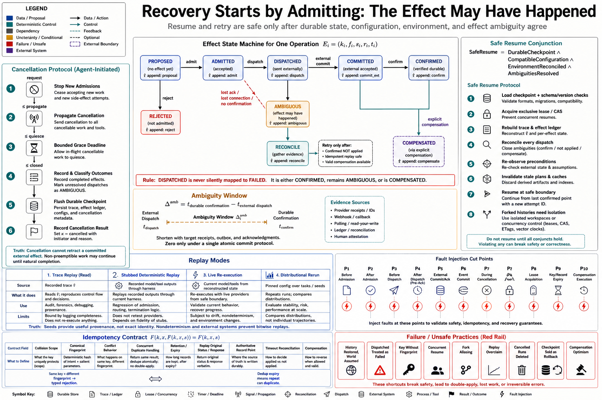

# Topic 9 — Cancellation, Interruption, Resumption, Replay, and Idempotency

## 1. Problem and objective

Cancellation and process failure can cut an agent run between proposal, admission, dispatch, effect, observation, and durable commit. At that boundary, neither “retry” nor “resume” is intrinsically safe. The harness must determine which state is durable, which external effects occurred, which effects remain ambiguous, and which operations can be repeated without duplication.

The objective is a lifecycle protocol with explicit effect states, cancellation semantics, durable checkpoints, environment reconciliation, replay modes, and idempotency contracts. Recoverability is achieved only when these properties hold together; it is not implied by the existence of a session identifier.

## 2. Intuition first

After an interruption, the most dangerous answer to “did the write happen?” is “probably not.” There are three materially different states:

- the operation was never dispatched;
- it completed and its result was durably confirmed;
- it may have completed, but confirmation was lost.

The third state is the **ambiguous-outcome interval**. Repeating an operation in that interval is safe only if the effect is idempotent, the target can be queried and reconciled, or a compensating transaction is valid. A restored conversation history does not resolve external ambiguity.

## 3. Lifecycle and effect-state model

For each effectful operation, record

$$
E_i
=
\left(
k_i,
f_i,
s_i,
r_i,
t_i
\right),
$$

where $k_i$ is an idempotency key, $f_i$ is a canonical request fingerprint, $s_i$ is effect state, $r_i$ is a result reference, and $t_i$ contains timestamps and attempt metadata. Use an exhaustive state set such as

$$
s_i\in
\left\{
\begin{array}{l}
\mathrm{proposed},
\mathrm{admitted},
\mathrm{dispatched},
\mathrm{committed},
\mathrm{confirmed},\\
\mathrm{ambiguous},
\mathrm{compensated},
\mathrm{rejected}
\end{array}
\right\}.
$$

These are harness bookkeeping states, not claims that every external system offers a transaction log. In particular, $\mathrm{dispatched}$ followed by lost connectivity must become $\mathrm{ambiguous}$ unless the target supplies authoritative reconciliation.

The observable trace $\hat\tau$ should retain state transitions and evidence. The latent trajectory $\tau^\star$ may still contain an effect the harness did not observe. Recovery logic must never silently equate the two.

## 4. Cancellation and interruption

### 4.1 Cancellation is a protocol

A cancellation request and an observed terminal state are different events:

$$
t_{\mathrm{request}}
\le
t_{\mathrm{propagate}}
\le
t_{\mathrm{quiesce}}
\le
t_{\mathrm{closed}}.
$$

The harness should:

1. stop admitting new proposals;
2. propagate cancellation to cancellable model and tool work;
3. wait only within a bounded grace deadline;
4. record completed effects and mark unresolved dispatches ambiguous;
5. flush the durable checkpoint;
6. close the run with $\kappa_t=\mathrm{cancelled}$ and a typed initiator and reason.

Cancellation cannot retract an external effect that already committed. A graceful-shutdown signal that ends after the current turn provides a useful boundary, but it does not guarantee that every tool has reached a safe checkpoint or that a non-preemptible operation has stopped [CAL].

For service reliability, cancellation is ordinarily an observed terminal outcome. It is right-censoring only for an estimand and censoring mechanism that justify that treatment. Operator cancellation caused by observed poor progress is generally informative.

### 4.2 Interruption exposes the commit gap

An interruption is unplanned loss of execution continuity. Durable event commit reduces agent-side state loss, but it does not automatically bound external-effect loss or duplication. Google ADK, for example, commits event actions through the session service, while durability depends on the configured service; its cancellation documentation also distinguishes committed events from in-progress work that has not yielded [ADK-EVENT; ADK-CANCEL].

The relevant quantity is the **ambiguity window**:

$$
\Delta_i^{\mathrm{amb}}
=
t_i^{\mathrm{durable\ confirmation}}
-
t_i^{\mathrm{external\ dispatch}}.
$$

Shortening this window reduces exposure. It does not eliminate it unless dispatch and durable confirmation participate in one atomic protocol, which is uncommon across arbitrary tools.

## 5. Safe resumption

A session can restore model-visible history and harness state while the external environment has changed. Safe resumption therefore requires a conjunction:

$$
\mathsf{SafeResume}
=
\mathsf{DurableCheckpoint}
\land
\mathsf{CompatibleConfiguration}
\land
\mathsf{EnvironmentReconciled}
\land
\mathsf{AmbiguitiesResolved}.
$$

A production resume protocol is:

1. load the checkpoint and verify schema, harness, tool, policy, and model compatibility;
2. acquire exclusive ownership of the run or use compare-and-swap on its lease;
3. reconstruct $\hat\tau$ and the effect ledger;
4. inspect every dispatched or ambiguous effect using target-side status, idempotency records, or a human decision;
5. re-observe workspace and external preconditions;
6. invalidate stale plans and derived caches;
7. resume from the next safe boundary with a new attempt identifier.

Forking a conversational session does not isolate a filesystem, database, or network resource. Forks that can mutate must receive isolated workspaces or explicit concurrency control.

Official ADK resumability must be enabled and has component-specific requirements; custom agents need checkpoint behavior where documented [ADK-RESUME]. ADK rewind restores supported session state and artifacts while preserving event history, but it does not restore arbitrary external dependencies, and the documented state, artifact, and event updates are not globally atomic [ADK-REWIND]. These are scoped platform semantics, not a universal rollback guarantee.

## 6. Replay modes

“Replay” should name one of four different operations:

| Mode | Model and tool behavior | Valid use | Principal limitation |
|---|---|---|---|
| Trace replay | Read recorded $\hat\tau$ without execution | Audit, visualization, postmortem | Cannot test counterfactual behavior; completeness depends on logging |
| Stubbed deterministic replay | Feed recorded model proposals and tool observations through harness logic | Regression-test admission, routing, and termination | Does not retest providers, tools, or environment |
| Live re-execution | Invoke current model and tools from a reconstructed initial state | Reproduction and integration testing | Provider, dependency, clock, concurrency, and external-state drift |
| Distributional rerun | Repeat a pinned configuration over tasks and seeds | Compare outcome distributions | Does not reproduce an individual trajectory |

Exact execution replay is normally unavailable for an open stochastic system. A seed is useful provenance, but it does not control provider implementations, scheduling, nondeterministic tools, or mutable dependencies. Sandboxes, immutable images, dependency locks, recorded tool outputs, and virtualized time increase replay fidelity; they do not justify claiming identity unless all relevant sources of nondeterminism are controlled.

## 7. Idempotency contract

For a state transition $F$, idempotency requires

$$
F(k,x,F(k,x,s))=F(k,x,s),
$$

for the same key $k$, canonical request $x$, and idempotency scope. An operational contract must additionally define:

- key generation and collision domain;
- canonical request fingerprinting;
- behavior when the same key is reused with a different fingerprint;
- concurrent duplicate handling;
- retention duration and expiry behavior;
- whether the original status and response are replayed;
- the point at which the record becomes authoritative;
- reconciliation for timeout after dispatch;
- compensation semantics for non-idempotent effects.

The safe default for key conflict is a typed rejection, not silent reuse. The safe default for an ambiguous effect is reconciliation before retry. Time-bounded deduplication also means idempotency is not permanent: a retry after record expiry can duplicate the effect.

For targets without native idempotency, compare-and-swap, unique constraints, conditional writes, or an outbox/inbox protocol can sometimes supply equivalent safety. Compensation is weaker than rollback because a compensating action can fail and may not restore all external consequences.

## 8. Failure modes and exceptions

- **Conversation restored, environment assumed restored:** stale belief drives a new mutation.
- **Dispatched treated as failed:** lost acknowledgment triggers a duplicate.
- **Idempotency key without request fingerprint:** a caller reuses a key for a different operation.
- **Concurrent resume:** two workers acquire the same checkpoint and both continue.
- **Fork aliasing:** independent histories share one mutable workspace.
- **Replay overclaim:** a trace is incomplete or live dependencies have drifted.
- **Cancellation deletion:** an operationally meaningful terminal outcome disappears from analysis.
- **Checkpoint overclaim:** durable session state is described as atomic rollback of external effects.
- **Compensation optimism:** a second failure leaves the system between forward and compensating states.

Some read-only operations are naturally repeatable and need less machinery. Conversely, irreversible operations such as sending money, publishing data, or notifying a person require stricter target-side confirmation and often human review.

## 9. Production verification

Test the lifecycle with deterministic fault injection at every transition:

- before and after admission;
- before dispatch;
- after external commit but before acknowledgment;
- before and after durable event commit;
- during cancellation propagation;
- while a second worker attempts resume;
- after idempotency-record expiry;
- during compensation.

Acceptance criteria should verify no forbidden duplicate effect, no lost confirmed effect, a single terminal run owner, exhaustive error handling, and a trace that explains every reconciliation decision.

## 10. Connections

Topic 8 supplies terminal causes and deadlines. Topic 10 supplies the error union and retry policy. Chapter 5 owns target-specific tool contracts; Chapter 9 owns shared-state concurrency; Topic 14 uses stubbed replay and clean-environment reruns for controlled ablations.

## Sources

[CAL] Claude Agent SDK, “How the agent loop works” — https://code.claude.com/docs/en/agent-sdk/agent-loop

[ADK-EVENT] Google ADK, “Runtime: Event loop” — https://adk.dev/runtime/event-loop/

[ADK-SESSION] Google ADK, “Sessions” — https://adk.dev/sessions/session/

[ADK-RESUME] Google ADK, “Resumability” — https://adk.dev/runtime/resume/

[ADK-CANCEL] Google ADK, “Agent run cancellation” — https://adk.dev/runtime/cancel/

[ADK-REWIND] Google ADK, “Session rewind” — https://adk.dev/sessions/session/rewind/

[CAH] *Code as Agent Harness*, arXiv:2605.18747, §3.4.3 (Knowledge_source/2605.18747v1.pdf)
