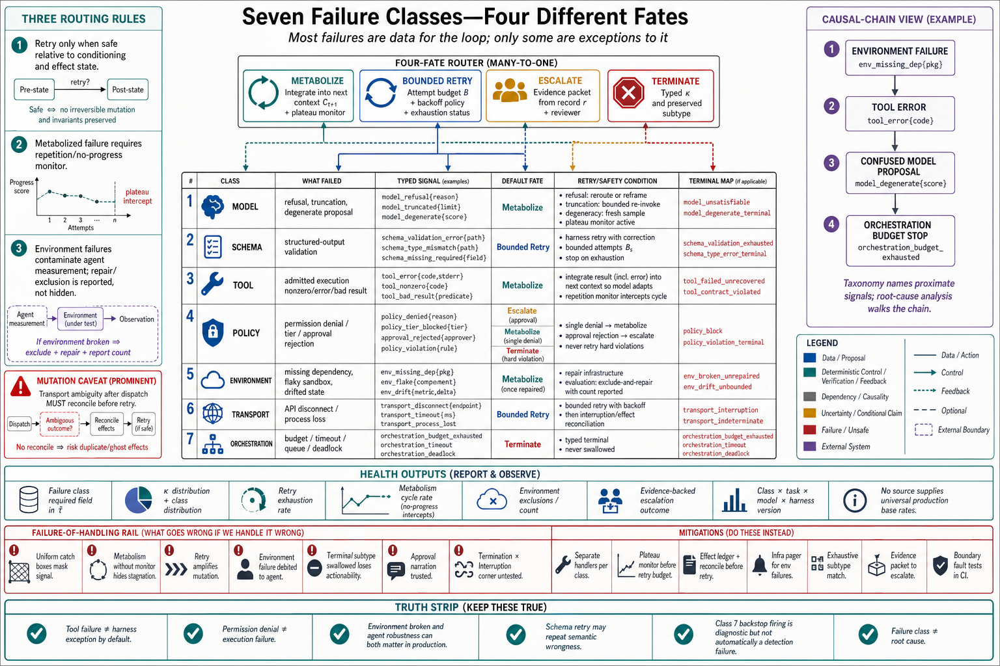

# Topic 10 — Exception Taxonomy: Model, Schema, Tool, Policy, Environment, Transport, and Orchestration Failures

## 1. Problem and objective

Agent systems fail through seven distinguishable channels, and the correct response differs per channel: some failures should retry, some should re-prompt, some should escalate, some should halt, and some should be *fed to the model as information* because adaptation is the designed response. Uniform handling — the generic try/catch around the loop — converts this structure into noise. The objective is the seven-class taxonomy with each class's typed signals, retry semantics, correct consumer, and mapping onto the terminal-control statuses; and the design rule the reference runtimes already embody: **most failures are data for the loop; only some are exceptions to it.**

## 2. Intuition first

The deepest design decision in the reference runtimes is easy to miss: a failed tool execution is *not an exception* — it returns to the model as a result, and "the model reacts to failures" [CAL]; a denied permission is *not an exception* — "Claude receives the rejection message as the tool result and typically attempts a different approach" [CAL]. The loop metabolizes these. What cannot be metabolized — transport loss, budget exhaustion, schema-retry exhaustion — surfaces as typed terminal results. The taxonomy's purpose is to assign every failure to its correct fate: *metabolize* (into context), *retry* (at the harness), *escalate* (to a human), or *terminate* (with a typed cause). Robustness is even scored as a first-class process dimension — "whether the agent handles tool or environment failures" [HB §3.4] — the metabolizing pathway is measured, not just permitted.

## 3. The seven classes

| # | Class | What fails | Typed signals in the sources | Default fate |
|---|---|---|---|---|
| 1 | **Model** | The proposal itself: refusal, truncation, degenerate output | `stop_reason ∈ {refusal, max_tokens}` on the final assistant response [CAL] | Refusal → surface/reroute; truncation → re-invoke with adjusted budget; degenerate → retry with fresh sample (Ch. 2 T1: sampling vs. conditioning split) |
| 2 | **Schema** | Structured-output validity | Validation failure → retry loop → `error_max_structured_output_retries`; fallback may retract completed output [CAL] | Harness retry (bounded); exhaustion is terminal and typed — handle it |
| 3 | **Tool** | Execution of an admitted call: nonzero exit, tool-level error, bad result | Error content in the tool result fed back to the model [CAL]; Robustness-scored handling [HB §3.4] | **Metabolize:** the model adapts; harness intervenes only on repetition (plateau detector, Topic 8 §3) |
| 4 | **Policy** | Admission: permission denial, tier violation, approval rejection | Rejection message as tool result [CAL]; `policy_block` terminal class where the run may not continue (Ch. 1, Topic 12 §3.3); approval routing [CDX] | Metabolize (single denial) / escalate (approval path) / terminate (hard violation) |
| 5 | **Environment** | The workspace or its services: missing dependencies, flaky sandboxes, drifted state | Failure-trace clusters: "missing dependencies, weak tests, hallucinated APIs, flaky sandboxes" [CAH §3.5.1]; "correlated failures due to infrastructure flakiness" [DEM] | Fix the environment, not the agent; in evaluation, *exclude and repair* — these runs measure the infrastructure |
| 6 | **Transport** | The connection to model or services: API failure, disconnect, process loss | `error_during_execution` [CAL]; connection failures yielding no result message [CAL] | Harness retry with backoff; then interruption machinery (Topic 9) — this class is where cut-point discipline pays |
| 7 | **Orchestration** | The loop's own control: budget/timeout exhaustion, queue loss at boundaries, coordination deadlock | `error_max_turns`, `error_max_budget_usd`, `timeout` [CAL; Ch. 1, Topic 12 §3.3]; the documented message-loss-at-max-turns defect [CAL] | Terminal and typed; each occurrence is a detection failure to trend (Topic 8 §5.3) — never silently absorbed |

**[synthesis — taxonomy assignment ours; every signal sourced]**

## 4. The routing logic

The fates form a decision structure the typed stages make enforceable **[synthesis]**:

$$
\text{failure} \longrightarrow
\begin{cases}
\text{metabolize (into } C_{t+1}\text{)} & \text{classes 3, 4}_{\text{single}} \text{ — adaptation is the designed response [CAL]}\\[2pt]
\text{harness retry (bounded)} & \text{classes 2, 6, and class-1 truncation/degeneracy}\\[2pt]
\text{escalate} & \text{class 4}_{\text{approval}}\text{, repeated class 3 (plateau), class-1 refusal on legitimate work}\\[2pt]
\text{terminate, typed} & \text{class 7 always; class 2/6 on exhaustion; class 4 hard violations}
\end{cases}
$$

Three routing rules with teeth:

1. **Retry only where the failure is independent of conditioning.** Transport and truncation retries draw fresh chances; schema retries fix format but re-sample the same conditioning (Chapter 2, Topic 7 §7) — bound them tightly and treat exhaustion as signal, not noise.
2. **Metabolized failures need a repetition monitor.** The model adapting to tool errors is the design [CAL]; the model *cycling* on the same error is a plateau, and the no-progress clause [CAH §3.4.4] — not a larger budget — is the correct interceptor.
3. **Class 5 contaminates measurement if mishandled.** Environment failures in evaluation produce "correlated failures... rather than agent performance" [DEM]; the honest protocol excludes-and-repairs with the exclusion counted and reported (missing/censored counts are a required reporting field — Ch. 1, Topic 12 §11).

## 5. Attribution discipline

The taxonomy is also an *attribution* instrument, and the stakes are the same as Chapter 1, Topic 4 §8's layer attribution: the AHE finding is that observed failures cluster in classes 3–5 territory — "missing repository context, brittle tool interfaces, weak validators, excessive token cost, poor retry policies, or mismatched permission boundaries rather than... model generation" [CAH §3.5] — while teams default to blaming class 1 because the model is the visible stochastic component. Two disciplines follow: classify every production failure into the seven classes *from the trace* (the typed signals make this mechanical for classes 2, 4, 6, 7; classes 1, 3, 5 need the deep-telemetry fields [CAH §3.5.1]); and read the class distribution quarterly — it is the reliability investment map, and the sources predict it will not point where intuition does.

## 6. Failure modes of failure handling

- **Uniform catch:** all seven classes handled identically (usually: retry N, then generic error) — destroys the routing structure and the attribution signal simultaneously.
- **Metabolism without monitoring:** tool-error adaptation left unbounded; the cycle burns budget until class 7 fires — the plateau detector is the missing piece, and its absence converts class-3 noise into class-7 terminals.
- **Retry amplification of mutations:** class-6 ambiguity (did the dispatched call execute?) retried without idempotency bookkeeping — Topic 9 §3.5's double-execution, arriving through the exception path.
- **Environment failures debited to the agent:** class 5 scored as task failure — in evaluation this corrupts the estimand [DEM]; in production it sends engineers tuning prompts against flaky sandboxes.
- **Swallowed terminals:** subtypes unchecked, `result` read on non-success [CAL] — class 7's typed information discarded at the last moment.
- **Escalation channel trusted naively:** class-4 approval requests are model outputs; the review-evasion evidence [FSC §2.3.3.3] applies — reviewers get evidence from the record, not narration (Topic 6 §9.5).
- **Boundary-condition blindness:** the documented queue-loss defect lived exactly at a class-7 boundary [CAL]; interruption × termination corners need dedicated tests (Topic 9 §5.6).

## 7. Limitations

- Real incidents span classes (a class-5 flaky sandbox inducing class-3 tool errors inducing class-1 confused proposals); the taxonomy classifies *proximate* signals, and root-cause analysis walks the chain — the classes are the walk's vocabulary, not its conclusion.
- The class-5 exclude-and-repair rule is clean for sandboxed evaluation and murky for production, where "the environment is broken" and "the agent must cope with broken environments" are both true; the split is a per-system judgment this book cannot make generically.
- No source provides base rates for the seven classes across production systems; the AHE clustering [CAH §3.5] is the nearest evidence and is code-agent-scoped.

## 8. Production implications

1. **Implement the taxonomy as a required field:** every failure event in $\hat\tau$ carries its class, assigned mechanically from typed signals where possible; the $\kappa$ distribution (Topic 8) plus the class distribution is the system's health picture.
2. **Wire the four fates explicitly** (§4): metabolize-with-monitor, bounded-retry-with-typed-exhaustion, evidence-carrying escalation, typed termination — one handler per fate, classes routed to handlers.
3. **Build the plateau detector before the retry budget** — it is the interceptor for both metabolism cycles and retry storms, and Topic 8 already required it.
4. **Separate the environment's pager from the agent's dashboard** (class 5): infrastructure failures page infrastructure owners; agent metrics exclude them with the exclusion counted.
5. **Test the corners:** interruption at budget boundaries, retry at dispatch ambiguity, escalation under adversarial narration — the documented defects live where classes meet.

## 9. Connections

- Extends Topic 8's terminal typing to non-terminal failures and consumes Topic 9's cut-point machinery for classes 6–7; Topic 7's invariants are what class-4 signals enforce.
- Chapter 5 owns class-3 prevention (tool contracts); Chapter 12 owns class 4 under adversaries; Chapter 13 the class-5 evaluation discipline; Chapter 14 the production incident taxonomy this topic seeds.

## Sources

[CAL] Claude Agent SDK, "How the agent loop works" (result subtypes, stop_reason, rejection-as-result, failure adaptation, boundary defect) — https://code.claude.com/docs/en/agent-sdk/agent-loop
[HB] Harness-Bench, arXiv:2605.27922 (`Knowledge_source/2605.27922v1.pdf`) §3.4
[CAH] Code as Agent Harness, arXiv:2605.18747 (`Knowledge_source/2605.18747v1.pdf`) §3.4.4, §3.5, §3.5.1
[DEM] Anthropic, Demystifying evals for AI agents — https://www.anthropic.com/engineering/demystifying-evals-for-ai-agents
[CDX] OpenAI Codex documentation, sandboxing and approvals — https://learn.chatgpt.com/docs/sandboxing
[FSC] Claude Fable 5 & Mythos 5 System Card (`Knowledge_source/`) §2.3.3.3
