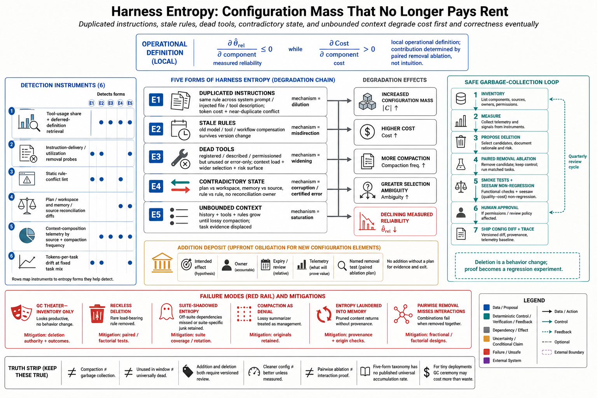

# Topic 12 — Harness Entropy: Duplicated Instructions, Stale Rules, Dead Tools, Contradictory State, and Unbounded Context

## 1. Problem and objective

Topic 11 established that the harness is capability; this topic establishes that the harness *decays*. Every incident adds an instruction, every integration adds a tool, every quarter adds rules — and almost nothing is ever removed, because removal requires proving a negative ("nothing depends on this") that nobody is paid to prove. The accumulated residue — duplicated instructions, stale rules, dead tools, contradictory state, unbounded context — is **harness entropy**: configuration mass that no longer pays rent, degrading cost always and correctness eventually. The objective is the five named forms with their mechanisms of harm, the detection instruments computable from the run record, and the garbage-collection discipline the sources support.

## 2. Intuition first

Entropy here is not a metaphor for "messy code." Each form does specific damage through a specific channel: duplicated instructions *dilute* (every token of context competes with every other for the policy's conditioning — Chapter 6); stale rules *misdirect* (the policy obeys guidance whose world is gone); dead tools *widen* (every visible tool is a branch in the selection problem — Chapter 2, Topic 5 §5); contradictory state *corrupts* (two sources of truth guarantee one is wrong); unbounded context *saturates* (until compaction lossily intervenes [CAL]). And unlike code rot, harness entropy has a second victim: it degrades the *model's* behavior, not just the maintainer's — the desk gets worse, and Topic 11's mechanisms run in reverse.

## 3. The five forms, with mechanisms and evidence anchors

**E-1 Duplicated instructions.** The same rule stated in system prompt, injected file, and tool description — trebling token cost and, worse, drifting into near-duplicates that disagree at the margins. Channel: context assembly (D2), the documented most-frequent edit target [HX §3.3] and therefore the fastest accumulator. The failure ledger's "excessive token cost" [CAH §3.5] is this form's direct signature.

**E-2 Stale rules.** Guidance written for a previous model, tool, or workflow, still conditioning behavior: the compensation asymmetry made concrete — harness rules encode fixes for a specific $M_c$'s weaknesses, and survive the model swap that obsoletes them (Ch. 1, Topic 4; [HB §4.3]'s model-dependent harness sensitivity is why the staleness *matters*). Recalled instructions that reference retired components are this form's memory-system cousin (the recall-verification rule of Chapter 7).

**E-3 Dead tools.** Registered, described, permissioned — and never selected, or selected only in error. Cost: context load per request (every definition ships unless deferred [OAT; CAL]) plus selection-problem widening plus *pure risk surface* (an enabled capability nobody watches — Chapter 1, Topic 5 §9.3's unused-capability rule). The benchmark protocol's "minimal required set enabled" [HB Table 1] is the anti-form stated as method.

**E-4 Contradictory state.** Two representations of one fact — plan file vs. actual progress, memory vs. workspace, rule vs. rule — with no reconciliation owner. The certified-error hazard (Ch. 1, Topic 8 §7): downstream consumers trust whichever copy they read. HarnessX names the systemic version *catastrophic forgetting through shared components*: "an edit repairing pattern A regresses pattern B" via "shared context, tools, memory, or control" [HX §4.2] — coupling through shared state is how one team's fix becomes another path's contradiction.

**E-5 Unbounded context.** History, injected files, tool definitions, and accumulated rules growing until the window's limit forces lossy compaction [CAL] — at which point *which* content survives is decided by a summarizer, not a policy. Entropy's endgame: the forms above don't just cost tokens; they spend the budget that would have carried task-relevant evidence, then compaction discards unpredictably among them.

## 4. Formalization sketch

Let $|\mathcal C|$ denote configuration mass (instruction tokens, rule count, tool count, injected-file bytes) and $\widehat\theta_{\mathrm{rel}}(c)$ the measured reliability (Ch. 1, Topic 12 §5). Entropy is the accumulating component of $\mathcal C$ for which

$$
\frac{\partial\,\widehat\theta_{\mathrm{rel}}}{\partial\,(\text{component})}\le 0
\quad\text{while}\quad
\frac{\partial\,\mathsf{Cost}}{\partial\,(\text{component})}>0,
$$

i.e., mass with non-positive reliability contribution and positive cost. **[derived — definition ours]** The definition is operational, not rhetorical: each component's contribution is measurable by removal ablation under Topic 14's paired methodology, and the seesaw constraint [HX §4.3] is the gate that makes removal safe — a deletion ships only if no previously passing task regresses. Entropy is thus *defined by the ablation that would remove it*, which is also why it accumulates wherever ablation is never run.

## 5. Detection instruments

All computable from the observable record $\hat\tau$ and configuration diffs **[synthesis — instrument list ours; substrate sourced]**:

1. **Tool-usage share** per registered tool over a trailing window: dead tools are the zero rows (E-3). The deferred-loading machinery [OAT; CAL] additionally logs which definitions were ever *retrieved*.
2. **Instruction-utilization probes:** removal ablations on instruction blocks (Topic 14); blocks whose removal moves nothing are E-1/E-2 candidates — Chapter 2, Topic 13 §6.3's delivery-vs-influence distinction applies (first verify the block even reaches $C_t$ post-compaction).
3. **Rule-conflict lint:** static contradiction checks across prompt, injected files, and tool descriptions (E-1's drift, E-4's rule/rule case) — cheap, deterministic, run per config change.
4. **State-reconciliation probes:** scheduled diffs between paired representations (plan vs. workspace, memory vs. source) — E-4's instrument, already required by the plan-consistency obligation (Ch. 2, Topic 3 §5).
5. **Context-composition telemetry:** per-request breakdown of $C_t$ by source class (instructions / history / tools / retrieval); E-5 shows as instruction-share creep and rising compaction frequency [CAL's compact_boundary events are the free signal].
6. **Token-per-task drift** at fixed task mix: the aggregate symptom (E-1+E-3+E-5), trending against [HB Table 2]-style efficiency baselines.

## 6. The garbage-collection discipline

The sources assemble into a maintenance loop **[synthesis]**: **inventory** (the 𝓒 enumeration of Topic 1 §9.2 — you cannot collect what you cannot list) → **measure** (§5's instruments) → **propose deletions** (each zero-contribution component) → **gate** (paired ablation + seesaw regression check + smoke tests [HX §4.3]; human approval where the deletion touches permission boundaries or review policy [CAH §3.5.3]) → **ship and log** (config diff into the trace store). This is the Evolution-Agent pipeline [CAH §3.5.2] run in reverse gear — the same observe→diagnose→propose→evaluate→promote stages, promoting *removals* — and the same governance applies, because a deletion is a behavior change with blast radius. Cadence matters more than heroics: entropy accumulates continuously, and an annual cleanup faces a proof-of-negative backlog no one will clear; a per-quarter gate on a small candidate list ships.

## 7. Failure modes of entropy management itself

- **GC theater:** inventories made, nothing deleted — the proof-of-negative paralysis; the gate exists precisely to convert "prove nothing breaks" into "run the suite" [HX §4.3].
- **Reckless deletion:** removals without paired ablation or regression gating — load-bearing "dead" rules exist (the rule that fires once a quarter on the expensive case), and the seesaw check is what finds them.
- **Suite-shadowed entropy:** components that matter only off-suite survive ablation and get deleted, or junk that helps only on-suite survives GC — the regression suite's coverage is the gate's blind spot (Topic 7 §6's suite-decay warning; Topic 14's suite hygiene).
- **Compaction as denial:** relying on automatic summarization to "handle" E-5 — compaction is lossy triage under pressure [CAL], not context management; by the time it fires routinely, the budget was already misallocated.
- **Entropy laundering into memory:** pruned context resurrected via memory stores without provenance — the contradiction (E-4) moves to a new address (Chapter 7's contamination discipline).

## 8. Limitations

- The five forms are this book's organization; the sources supply the failure clusters [CAH §3.5], the coupling pathology [HX §4.2], and the mechanisms, but no source measures entropy accumulation rates or GC yields — §4's definition is the instrument a team would use to produce those numbers locally.
- Removal ablations price components *individually*; interaction effects (two half-redundant instructions covering each other) need factorial designs that quickly exceed practical budgets — Topic 14 §6's fractional designs are the compromise.
- The economics assume measurement is cheaper than waste; for tiny deployments the GC machinery can cost more than the entropy — the minimal-agent principle applies to maintenance ceremony too.

## 9. Production implications

1. **Stand up the six instruments (§5)** on the existing run record — most are queries, not systems — and review them on a fixed cadence with deletion authority in the room.
2. **Adopt config-diff discipline:** every 𝓒 change (addition *or* deletion) versioned, gated by the paired-ablation + seesaw check where feasible, human-approved where privileged [HX §4.3; CAH §3.5.3].
3. **Make addition pay a deposit:** every new rule, tool, or injected block ships with its intended effect stated and its removal test named — the component that cannot say what it does cannot later prove it should stay.
4. **Treat compaction frequency as an alarm**, not a feature working as intended (§7.4).
5. **Report configuration mass alongside reliability** in quarterly reviews: $|\mathcal C|$ up with $\widehat\theta_{\mathrm{rel}}$ flat is the entropy signature (§4), visible one quarter before it becomes an incident.

## 10. Connections

- This topic is Topic 11's inverse (the harness term degrading) and Topic 7's maintenance problem (gates need upkeep); Topic 14 supplies the ablation machinery §4's definition presumes.
- Chapter 6 owns E-5's content strategy; Chapter 7 owns memory-side entropy; Chapter 15's harness garbage collection is §6 institutionalized as lifecycle.

## Sources

[CAH] Code as Agent Harness, arXiv:2605.18747 (`Knowledge_source/2605.18747v1.pdf`) §3.5, §3.5.1–3.5.3
[HX] HarnessX, arXiv:2606.14249 (`Knowledge_source/2606.14249v2.pdf`) §3.3, §4.2–4.3
[CAL] Claude Agent SDK, "How the agent loop works" (context accumulation, compaction, compact_boundary) — https://code.claude.com/docs/en/agent-sdk/agent-loop
[HB] Harness-Bench, arXiv:2605.27922 (`Knowledge_source/2605.27922v1.pdf`) §4.3, Tables 1–2
[OAT] OpenAI, Tools guide (tool search / deferred loading) — https://developers.openai.com/api/docs/guides/tools
