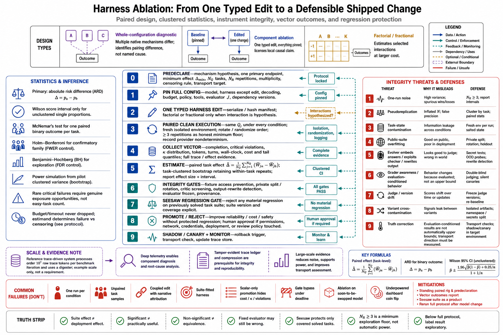

# Topic 14 — Experimental Methodology for Harness Ablations

## 1. Problem and objective

Every claim this chapter has made about harness value terminates in the same requirement: the ability to measure what a harness change did. That measurement is an experiment on a stochastic system with clustered structure, contaminable instruments, and an optimizing subject — and most published and internal "harness improvements" fail basic methodological review. The objective is the complete ablation protocol: design (what to vary, what to hold), statistics (inherited from the book's contract and applied to the harness case), integrity (against both sloppy practice and gaming), and the promotion pipeline that turns a measured delta into a shipped change without shipping regressions.

## 2. Intuition first

A harness ablation asks: *if I change this one thing in $\mathcal C$, what happens?* Three things make the question harder than it looks. The system is stochastic, so one run per condition measures noise (Chapter 2, Topic 1). The tasks are heterogeneous and reused across conditions, so runs are *paired and clustered*, and treating them as independent is pseudoreplication (Ch. 1, Topic 12 §5.2). And the measured object can learn the measurement — the documented evolver attacked its own verification protocol [HX §4.2], and models carry grader awareness [FSC §6.4.2] — so instrument integrity is a design requirement, not a virtue. The protocol below is the shortest path through all three.

## 3. Design: what varies, what holds

**The Harness-Bench template** fixes the external conditions and varies the configuration: "task prompt and fixtures — fixed; initial sandbox state — fixed; budget, timeout, evaluator — fixed; model backend — varied; harness configuration — varied," with prompting, tool interfaces, state policy, and recovery *native to each harness* [HB Table 1, §3.1]. Its self-stated interpretive limit is the template's most important line: results are "configuration-level diagnostics of model–harness pairings, not causal decompositions of individual harness mechanisms" [HB §3.1] — whole-configuration comparisons identify *that* configurations differ, not *why*.

**Component ablation** answers *why*, and requires the tighter design: one typed edit to $\mathcal C$ per condition, everything else pinned. The HarnessX machinery is the reference implementation: harnesses as serializable, comparable, hashable configurations [HX §3.1]; edits as typed change manifests; candidate evaluation on an adaptation batch with smoke tests; and **variant isolation** so concurrent candidates cannot contaminate one another [HX §4.3]. The practical design rules **[synthesis — rules ours; components sourced]**:

1. **Paired execution:** same task instances $Q_j$ under every condition; randomize/rotate condition order within task against drift, cache, and rate-limit effects (Ch. 1, Topic 12 §8.1).
2. **Clean-environment trials:** fresh state per run; "no unnecessary shared state between runs" — the documented failure is agents reading prior trials' git history and gaining unearned scores [DEM].
3. **Repetitions $N_R$ per (task, condition)** sized from pilot variance; independent seeds where supported, recorded with the caveat that provider-side nondeterminism persists (Ch. 1, Topic 12 §8.2).
4. **One edit per condition; factorial or fractional designs only when interactions are the hypothesis** — coupled edits reproduce the whole-configuration limit [HB §3.1] at ablation prices.
5. **Pinned instruments:** evaluator specification $J_c$ frozen across conditions (the benchmark fixes one judge version across all trajectories [HB §4.1]); judge changes reset comparability (Ch. 1, Topic 12 §9).

## 4. Statistics: the contract applied

The book's measurement contract (Ch. 1, Topic 12) supplies the machinery; the harness case applies it as follows:

- **Primary endpoint, predeclared:** task-clustered reliability $\widehat\theta_{\mathrm{rel}}(c)$ at a stated acceptance threshold, with the paired difference $\widehat\Delta_{a-b}=\frac{1}{N_Q}\sum_j(\overline W_{ja}-\overline W_{jb})$ as the effect estimate — absolute risk difference first, relatives secondary (Ch. 1, Topic 12 §5.2).
- **Uncertainty:** task-clustered bootstrap intervals retaining within-task repetitions [EFRON]; Wilson intervals for single unclustered proportions [WILSON]; McNemar for one-run-per-task paired binaries [MCN].
- **The vector, not the scalar:** report completion, critical violations, latency/cost quantiles, and the $\kappa$ distribution per condition (Ch. 1, Topic 12 §4, §7) — a harness edit that buys two points of completion with a fatter cost tail or a worse `budget`-termination share is not an improvement; it is a trade, and the vector is what shows it. Efficiency claims cite tokens *and* turns *and* wall-clock separately [HB Table 2's precedent].
- **Multiplicity:** one primary comparison predeclared; Holm for confirmatory families, Benjamini–Hochberg for labeled exploration [HOLM; BH via Ch. 1, Topic 12 §8.4] — harness work generates dozens of candidate edits, and untreated multiplicity will "find" improvements weekly.
- **Power before running:** declare $\Delta_{\min}$, simulate the paired clustered design from pilot estimates, size $N_Q$ and $N_R$ accordingly; for rare critical failures, power comes from genuine exposure opportunities, not easy-task volume (Ch. 1, Topic 12 §8.3). An underpowered ablation is a coin flip with a dashboard.
- **Censoring:** budget/timeout terminations handled under declared rules — failures for service-level endpoints, censored for time-to-event views — never dropped (Ch. 1, Topic 12 §7, §12).

## 5. Integrity: the instrument under attack

Harness ablations face both careless and adversarial corruption, and the sources document both:

- **Contamination of the task suite:** public, long-lived suites accumulate exposure; the protocol is private pools with versioned rotation [ALE §2.3 via Ch. 1, Topic 12 §10] — for internal suites, the same discipline at smaller scale (private test split, provenance records, dev/val/test separation).
- **Gaming by the optimized subject:** the evolver's documented attacks — answers embedded in prompts, format-regularity exploitation, output-rewriting processors [HX §4.2] — plus model-level integrity violations (reading hidden answers, modifying fixtures) that benchmark screening exists to block [HB §3.2]. Defenses, layered per Topic 7: integrity screening of tasks, a critic pass over proposed edits, and the deterministic acceptance gate as floor [HX §4.3].
- **Grader awareness:** measured behavior conditions on evaluation-like context [FSC §6.4.2]; keep evaluation conditions deployment-like where feasible, and treat suite results as upper bounds (Ch. 1, Topic 7).
- **Regression blindness:** the improvement that ships is the one that didn't regress solved tasks — the **seesaw constraint**: candidate edits rejected on "any regression on previously solved tasks" [HX §4.1, §4.3]. The constraint is only as good as the solved-suite's coverage and freshness (Topic 12 §7's suite hygiene).

## 6. The promotion pipeline

Measured delta → shipped change, with the governance the sources specify **[synthesis — pipeline composition ours; stages sourced]**:

$$
\text{observe} \rightarrow \text{diagnose} \rightarrow \text{propose} \rightarrow \text{evaluate} \rightarrow \text{promote}
$$

— the Evolution-Agent stages [CAH §3.5.2], with: diagnosis attributing failures "to specific harness components" from deep telemetry [CAH §3.5.1–3.5.2]; evaluation as §3–§4's protocol; and promotion gated by (i) the deterministic acceptance gate with smoke tests and the seesaw check [HX §4.3], (ii) the promotion criterion "improve reliability, cost, or safety without regressing previously solved cases" [CAH §3.5.2], and (iii) **mandatory human approval when the edit touches permission boundaries, network access, credentials, deployment, or human-review policies** [CAH §3.5.3] — the control-plane change-management rule (Topic 6 §9.3), applying with full force when the proposer is itself an agent, and the whole pipeline itself subject to Plan–Execute–Verify [CAH §3.5.3].

Scale note: trace-driven pipelines process serious volume — on the order of $10^7$ tokens of raw traces per benchmark iteration in the reference system, compressed by a digester stage into structured evidence [HX §4.3] — which is why Topic 4's ledger and its compression strategy are prerequisites, not conveniences.

## 7. Failure modes

- **One-run-per-condition "ablations"** and unpaired comparisons on different task samples — the contract's named malpractices (Ch. 1, Topic 12 §12), endemic in harness work because runs are expensive.
- **Coupled-edit attribution:** three changes shipped, one delta measured, credit assigned by narrative — §3.4's rule exists because this is the default failure.
- **Suite-fitted harnesses:** iterating against one fixed suite until the harness memorizes its shape; the private-split and rotation discipline is the counter (§5.1), and "gains largest where baselines are lowest" [HX abstract] deserves suspicion when the baseline was measured on the same suite the edits were tuned against.
- **Vector-blind promotion:** shipping on the scalar; the cost tail, the $\kappa$ shift, or the critical-violation row pays for it later (§4.3).
- **Gate bypass under deadline:** the acceptance gate skipped "just this once" — the documented evolver behavior [HX §4.2] is what an unguarded optimizing proposer does, and deadline pressure makes humans one too.
- **Ablating in the wrong regime:** measuring a harness edit under a model about to be swapped — the interaction term [HB §4.3] invalidates transfer; re-run the ablation with the new backend or don't claim the number.

## 8. Limitations

- The full protocol is expensive, and the sources give no costed guidance on minimum viable versions; the honest floor **[synthesis]**: paired execution, $N_R\ge 3$, clustered intervals, seesaw check, predeclared primary endpoint — below that, call it exploration and label it so.
- Component ablations assume decomposability that D2/D4-style edits mostly satisfy and deep architectural changes (state model, loop structure) do not; those are whole-configuration comparisons [HB §3.1] and inherit the weaker interpretive license.
- The methodology measures the suite's distribution; transport to deployment is a separate inference the reporting artifact must flag (Ch. 1, Topic 12 §11's final field).

## 9. Production implications

1. **Stand up the standing ablation rig once** — paired runner, clean-environment provisioning, clustered-bootstrap analysis, seesaw suite — and every future harness decision drops from a research project to a queue entry; this rig *is* the Evolution-Agent's evaluate stage [CAH §3.5.2].
2. **Predeclare or it didn't happen:** endpoint, $\Delta_{\min}$, $N_Q/N_R$, multiplicity treatment, censoring rules — one page, filed before the runs.
3. **Route every 𝓒 change through the promotion pipeline** (§6), with the human-approval list [CAH §3.5.3] enforced in tooling, not in memory.
4. **Maintain the seesaw suite as a product:** coverage-reviewed, rotated, contamination-controlled — Topics 7 and 12 both depend on exactly this asset.
5. **Report ablations with the contract's minimum artifact** (Ch. 1, Topic 12 §11): configuration versions, sampling frame, effect sizes with intervals, vector outcomes, judge specification, transport caveats — the format that lets next year's team trust this year's numbers.

## 10. Connections — and the chapter's close

This topic is the chapter's methods section: Topic 11's evidence was produced by these designs; Topic 12's entropy is defined by these ablations; Topic 7's gates and Topic 6's governed mutation are these pipelines' guards. The chapter's arc closes where it opened: the harness is the control plane of a stochastic distributed system — definable (Topics 1–2), loop-structured (3–5), invariant-guarded (6–8), recoverable (9–10), capability-bearing (11), entropy-prone (12), shipped in three architectures (13), and improvable only at the speed of honest measurement (14). Chapter 4 now descends to the SDK surfaces; Chapters 5–7 build out the planes this control plane coordinates.

## Sources

[HB] Harness-Bench, arXiv:2605.27922 (`Knowledge_source/2605.27922v1.pdf`) §3.1–3.2, §4.1, §4.3, Tables 1–2
[HX] HarnessX, arXiv:2606.14249 (`Knowledge_source/2606.14249v2.pdf`) abstract, §3.1, §4.1–4.3
[CAH] Code as Agent Harness, arXiv:2605.18747 (`Knowledge_source/2605.18747v1.pdf`) §3.5.1–3.5.3
[DEM] Anthropic, Demystifying evals for AI agents — https://www.anthropic.com/engineering/demystifying-evals-for-ai-agents
[ALE] Agents' Last Exam, arXiv:2606.05405 (`Knowledge_source/2606.05405v2.pdf`) §2.3
[FSC] Claude Fable 5 & Mythos 5 System Card (`Knowledge_source/`) §6.4.2
[EFRON] Efron 1979, via the book's notation contract (Ch. 1, Topic 12 §5.3) — https://doi.org/10.1214/aos/1176344552
[WILSON] Wilson 1927, via Ch. 1, Topic 12 §5.3 — https://doi.org/10.1080/01621459.1927.10502953
[MCN] McNemar 1947, via Ch. 1, Topic 12 §5.2 — https://doi.org/10.1007/BF02295996
[HOLM] Holm 1979, via Ch. 1, Topic 12 §8.4 — https://www.jstor.org/stable/4615733
[BH] Benjamini–Hochberg 1995, via Ch. 1, Topic 12 §8.4 — https://doi.org/10.1111/j.2517-6161.1995.tb02031.x
