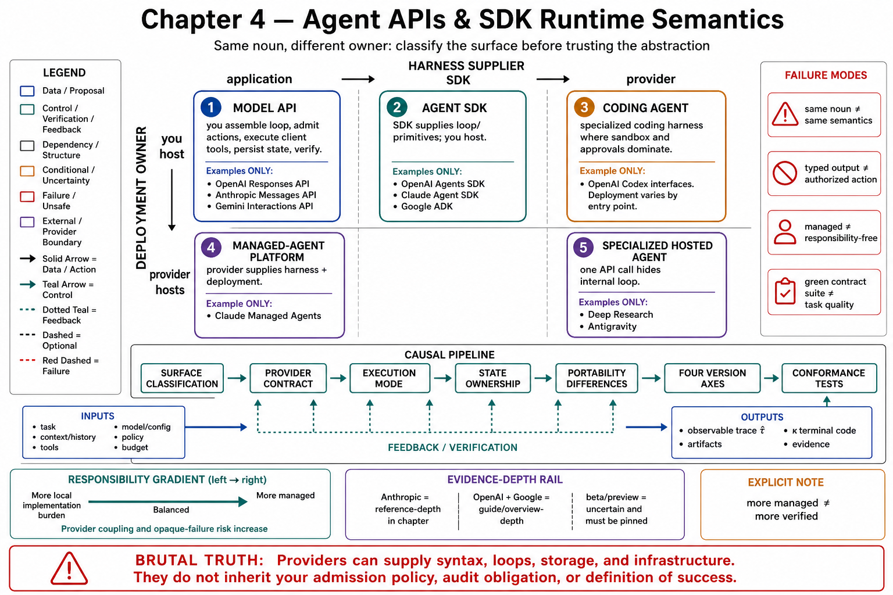

# Chapter 4 — Agent APIs and SDK Runtime Semantics



## Scope, Prerequisites, Terminology, Boundaries, Exclusions, and Expected Outcomes

---

## 1. Why this chapter opens with a disambiguation

The industry now ships at least five *different kinds of thing* under the word "agent API," and conflating them is the most common architecture error in procurement documents. Anthropic's own developer reference draws the load-bearing distinction as two independent questions: **who supplies the harness** (the agent loop + context management) and **who supplies the deployment** (the infrastructure the agent runs on) — noting that its Tool Runner and the Claude Agent SDK "both supply a *harness only* — you still host and deploy them yourself — which is why they're easy to conflate," while Managed Agents "is the only option that supplies both the harness and managed deployment; the manual loop supplies neither" [ANT-API]. OpenAI's documentation draws the same axis between the Responses API ("you want direct control over model interactions, output items, tools, state, and orchestration") and the Agents SDK ("the SDK provides the agent loop and lifecycle") [OAG]. Google's Interactions API unifies model calls and "specialized agents directly" behind one endpoint [GIA].

Chapter 3 built the control plane abstractly; this chapter documents the concrete interfaces on which such control planes are built — as *interfaces*, with exact semantics, state ownership, execution modes, versioning discipline, and the portability traps hiding behind superficially similar vocabulary.

## 2. Chapter scope

The unit of analysis is the **provider-facing API and SDK surface**: endpoint semantics, object models, runtime primitives, and their cross-provider comparison. Distinctions among surface types (Topic 1); the OpenAI stack (Topics 2–4: Responses API, Agents SDK, Codex interfaces); the Anthropic stack (Topics 5–7: Messages API, Claude Agent SDK, Managed Agents); the Google stack (Topics 8–9: ADK, Gemini Interactions); cross-cutting execution modes (Topic 10); state ownership (Topic 11); portability limits (Topic 12); version discipline (Topic 13); and conformance testing (Topic 14).

## 3. Prerequisites

Chapters 1–3 in full — especially the typed harness stages and $\kappa_t$ (Ch. 1, Topic 12 §3.3), the configuration tuple $c=(M_c,H_c,D_c,\nu_c,B_c,P_c,\mathcal U_c,J_c)$, the canonical loop (Ch. 3, Topic 3), and the state architectures (Ch. 3, Topic 4). Working Python literacy is assumed; Topic 14 sketches reference implementations.

## 4. Terminology fixed for this chapter

| Term | Definition adopted | Source |
|---|---|---|
| **Model API** | Stateless request/response endpoint over the model: `POST /v1/messages`; Responses API's core; `generateContent`/Interactions | [ANT-API; OAG; GIA] |
| **Agent SDK** | Client library supplying the loop + lifecycle over a model API; you host | [OAG; ANT-API; OAP; CAL] |
| **Coding agent** | A shipped, opinionated agent product with built-in tools and workspace semantics (Claude Code, Codex) | [ANT-API; CDX] |
| **Managed-agent platform** | Provider runs the loop *and* hosts execution: persisted agent configs, sessions, server-side sandboxes | [ANT-API]; ADK's "Managed Agents" [ADK-A] |
| **Harness vs. deployment** | The two independent supply questions that classify every surface | [ANT-API] |
| **Content block** | Typed element of a message (`text`, `tool_use`, `tool_result`, `thinking`, …) | [ANT-API] |
| **Response/tool item** | The Responses API's typed output elements | [OAG] |
| **Event (managed-agent sense)** | Atomic typed record on a session stream (`agent.message`, `session.status_idle`, …) | [ANT-API]; ADK Event [ADK] |
| **Interaction** | Gemini's session record: "a chronological sequence of execution steps" | [GIA] |

## 5. System boundary

Inside: the documented request/response semantics, object models, state and execution modes, and version surfaces of the three ecosystems' agent interfaces. Outside: harness design principles (Chapter 3), tool engineering (Chapter 5), context strategy (Chapter 6), orchestration patterns (Chapter 8), and pricing/capacity operations (Chapter 14). Provider claims are reported as documentation evidence, not as independently benchmarked fact — this chapter's epistemic register is *interface specification*, and its reliability claims are bounded accordingly.

## 6. Exclusions

- No API-key setup, quickstarts, or tutorial material.
- No exhaustive parameter reference — semantics that carry architectural weight only.
- No multi-agent orchestration patterns (Chapter 8) beyond noting where primitives exist (handoffs, subagents, multiagent rosters).

## 7. Measurable outcomes for the reader

1. Classify any vendor offering on the harness/deployment axes (Topic 1) and name what you still own.
2. State each ecosystem's loop, state, and termination semantics precisely enough to map them onto the typed stages and $\kappa_t$ (Topics 2–9).
3. Choose an execution mode (sync/stream/background/webhook) from latency and recovery requirements (Topic 10) and a state owner deliberately (Topic 11).
4. Enumerate the portability traps of Topic 12 for any planned migration, and cost them.
5. Operate the version-pinning and migration-test discipline of Topic 13, and build the conformance suite of Topic 14.

## 8. Source ledger for this chapter

All previous tags remain in force. New:

| Tag | Source | Provenance |
|---|---|---|
| [ANT-API] | Anthropic Claude API & Managed Agents reference documentation | platform.claude.com docs, consumed via the bundled claude-api reference (cache date 2026-06); includes Messages API, tool-use concepts, streaming, Managed Agents (`managed-agents-2026-04-01` beta), model catalog, migration guide |
| [OAG] | OpenAI agents guide (Responses API + Agents SDK positioning) | https://developers.openai.com/api/docs/guides/agents |
| [OAP] | OpenAI Agents SDK for Python | https://github.com/openai/openai-agents-python |
| [ADK-A] | Google ADK agents documentation (agent classes, services, callbacks, plugins) | https://adk.dev/agents/ |
| [GIA] | Gemini Interactions API documentation | https://ai.google.dev/gemini-api/docs/interactions |

**Evidence-depth note, stated plainly:** the Anthropic surface is documented here at reference depth [ANT-API; CAL]; the OpenAI and Google surfaces at guide/overview depth ([OAG], [OAP], [ADK-A], [GIA] are summaries of larger documentation sets). Topics 2–4 and 8–9 are correspondingly narrower than Topics 5–7, and say so inline. Several surfaces are explicitly beta (Managed Agents `managed-agents-2026-04-01`; Anthropic's Tool Runner; various dated beta headers) — Topic 13 treats beta status as version-discipline input, not decoration.

**Notation and statistics contract:** Chapter 1, Topic 12 binds this chapter; interface behaviors are mapped onto the typed stages ($\operatorname{Assemble}$, proposal $Y_t$, $\Xi_t$, $\widetilde A_t$, $A_t$) and terminal statuses $\kappa_t$ throughout, and syntheses are flagged **[synthesis]**.

## 9. Chapter map

```
00 scope (this file)
01 the five surface types                      ── the disambiguation
02 OpenAI Responses API      ──┐
03 OpenAI Agents SDK           ├─ ecosystem: OpenAI
04 Codex interfaces          ──┘
05 Anthropic Messages API    ──┐
06 Claude Agent SDK            ├─ ecosystem: Anthropic
07 Claude Managed Agents     ──┘
08 Google ADK                ──┐
09 Gemini Interactions API   ──┘ ecosystem: Google
10 execution modes             ──┐
11 state ownership               ├─ cross-cutting semantics
12 portability limits            │
13 version discipline          ──┘
14 reference implementations & conformance tests
```

Chapter 5 descends into the tool contracts these interfaces carry; Chapter 8 composes their orchestration primitives into patterns.
