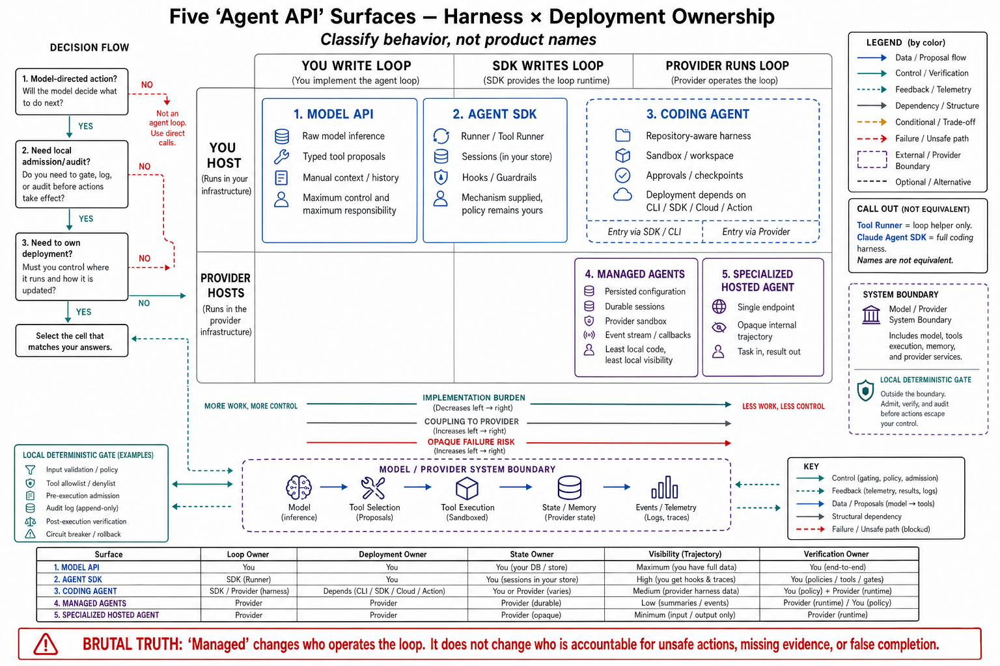

# Topic 1 — API Endpoint, Model API, Agent SDK, Coding Agent, and Managed-Agent Platform Distinctions

## 1. Problem and objective

The word "agent API" names five different products with different ownership boundaries, different failure surfaces, and different bills. Choosing among them without a classification is how teams end up hosting a loop they meant to outsource, or outsourcing a loop they needed to control. The objective is a two-axis classification — taken directly from Anthropic's own developer reference, which draws it explicitly — that sorts any offering, tells you exactly what you still own, and connects each cell to the Chapter 3 control-plane responsibilities you must therefore implement yourself.

## 2. Intuition first

Two questions classify everything: **who runs the loop?** and **who runs the compute the loop acts on?** A raw model endpoint answers "you" and "you" — you write the `while stop_reason == "tool_use"` loop and host every tool. A managed-agent platform answers "the provider" and "the provider" — you send config and consume events. The two SDKs sit in the confusing middle: they run the loop *for* you but still deploy *on* you. Anthropic's reference names this trap directly — the Tool Runner and the Claude Agent SDK "both supply a *harness only* — you still host and deploy them yourself — which is why they're easy to conflate" [ANT-API]. Get the two axes right and the rest of this chapter is filling in cells.

## 3. The two axes, sourced

Anthropic's reference states the axes verbatim: "Two independent questions separate them: **who supplies the harness** (the agent loop + context management) and **who supplies the deployment** (the infra the agent runs on)" — and gives the four-way table [ANT-API]:

| # | Approach | You write | Harness & deployment |
|---|---|---|---|
| 1 | **Manual loop** (Model API + tool use) | The `while stop_reason == "tool_use"` loop yourself | You build the harness; you host |
| 2 | **Tool Runner** (SDK helper over the Model API) | Just the tool functions | SDK supplies the loop (**harness only**); you host |
| 3 | **Managed Agents** | Agent config + your tool results | Provider supplies harness **and** hosts a per-session sandbox |
| 4 | **Claude Agent SDK** (separate product) | A prompt + options | SDK supplies the Claude Code harness + built-in tools (**harness only**); you host |

The reference's summary is the mental model to carry: "options 1, 2, and 4 all **leave deployment to you**; only option 3 (CMA) adds managed deployment" [ANT-API]. OpenAI draws the same harness axis: the Responses API is for when "you want direct control over model interactions, output items, tools, state, and orchestration"; the Agents SDK is where "the SDK provides the agent loop and lifecycle" [OAG].

## 4. The five surface types (the book's partition)

Extending the axes to the README's five named types **[synthesis — the fifth type, coding agent, is a deployment-and-opinionation distinction the sources support but the two-axis table doesn't name separately]**:

| Surface | Harness | Deployment | Tools | Canonical examples |
|---|---|---|---|---|
| **API endpoint / Model API** | You | You | Only yours | `POST /v1/messages` [ANT-API]; Responses API [OAG]; Interactions [GIA] |
| **Agent SDK** | SDK (harness only) | You | Yours (+ built-ins for coding SDKs) | OpenAI Agents SDK [OAP]; Claude Agent SDK [CAL]; ADK [ADK-A] |
| **Coding agent** | Opinionated harness, shipped | You (CLI/CI) or provider (cloud) | Rich built-ins + workspace | Claude Code, Codex [CDX] |
| **Managed-agent platform** | Provider | Provider (per-session sandbox) | Provider sandbox + MCP + your custom tools | Claude Managed Agents [ANT-API]; ADK "Managed Agents" [ADK-A] |
| **Specialized hosted agent** | Provider | Provider | Provider's | Gemini `deep-research-preview`, `antigravity-preview` callable via Interactions [GIA] |

The coding-agent row is the one the two-axis table compresses: a coding agent is an Agent SDK (or managed platform) *with an opinionated built-in toolset and workspace model already chosen*. Claude Code and Codex can run harness-only on your infra (CLI) or as managed cloud tasks — the same product spanning two deployment cells, which is exactly why "is Codex an SDK or a managed platform?" has no single answer (Chapter 3, Topic 13's Codex evidence gap).

## 5. What each cell leaves you owning — mapped to Chapter 3

The classification's payoff is that it tells you which Chapter 3 control-plane responsibilities remain yours **[synthesis — mapping ours; cells sourced above]**:

| Surface | You still own (Chapter 3 refs) |
|---|---|
| Model API | The entire canonical loop (T3), all invariants (T7), termination and budgets (T8), lifecycle ops (T9), the exception taxonomy (T10), telemetry (T4) — *everything* π_H |
| Agent SDK | Tool implementations, permission policy, budgets, custom termination beyond the SDK default, telemetry beyond what the SDK emits; the SDK owns loop mechanics and message assembly |
| Coding agent | Configuration ($\mathcal C$: rules files, permissions, hooks), the sandbox boundary (unless cloud), verification and stop discipline (the shipped defaults rarely include verify — Ch. 3 T3 §4) |
| Managed platform | Agent config, custom-tool results, credential vaulting, event-stream handling and reconnect; the provider owns loop, sandbox, and state |
| Specialized hosted | Prompt and result consumption only; near-total loss of control-plane visibility (Ch. 2 T9's hosted-execution trade at its extreme) |

Reading down the "you still own" column *is* the cost of each convenience: the managed platform is the least code and the least control-plane visibility; the model API is the most code and total visibility. The minimal-agent principle (Ch. 1, Topic 10) applies to *this* choice too — buy the most managed surface whose lost visibility your consequence class can tolerate, and no more managed than that.

## 6. The decision procedure

**[synthesis — procedure ours; anchored in the sourced axes and Ch. 1 Topic 10]**

1. **Does the task need model-directed action at all?** No → this chapter is moot; a single model call or workflow suffices (Ch. 1, Topics 9–10; the vendor's own "start simple" default [ANT-API]).
2. **Must you gate, audit, or verify effectful actions in your own environment?** Yes → you need client-side execution (Ch. 2, Topic 9); eliminate the specialized-hosted and (for the sensitive tools) the managed-sandbox cells.
3. **Do you want to write the loop?** No and the built-in toolset fits → Agent SDK or coding agent. No and you want the provider to host too → managed platform. Yes → model API + manual loop or Tool Runner.
4. **Re-classify per component.** Real systems mix cells: a managed platform for the workspace-heavy step, a model-API call for the latency-critical classification, a coding agent for the repo work. Classify each, own each cell's residual responsibilities.

## 7. Failure modes of misclassification

- **Outsourcing a loop you needed to control:** adopting a managed platform for actions requiring bespoke pre-execution gating, then discovering the gate lives on the provider's side (Ch. 3, Topic 6's CP-1 enforcement point moved out of reach).
- **Hosting a loop you meant to outsource:** hand-writing a manual loop where the Tool Runner's per-turn hooks (approval, interception, retries [ANT-API]) already covered every "I need control" need — the reference explicitly warns "'I need control' is rarely a reason to drop to the manual loop."
- **Conflating the two SDKs:** the reference's flagged trap — Tool Runner (loop over *your* tools, no built-ins) vs. Claude Agent SDK (full Claude Code harness with built-ins) are different packages [ANT-API]; substituting one for the other is a category error.
- **Coding-agent deployment ambiguity:** assuming "Codex" means one deployment cell; it spans CLI (you host) and cloud task (provider hosts) with different control surfaces (Ch. 3, Topic 13).
- **Specialized-hosted overtrust:** routing consequential work to a `deep-research`-style hosted agent [GIA] and inheriting zero control-plane visibility for a high-consequence class.

## 8. Limitations

- The five-type partition is this book's synthesis over the sources' two-axis table plus the README's vocabulary; the sources themselves draw four cells (Anthropic) or two (OpenAI's Responses/SDK split), and the coding-agent and specialized-hosted rows are our extensions with sourced anchors.
- Provider taxonomies drift and overlap (ADK's "Managed Agents" is a different product from Anthropic's identically-named surface [ADK-A vs ANT-API]); the classification is by *behavior* on the two axes, not by product name.
- Evidence depth is uneven (§8 of the scope file); the OpenAI and Google cells are documented here at overview depth.

## 9. Production implications

1. **Classify before procuring.** Run §6 on any candidate; write down its two-axis cell and its "you still own" column (§5). Procurement documents that skip this buy convenience they can't use or control they've already outsourced.
2. **Report the surface with every reliability number.** A benchmark on a managed platform and one on a manual loop measure different-sized systems; the configuration tuple (Ch. 1, Topic 12) must record which surface produced it.
3. **Prefer the most-managed surface your consequence class tolerates** (Ch. 1, Topic 10), and re-check that tolerance when the class changes.
4. **Classify per component, not per product.** Mixed-surface fleets are normal; own each cell's residual control-plane responsibilities explicitly.

## 10. Connections

- This topic is the map for Topics 2–9 (each documents cells of §4's table) and the frame for Topic 11 (state ownership follows the deployment axis) and Topic 12 (portability breaks worst across surface types, not just across vendors).
- Chapter 3's entire control-plane inventory is what §5's "you still own" column indexes; Chapter 2, Topic 9's hosted-vs-client execution is the same axis at tool granularity.

## Sources

[ANT-API] Anthropic Claude API & Managed Agents reference (harness/deployment axes, four-approach table, Tool Runner vs Claude Agent SDK disambiguation) — platform.claude.com docs (cache 2026-06)
[OAG] OpenAI agents guide — https://developers.openai.com/api/docs/guides/agents
[OAP] OpenAI Agents SDK (Python) — https://github.com/openai/openai-agents-python
[ADK-A] Google ADK agents documentation — https://adk.dev/agents/
[GIA] Gemini Interactions API — https://ai.google.dev/gemini-api/docs/interactions
[CDX] OpenAI Codex documentation — https://learn.chatgpt.com/docs/sandboxing
[CAL] Claude Agent SDK, "How the agent loop works" — https://code.claude.com/docs/en/agent-sdk/agent-loop
