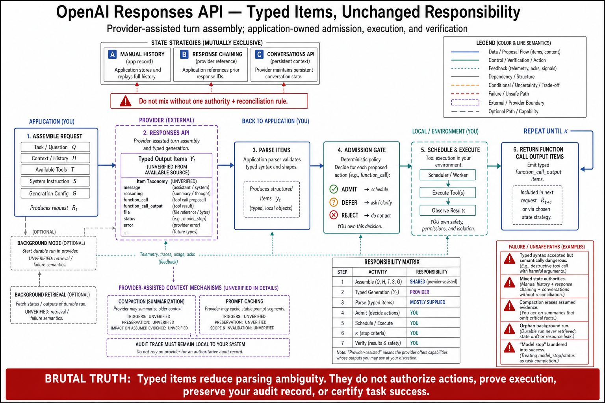

# Topic 2 — OpenAI Responses API: Response Items, Tool Items, Conversations, Background Execution, and Compaction

## 1. Problem and objective

The Responses API is OpenAI's model-API surface for agentic work — the cell of Topic 1's table where *you* own the harness. The objective is its architectural semantics: the item-based object model, the three state strategies it offers, background execution, and context management — plus an honest statement of where this book's evidence for it runs out.

**Evidence-depth note, stated first.** The accessible documentation for this surface is the agents guide [OAG], which is positioning-level: it names the primitives and the choice they present but does not, at the depth this book requires, specify item type schemas, conversation-object lifecycles, or compaction trigger semantics. This topic reports what the guide states and marks the rest as unverified rather than reconstructing it from training priors. Teams building on this surface should treat the OpenAI reference documentation as authoritative over this chapter.

## 2. Intuition first

The Responses API's design bet is that an agent's turn is not one blob of text but a *sequence of typed items* — reasoning, messages, tool calls, tool outputs — and that the API should hand you those items rather than a flat completion. That bet has a direct consequence for Chapter 1's notation: the API's output *is* the proposal $Y_t$ decomposed into typed elements, which is precisely what $\operatorname{Parse}_{H_c}$ would otherwise have to construct. The cost is that you still own admission, execution, and the loop.

## 3. What the guide specifies

**Object model.** The API's core abstraction is "model responses with structured **output items** and **tool items**" [OAG]. The tool-calling flow is the classic client-executed cycle: "Application receives function calls, executes them, returns output, and reinvokes the model" [OAG] — i.e., the harness owns $\operatorname{Admit}$ and $\operatorname{ScheduleExec}$, and the loop is yours to write (Topic 1's cell 1).

**State strategies — three, explicitly.** "Manual history tracking, response chaining, or the **Conversations API** for persistent context" [OAG]. Read against Chapter 3, Topic 4: manual history is the request–response architecture with you holding the ledger; chaining is provider-assisted continuity by reference; the Conversations API moves conversation state to the provider (Topic 11's state-ownership question, answered three different ways by the same API).

**Background mode.** "Asynchronous execution capability" [OAG] — the surface's long-running-task escape from HTTP timeout semantics. Topic 10 treats the mode class in full; its architectural significance here is that background execution implies provider-side durable state for the in-flight response, which folds into the state-ownership analysis.

**Context management.** "Compaction and prompt caching strategies" are named as the context-optimization mechanisms [OAG]. Compaction is the same lossy-summarization class Chapter 1, Topic 3 analyzed (belief-state corruption mechanism 3) and Chapter 3, Topic 4 called an in-band mutation of the record; prompt caching is the prefix-stability discipline Chapter 6 owns.

**Positioning.** The guide's own selection criterion: use the Responses API when "you want direct control over model interactions, output items, tools, state, and orchestration" [OAG]. That sentence is the Topic 1 classification stated by the vendor: harness = you.

## 4. Mapping onto the typed stages

**[synthesis — mapping ours; components sourced above]**

| Typed stage (Ch. 1, T12 §3.3) | Responses API locus |
|---|---|
| $\operatorname{Assemble}_{H_c}$ | Your request construction; or provider-held state via chaining / Conversations API [OAG] |
| $Y_t \sim \pi_{M_c}$ | The response's output items and tool items [OAG] |
| $\operatorname{Parse}_{H_c}$ → $\Xi_t$ | Largely *given* — items arrive typed; your parse is a projection, not an extraction |
| $\operatorname{Admit}$ → $\widetilde A_t$ | **Yours** — no provider-side permission layer on this surface |
| $\operatorname{ScheduleExec}$ → $A_t$ | **Yours** — "application receives function calls, executes them" [OAG] |
| $\kappa_t$ | **Yours** — the loop's continue/stop predicate is application code |

The table is the topic's practical content: on this surface, *everything after the model's proposal is yours*, which means every Chapter 3 invariant (Topic 7), budget (Topic 8), and exception class (Topic 10) must be implemented by you. The item typing is a genuine gift — it removes a whole class of parse failures (Ch. 3, Topic 10's class 2) — and it removes nothing else.

## 5. What this book cannot verify about this surface

Stated explicitly, because the alternative is confabulation:

- The **item type taxonomy** (exact type names, nesting, reasoning-item semantics) is not specified in the accessible guide.
- **Conversation-object lifecycle** (creation, retention, deletion, tenancy) is named but not specified [OAG].
- **Compaction trigger and preservation semantics** — the fields that would let a builder reason about what survives, as Chapter 1, Topic 3 requires — are named but not specified [OAG].
- **Background-mode retrieval and failure semantics** (polling, webhooks, expiry) are named but not specified.

Each is an interface fact a production team must obtain from the vendor's reference and record in its own configuration documentation; this book flags them as gaps rather than filling them.

## 6. Failure modes (surface-specific, derived from the sourced semantics)

- **State-strategy drift:** mixing manual history with chaining or Conversations across code paths, so that "the conversation" has two owners and diverges (Ch. 3, Topic 2's storage/harness fusion, at API granularity).
- **Compaction as silent evidence loss:** relying on provider compaction while the audit trail is assumed complete — the Chapter 3, Topic 4 hazard, now provider-side and therefore harder to archive around.
- **Background-mode orphan work:** a background response whose completion nobody consumes, or whose failure surfaces nowhere; Topic 10's mode discipline exists because this class is silent by construction.
- **Item-typing complacency:** typed items guarantee *syntactic* structure, not semantic validity (Ch. 2, Topic 7's L2-vs-L3/L4 stack); admission and verification remain yours.

## 7. Limitations

The entire topic is bounded by §5. This is a documentation-depth limitation, not a judgment about the surface's quality; a team with access to the full reference should extend this topic locally, and Topic 14's conformance tests are how they would verify the extension against reality rather than against the docs.

## 8. Production implications

1. **If you choose this surface, budget the full Chapter 3 control plane** (§4's table) — you are in Topic 1's cell 1, and the "you still own" column is long.
2. **Choose one state strategy per system and write it down** (§3, §6); the three named options are not composable by accident.
3. **Obtain and record the unverified semantics of §5** before production: compaction preservation rules and background-mode failure semantics are load-bearing for Chapters 10 and 14, and both are currently blanks.
4. **Exploit item typing where it pays** — it collapses the parse stage — and nowhere else; admission, verification, and termination are unchanged by it.

## 9. Connections

- Topic 3 covers the SDK that supplies the loop this surface leaves to you; Topic 10 develops background execution; Topic 11 develops the three state strategies into the ownership analysis; Topic 12 makes compaction and conversation state portability traps.
- Chapter 3, Topics 3–10 are the responsibilities §4's table hands back to you.

## Sources

[OAG] OpenAI agents guide (Responses API: output/tool items, tool-calling flow, three state strategies, background mode, compaction and prompt caching, positioning) — https://developers.openai.com/api/docs/guides/agents
