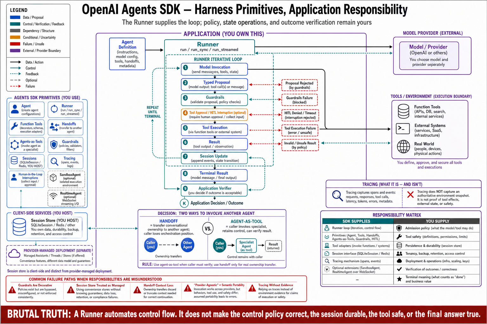

# Topic 3 — OpenAI Agents SDK: Agent, Runner, Tools, Handoffs, Agents-as-Tools, Sessions, Guardrails, Tracing, and Interruptions

## 1. Problem and objective

The OpenAI Agents SDK is a harness-only surface (Topic 1, cell 2/4): it supplies the loop and lifecycle, you supply the tools and the deployment. Its primitive set is unusually explicit about *multi-agent* structure — handoffs, agents-as-tools — which makes it the best-documented instance in this chapter of a design decision Chapter 8 will have to make. The objective is the primitive inventory with its architectural reading: what each primitive is, which Chapter 3 control-plane responsibility it discharges, and which it leaves open.

**Evidence depth:** the accessible sources are the agents guide [OAG] and the SDK repository overview [OAP], both of which name the primitives and their roles without full API reference detail. Method signatures below are those the sources state; anything not stated is marked rather than reconstructed.

## 2. Intuition first

The SDK's bet is that the agent loop is *boilerplate* and the interesting engineering is in the agent definitions: what this specialist knows, what it may call, when it hands off. So it hoists the loop into a `Runner`, makes `Agent` a declarative object, and — the distinctive move — gives *delegation* two different first-class shapes: **handoff** (ownership transfers; the other agent takes over the conversation) and **agent-as-tool** (the other agent is invoked, returns a result, and the caller keeps control). That distinction is not cosmetic; it is the difference between a topology change and a function call, and Chapter 9 will show they have different failure modes.

## 3. The primitives, as documented

**`Agent`** — "a reusable specialist with typed instructions, tools, and model configuration" [OAG]; "the fundamental building block... configured with instructions, tools, guardrails, and handoffs" [OAP]. In Chapter 1's terms, an Agent object bundles a slice of the configuration tuple: $M_c$ (model config), part of $H_c$ (instructions), and $\mathcal U_c$ (tool contracts).

**`Runner`** — "executes the agent loop — handling tool invocation, branching, and lifecycle management" [OAG]; the primary execution interface with `run()` (async), `run_sync()`, and `run_streamed()`, returning a result carrying `final_output` [OAP]. The Runner *is* the harness's loop-control component (Ch. 3, Topic 3's canonical loop, supplied).

**Tools** — function tools via the `@function_tool` decorator; MCP integration; hosted tools; and agents-as-tools [OAP]. The decorator pattern makes the tool contract a Python signature — schema generation from types, the same design as Anthropic's `@beta_tool` [ANT-API] and a Chapter 5 concern.

**Handoffs** — "delegate work between specialist agents with **ownership transfer**" [OAG]; "mechanisms for delegating specific tasks between agents within workflows" [OAP]. Ownership transfer is the operative phrase: the receiving agent continues the run.

**Agents-as-tools** — "delegation pattern allowing agents to call other agents" [OAP], listed under *tools* rather than under handoffs — the caller retains control and consumes a return value. §2's distinction, in the source's own structure.

**Sessions** — "resumable state containers for multi-turn conversations" [OAG]; "automatic conversation history management, with implementations including SQLiteSession and Redis support" [OAP]. Note the ownership: sessions here are *client-side* stores you configure (Topic 11's analysis) — the SDK is harness-only, so its state is yours to host.

**Guardrails** — "input/output validation and **tool-specific approvals with resumable flows**" [OAG]; "input/output validation through configurable safety checks" [OAP]. This is the SDK's admission layer — Chapter 3, Topic 6's control-plane enforcement point, supplied as a primitive, with approvals explicitly *resumable* (Ch. 3, Topic 9's re-entry machinery, provided).

**Tracing** — "built-in tracing across model calls, tools, agents, guardrails, and handoffs" [OAG], with a UI for run visualization [OAP]. Chapter 3, Topic 4's evidence floor, partly supplied — the span coverage named here matches the deep-telemetry field list's core [CAH §3.5.1] and omits environment snapshots, which remain yours.

**Human-in-the-loop interruptions** — "interruption mechanisms enabling human involvement across agent execution cycles" [OAP], coupled to guardrails' resumable approvals [OAG]. Chapter 3, Topic 9's interruption/resumption class as a first-class primitive.

**Provider agnosticism** — "support for OpenAI APIs plus 100+ alternative LLM providers" [OAP]. Read with Topic 12's warning: provider-agnostic *invocation* is not provider-agnostic *semantics*.

**Specialized agent classes** — `SandboxAgent` ("preconfigured for container-based work, supporting file inspection, command execution, and workspace state persistence across longer task horizons") and `RealtimeAgent` (low-latency voice/multimodal over WebSocket) [OAP]. The former is the coding-agent shape (Topic 1's row 3) as a class; the latter is Topic 10's realtime mode as a class.

## 4. Mapping onto the control plane

**[synthesis — mapping ours; primitives sourced above]**

| Chapter 3 responsibility | Supplied by the SDK | Still yours |
|---|---|---|
| Loop control (T3) | `Runner` [OAG] | Termination beyond the default; budget policy |
| Admission (T6, T7) | Guardrails + tool approvals [OAG] | The *rules*: what to allow, at what tier |
| Execution / sandbox (T7) | `SandboxAgent` for container work [OAP] | The sandbox's boundary and hardening (harness-only ⇒ you host) |
| State (T4, T11) | Sessions (SQLite/Redis) [OAP] | The store, its tenancy, retention, and the commit discipline |
| Interruption/resumption (T9) | Resumable approval flows, interruptions [OAG; OAP] | Environment-side re-observation on resume |
| Telemetry (T4) | Tracing across model/tool/agent/guardrail/handoff spans [OAG] | Workspace snapshots; retention; the evidence floor's remainder |
| Orchestration (Ch. 8–9) | Handoffs, agents-as-tools | The topology decision and its coordination tax |

The column that matters is the right one. The SDK is generous with *mechanism* and silent on *policy* — which is correct SDK design and exactly why Chapter 3's invariant ledger (Topic 7 §9.1) does not become someone else's problem when you adopt it.

## 5. Handoff versus agent-as-tool: the decision

The two delegation shapes differ in who owns the conversation afterward — and therefore in failure mode **[synthesis; distinction sourced from OAG/OAP's own framing]**:

- **Handoff** (ownership transfers): the receiving agent inherits the run. Failure mode: *lost thread* — the receiver lacks context the sender never serialized, and no one is left to notice (Ch. 1, Topic 3's belief divergence across an agent boundary). Use when the task genuinely changes hands and the receiver's context is self-sufficient.
- **Agent-as-tool** (caller retains control): the callee returns a value; the caller continues. Failure mode: *summary loss* — only the return value crosses the boundary, so evidence the caller needed stays behind (the subagent-context trade [CAL] makes explicit: the parent's context grows by the summary, not the transcript). Use when the caller must verify, aggregate, or continue.

The rule this book adopts: **prefer agent-as-tool whenever the caller must verify the callee's work** — because verification requires the verifier to still exist (Ch. 1, Topic 2, invariant I4). Handoffs are for genuine ownership changes, and each one is a place where the $\hat\tau$ record must be explicitly stitched (Chapter 9's trace topology).

## 6. Failure modes

- **Guardrails as decoration:** approvals configured but auto-approved in practice; the admission primitive present, the policy absent (§4's right column).
- **Session store treated as managed:** SQLite/Redis sessions are *yours* [OAP] — their retention, tenancy isolation, and durability are your operational problem, and a resumable session pointing at a lost store is an unrecoverable run (Ch. 3, Topic 9).
- **Handoff without context serialization:** §5's lost-thread mode; the receiving agent's $\operatorname{Assemble}$ has inputs the sender never provided.
- **Provider-agnostic complacency:** swapping the model provider behind the SDK and inheriting different tool-call, refusal, and termination semantics unmeasured — Topic 12's whole subject; the SDK abstracts the call, not the behavior.
- **Tracing without the environment:** span coverage across model/tool/agent [OAG] omits workspace state; incident reconstruction needs both (Ch. 3, Topic 4 §6's ledger-lies hazard).

## 7. Limitations

- API-reference depth (exact signatures, guardrail types, session interfaces, tracing exporters) is beyond the accessible sources; §3 reports what [OAG] and [OAP] state.
- No performance, reliability, or scale evidence for this SDK exists in this book's ledger — its inclusion is as an interface, not as a benchmarked configuration (Ch. 1, Topic 12's citation discipline forbids the latter without measurement).
- The handoff/agent-as-tool decision rule (§5) is our synthesis; the sources describe both primitives without prescribing between them.

## 8. Production implications

1. **Adopt the mechanisms, write the policy** (§4): guardrail rules, budget ceilings, termination predicate, and the invariant ledger remain your deliverables on this surface.
2. **Own the session store like a database** — because it is one: backups, tenancy, retention, and failure semantics (Topic 11).
3. **Default to agent-as-tool; justify each handoff** (§5), and serialize the context a handoff needs explicitly.
4. **Extend tracing to the environment** before relying on it for incidents (Ch. 3, Topic 4's evidence floor).
5. **Re-qualify on provider swaps** even though the SDK makes them syntactically free (Topic 12).

## 9. Connections

- Topic 2 supplied the API this SDK wraps; Topic 4 covers the opinionated coding-agent product built on the same ecosystem; Topics 10–13 treat the cross-cutting semantics (modes, state, portability, versions) this surface participates in.
- Chapters 8–9 own the orchestration patterns handoffs and agents-as-tools implement; Chapter 5 owns the tool-contract layer `@function_tool` generates.

## Sources

[OAG] OpenAI agents guide (Agent, Runner, Sessions, Handoffs with ownership transfer, Guardrails with resumable tool approvals, tracing scope, positioning) — https://developers.openai.com/api/docs/guides/agents
[OAP] OpenAI Agents SDK for Python (Agent, Runner `run`/`run_sync`/`run_streamed`, `@function_tool`, MCP, agents-as-tools, SQLiteSession/Redis, guardrails, tracing, HITL interruptions, provider agnosticism, `SandboxAgent`, `RealtimeAgent`) — https://github.com/openai/openai-agents-python
[ANT-API] Anthropic Claude API reference (decorator-based tool definition as a comparable pattern) — platform.claude.com docs
[CAL] Claude Agent SDK, "How the agent loop works" (subagent context semantics) — https://code.claude.com/docs/en/agent-sdk/agent-loop
[CAH] Code as Agent Harness, arXiv:2605.18747, §3.5.1 (deep-telemetry field list) — `Knowledge_source/2605.18747v1.pdf`
