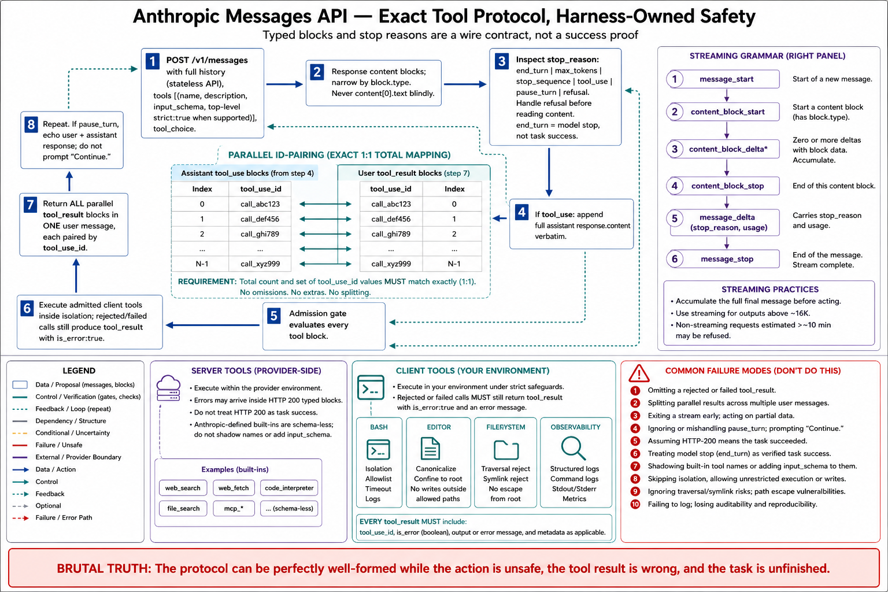

# Topic 5 — Anthropic Messages API: Content Blocks, `tool_use`, `tool_result`, Streaming, and Client-Executed Tools

## 1. Problem and objective

The Messages API is the model-API surface of the Anthropic stack — Topic 1's cell 1, where the harness is entirely yours. Its architecture is unusually clean to reason about because *everything* goes through one endpoint: "Everything goes through `POST /v1/messages`. Tools and output constraints are features of this single endpoint — not separate APIs" [ANT-API]. The objective is the object model, the tool-use protocol's exact contract, the streaming event grammar, and the client/server tool split — each mapped onto the typed stages, because this surface is where the mapping is tightest.

## 2. Intuition first

The API's unit is the **message**, and a message's content is a *list of typed blocks* — text, thinking, `tool_use`, `tool_result`, and more. The agent loop is then a discipline about how those blocks travel: the model emits `tool_use` blocks; you execute them; you send back `tool_result` blocks with matching IDs; repeat until the model stops asking. The protocol's strictness is its virtue — the ID pairing is checked, and violating it is an error rather than a silent corruption — and the whole of Chapter 3's control plane fits in the space between "model emitted `tool_use`" and "you sent `tool_result`."

## 3. The object model

**Content blocks.** A response's `content` is a list of typed blocks; the consumer must narrow by `.type` before reading fields [ANT-API]. The documented block types across current models include `text`, `thinking`, `redacted_thinking`, `tool_use`, `server_tool_use`, tool-result variants (`web_search_tool_result`, `web_fetch_tool_result`, `bash_code_execution_tool_result`, `text_editor_code_execution_tool_result`, `tool_search_tool_result`, `mcp_tool_use`, `mcp_tool_result`), `container_upload`, `compaction`, and `fallback` [ANT-API]. The engineering rule the reference repeats: never index `content[0].text` unconditionally — with thinking enabled, the first block is a `thinking` block [ANT-API].

**Stop reasons** — the API's terminal-status field, and the direct analogue of Chapter 1's $\kappa_t$ [ANT-API]:

| `stop_reason` | Meaning |
|---|---|
| `end_turn` | Finished naturally |
| `max_tokens` | Hit the output cap — increase or stream |
| `stop_sequence` | Custom stop sequence hit |
| `tool_use` | Wants a tool call — execute and continue |
| `pause_turn` | Server-side tool loop paused; resumable |
| `refusal` | Declined for safety; check `stop_details` |

`stop_details` is populated *only* on `refusal` (fields `type`, `category`, `explanation`) and is `null` for every other stop reason — "always guard before reading" [ANT-API]. Note what this gives the builder: a typed terminal cause per model turn, which the harness's $\kappa_t$ (Ch. 3, Topic 8) consumes as one of its inputs — *not* as its conclusion, since `end_turn` is a model proposal, not a verified success.

## 4. The tool-use protocol — the contract in full

The cycle [ANT-API]:

1. You declare tools: `{name, description, input_schema}` — plus `strict: true` as a **top-level field on the tool definition** (not on `tool_choice`), which "guarantees `tool_use.input` validates exactly" when the schema has `additionalProperties: false` and `required`.
2. The model responds with `stop_reason: "tool_use"` and one or more `tool_use` blocks (`id`, `name`, `input`).
3. You execute and append: an assistant message carrying the **full `response.content`** (preserving the `tool_use` blocks), then a user message whose content is `tool_result` blocks, each with `tool_use_id` matching its `tool_use`.
4. Repeat until `stop_reason == "end_turn"`.

Four contract details that carry disproportionate weight:

- **ID pairing is mandatory.** Every `tool_use` must have a matching `tool_result`; a follow-up with an unmatched ID is rejected [ANT-API].
- **Parallel tool use is on by default**, and the results must return in a **single** user message: "splitting them across multiple messages silently trains Claude to stop making parallel calls" [ANT-API]. A failed tool returns `tool_result` with `is_error: true` — "don't drop it."
- **`tool_choice`** controls the *whether* factor (Ch. 2, Topic 5 §3): `auto` (default), `any` (must use at least one), `tool` (must use the named one), `none`; any of them may carry `disable_parallel_tool_use: true` [ANT-API].
- **`pause_turn` is a resumption, not a completion.** When a server-side tool loop hits its iteration limit, re-send the user message plus the assistant response — "do NOT add an extra user message like 'Continue.' — the API detects the trailing `server_tool_use` block and knows to resume automatically" [ANT-API]. The reference further warns that the SDK tool runners **do not auto-resume `pause_turn`**: "a paused turn ends the runner and is returned as the final message — no error, no warning, just a silently truncated answer" [ANT-API]. This is a live, documented silent-failure mode, and Topic 14's conformance suite must test for it.

## 5. Streaming: the event grammar

The SSE event types [ANT-API]:

| Event | When |
|---|---|
| `message_start` | Once, with metadata |
| `content_block_start` | A text/thinking/tool_use block begins |
| `content_block_delta` | Incremental content (`text_delta`, `thinking_delta`, `input_json_delta`) |
| `content_block_stop` | Block complete |
| `message_delta` | Message-level updates: `stop_reason`, usage |
| `message_stop` | Once, at the end |

Operational semantics the reference fixes: stream for `max_tokens` above ~16K, because non-streaming requests hit SDK HTTP timeouts at high output caps (the Python SDK *refuses* non-streaming requests it estimates will exceed ~10 minutes, raising `ValueError`) [ANT-API]; use the SDK's accumulating helper (`get_final_message()` / `finalMessage()`) rather than hand-rolling event accumulation; and fine-grained tool streaming is GA via `eager_input_streaming: true` on the tool definition — "there is no beta header and no `client.beta.*` path" [ANT-API].

Mapping to Chapter 3: streaming is a *display* channel, and the terminal information (`stop_reason`, usage) arrives in `message_delta` — the same separation ADK draws between partial and final events (Ch. 3, Topic 4 §3.1). Do not let a UI's streamed text become the system's record; the record is the assembled message.

## 6. Client-executed versus server-executed tools

The split is architecturally central (Chapter 2, Topic 9's placement decision, as a per-tool property) [ANT-API]:

- **Server-side (Anthropic executes):** web search, web fetch, code execution, tool search, advisor. Declared in `tools`; results arrive as content blocks in the same response; no client execution loop. The reference's failure note matters: "server-tool errors don't raise" — they return HTTP 200 with an error object inside the result block, and for web search "a success `content` is a *list*; an error `content` is an *object* — branch on that before indexing" [ANT-API].
- **Client-executed (you execute):** bash, text editor, memory, computer use. These are **Anthropic-defined but schema-less**: declare by `type` and `name` only — "do not pass an `input_schema`, and do not define a custom tool that happens to be named `"bash"` — that creates a user-defined tool without the built-in behavior" [ANT-API]. Your handler performs the action and returns a `tool_result`.

The security obligations the reference attaches to the client-executed tools are Chapter 12's material arriving early, and they belong in this topic because they are *interface contract*, not advice: bash commands are "untrusted model output" requiring an isolated environment, an **allowlist** of executables (a blocklist "is not sufficient"), rejection of shell operators, timeouts, and logging; text-editor paths must be canonicalized and confined to a project root, rejecting `..`, symlinks, and encoded traversal [ANT-API]. In Chapter 3's terms: the API hands you an action proposal; $\operatorname{Admit}$ is entirely yours, and these are its minimum rules.

## 7. Mapping onto the typed stages

**[synthesis — mapping ours; every cell sourced above]**

| Stage | Messages API locus |
|---|---|
| $\operatorname{Assemble}_{H_c}$ | Your `system` + `messages` + `tools` construction (render order `tools` → `system` → `messages` [ANT-API]) |
| $Y_t\sim\pi_{M_c}$ | `response.content` (typed blocks) + `stop_reason` |
| $\operatorname{Parse}\to\Xi_t$ | Filter `tool_use` blocks; `strict: true` guarantees argument-schema validity [ANT-API] |
| $\operatorname{Admit}\to\widetilde A_t$ | **Yours** — allowlists, path confinement, approval gates (§6) |
| $\operatorname{ScheduleExec}\to A_t$ | **Yours** — parallel execution then a single results message (§4) |
| $\kappa_t$ | Composed from `stop_reason` **plus your validator** — `end_turn` ≠ verified success (Ch. 3, Topic 8) |

## 8. Failure modes

- **Unguarded `content[0]`** — breaks the moment thinking is on [ANT-API]; the type-narrow is not optional.
- **`stop_details` read without a `refusal` guard** — it is `null` elsewhere [ANT-API].
- **Split parallel tool results** — silently degrades the model's future parallelism [ANT-API]; a behavioral regression with no error.
- **Dropped error results** — a failed tool whose `tool_result` is omitted breaks ID pairing; `is_error: true` exists for exactly this [ANT-API].
- **`pause_turn` unhandled** — the documented silent truncation, and *worse under the SDK tool runners*, which do not auto-resume [ANT-API].
- **Raw-string-matching tool inputs** — current models "may produce different JSON string escaping in tool call `input` fields"; always parse [ANT-API].
- **Server-tool error blindness** — HTTP 200 with an error object; a consumer that indexes success-shaped content crashes or, worse, misreads (§6).
- **Custom tool shadowing a built-in name** — a `bash`-named custom tool is a different tool without built-in behavior [ANT-API].

## 9. Limitations

- The reference is a snapshot (cache 2026-06) of a fast-moving surface; beta headers, tool versions, and model-gated features (mid-conversation system messages; adaptive thinking; `strict`) change on vendor timescales. Topic 13's pinning discipline exists for exactly this.
- Model-specific behavior is entangled with API surface (prefill removal, sampling-parameter removal, thinking configuration are *model*-gated, not endpoint-gated) — a fact Topic 12 will make into a portability lesson.
- This book measures none of it: the topic is interface specification, and any reliability claim about a configuration built on it must come from Chapter 3, Topic 14's methodology.

## 10. Production implications

1. **Encode the tool-use contract in one place** (§4) — assembly of the assistant echo, the single results message, ID pairing, `is_error`, `pause_turn` — and unit-test it (Topic 14). Every one of these is a documented silent-failure mode when hand-rolled.
2. **Turn on `strict: true`** and treat its guarantee as *L2 only* (Ch. 2, Topic 7's validity stack); L3/L4 remain yours.
3. **Implement $\operatorname{Admit}$ to the reference's own minimums** for bash and text editor (§6): allowlists, canonicalized paths, isolation, logging. These are the interface's stated security contract, not optional hardening.
4. **Compose $\kappa_t$ from `stop_reason` + validator**, never from `end_turn` alone (§7; Ch. 3, Topic 8).
5. **Stream above ~16K `max_tokens`** and take terminal facts from `message_delta`/the final message, not from the rendered text (§5).

## 11. Connections

- Topic 6 covers the SDK that supplies the loop this surface leaves you; Topic 7 the managed platform that supplies both; Topic 10 develops streaming into the mode taxonomy; Topic 12 turns §9's model/API entanglement into a portability trap.
- Chapter 2, Topics 5–7 analyzed the emission side of this protocol; Chapter 3, Topics 6–8 are the control plane §7's right column hands you; Chapter 5 owns tool contracts; Chapter 12 owns §6's security obligations at depth.

## Sources

[ANT-API] Anthropic Claude API reference — Messages API architecture (single endpoint), content-block types and narrowing, `stop_reason`/`stop_details`, tool-use protocol (definitions, `strict`, ID pairing, parallel results, `is_error`, `tool_choice`, `pause_turn` and the tool-runner caveat), streaming event grammar and `max_tokens` guidance, server- vs client-executed tools and their security contracts, tool-input JSON parsing — platform.claude.com docs (cache 2026-06)
