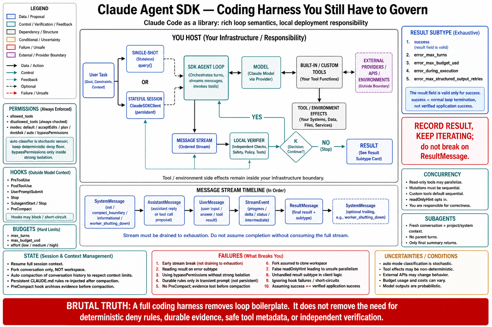

# Topic 6 — Claude Agent SDK: `query()`, `ClaudeSDKClient`, Built-in Tools, Permissions, Hooks, Subagents, Sessions, Skills, and MCP

## 1. Problem and objective

The Claude Agent SDK is "Claude Code packaged as a library" [ANT-API] — a harness-only surface (Topic 1, cell 4) that ships an opinionated loop *and* a built-in toolset, and leaves deployment to you. Chapter 3 used it as the reference runtime for loop semantics; this topic documents it as an *interface*: entry points, the permission and hook machinery that constitute its control plane, subagent and session semantics, and the extension surfaces (skills, MCP). The objective is to let a builder configure it deliberately — because on this surface, $\mathcal C$ (Chapter 3's harness configuration) is almost entirely a matter of SDK options, and defaults are decisions.

## 2. Intuition first

Two entry points, one loop. `query(prompt, options)` is a single-shot invocation of the full Claude Code agent loop; `ClaudeSDKClient` is the stateful client that manages session identity across calls. Everything else in the SDK is a knob on the loop that Chapter 3, Topic 3 already anatomized: what the model sees (setting sources, skills, MCP), what it may do (permissions, hooks), how far it may go (turns, budget, effort), how you observe it (the typed message stream), and how it survives (sessions, compaction). Configuring this SDK *is* writing $\mathcal C$.

## 3. Entry points and the message stream

**`query()`** — single-shot: takes a prompt and options, yields the message stream, and raises after an error result (the raise "is intentional — wrap the loop in a try block if your code needs to continue past it"; the underlying process also exits nonzero) [CAL]. **`ClaudeSDKClient`** (Python) "handles session IDs automatically across multiple calls" [CAL] — the stateful counterpart, and the correct choice whenever continuity matters.

**The stream is the interface.** Five core message types [CAL]: `SystemMessage` (subtypes `init`, `compact_boundary`, `informational`, `worker_shutting_down`), `AssistantMessage` (text + tool-call blocks), `UserMessage` (tool results; also your mid-loop inputs), `StreamEvent` (raw deltas, only with partial messages enabled), and `ResultMessage` (terminal: final text, usage, cost, session ID). The reference's operational warning is a Topic 14 test case: "A small number of trailing system events, such as `prompt_suggestion`, can arrive after it, so iterate the stream to completion rather than breaking on the result" [CAL].

**Terminal semantics** — the SDK's $\kappa_t$ [CAL]:

| `ResultMessage.subtype` | Meaning | `result` present? |
|---|---|---|
| `success` | Finished normally | Yes |
| `error_max_turns` | Hit `max_turns` | No |
| `error_max_budget_usd` | Hit spend cap | No |
| `error_during_execution` | API failure/cancellation | No |
| `error_max_structured_output_retries` | No valid structured output within retries | No |

Plus `stop_reason` carrying the model-side cause (`end_turn`, `max_tokens`, `refusal`) [CAL]. "The `result` field... is only present on the `success` variant, so always check the subtype before reading it" [CAL] — and note again that `success` here means *the model stopped asking for tools*, not that a validator agreed (Chapter 3, Topic 8's discipline).

## 4. The control plane, as options

This is the topic's core: the SDK's options *are* Chapter 3's control plane, and here is the mapping **[synthesis — mapping ours; every mechanism sourced from CAL]**.

**Built-in tools** — file ops (`Read`, `Edit`, `Write`), search (`Glob`, `Grep`), execution (`Bash`), web (`WebSearch`, `WebFetch`), discovery (`ToolSearch`), orchestration (`Agent`, `Skill`, `AskUserQuestion`, `TaskCreate`, `TaskUpdate`) [CAL]. The toolset is the surface's opinion; scoping it is your first $\mathcal C$ decision.

**Permissions** — three interacting options [CAL]: `allowed_tools` (auto-approve), `disallowed_tools` (block, regardless of other settings), and `permission_mode` for everything uncovered — `default` (prompt via callback; no callback ⇒ deny), `acceptEdits` (auto-approve edits and common filesystem commands; other Bash follows default rules), `plan` (explore/plan; source edits never auto-approved), `dontAsk` (pre-approved rules run, everything else denied), `auto` (a model classifier approves/denies each call), `bypassPermissions` (all allowed tools run without asking — "Use only in isolated environments where the agent's actions cannot affect systems you care about"; cannot run as root on Unix). Rules can scope commands (`"Bash(npm *)"`). **A denied call returns to the model as a tool result** — "Claude receives a rejection message as the tool result and typically attempts a different approach" [CAL], which is Chapter 3, Topic 6's CP-1 (data-plane feedback, control-plane decision) implemented.

**Hooks** — `PreToolUse` (validate/block *before* execution), `PostToolUse` (audit), `UserPromptSubmit` (inject context), `Stop` (validate result, save state), `SubagentStart`/`SubagentStop`, `PreCompact` (archive before summarization) [CAL]. Two properties matter architecturally: hooks "run in your application process, not inside the agent's context window, so they don't consume context," and they can **short-circuit** the loop — a rejecting `PreToolUse` prevents execution and the model receives the rejection [CAL]. This is the enforced-invariant insertion point (Chapter 3, Topic 7), and `PreCompact` is the archive-before-lossy-summarization hook that Chapter 3, Topic 4 §6 demanded.

**Budgets and depth** — `max_turns` (counts tool-use turns), `max_budget_usd`, and `effort` (`low`…`max`; `xhigh` recommended on current frontier models; trades latency/tokens for reasoning depth *within* each response, independent of extended thinking) [CAL]. The reference's posture: "Setting a budget is a good default for production agents" [CAL].

**Concurrency** — read-only tools may run concurrently; state-modifying tools (`Edit`, `Write`, `Bash`) run sequentially; custom tools default to sequential and opt in via `readOnlyHint` [CAL]. Chapter 2, Topic 6's scheduler, shipped.

## 5. Subagents, sessions, and context

**Subagents** — "Each subagent starts with a fresh conversation (no prior message history, though it does load its own system prompt and project-level context like CLAUDE.md). It does not see the parent's turns, and only its final response returns to the parent as a tool result. The main agent's context grows by that summary, not by the full subtask transcript" [CAL]. Subagents take their own `tools` scope and `effort` override [CAL]. Read against Topic 3 §5: this is the *agent-as-tool* shape (caller retains control; only a summary crosses), with its characteristic summary-loss failure mode — and its characteristic context-economy benefit.

**Sessions** — capture `session_id` from `ResultMessage` to resume ("the full context from previous turns is restored: files that were read, analysis that was performed, and actions that were taken") or **fork** ("branch into a different approach without modifying the original") [CAL]. Chapter 3, Topic 9's caution applies unchanged: fork isolates *conversation* state, not the workspace.

**Context and compaction** — everything accumulates (system prompt, tool definitions, history, tool inputs/outputs); stable content is prompt-cached; when the window nears its limit the SDK **automatically compacts**, summarizing older history and emitting a `compact_boundary` [CAL]. The consequence the reference states plainly: "specific instructions from early in the conversation may not be preserved. Persistent rules belong in CLAUDE.md... because CLAUDE.md content is re-injected on every request" [CAL]. Chapter 1, Topic 3's compaction-loss mechanism, with the vendor's own mitigation.

**Skills and MCP** — skills load via setting sources (descriptions at session start; full content on invocation); MCP servers connect external services, with **tool search deferring MCP schemas by default** to protect context [CAL]. Both are $\operatorname{Assemble}$-stage extensions (Chapter 6's material).

## 6. The `auto` permission mode and the CP-2 question

One option deserves separate treatment: `permission_mode: "auto"` uses "a model classifier to approve or deny each tool call" [CAL]. This is the same structure as Codex's `auto_review` (Topic 4 §3) — a stochastic component holding an admission seat — and the same discipline applies (Chapter 3, Topic 6's CP-2): it is legitimate as a *measured sensor* with a known error profile and a fail-safe direction, and illegitimate as an oracle. The SDK's own framing is careful ("see Auto mode for availability and behavior" [CAL]); a production adoption should measure its false-allow rate on the consequential action classes before trusting it, and keep deterministic deny-rules (`disallowed_tools`) as the floor beneath it — because deny rules are checked regardless of mode [CAL].

## 7. Failure modes

- **Breaking on `ResultMessage`** — trailing system events are dropped; iterate to completion [CAL].
- **Reading `result` on a non-success subtype** — it is absent; the check is mandatory [CAL].
- **`bypassPermissions` outside isolation** — the reference's own restriction, ignored (Ch. 3, Topic 7's floor removed).
- **Persistent rules in the prompt instead of CLAUDE.md** — compaction eats them [CAL]; the mitigation is documented and routinely skipped.
- **No `PreCompact` archive** — early evidence unrecoverable (Ch. 3, Topic 4 §6).
- **Fork aliasing on one workspace** — conversation forked, filesystem shared; two branches racing (Ch. 3, Topic 9 §5.4).
- **Mislabeled `readOnlyHint`** — a mutating custom tool marked read-only re-admits write races past the scheduler [CAL].
- **Subagent summary loss** — the parent verifies against a summary it cannot audit; if the parent must *verify*, it must receive evidence, not narration (Ch. 2, Topic 14's externalize-and-verify).
- **Unhandled budget subtypes** — `error_max_turns`/`error_max_budget_usd` treated as generic failure, discarding the detection-failure signal (Ch. 3, Topic 8 §5.3).

## 8. Limitations

- The SDK's surface moves quickly (the reference documents version-gated behavior, e.g. a streaming-input message-loss defect fixed in v2.1.205 [CAL]) — Topic 13's pinning discipline is not optional here.
- TypeScript and Python surfaces differ (TS yields additional observability events; Python's `ClaudeSDKClient` handles session IDs automatically) [CAL]; cross-language ports are not free.
- This chapter documents the interface; no reliability claim about a Claude-Agent-SDK configuration is made without Chapter 3, Topic 14's measurement.

## 9. Production implications

1. **Write $\mathcal C$ explicitly** (§4): tool scope, permission mode + rules, hooks, budgets, effort, setting sources. Each default you leave unset is a decision you have made silently.
2. **Put invariants in hooks and deny-rules, not in prompts** — `PreToolUse` blocks execution; `disallowed_tools` is checked regardless of mode [CAL]. This is Chapter 2, Topic 13's lever discipline, with the exact insertion points named.
3. **Archive before compaction** (`PreCompact`) and **put durable rules in CLAUDE.md** — the two documented mitigations for the surface's one lossy mechanism [CAL].
4. **Bound `auto` mode** before relying on it (§6); keep deterministic deny-rules beneath it.
5. **Use subagents for context economy, not for verification** (§5): the parent gets a summary, and a summary is not evidence.
6. **Handle every terminal subtype**, and trend the budget-firing rate as a detection-failure metric (Ch. 3, Topic 8).

## 10. Connections

- Chapter 3 used this SDK as its reference runtime (Topics 3–5, 13); this topic is the interface view of the same object. Topic 7 covers the managed platform that adds deployment; Topic 11 places its session/state model; Topic 13 owns its version discipline.
- Chapter 5 owns MCP and tool contracts; Chapter 6 owns skills, CLAUDE.md, and compaction strategy; Chapter 9 owns the subagent topology.

## Sources

[CAL] Claude Agent SDK, "How the agent loop works" — entry points and message types, terminal subtypes and `stop_reason`, built-in tools, permissions (rules and modes), hooks, budgets and effort, concurrency (`readOnlyHint`), subagent inheritance, sessions (resume/fork), context accumulation and automatic compaction, skills, MCP and tool search — https://code.claude.com/docs/en/agent-sdk/agent-loop
[ANT-API] Anthropic Claude API reference (Claude Agent SDK positioned as "Claude Code packaged as a library"; harness-only vs Tool Runner disambiguation) — platform.claude.com docs (cache 2026-06)
