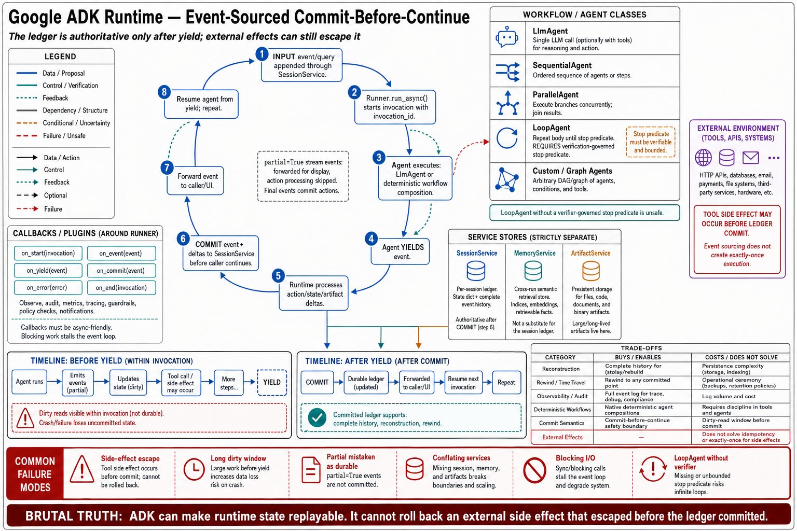

# Topic 8 — Google ADK: Agent Classes, Runner, Event Loop, Session/Memory/Artifact Services, Callbacks, and Plugins

## 1. Problem and objective

ADK is the chapter's third harness-only SDK, and architecturally the most distinctive: its runtime is **event-sourced with a commit-before-continue discipline** (Chapter 3, Topic 4's ledger pole), and its agent model is explicitly *compositional* — workflow agents are first-class classes rather than patterns you write. The objective is the class taxonomy, the runtime's state semantics (already load-bearing in Chapter 3 and here documented as an interface), the service layer, and the extension points — with the trade its architecture makes stated plainly.

**Evidence depth:** the runtime event-loop documentation is detailed [ADK]; the agents documentation [ADK-A] names the class taxonomy and services without full API-reference depth ("the provided content doesn't expose detailed internal class names, inheritance hierarchies, or specific mechanism implementations — only public architectural concepts"). Topic content is bounded accordingly.

## 2. Intuition first

ADK's bet is that an agent runtime is a *transaction log*, not a conversation. Your code doesn't call the model and mutate state; it **yields events** carrying both content and side-effect declarations, and a `Runner` commits those side effects through services before your code resumes. The payoff is that state, history, and observability come from one mechanism, and recovery is a replay rather than a reconstruction. The cost is ceremony: every state change must travel as an event, and code that mutates state without yielding has written a lie into the ledger.

## 3. The agent taxonomy

**`LlmAgent`** — the model-backed unit: "a self-contained execution unit designed to act autonomously," configured with instructions and optional tools [ADK-A].

**Workflow agents** — composition as classes: `SequentialAgent`, `ParallelAgent`, `LoopAgent` [ADK-A]. This is the distinctive design decision: Chapter 1's *workflow* class (predefined code paths orchestrating LLM calls [BEA]) is a first-class runtime object rather than application code you write around the SDK. Chapter 8's orchestration patterns therefore have a direct constructor here — and Chapter 1, Topic 9's dominance argument acquires an unusually cheap implementation path: on this surface, choosing the deterministic control shape costs *less* code than letting the model direct, which inverts the usual incentive.

**Custom agents** and **graph workflows** — the documentation points beyond plain instructions to "composable, reliable execution paths" [ADK-A], and to first-party "Managed Agents" backed by a Managed Agents API [ADK-A]. Note the name collision with Topic 7's product: same word, different platform (Topic 1's classify-by-behavior rule applies).

## 4. The runtime: event loop and commit discipline

The mechanics [ADK] — restated here as interface, having served in Chapter 3 as architecture:

- The **`Runner`** manages a single user **invocation**: appends the query to session history via `SessionService`, kicks off the agent's `run_async()`, **receives yielded events**, commits their declared changes via services, forwards them upstream, and resumes the agent.
- Execution logic follows **execute → yield → pause → resume**: "the agent logic resumes execution from the statement immediately following the yield" only after the Runner completes processing.
- **Commit-before-continue:** changes are packaged in `event.actions.state_delta` / `artifact_delta`; services persist them (`SessionService.append_event()`); "code that runs *after* resuming from a `yield` can reliably assume that the state changes signaled in the *yielded event* have been committed."
- **Dirty reads, named:** within one invocation, code may read uncommitted state changes made earlier — "this enables coordination between multiple steps before yielding, but creates risk if the invocation fails before state-carrying events are processed."
- **Partial vs final events:** `partial=True` events (streamed LLM tokens) are forwarded upstream but **skip actions processing**; only final events commit. Display and durability are separate channels — the same discipline Topic 5 §5 drew for Anthropic's streaming.
- **Event-sourced by construction:** "All state changes flow through events with explicit `actions`. The `Session` maintains complete event history, enabling state reconstruction, session rewinding, and observability," with an `invocation_id` per request-response cycle [ADK].

Mapping to Chapter 1's notation **[synthesis]**: the yielded `Event` *is* the record entry of $\hat\tau$, and `state_delta` is the explicit declaration of what the step changed — which is the property Chapter 3, Topic 4 §6 warned is *assumed* rather than guaranteed elsewhere ("a ledger where side effects escape the events... lies"). ADK makes the declaration mandatory for state; environment-facing effects (a tool that writes a file) still escape it, and capturing those remains the builder's job.

## 5. Services and extension points

**Services** — the persistence layer the Runner calls during event processing [ADK; ADK-A]:

| Service | Role |
|---|---|
| `SessionService` | Session state dict + complete event history |
| Memory service | Agent memory/context (Chapter 7's material) |
| Artifact service | "Persistent outputs like files, code, or documents" [ADK-A] |

Three separate services for three lifecycles is the correct separation (Chapter 3, Topic 2 §3's storage boundary), and it is rarer than it should be: conversation state, cross-session memory, and produced artifacts have different retention, tenancy, and deletion semantics, and a runtime that gives them one store forces the builder to fake the distinction.

**Callbacks** — "hook into specific events during an agent's execution lifecycle" [ADK-A]: the admission/audit insertion point (Chapter 3, Topic 7's enforcement), analogous to Claude's hooks (Topic 6 §4) and to HarnessX's hook-indexed processors [HX §3.1–3.2].

**Plugins** — "integrate complex, pre-packaged behaviors and third-party services" [ADK-A].

**Async foundation** — the runtime is built on async primitives (`asyncio`, `RxJava`, Promise/AsyncGenerator); `Runner.run_async()` is the primary entry, with a sync wrapper delegating to it, and the caveat that "blocking I/O in sync code may stall performance" [ADK].

## 6. The trade this architecture makes

Stated plainly, because it is the decision a builder actually faces **[synthesis; components sourced]**:

**Bought:** state reconstruction, session rewinding, observability from one mechanism [ADK]; a commit guarantee that makes post-resume reads safe; native workflow composition (§3), which makes the *deterministic* option the cheap one.

**Paid:** per-yield persistence cost; the ceremony of declaring every state change as an event action; a documented dirty-read window that must be kept short [ADK]; and — the unavoidable residue — the fact that environment effects still escape the ledger, so the workspace-capture problem (Chapter 3, Topic 4 §6) is unsolved by the architecture, merely narrowed.

Chapter 3, Topic 4 §5's decision rules apply unchanged: choose this pole when runs outlive processes, when audit is a requirement, when the harness itself is under trace-driven evolution, and when multiple consumers need one committed record.

## 7. Failure modes

- **Side-effect escape:** a tool mutating state without a `state_delta` — the ledger records a run that didn't happen as it happened. The commit discipline binds *declared* state, not the world.
- **Long dirty-read windows:** coordination-before-yield state lost on mid-invocation failure [ADK]; keep deltas early and windows short.
- **Partial-event confusion:** treating streamed `partial=True` content as committed [ADK] — the display/durability channels crossed.
- **Service conflation:** wiring session, memory, and artifact to one store, collapsing three retention/tenancy models into one (§5).
- **Sync blocking in an async runtime** — documented performance stall [ADK].
- **Workflow-class overreach:** using `LoopAgent` where the loop needs verification-governed termination; the class supplies iteration, not a stop predicate (Chapter 3, Topic 8's $\kappa$ is still yours).

## 8. Limitations

- Class-level API detail (constructors, inheritance, service interfaces) is beyond the accessible sources [ADK-A]'s own admission; §3 and §5 report the public architecture only.
- ADK's "Managed Agents" is named but undocumented at depth here; do not transfer Topic 7's semantics to it.
- As elsewhere in this chapter: no measured reliability claims: interface documentation only.

## 9. Production implications

1. **Adopt the commit discipline honestly** — declare every state change as an event action, keep dirty-read windows short, and *separately* capture environment effects (workspace snapshots) that the ledger cannot see (§4, §6).
2. **Keep the three services separate** (§5); their lifecycles differ and merging them is a debt paid in Chapter 7 and Chapter 12.
3. **Exploit the workflow classes** (§3): on this surface the deterministic shape is the cheap shape, which is the only place in this book where the incentives point the way Chapter 1, Topic 9 says they should.
4. **Put invariants in callbacks** (§5), not in instructions (Chapter 2, Topic 13's lever rule).
5. **Choose this runtime for its recovery properties, or don't choose it** (§6): the ceremony is only worth it when replay, rewind, and audit are requirements.

## 10. Connections

- Chapter 3, Topic 4 argued the event-sourced/request–response split; this topic documents the surface that anchors the event-sourced pole. Topic 9 covers the Gemini model surface ADK sits above; Topic 11 places its state ownership; Topic 12 warns against porting its event semantics elsewhere.
- Chapter 7 owns the memory service; Chapter 8 owns the workflow classes as orchestration patterns; Chapter 14 owns the replay operations the ledger enables.

## Sources

[ADK] Google ADK runtime event-loop documentation — Runner orchestration, execute/yield/pause/resume, commit-before-continue, `state_delta`/`artifact_delta`, dirty reads, partial vs final events, event-sourced design and `invocation_id`, async foundation — https://adk.dev/runtime/event-loop/
[ADK-A] Google ADK agents documentation — `LlmAgent`, workflow agents (Sequential/Parallel/Loop), custom agents, graph workflows, first-party Managed Agents, Session/Memory/Artifact services, callbacks, plugins — https://adk.dev/agents/
[BEA] Anthropic, Building Effective Agents (workflow definition) — https://www.anthropic.com/engineering/building-effective-agents
[HX] HarnessX, arXiv:2606.14249, §3.1–3.2 (hook-indexed processors as the comparable extension model) — `Knowledge_source/2606.14249v2.pdf`
