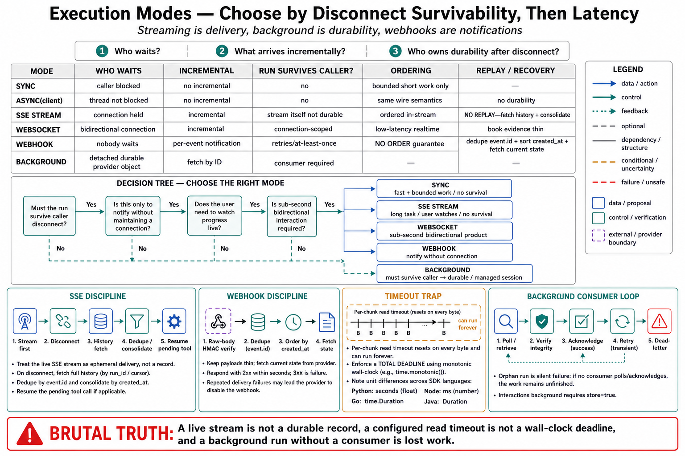

# Topic 10 — Sync, Async, Streaming, WebSocket, Webhook, and Background Execution

## 1. Problem and objective

An agent run can take minutes (Chapter 2's frontier note: "single requests on hard tasks can run many minutes" [ANT-API]). HTTP was not designed for that, and every ecosystem in this chapter has therefore grown a set of execution modes that trade latency, durability, and operational complexity against one another. The objective is the six modes as an engineering taxonomy: what each guarantees, what each *fails* to guarantee, which surfaces offer which, and the decision rule that maps a workload to a mode — plus the two documented failure classes (timeout semantics and delivery semantics) that bite hardest in practice.

## 2. Intuition first

Three questions separate the modes. **Who waits?** (the caller's thread, or nobody). **What arrives incrementally?** (nothing, tokens, or events). **Who owns durability if everyone disconnects?** (nobody, the provider, or your queue). Sync answers: the caller waits, nothing streams, nobody is durable — which is why it breaks first. Every other mode is a different way of relaxing one of those three.

## 3. The six modes

**Sync.** One blocking request/response. The documented limit is not theoretical: the Anthropic reference has the SDK *refuse* non-streaming requests it estimates will exceed ~10 minutes ("large `max_tokens` without streaming raises `ValueError`... idle connections drop"), and prescribes streaming above ~16K output tokens [ANT-API]. Sync is correct for short, bounded, latency-sensitive calls and for nothing else.

**Async (client-side).** Same wire semantics, non-blocking caller. ADK's runtime is async-native (`Runner.run_async()` primary, sync wrapper delegating, "blocking I/O in sync code may stall performance") [ADK]; OpenAI's SDK exposes `run()` / `run_sync()` [OAP]; Anthropic ships `AsyncAnthropic` with an aiohttp backend for high concurrency [ANT-API]. Async solves *caller* efficiency, not *durability* — a dropped connection still loses the run.

**Streaming (SSE).** Incremental delivery over one long-lived connection. Two grammars documented in this chapter: Anthropic's message/content-block/delta events [ANT-API] (Topic 5 §5) and Managed Agents' session event stream [ANT-API] (Topic 7 §4); ADK forwards partial events but "skips actions processing" for them [ADK] — display and durability separated. The universal property, and the one teams forget: **SSE has no replay.** The Managed Agents reference says it in the imperative — reconnect requires consolidation with a history fetch, or "if the stream drops while a tool_use is pending resolution... the session deadlocks" [ANT-API].

**WebSocket.** Bidirectional, low-latency, session-scoped. Documented here only for realtime/voice — OpenAI's `RealtimeAgent` "enables low-latency voice and multimodal experiences over WebSocket connections" [OAP]. Treat as a specialized mode with its own reconnection and state discipline; this book's evidence for it is thin, and Chapter 2, Topic 10 §3.4 already flagged audio/realtime agent loops as an evidence gap.

**Webhook (provider → you).** The provider POSTs state transitions to your endpoint. The Managed Agents specification is the fullest in the ledger [ANT-API]: **thin payloads** (event type + IDs; "fetch the resource for current state"), HMAC-signed with a `whsec_` secret and a ~5-minute staleness rejection via `webhooks.unwrap()`, **at-least-once with retries carrying the same `event.id`** (dedupe on it), **no ordering guarantee** ("sort by envelope `created_at` if order matters"), 3xx counts as failure (redirects are not followed), and auto-disable after ~20 consecutive failures. Note the direction discipline: this is *provider → you notifications*, not the third-party → you webhooks that *trigger* an agent — those are ordinary application code [ANT-API].

**Background execution.** The run detaches; you retrieve later. Named on the Responses API ("asynchronous execution capability") [OAG] and on Interactions (`background=true`, "storing the interaction for later retrieval" — and **gated on `store=true`**) [GIA]. Managed Agents' entire model is background-by-construction (the session runs provider-side whether or not you are streaming), with scheduled **deployments** firing sessions on a cron cadence, each firing writing a `deployment_run` record [ANT-API].

## 4. The property table

**[synthesis — table ours; every cell sourced above]**

| Mode | Caller blocked | Incremental | Durable if caller dies | Ordering | Replay |
|---|---|---|---|---|---|
| Sync | Yes | No | No | N/A | No |
| Async | No (thread) | No | No | N/A | No |
| SSE stream | Connection held | Yes | **No** (provider-side run may continue; *delivery* does not) | Yes, in-stream | **No** — consolidate on reconnect [ANT-API] |
| WebSocket | Connection held | Yes | No | Yes | No |
| Webhook | No | Per-event | Yes (retries) | **No** [ANT-API] | Via `event.id` dedupe + fetch |
| Background | No | No | **Yes** (provider stores) | N/A | Fetch by ID |

The two red cells are the ones that generate incidents: SSE's missing replay (a *delivery* gap that can deadlock a session waiting on a tool result) and webhooks' missing ordering (an *interpretation* gap that reorders state transitions). Both have documented remedies (consolidation; sort-by-`created_at` + dedupe) [ANT-API], and both remedies are library code you write once — Topic 14's test targets.

## 5. Timeout semantics: the systems-engineering trap

The Managed Agents reference documents a failure mode general enough to belong in every builder's head, not just this platform's [ANT-API]:

> `requests` `timeout=(c, r)` and `httpx.Timeout(n)` are **per-chunk** read timeouts; they reset every byte, so a trickling connection can block indefinitely. For a hard deadline on raw-HTTP polling, track `time.monotonic()` at the loop level and bail explicitly.

Neither library has a total wall-clock timeout. Combined with heartbeated long-lived streams (which trickle *by design*), the naive "I set a timeout" mental model is simply false. The SDK clients' own timeout defaults differ per language and scale with `max_tokens` — the Anthropic reference notes 10-minute defaults, TypeScript scaling to 60 minutes for large non-streaming requests, and unit differences (Python/Ruby seconds; TypeScript **milliseconds**) [ANT-API] — so "the same timeout" is not the same across a polyglot fleet. Chapter 3, Topic 10's transport failure class (class 6) is where these land, and this is its concrete etiology.

## 6. The decision rule

**[synthesis — rules ours; anchored above]** Choose by *what must survive a disconnect*, then by latency:

1. **Nothing must survive; the answer is fast** → sync (bounded `max_tokens`, short tool chains).
2. **Nothing must survive; the answer is long or the user watches** → streaming (mandatory above ~16K output [ANT-API]; the display channel is not the record).
3. **The run must survive the caller** → background or a managed session; the caller becomes a *consumer of a durable object*, not a holder of a connection.
4. **You must be told when something happens, without holding a connection** → webhooks, with the dedupe/ordering/fetch disciplines (§4) implemented before first use.
5. **Sub-second bidirectional interaction is the product** → WebSocket, with its own reconnection design (and a documented evidence gap in this book).

Two corollaries worth stating. **Streaming is not a durability strategy** — the run's survival and the stream's survival are different questions, and conflating them is what produces the deadlock in §4. **Background execution is not free of your problems** — an orphaned background run whose completion nobody consumes is a silent failure (Topic 2 §6), so background mode implies a *consumer* with retries and a dead-letter path.

## 7. Failure modes

- **Sync at scale** — the documented timeout wall; the SDK will refuse before the network does, which is a kindness [ANT-API].
- **Stream-after-send** — early events buffered into one batch; the kickoff's beginning missed [ANT-API].
- **Reconnect without consolidation** — deadlock on a pending tool call [ANT-API].
- **Webhook handler that trusts order** — state transitions applied out of sequence [ANT-API].
- **Webhook body re-serialized before verification** — "frameworks that re-serialize JSON (Express `.json()`, Flask `.get_json()`) change the bytes and break the MAC" [ANT-API]; pass the raw body.
- **Per-chunk timeouts believed to be wall-clock** — §5's trap; indefinite blocking with a timeout configured.
- **Background run with no consumer** — the silent orphan (§6).
- **`store=false` with background expected** — Interactions gates background on storage [GIA]; the combination is simply unavailable.
- **Post-idle cleanup race** — archive/delete immediately on the idle event, before the queryable status catches up [ANT-API].

## 8. Limitations

- WebSocket coverage is thin (§3); this book documents its existence and defers.
- Background-mode retrieval and failure semantics for the Responses API are among Topic 2 §5's unverified cells.
- The property table's "durable" column is about *the provider's run*, not about *your* application state — which is Topic 11's subject and a different question.

## 9. Production implications

1. **Pick the mode from the durability requirement, not from the latency requirement** (§6). Latency picks between sync and streaming; durability picks between "connection-scoped" and "durable object," and that is the decision that costs money to reverse.
2. **Implement the four stream/webhook disciplines once, as library code**: stream-first, consolidate-on-reconnect, dedupe-by-event-id, sort-by-created_at [ANT-API]. Every one is a documented, silent, expensive bug (Topic 14 tests them).
3. **Set wall-clock deadlines explicitly** (§5) and audit every timeout in a polyglot fleet for units and semantics.
4. **Give every background run a consumer** with retries and a dead-letter path (§6).
5. **Record the mode in the configuration tuple.** Two runs of "the same agent" over sync and background are different systems with different failure sets (Chapter 1, Topic 12).

## 10. Connections

- Topics 2, 5, 7, 9 supplied the per-surface mechanics this topic taxonomizes; Topic 11 asks who owns the state these modes move around; Topic 14 tests §9.2's disciplines.
- Chapter 3, Topics 9–10 own the interruption/resumption and transport-failure classes these modes generate; Chapter 14 owns their operations at fleet scale.

## Sources

[ANT-API] Anthropic Claude API & Managed Agents reference — streaming requirement above ~16K output and the non-streaming `ValueError` guard; client timeout defaults and per-language units; SSE event grammar; Managed Agents event delivery (SSE no-replay, stream-first, reconnect consolidation, deadlock warning; polling per-chunk-timeout trap; webhooks: thin payload, HMAC `unwrap()`, at-least-once with `event.id` dedupe, no ordering guarantee, 3xx failure, auto-disable, raw-body verification); scheduled deployments and `deployment_run` records; post-idle status race — platform.claude.com docs (cache 2026-06)
[OAG] OpenAI agents guide (background mode) — https://developers.openai.com/api/docs/guides/agents
[OAP] OpenAI Agents SDK (`run`/`run_sync`/`run_streamed`; `RealtimeAgent` over WebSocket) — https://github.com/openai/openai-agents-python
[GIA] Gemini Interactions API (`background=true`; gating on `store=true`) — https://ai.google.dev/gemini-api/docs/interactions
[ADK] Google ADK runtime (async-native Runner; partial events skip actions processing) — https://adk.dev/runtime/event-loop/
