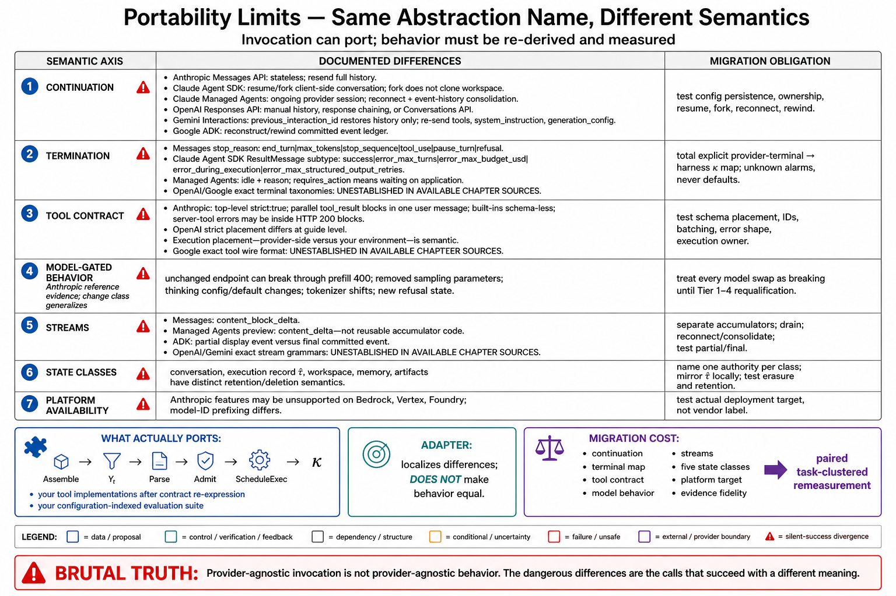

# Topic 12 — Portability Limits: Semantic Differences Hidden Behind Superficially Similar Abstractions

## 1. Problem and objective

Every surface in this chapter has an `Agent`, a `Session`, a "tool," and a way to "continue the conversation." The words match; the semantics do not. Portability marketing (the OpenAI SDK's "support for OpenAI APIs plus 100+ alternative LLM providers" [OAP]) is true at the *invocation* layer and false at the *behavior* layer, and the gap between those two truths is where migrations die. The objective is a catalogue of the specific semantic divergences documented in this chapter's sources, organized so that a migration plan can price each one — and a statement of the one portability claim that *does* hold.

## 2. Intuition first

Two systems can accept the same call and mean different things by it. "Resume the session" restores conversation context in one runtime and re-derives state from a committed event log in another — and in a third it restores history but silently *drops your tool definitions* [GIA]. "The model finished" means an emitted stop token everywhere, but the *terminal taxonomy* around it differs, and code that switches on it does not port. The dangerous divergences are never the ones that throw; they are the ones that succeed with different meaning.

## 3. The divergence catalogue

**[synthesis — the catalogue's organization is ours; every divergence is sourced]**

### 3.1 "Continue the conversation" — three incompatible meanings

| Surface | What continuation does |
|---|---|
| Anthropic Messages API | Nothing — stateless; you resend everything [ANT-API] |
| Claude Agent SDK | Resume a session by ID: "full context from previous turns is restored" client-side; fork branches without modifying the original [CAL] |
| Gemini Interactions | `previous_interaction_id` restores **history only** — `tools`, `system_instruction`, `generation_config` **must be re-specified per request** [GIA] |
| ADK | Reconstruct from the committed event ledger; "session rewinding" native [ADK] |
| Managed Agents | The session *is* provider-side and ongoing; you resume by reconnecting to its stream (with consolidation) [ANT-API] |

The Gemini row is the trap: a migration that ports "chain the conversation" from a surface where configuration persists to one where it does not produces turns running under a silently different configuration $c$ (Chapter 1, Topic 12) — no error, degraded behavior.

### 3.2 Terminal semantics

`stop_reason` (Anthropic: `end_turn`/`max_tokens`/`stop_sequence`/`tool_use`/`pause_turn`/`refusal` [ANT-API]) is not `ResultMessage.subtype` (SDK: `success`/`error_max_turns`/`error_max_budget_usd`/`error_during_execution`/`error_max_structured_output_retries` [CAL]) is not Managed Agents' `session.status_idle` + `stop_reason.type` (`requires_action`/`retries_exhausted`/`end_turn`) [ANT-API]. Three levels (model, harness, platform), three vocabularies, and a *fourth* semantic distinction that exists only on the platform: **"idle because I'm waiting on you"** [ANT-API]. Code that switches on termination does not port; it must be re-derived from Chapter 1's $\kappa_t$ per surface.

### 3.3 Tool semantics

- **Schema enforcement:** Anthropic's `strict: true` is a **top-level field on the tool definition**, not on `tool_choice` [ANT-API]; OpenAI's strict mode is a schema flag [OAT]. Same idea, different placement — and a mechanical port breaks.
- **Parallel results:** Anthropic requires **all** `tool_result` blocks in a **single** user message — "splitting them across multiple messages silently trains Claude to stop making parallel calls" [ANT-API]. A behavioral consequence with no error, invisible to a port that batches differently.
- **Built-in tool identity:** Anthropic's bash/text-editor are **schema-less Anthropic-defined tools** — "do not define a custom tool that happens to be named `bash`" [ANT-API]. A port that reconstructs them as custom tools gets a different tool with the same name.
- **Server vs client execution** differs per tool per provider (Topic 5 §6); the execution *placement* is a semantic property, not a deployment detail (Chapter 2, Topic 9).
- **Error surfacing:** Anthropic server-tool errors "return HTTP 200 with an error object" and web-search success/error content have *different shapes* (list vs object) [ANT-API]. A port that assumes exceptions loses errors silently.

### 3.4 Model-gated behavior masquerading as API behavior

This is the divergence class teams least expect, and Anthropic's own migration guide is a catalogue of it [ANT-API]: assistant **prefill returns 400** on current models; `temperature`/`top_p`/`top_k` are **removed** (400) on the newest tier; `thinking: {budget_tokens: N}` is removed in favor of adaptive thinking; `thinking.display` defaults changed silently ("omitted" — thinking blocks stream with *empty text*); tokenizers changed (a documented ~1×–1.35× token-count shift on one transition; ~30% on another); and `stop_reason: "refusal"` is a **new terminal state** on the frontier model requiring explicit handling before reading `content`. **None of these are endpoint changes.** They are model changes that break code through the same endpoint — which means "we didn't change our API integration" is not a defense, and Topic 13's migration tests must cover model swaps as breaking changes.

### 3.5 Streaming and delivery

Anthropic's SSE grammar (`message_start`/`content_block_delta`/…) [ANT-API], Managed Agents' session events (with the delta-preview grammar explicitly *not* the Messages-API one: "the delta type is `content_delta`, not `content_block_delta`, so Messages-API accumulator code does not carry over unchanged" [ANT-API]), and ADK's partial-vs-final split [ADK] are three different event models. The Managed Agents note is remarkable: it is the same *vendor* warning that its own two streams don't share accumulator code.

### 3.6 Platform availability inside one vendor

Even holding the vendor fixed, the *platform* changes semantics: the Anthropic reference's availability matrix marks Managed Agents, Batches, Files, Models API, mid-conversation system messages, and several server tools as **unsupported** on Bedrock/Vertex/Foundry, with model-ID prefixing differing (`anthropic.claude-...` on Bedrock; bare IDs on Vertex and Claude Platform on AWS) [ANT-API]. Portability fails *within* a vendor, across its cloud distributions.

## 4. What actually ports

Being fair to the abstractions, three things do **[synthesis]**:

1. **The conceptual model.** Chapter 1's typed stages and $\kappa_t$ port perfectly, because they are the invariant structure every surface implements differently. *This is why the book insists on them* — a team that reasons in $\operatorname{Assemble}/\Xi_t/\widetilde A_t/A_t/\kappa_t$ can re-derive any surface's semantics in an afternoon; a team that reasons in one SDK's vocabulary cannot.
2. **Your tool *implementations*.** The functions behind the schemas are yours and survive (though their *contracts* — schemas, placement, error surfacing — are re-expressed per surface).
3. **Your evaluation suite.** If it is built to Chapter 1, Topic 12's contract (configuration-indexed, paired, task-clustered), it measures the new surface as readily as the old — and is *precisely* the instrument that tells you what the migration cost you (§5).

## 5. Migration costing

**[synthesis — procedure ours]** For any planned migration, price these line items, each anchored in §3:

| Line item | Question |
|---|---|
| Continuation semantics | Does configuration persist across turns? (§3.1) |
| Termination taxonomy | What are the terminal states, and which mean "waiting on me"? (§3.2) |
| Tool contracts | Schema flag placement, parallel-result batching, built-in identity, error surfacing (§3.3) |
| Model behavior | Prefill, sampling params, thinking config, tokenizer, refusal states (§3.4) |
| Streams | Event grammar and accumulator code (§3.5) |
| State classes | Which of the five (Topic 11 §4) move, and do their retention/deletion semantics survive? |
| Availability | Is every feature you use present on the target *platform*, not just the target vendor? (§3.6) |
| Evidence | Does $\hat\tau$ remain constructible at the same fidelity? (Chapter 3, Topic 4) |

Then **measure**: paired, clustered, on your task suite (Chapter 3, Topic 14). A migration whose reliability delta is unmeasured is a rewrite with a hypothesis attached — and the whole point of Chapter 1's contract is that hypotheses about agent systems are wrong at rates that make measurement cheaper than optimism.

## 6. Failure modes

- **Abstraction-layer complacency:** "The SDK supports 100+ providers" [OAP] read as "our behavior is provider-independent." Invocation ports; behavior does not (§3).
- **Silent-success divergence:** the whole of §3 — none of the listed traps throws; all of them change meaning.
- **Model swaps treated as non-breaking** (§3.4) — the most common instance, and the vendor's own migration guide is a list of the 400s and silent defaults that result [ANT-API].
- **Accumulator reuse across streams** — including within one vendor [ANT-API] (§3.5).
- **Within-vendor platform surprise** — building on a feature absent on the cloud distribution you must deploy to (§3.6).
- **Porting the evaluation suite last** — leaving you unable to detect what the migration broke, which is the one thing a migration must be able to do.

## 7. Limitations

- The catalogue is bounded by this book's sources: Anthropic's surfaces are documented deeply enough to enumerate their traps; OpenAI's and Google's are documented at overview depth, so §3 under-represents *their* divergences rather than showing them to be fewer. Read the asymmetry as evidence depth, not as a portability verdict.
- Provider surfaces change; the catalogue is a snapshot and a *method*, and the method (§5) is the durable part.

## 8. Production implications

1. **Write the divergence table (§5) before, not during, a migration.** Each row is an integration test (Topic 14) and a line in the estimate.
2. **Reason in the book's notation, not the SDK's vocabulary** (§4.1) — it is the only layer that ports, and it is free.
3. **Treat every model upgrade as a migration** (§3.4), with the same divergence table and the same measured re-qualification.
4. **Isolate provider semantics behind your own boundary**: a thin adapter expressing $\operatorname{Assemble}/\operatorname{Admit}/\operatorname{ScheduleExec}/\kappa$ over each surface makes the divergences *explicit and testable* rather than diffuse. Note honestly what this does not buy: it does not make behaviors equal, only their differences visible and localized.
5. **Port the eval suite first** (§4.3). It is the instrument that tells you whether the migration succeeded, and it is the cheapest thing in the plan.

## 9. Connections

- Topics 2–9 supplied the surfaces this topic diffs; Topic 11's state table is one of §5's line items; Topic 13 keeps the divergences current; Topic 14 turns them into executable conformance tests.
- Chapter 1, Topic 12's notation is the portable layer (§4.1); Chapter 3, Topic 14's methodology is how a migration's cost is actually measured.

## Sources

[ANT-API] Anthropic Claude API, Managed Agents, and model-migration reference — stateless Messages API; `strict` placement; parallel `tool_result` batching requirement; schema-less built-in tools; server-tool HTTP-200 error objects and shape-dependent content; terminal taxonomies; Managed Agents delta grammar (`content_delta` ≠ `content_block_delta`); model-gated breaking changes (prefill 400, sampling-param removal, thinking config, tokenizer shifts, `refusal` stop reason, `thinking.display` default change); platform-availability matrix and model-ID prefixing — platform.claude.com docs (cache 2026-06)
[CAL] Claude Agent SDK (session resume/fork; `ResultMessage` subtypes) — https://code.claude.com/docs/en/agent-sdk/agent-loop
[GIA] Gemini Interactions API (`previous_interaction_id` restores history only; interaction-scoped params must be re-specified) — https://ai.google.dev/gemini-api/docs/interactions
[OAP] OpenAI Agents SDK (provider agnosticism claim) — https://github.com/openai/openai-agents-python
[OAT] OpenAI Tools guide (strict mode as a schema flag) — https://developers.openai.com/api/docs/guides/tools
[ADK] Google ADK runtime (event ledger; partial vs final) — https://adk.dev/runtime/event-loop/
