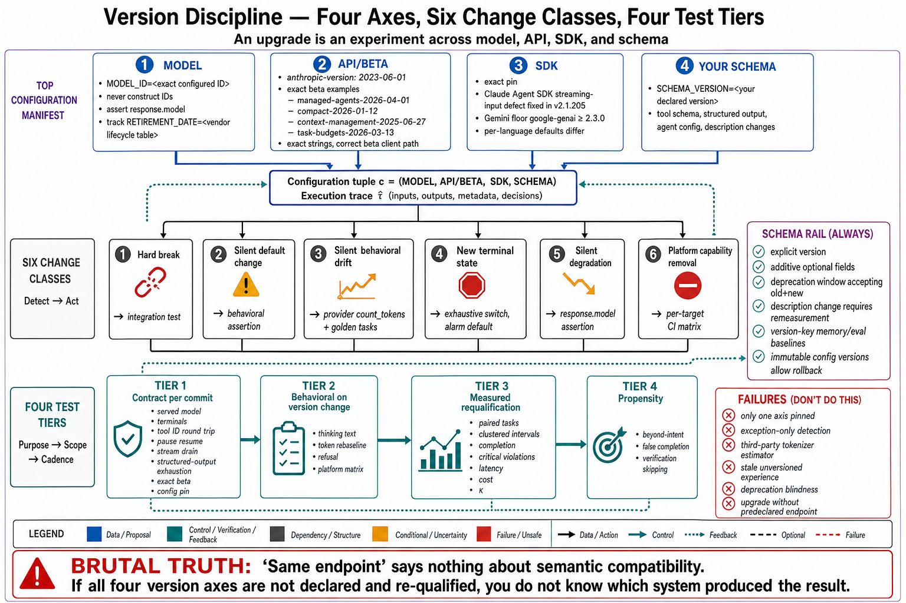

# Topic 13 — Version Pinning, Release Compatibility, Schema Evolution, and Migration Tests

## 1. Problem and objective

Chapter 1's configuration tuple $c=(M_c,H_c,D_c,\nu_c,B_c,P_c,\mathcal U_c,J_c)$ says every reported number is indexed by a *version*. This topic is that requirement made operational against interfaces that change on someone else's schedule: model IDs that retire, beta headers that gate features, SDK releases that fix silent defects, tool schemas that evolve, and — the class teams most underestimate — **model upgrades that break code through an unchanged endpoint**. The objective is the pinning surface (what must be pinned, and where), the change classes with their detection strategies, and the migration-test discipline that makes an upgrade an experiment rather than a leap.

## 2. Intuition first

There are four independent version axes in an agent system, and a team that pins only the obvious one is exposed on three. **Model version** (behavior, tokenizer, terminal states). **API/beta version** (feature availability, request shape). **SDK version** (client semantics, defect fixes, defaults). **Your own schema version** (tool contracts, structured-output schemas, agent configs). Any of the four can change under you; only the last is yours to schedule. The engineering job is to make all four *declared*, so that when behavior changes you can say which axis moved.

## 3. The pinning surface

**Model IDs.** Exact strings, never constructed: the reference is explicit that IDs are complete as-is and that appending date suffixes to aliases produces 404s [ANT-API]. Models have documented lifecycle states — Active / Deprecated (with retirement dates) / Retired (404) — and a retired-model table with drop-in replacements [ANT-API]. Pin the ID; track the deprecation date; **never leave a retired ID in code** — and note the asymmetric failure the reference documents for one deprecated variant: a retired `-fast` model string **silently falls back** to the standard model (you lose the speed, no error), while a later one **returns an error** [ANT-API]. Silent degradation and hard failure from the same class of change is exactly why an inventory beats vigilance.

**API and beta versions.** `anthropic-version: 2023-06-01` plus dated `anthropic-beta` flags gating features: `managed-agents-2026-04-01`, `compact-2026-01-12`, `context-management-2025-06-27`, `task-budgets-2026-03-13`, `files-api-2025-04-14`, `skills-2025-10-02`, `fast-mode-2026-02-01`, `server-side-fallback-2026-06-01` [ANT-API]. Three disciplines follow. (i) **Beta headers are exact strings** — the reference warns that a nearby-looking date is rejected ("the current header carries the *earliest* date of the series... do not 'correct' it to a newer-looking date") [ANT-API]. (ii) **Beta ⇒ pin and monitor**: a beta surface can change shape; the reference documents a v1→v2 fallbacks migration where "the v1 parameter shape under the v2 header is a 400" [ANT-API]. (iii) **Beta features gate on the client path** — `client.beta.messages.*` vs `client.messages.*` — so removing a header means moving the call site [ANT-API].

**SDK versions.** Client semantics change and defects get fixed: the Agent SDK documents a streaming-input message-loss defect fixed in **v2.1.205** ("before v2.1.205, a message that arrived on the turn's final iteration could be consumed into the ending turn and lost") [CAL]; the Gemini SDKs have version floors (`google-genai` ≥ 2.3.0) [GIA]; language SDKs differ in defaults (timeout units, retry counts) [ANT-API]. Pin exactly; read changelogs for *semantic* changes, not just API additions.

**Your schemas.** Tool schemas ($\mathcal U_c$), structured-output schemas, agent configs. Managed Agents is the one surface that versions your config *for* you — every update to an agent "creates a new immutable version (numeric timestamp)"; sessions pin with `{type: "agent", id, version}`, enabling reproducibility, safe iteration, and rollback [ANT-API]. That is the model the other surfaces make you build; §5's discipline is how.

## 4. Change classes and their detection

**[synthesis — the class taxonomy and detection column are ours; each example sourced]**

| Class | Example | Detection |
|---|---|---|
| **Hard break** (throws) | Prefill → 400; `temperature` → 400 on newest models; `budget_tokens` → 400 [ANT-API] | Integration tests; the exception is the alarm |
| **Silent default change** | `thinking.display` default flipped to `"omitted"` — thinking blocks stream with **empty text**; adaptive thinking on-by-default where it previously ran thinking-off [ANT-API] | **Behavioral assertions**, not exception handling |
| **Silent behavioral drift** | Tokenizer change (~1×–1.35×, ~30% on another transition) shifting token counts, context budgets, and `max_tokens` sufficiency [ANT-API] | Golden-task evals + token-count re-baselining (`count_tokens` per model, never estimator libraries) |
| **New terminal state** | `stop_reason: "refusal"` with `stop_details`; must be handled *before* reading content [ANT-API] | Exhaustive switch on terminal states; a default branch that alarms |
| **Silent degradation** | Retired `-fast` model silently falling back to standard [ANT-API] | Assert on `response.model` — the reference's own verification step |
| **Capability removal by platform** | Feature present on the API, absent on Bedrock/Vertex/Foundry [ANT-API] | Platform-matrix check in CI per deployment target |

The two rows to internalize are *silent default change* and *silent degradation*, because they are the ones your error handling cannot see. Detection for both is the same shape: **assert on observable facts** (the served model ID; the presence of thinking text; the token count) rather than on the absence of exceptions.

## 5. Schema evolution

**Tool and output schemas are API contracts with two consumers** — your code and the model — and they break differently for each **[synthesis]**. Code-side breakage is ordinary (a removed field, a renamed enum). Model-side breakage is subtler: a schema whose *descriptions* change is a different policy input (Chapter 2, Topic 5's selection factor), and a schema the model chronically fails to satisfy is usually a badly designed constraint rather than a model failure — the reference's read of `error_max_structured_output_retries` exhaustion [CAL]. Disciplines:

1. **Version schemas explicitly**, and treat description changes as behavior changes requiring re-measurement (Chapter 3, Topic 14's ablation, at schema granularity).
2. **Prefer additive evolution** (new optional fields) and stage removals behind a deprecation window in which both shapes validate.
3. **Version-key accumulated experience.** Anything that stores model-conditioned evidence — router memory (Chapter 2, Topic 12 §6.3), eval baselines, cached judgments — must record the version it was collected under, or the store silently mixes regimes.
4. **Use the platform's versioning when it exists** — Managed Agents' immutable agent versions with session pinning [ANT-API] is the reference implementation, and its rollback story ("if a new system prompt regresses, pin new sessions back to the prior version") is what your homegrown config store should replicate.

## 6. Migration tests

The discipline that turns an upgrade from a leap into an experiment **[synthesis — protocol ours; grounded in the sourced practices and Ch. 3 Topic 14]**:

**Tier 1 — Contract tests (fast, per-commit).** For each surface, assert the interface facts your code depends on: the served model ID (`assert response.model.startswith(TARGET)` — the reference's own verification step [ANT-API]); terminal-state handling for every documented subtype; tool-call round-trip including ID pairing, parallel-result batching, and `is_error` (Topic 5 §4); `pause_turn` resumption (the documented silent-truncation defect, *including under the SDK tool runners* [ANT-API]); stream-to-completion past `ResultMessage` [CAL]; structured-output retry exhaustion handled.

**Tier 2 — Behavioral assertions (per model/SDK/beta change).** The silent-change detectors of §4: thinking text present when `display: "summarized"` is set; token counts re-baselined per model with `count_tokens` [ANT-API]; refusal path exercised; `max_tokens` sufficiency re-checked against the new tokenizer.

**Tier 3 — Measured re-qualification (per model change; per significant SDK/harness change).** The full Chapter 3, Topic 14 protocol: paired, same tasks, clustered intervals, vector outcomes (completion, critical violations, latency/cost quantiles, $\kappa$ distribution), predeclared primary endpoint. **A model upgrade is a configuration change (Chapter 1, Topic 12) and inherits the same evidentiary burden as a harness edit** — the vendor's own migration guides distinguish `[BLOCKS]` items (hard breaks) from `[TUNE]` items (quality/cost re-tuning: effort levels, verbosity, tool-triggering, prompt scaffolding to *remove*) [ANT-API], and only Tier 3 can tell you where the `[TUNE]` items landed.

**Tier 4 — Propensity re-screen (per model change).** Chapter 2, Topic 14's behavioral metrics: beyond-intent actions, false completion, verification skipping. The measured record shows these regress *inside* capability upgrades [G56 §1; FSC §6.3.5], so the capability re-qualification does not cover them.

## 7. Failure modes

- **Pinning the model, floating the SDK** (or vice versa) — three of four axes exposed (§2).
- **Beta header drift** — "correcting" an exact string to a newer-looking date; rejected [ANT-API].
- **Treating a model upgrade as a no-op** — the entire §4 table, and the vendor's own migration guides exist because it isn't.
- **Exception-only detection** — blind to silent default changes and silent degradation (§4's two critical rows).
- **Token estimators instead of `count_tokens`** — the reference is blunt that third-party tokenizers "undercount Claude tokens by ~15–20% on typical text, and by much more on code" [ANT-API]; a budget built on one is wrong on every model.
- **Un-versioned experience stores** — router memory or eval baselines mixing regimes across a model change (§5.3).
- **Deprecation-date blindness** — a retirement arriving as a production 404 (§3).
- **Migration without a measured endpoint** — Tier 3 skipped; the upgrade's effect is a matter of opinion (Chapter 1, Topic 7's whole argument).

## 8. Limitations

- The specifics (headers, IDs, dates, SDK versions) are cache-dated snapshots; the *classes* (§4) and the *tiers* (§6) are the durable content.
- Only the Anthropic surface documents its breaking-change history at the granularity §4 requires; the corresponding OpenAI/Google change classes are certainly present and are under-represented here for evidence-depth reasons (Topic 12 §7's asymmetry note applies).
- Tier 3/4 costs are real; §9.4 states the honest floor for teams that cannot pay them in full.

## 9. Production implications

1. **Declare all four axes in one file** (model IDs, API/beta headers, SDK versions, your schema versions) and make it the artifact that CI reads and the configuration tuple $c$ cites. If you cannot print your system's versions in one command, you cannot report a number under Chapter 1's contract.
2. **Build Tier 1 contract tests now** — every one of §6's assertions corresponds to a documented silent failure, and they are cheap.
3. **Gate model upgrades behind Tiers 2–4** (§6). "It's the same endpoint" is not evidence of anything.
4. **The honest floor when Tier 3 is unaffordable:** Tier 1 + Tier 2 + a paired golden-task run with $N_R \ge 3$ and the $\kappa$/cost/latency vector reported — and *label the result exploratory* (Chapter 3, Topic 14 §8's minimum-viable line).
5. **Track deprecation calendars as a standing operational task**, and treat a retirement date as a project with a date, not a warning to be re-read.

## 10. Connections

- Topic 12's divergences are what migrations must price; this topic is how you keep them from arriving unannounced. Topic 14 implements §6's tiers as runnable conformance tests.
- Chapter 1, Topic 12 (configuration identity), Chapter 2, Topics 11–14 (selection, portfolios, levers, propensities), and Chapter 3, Topic 14 (ablation methodology) are the machinery this topic schedules; Chapter 15's capability-drift management is its lifecycle form.

## Sources

[ANT-API] Anthropic Claude API and model-migration reference — exact model IDs and lifecycle tables (Active/Deprecated/Retired; retired-model 404s; `-fast` silent-fallback vs error asymmetry); `anthropic-version` and dated beta headers (exact-string requirement; beta client path; v1→v2 shape break); model-gated breaking changes (`[BLOCKS]`/`[TUNE]` classification; prefill 400; sampling-param removal; `budget_tokens` removal; `thinking.display` default change; tokenizer shifts; `refusal` stop reason); verification step (`assert response.model.startswith(...)`); `count_tokens` vs third-party tokenizers; Managed Agents immutable agent versioning with session pinning and rollback; platform-availability matrix — platform.claude.com docs (cache 2026-06)
[CAL] Claude Agent SDK — streaming-input defect fixed in v2.1.205; `error_max_structured_output_retries`; iterate-past-`ResultMessage` — https://code.claude.com/docs/en/agent-sdk/agent-loop
[GIA] Gemini Interactions API — SDK version floors — https://ai.google.dev/gemini-api/docs/interactions
[G56] GPT-5.6 Preview System Card §1 — beyond-intent propensity regression across a version step — `Knowledge_source/gpt-5-6-preview.pdf`
[FSC] Claude Fable 5 & Mythos 5 System Card §6.3.5 — code-summary honesty regression at a frontier step — `Knowledge_source/`
