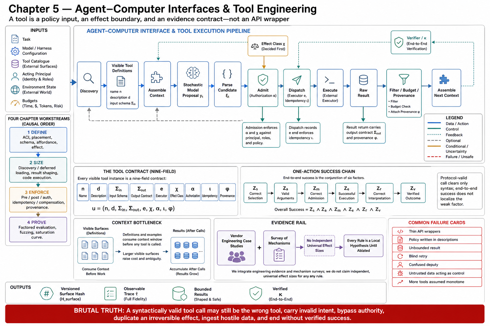

# Chapter 5 — Agent–Computer Interfaces and Tool Engineering



## Scope, Prerequisites, Terminology, System Boundaries, Exclusions, and Expected Outcomes

---

## 1. Why this chapter exists

Chapter 3 established the harness as an execution control plane. Chapter 4 documented the provider interfaces that carry its traffic, and guaranteed that a tool round trip is *well-formed*. Neither answers the question this chapter is about: **was the tool worth calling, and could the model tell?**

That question is load-bearing, not decorative. The Code-as-Agent-Harness survey names **brittle tool interfaces** among the recurring non-model failure mechanisms: observed failures "arise from missing repository context, brittle tool interfaces, weak validators, excessive token cost, poor retry policies, or mismatched permission boundaries rather than from model generation" [CAH §3.5]. Anthropic's tool-engineering study begins from the same premise and states the design consequence bluntly: **"More tools don't always lead to better outcomes. A common error we've observed is tools that merely wrap existing software functionality or API endpoints—whether or not the tools are appropriate for agents"** [WTA].

The chapter's organizing claim, and the reason it is a chapter rather than a subsection of Chapter 4: **a tool is not an API; it is "a contract between deterministic systems and non-deterministic agents"** [WTA]. An API's caller is code that has already decided to call it, with arguments it has already computed. A tool's caller is a stochastic policy $\pi_M$ that must *infer* — from a name, a description, and a schema — that this tool applies, that now is the moment, and what the arguments should be. The tool surface is therefore not an implementation detail behind the harness. It is **part of the policy's input distribution**: the part you control most directly, change most cheaply, and measure least often.

The survey states the same shift in its own terms: "The core challenge is no longer whether a model can call a tool, but whether the harness can make tool use safe, auditable, and useful for long-horizon execution" [CAH §3.3].

## 2. Problem, bottleneck, and objective

**The problem.** Every tool-mediated action must clear a chain of independent conditions: the model must *select* the right tool, *construct* valid arguments, the harness must *admit* the call, the environment must *execute* it, the model must *interpret* the result, and something must *verify* the outcome. A syntactically valid tool call that satisfies the protocol of Chapter 4 has cleared exactly one of these. Treating protocol conformance as task success is the specific error that produces inflated reliability claims.

**The bottleneck.** The tool surface competes for the scarcest resource in the system. Tool definitions consume context before any work begins — "In cases where agents are connected to thousands of tools, they'll need to process hundreds of thousands of tokens before reading a request" [CXM] — and tool *results* consume it again, repeatedly, as the run proceeds. Meanwhile the model's ability to select correctly degrades as the surface grows and options become confusable. The tool surface is thus a resource-allocation problem and a policy-conditioning problem *at the same time*, and the two pull in opposite directions: the tool that would be easiest to select is often the one whose description is longest.

**The objective.** Specify the agent–computer interface as an engineering artifact with stated contracts, enforcement points, cost bounds, and a measurement protocol — such that a change to it is a *configuration change* with the evidentiary burden that implies (Chapter 1, Topic 12), rather than an undocumented edit to a string that silently changes the policy.

**Assumptions carried in.** The wire protocol is correct (Chapter 4, Topics 5 and 14: IDs paired, results batched, every call answered). The model is a stochastic proposal generator with no guarantees (Chapter 2, Topic 1). The harness owns admission and dispatch (Chapter 3).

**Constraints.** Context is finite and is the binding constraint. The model cannot be assumed to read a description it was not shown, nor to ignore one it was. Tool descriptions are attacker-reachable in any system where tool inventories are partly third-party (MCP). Vendors document their own systems; almost nothing in this domain has an independent controlled study.

**Success criteria for the chapter.** The reader can state, for any tool in their system: its effect class, its authorization predicate over *arguments*, its idempotency contract, its result budget, its provenance envelope, and its measured selection accuracy — with a number attached to the last one.

## 3. Prerequisites

Chapters 1–4 in full. This chapter leans hardest on:

- **Chapter 1, Topic 12** — the notation and statistics contract: typed stages, $\kappa_t$, the configuration tuple, the observable trace $\hat\tau$, and the statistical discipline binding every measurement here.
- **Chapter 2, Topic 5** — tool-call generation as *selection under uncertainty*: the model's choice is a draw from a distribution conditioned on the descriptions you wrote.
- **Chapter 3, Topics 6–7** — the control-plane/data-plane split (CP-1: data must not act as control) and the deterministic invariant floor. Topic 12 of this chapter is CP-1 applied to tool output; Topic 10 is the invariant floor applied to tool arguments.
- **Chapter 4, Topics 5 and 14** — the tool-use protocol and its invariants I1–I6, assumed correct throughout.

Working knowledge of JSON Schema, HTTP API contracts, authorization models, idempotency and retry semantics, and basic distributed-systems failure modes is assumed.

## 4. Terminology fixed for this chapter

| Term | Definition adopted | Source |
|---|---|---|
| **Tool** | "A contract between deterministic systems and non-deterministic agents" | [WTA] |
| **Agent–computer interface (ACI)** | The complete tool surface as *perceived by the model*: names, descriptions, schemas, results, errors, and the discovery mechanism that exposes them | [WTA]; **[synthesis]** |
| **Affordance** | A property that makes a tool's applicability inferable from context. Agents "have distinct 'affordances' to traditional software—that is, they have different ways of perceiving the potential actions they can take with those tools." Distinguished from *capability*: a tool the model cannot tell to call has capability and no affordance | [WTA] |
| **Tool classes (functional)** | Function-oriented, environment-interaction, verification-driven, and workflow-orchestration tool use | [CAH §3.3] |
| **Deferred loading** | Withholding a tool's parameter schema from initial context; the model sees names and descriptions only and retrieves schemas on demand (`defer_loading: true`) | [TS] |
| **Tool search** | A meta-tool (`{"type": "tool_search"}`) by which the model discovers deferred tools; emits `tool_search_call`, receives `tool_search_output` carrying the loaded definitions | [TS] |
| **Progressive disclosure** | Structuring the surface so definitions are read on demand: "Models are great at navigating filesystems. Presenting tools as code on a filesystem allows models to read tool definitions on-demand, rather than reading them all up-front" | [CXM] |
| **Namespacing** | "Grouping related tools under common prefixes" to "delineate boundaries between lots of tools" | [WTA] |
| **Tool response budget** | A hard cap on tokens a tool may return. "For Claude Code, we restrict tool responses to 25,000 tokens by default" | [WTA] |
| **Untrusted-content boundary** | The line at which tool output — which is *data* — must be prevented from acting as *control* | Ch. 3, Topic 6 (CP-1); [CAH §5] |
| **Tool contract $u$** | The engineering object this chapter specifies: $u=(n_u,\ d_u,\ \Sigma^{\mathrm{in}}_u,\ \Sigma^{\mathrm{out}}_u,\ e_u,\ \chi_u,\ \alpha_u,\ \iota_u,\ \phi_u)$ — name, model-visible description, input schema, output contract, executor placement, effect class, authorization predicate, idempotency contract, provenance contract | **[synthesis]** — assembled in Topic 1; each field sourced there |

## 5. Formal frame carried through the chapter

The chapter is about $\mathcal U_c$, the tool-contract component of the configuration tuple $c=(M_c,H_c,D_c,\nu_c,B_c,P_c,\mathcal U_c,J_c)$, and about the two typed stages it dominates:

$$
\underbrace{c_t=\operatorname{Assemble}_{H_c}(\cdot)}_{\text{tool definitions and prior results enter here}}
\quad\longrightarrow\quad
y_t\sim\pi_M(\cdot\mid c_t)
\quad\longrightarrow\quad
\xi_t=\operatorname{Parse}_{H_c}(y_t)
\quad\longrightarrow\quad
\underbrace{\widetilde a_t=\operatorname{Admit}_{H_c}(\xi_t)}_{\text{Topic 10's checks execute here}}
\quad\longrightarrow\quad
\underbrace{a_t=\operatorname{Dispatch}_{H_c}(\widetilde a_t)}_{\text{Topic 11's idempotency lives here}} .
$$

For a single required tool-mediated action, decompose success into the six conditions of §2 — correct selection $Z_s$, valid arguments $Z_a$, correct admission $Z_m$, successful execution $Z_e$, correct result interpretation $Z_r$, and verified outcome $Z_v$. The exact statement is the chain rule, and it is exact because no independence is assumed:

$$
\Pr(Z_s\cap Z_a\cap Z_m\cap Z_e\cap Z_r\cap Z_v)
=\Pr(Z_s)\cdot\Pr(Z_a\mid Z_s)\cdot\Pr(Z_m\mid Z_s,Z_a)\cdots\Pr\bigl(Z_v\mid Z_s,\ldots,Z_r\bigr).
$$

**[derived]** Two consequences organize the chapter, and both survive without an independence assumption. First, **the chain has no weakest-link shortcut but it does have a floor**: a system reporting only end-to-end success cannot say which factor is small, which is why Topic 13 measures $\Pr(Z_s)$ and $\Pr(Z_a\mid Z_s)$ *separately* rather than folding them into an accuracy number. Second, **the conditioning is real and adversarial to intuition** — a tool description rewritten to raise $\Pr(Z_s)$ can lower $\Pr(Z_a\mid Z_s)$ by making the tool attractive in cases whose arguments the model cannot construct. This is the mechanism behind Topic 15's saturation result, and it is why the chapter refuses to treat "add a tool" as monotone.

Note carefully what these factors are *not*. Chapter 1's error-accumulation model concerns per-step success over a horizon; this decomposition concerns *one* action. They compose — a run of $K$ tool-mediated steps multiplies the horizon model over the per-action chain — and conflating them produces the familiar error of quoting a per-action number as a per-run guarantee.

## 6. Architecture: where the tool surface sits

```
                 ┌──────────────────── the ACI: this chapter ────────────────────┐
                 │                                                               │
  discovery ──►  tool definitions (n, d, Σin)  ──► Assemble ──► [ CONTEXT ]      │
  (T6, T8)       namespaces, deferred loading                       │            │
                                                                    ▼            │
                                                              model  π_M         │
                                                                    │            │
                                                          proposal  y_t          │
                                                                    ▼            │
                                                                  Parse          │
                                                                    │  ξ_t       │
                                                                    ▼            │
                 authorization α_u, preconditions  ──────────►   Admit  ◄── T10  │
                                                                    │  ã_t       │
                                                                    ▼            │
                 idempotency ι_u, retry, compensation ─────────► Dispatch ◄─ T11 │
                                                                    │  a_t       │
                                                                    ▼            │
                                                              executor e_u       │
                                                            (T2 placement,       │
                                                             T9 families)        │
                                                                    │            │
                 result budget, pagination, truncation  ◄──── raw result         │
                 provenance envelope φ_u (T7, T12)                  │            │
                 postconditions, verification (T10)                 ▼            │
                 └───────────────────────────────► back to Assemble ─────────────┘
```

**Dependency order for building this.** Effect class $\chi_u$ first (Topic 5), because it determines everything downstream: an irreversible write earns an authorization predicate, an idempotency key, and a confirmation gate that a read does not. Then schema and description ($\Sigma^{\mathrm{in}}_u$, $d_u$: Topics 3–4), because they are the policy inputs. Then discovery (Topic 6), because it is only a problem once the surface is large. Then result shaping (Topic 7) and, if the surface is large enough to justify it, aggregation (Topic 8). Enforcement (Topics 10–12) is not a later phase — it is a property of each contract, written when the contract is written.

## 7. System boundary

**Inside.** Tool definition and schema design; the model-facing semantics of names, descriptions, and arguments; discovery and loading strategy; result shaping (compression, pagination, filtering, truncation, format); the read/write and reversibility classification; preconditions, postconditions, and argument-level authorization; retry, idempotency, and compensation at the tool contract; provenance and untrusted-content handling at the tool boundary; and the evaluation of tool choice and argument validity.

**Outside.** The wire protocol (Chapter 4). Everything in the context that is *not* a tool definition or tool result (Chapter 6). Durable memory and artifact stores (Chapter 7). Multi-agent topology (Chapters 8–9) — though *agents-as-tools* appears here, in Topic 2, as a tool type with a cost profile. Domain agent construction (Chapter 11). The threat model and governance policy behind permissions (Chapter 12).

The seam with Chapter 12 is worth stating precisely, because it is the one readers most often place wrongly: **this chapter specifies that authorization must be argument-aware and where the check must sit; Chapter 12 specifies what the policy should say.** The survey's formulation is why the seam falls here — permissions "should depend not only on tool identity, but also on arguments, environment state, data sensitivity, and expected side effects" [CAH §5]. A check with that signature is a property of the *tool contract*, not of a policy file bolted on afterwards.

## 8. Exclusions

- No catalogue of vendor tools or MCP servers. Topic 9 characterizes tool *families* by hazard and result profile, not by product.
- No MCP protocol walk-through. MCP appears as a tool *type* with consequences for context cost and trust, not as a wire format to document.
- No general prompt engineering. Tool descriptions and schemas are in scope precisely because they are *policy inputs*, not commentary — a distinction Topic 4 makes formal.
- No security threat modeling (Chapter 12), though the untrusted-content boundary (Topic 12) and the authorization points (Topic 10) are specified here as interface obligations.

## 9. Measurable outcomes for the reader

1. **Classify** any tool on the four axes that determine its engineering treatment: functional class [CAH §3.3], read vs. write, reversible vs. irreversible, and trusted vs. untrusted output.
2. **Write a tool contract** $u$ with all nine fields populated, and defend each as a policy input or an enforcement point rather than an implementation convenience (Topics 1–5).
3. **Choose a discovery strategy** — all-loaded, namespaced, deferred/tool-search, or code-execution aggregation — from a measured token and selection-accuracy budget, and state the crossover at which the choice flips (Topics 6, 8).
4. **Specify a result contract**: budget, pagination, filtering, truncation, error format, and provenance envelope (Topics 7, 12).
5. **Place the enforcement points**: preconditions, argument-level authorization, postconditions, idempotency keys, and compensation paths (Topics 10–11).
6. **Measure the surface**: tool-choice accuracy and argument validity as *separate* quantities with confidence intervals, under the statistics contract of Chapter 1, Topic 12; fuzz the contract; run an adversarial-description test (Topics 13–14).
7. **Detect saturation**: state the mechanisms by which adding a tool reduces measured performance, and run the experiment that finds your system's turning point (Topic 15).

## 10. Source ledger, and an honest statement of evidence quality

All previously established tags remain in force ([HB], [CAH], [HX], [AAR], [ALE], [FSC], [G56], [MEM], [BEA], [CAL], [DEM], [ANT-API], [OAG], [OAP], [OAT], [ADK], [ADK-A], [GIA], [CDX], plus the statistics tags of Chapter 1, Topic 12). New in this chapter:

| Tag | Source | Provenance |
|---|---|---|
| [WTA] | Anthropic, "Writing effective tools for agents — with agents" | https://www.anthropic.com/engineering/writing-tools-for-agents |
| [CXM] | Anthropic, "Code execution with MCP: building more efficient agents" | https://www.anthropic.com/engineering/code-execution-with-mcp |
| [TS] | OpenAI, tool-search guide (`defer_loading`, `tool_search`) | https://developers.openai.com/api/docs/guides/tools-tool-search |
| [ADK-T] | Google ADK custom-tools documentation (function tools, long-running tools, agent-as-tool, tool performance) | https://adk.dev/tools-custom/function-tools/ ; https://adk.dev/integrations/ |

**Evidence quality, stated plainly and enforced throughout.** This chapter's strongest evidence is *vendors reporting engineering results on their own systems* [WTA; CXM; TS], plus a survey that catalogues mechanisms without estimating their prevalence [CAH §3.3, §3.5]. That is a weaker base than a controlled study, and it is what exists. Three rules follow, and the chapter obeys them without exception:

1. **Vendor numbers are reported with their scope attached, and are never upgraded into laws.** The 98.7% token reduction [CXM] is one worked case study on one workflow. The 25,000-token cap [WTA] is one product's default, not a derived optimum. The SWE-bench Verified result attributed to tool-description refinement [WTA] is an uncontrolled attribution by the party that made the change. And the source's own finding on namespacing is that effects "vary by LLM" and that you should "choose a naming scheme according to your own evaluations" [WTA] — which is an instruction to *not* generalize it.

2. **The central mechanism of this chapter is un-quantified in the public literature.** No source known to this chapter reports a measured curve of task success against tool-surface size — which is exactly what Topic 15 would need to state its result quantitatively. Topic 15 therefore states the *mechanisms* with sources, states the *magnitude* as unmeasured, and hands the reader the experiment to run locally. This is the chapter's largest evidence gap and it is named rather than papered over.

3. **Every design rule here is a hypothesis about your system until you ablate it.** The tool surface is $\mathcal U_c$; a change to it is a configuration change carrying the evidentiary burden of Chapter 3, Topic 14. The vendor sources model this discipline themselves, using "held-out test sets to ensure we did not overfit to our 'training' evaluations" [WTA]. A reader who adopts this chapter's rules without measuring has substituted our priors for their evidence, which is the failure this book exists to prevent.

## 11. Chapter layout

Every topic file in this chapter — and in the remainder of the book — follows one skeleton, one section per governing instruction:

```
1.  Scope, prerequisites, terminology, boundaries, exclusions, outcomes
2.  Problem, bottleneck, objective, assumptions, constraints, success criteria
3.  Intuition first, then formalization (equations, algorithms, invariants)
4.  Architecture: components, responsibilities, interfaces, data and control flow
5.  Grounding: primary sources, specifications, reproducible evidence
6.  Implementation: APIs, schemas, data structures, configuration, semantics
7.  Trade-offs: complexity, latency, throughput, scalability, reliability, security, cost
8.  Experiments: baselines, ablations, metrics, statistical tests, thresholds
9.  Failure modes, edge cases, hazards, mitigations, recovery, open limitations
10. Verified observations, decision rules, production implications, connections
```

Chapter map:

```
00 scope (this file)
01 the ACI as a first-class design object     ── the premise
02 tool types and executor placement        ──┐
03 schema design                              ├─ defining the surface
04 semantic affordance                        │
05 read/write, reversible/irreversible      ──┘
06 discovery, deferred loading, namespaces  ──┐
07 result compression and disclosure          ├─ sizing the surface
08 code execution as an aggregation layer   ──┘
09 the standard tool families                 ── the concrete inventory
10 preconditions, postconditions, authorization ──┐
11 retry, idempotency, compensation               ├─ making calls safe
12 provenance and untrusted content             ──┘
13 tool-choice and argument-validity evaluation ──┐
14 contract fuzzing and adversarial descriptions   ├─ proving the surface
15 why adding tools can reduce performance      ──┘ the closing result
```

Chapter 6 takes the context window that Topics 6–8 fought to protect and asks what should occupy it. Chapter 12 takes the enforcement points of Topic 10 and supplies the policy.

## 12. Notation and grounding contract

Chapter 1, Topic 12 binds this chapter. Tool contracts are $\mathcal U_c$; a candidate call is a component of $\xi_t$; admission is where Topic 10's checks execute; dispatch is where Topic 11's idempotency lives. Every claim carries a source tag. Every synthesis beyond a source is flagged **[synthesis]** or **[derived]** with its assumptions stated. Anything unmeasured is stated as unmeasured rather than asserted with a confidence it has not earned.

## Sources

[WTA] Anthropic, "Writing effective tools for agents — with agents" — tool as contract between deterministic systems and non-deterministic agents; affordances; "more tools don't always lead to better outcomes"; namespacing; 25,000-token response cap in Claude Code; held-out test sets — https://www.anthropic.com/engineering/writing-tools-for-agents
[CXM] Anthropic, "Code execution with MCP: building more efficient agents" — context cost of large tool surfaces ("hundreds of thousands of tokens"); progressive disclosure via filesystem-presented tools — https://www.anthropic.com/engineering/code-execution-with-mcp
[TS] OpenAI, tool-search guide — `defer_loading`, `tool_search`, `tool_search_call`/`tool_search_output` — https://developers.openai.com/api/docs/guides/tools-tool-search
[CAH] Code as Agent Harness, arXiv:2605.18747 (`Knowledge_source/2605.18747v1.pdf`) §3.3 (four tool classes; "the core challenge is no longer whether a model can call a tool"), §3.5 (brittle tool interfaces among non-model failure mechanisms), §5 (permissions depend on arguments, environment state, data sensitivity, expected side effects)
[ADK-T] Google ADK custom tools — https://adk.dev/tools-custom/function-tools/
