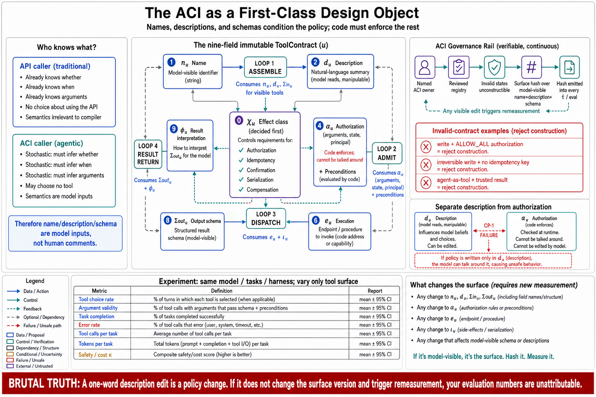

# Topic 1 — The Agent–Computer Interface as a First-Class Design Object



## 1. Scope, prerequisites, terminology, boundaries, exclusions, outcomes

**Scope.** This topic establishes the agent–computer interface (ACI) as an engineering object with a definition, a formal contract, and an owner. It fixes the tool-contract tuple $u$ that the remaining fourteen topics populate field by field.

**Prerequisites.** Chapter 2, Topic 5 (tool-call generation as selection under uncertainty); Chapter 3, Topic 1 (the harness definition and its $\mathcal U_c$ component); Chapter 4, Topic 5 (the tool round trip, assumed correct).

**Terminology.** *Tool*: "a contract between deterministic systems and non-deterministic agents" [WTA]. *ACI*: the complete tool surface as perceived by the model. *Affordance*: a property making applicability inferable. *Capability without affordance*: a tool that works but that the model cannot tell to call.

**Boundaries.** Inside: the definition, the contract tuple, the argument for first-class status, and the ownership discipline. Outside: each field's design (Topics 2–12) and its measurement (Topics 13–15).

**Exclusions.** No survey of function-calling syntaxes; Chapter 4 owns the wire.

**Outcomes.** The reader can (i) state why an ACI is not an API, in terms of the caller's epistemic position rather than by analogy; (ii) write the nine-field contract for a tool in their system; (iii) name the ACI's owner, version, and review process.

## 2. Problem, bottleneck, objective, assumptions, constraints, success criteria

**Problem.** Tool surfaces are, in most systems, an accretion. Someone wraps an endpoint; someone else adds a second; a third imports an MCP server carrying forty more. No one owns the surface, no one versions it, and no one has measured it. Yet it sits directly on the causal path from model intent to environmental change, and — unlike the model — it is entirely under your control.

**Bottleneck.** The specific error is category confusion. Engineers build tools with the reflexes of API design: completeness, orthogonality, thin wrappers over existing endpoints, identifiers as keys. Those reflexes are correct for a caller that is code and *wrong for a caller that must infer*. [WTA] names this directly: "A common error we've observed is tools that merely wrap existing software functionality or API endpoints—whether or not the tools are appropriate for agents."

**Objective.** Convert the tool surface from accretion into artifact: a versioned, owned, contract-bearing component $\mathcal U_c$ whose every field has a stated purpose and a measurable consequence.

**Assumptions.** The model cannot be assumed to read what it was not shown, nor to ignore what it was; tool definitions occupy context; the model's selection is stochastic.

**Constraints.** Context is finite. Descriptions compete with task content. Some tools arrive from third parties whose descriptions you did not write and cannot fully trust (Topic 14).

**Success criteria.** Every tool in the system has all nine contract fields populated and reviewed; the surface has a version; a change to it triggers re-measurement (Topic 13).

## 3. Intuition first, then formalization

### 3.1 Intuition: the caller's epistemic position

The distinction between an API and an ACI is not stylistic. It is a difference in **what the caller knows at call time.**

A function call in ordinary software is made by code that has already resolved every question the call raises. Whether to call it: decided, by control flow. When: decided, by program order. With what arguments: decided, by computation. Given identical inputs it produces identical outputs, and the caller's understanding of the function is *irrelevant* — the compiler does not need to grasp the semantics of `parseInt`.

A tool call is made by a policy that has resolved none of these. Given a user request and a tool surface, the model may, as [WTA] enumerates for a weather tool, "call the weather tool, answer from general knowledge, or even ask a clarifying question about location first. Occasionally, an agent might hallucinate or even fail to grasp how to use a tool."

This is the whole chapter in one observation. **The tool's name, description, and schema are not documentation for a human reading the code. They are the inputs on which a stochastic policy conditions its decision.** They are as much a part of $\pi_M$'s input as the user's prompt. Treating them as comments — as strings that describe behavior without affecting it — is a type error, and it is the type error from which the rest of the chapter's failures descend.

The design consequence follows immediately: tools should be built for the *inference* the model has to make, not for the completeness of the underlying system. [WTA] states the target directly: "Tools should enable agents to subdivide and solve tasks in much the same way that a human would, given access to the same underlying resources, and simultaneously reduce the context that would have otherwise been consumed by intermediate outputs."

### 3.2 Formalization: the tool contract

Define a tool contract as a nine-tuple:

$$
u=\bigl(\,n_u,\ d_u,\ \Sigma^{\mathrm{in}}_u,\ \Sigma^{\mathrm{out}}_u,\ e_u,\ \chi_u,\ \alpha_u,\ \iota_u,\ \phi_u\,\bigr)\ \in\ \mathcal U_c
$$

| Field | Meaning | Owning topic |
|---|---|---|
| $n_u$ | Name, including namespace prefix | 3, 6 |
| $d_u$ | Model-visible description | 3, 4 |
| $\Sigma^{\mathrm{in}}_u$ | Input schema: types, enums, bounds, defaults, required set | 3 |
| $\Sigma^{\mathrm{out}}_u$ | Output contract: shape, budget, truncation and error semantics | 7 |
| $e_u$ | Executor placement: server-side, client-side, remote, sandboxed, sub-agent | 2 |
| $\chi_u$ | Effect class: read / write, reversible / irreversible | 5 |
| $\alpha_u$ | Authorization predicate over *arguments and state*, not tool identity alone | 10 |
| $\iota_u$ | Idempotency and retry contract | 11 |
| $\phi_u$ | Provenance, freshness, and trust class of the output | 12 |

**[synthesis — the tuple is ours; every field is a documented concern of at least one source.]** $n_u$, $d_u$, $\Sigma^{\mathrm{in}}_u$ and response-format control are the subject of [WTA]. $e_u$ is documented as server- vs client-executed tools [ANT-API] and as ADK's function/built-in/agent tools [ADK-T]. $\chi_u$ is MCP's advisory annotation surface and Codex's approval semantics [CDX]. $\alpha_u$ is the survey's argument-dependent permission requirement [CAH §5]. $\phi_u$ follows from CP-1 (Chapter 3, Topic 6).

The tuple's purpose is not taxonomy for its own sake. It is a **completeness checklist with a failure attached to each empty field**: an unpopulated $\alpha_u$ is an unauthorized action waiting to happen; an unpopulated $\iota_u$ is a duplicate charge; an unpopulated $\phi_u$ is a prompt-injection vector; an unpopulated $\Sigma^{\mathrm{out}}_u$ is a context blowout.

### 3.3 The invariant that makes the ACI first-class

Chapter 1 defines two configurations as distinct if they induce different behavior distributions. The tool surface satisfies this by construction:

$$
\mathcal U_c\neq\mathcal U_{c'}\ \Longrightarrow\ \pi_M(\cdot\mid c_t)\ \text{differs, since}\ c_t=\operatorname{Assemble}_{H_c}(\ldots,\mathcal U_c,\ldots).
$$

**[derived]** The tool surface is *literally* part of the model's conditioning context. Therefore **any edit to any tool description is a change to the policy**, and inherits the evidentiary burden of a configuration change (Chapter 1, Topic 12). This is not an analogy or a heuristic. It is the definition, applied.

The corollary is uncomfortable and correct: a one-word change to a tool description made by a junior engineer at 5pm on a Friday is, formally, the same class of act as swapping the model. The reason it does not *feel* that way is that nobody measures it.

## 4. Architecture: components, responsibilities, interfaces, data and control flow

The ACI is not a layer. It is a **cross-cutting contract** that surfaces at four distinct points in the loop, each with a different owner:

| Point in loop | What the ACI contributes | Consumed by | Failure if absent |
|---|---|---|---|
| $\operatorname{Assemble}$ | $n_u$, $d_u$, $\Sigma^{\mathrm{in}}_u$ for every *visible* tool | The model, as conditioning | Model cannot select (no affordance) |
| $\operatorname{Admit}$ | $\alpha_u$, preconditions | The harness, as a gate | Unauthorized or invalid action executes |
| $\operatorname{Dispatch}$ | $e_u$, $\iota_u$ | The executor | Duplicate or misplaced execution |
| Result return | $\Sigma^{\mathrm{out}}_u$, $\phi_u$ | Assemble, next turn | Context blowout; injection; unattributable claims |

The critical structural point: **$d_u$ and $\alpha_u$ are read by different consumers with different trust levels.** The description is read by a model that may be manipulated; the authorization predicate is enforced by code that must not be. A system that expresses its permission policy *in the tool description* — "only call this for authorized users" — has placed its control logic in the data plane, and has violated CP-1 (Chapter 3, Topic 6). This is common, and it is always wrong.

**Dependency order.** $\chi_u$ (effect class) is decided first because it determines whether $\alpha_u$, $\iota_u$, and a confirmation gate are required at all. Then $n_u$, $d_u$, $\Sigma^{\mathrm{in}}_u$ — the policy inputs. Then $\Sigma^{\mathrm{out}}_u$ and $\phi_u$ — the return path. $e_u$ is often forced by the platform. Enforcement fields are written *with* the contract, never retrofitted.

## 5. Grounding: primary sources and reproducible evidence

**The definitional claim** — a tool is a contract between a deterministic system and a non-deterministic consumer, and agents have distinct affordances — is [WTA]'s framing, stated in its own words and quoted in §3.1.

**The failure-mechanism claim** — that interface quality is a *cause* of agent failure, not an aesthetic concern — is [CAH §3.5]: failures "arise from missing repository context, brittle tool interfaces, weak validators, excessive token cost, poor retry policies, or mismatched permission boundaries rather than from model generation." Note the scope: this is a mechanism catalogue from a survey. **It does not estimate how often each mechanism fires in production**, and this chapter does not pretend otherwise.

**The improvability claim** — that editing the interface changes measured outcomes — has the strongest available support and the weakest available design. [WTA] reports that "Claude Sonnet 3.5 achieved state-of-the-art performance on the SWE-bench Verified evaluation after we made precise refinements to tool descriptions, dramatically reducing error rates and improving task completion," and that agent-optimized versions of internal Slack and Asana tools beat human-written ones on held-out test sets. **Both are uncontrolled attributions by the party that made the change**, with the held-out-set discipline as the one methodological safeguard reported. Treat them as existence proofs that the lever moves, not as effect-size estimates.

**The independent corroboration** that scaffolding changes behavior without touching weights comes from HarnessX's 14.5-point mean gain across 15 model–benchmark configurations with model weights fixed [HX abstract] — but that is a *harness*-level result, and the tool schema is only one of its nine dimensions. Attributing it to the ACI specifically would overreach, and this topic does not.

**Evidence gap, named.** No source provides a controlled study isolating tool-description quality as a factor with an effect size and an interval. The lever is documented to move; its magnitude in your system is unmeasured until Topic 13 measures it.

## 6. Implementation: APIs, schemas, data structures, configuration

Make the contract a real object, not a convention:

```python
from dataclasses import dataclass
from enum import Enum
from typing import Callable, Protocol

class Effect(Enum):                       # χ_u — Topic 5
    READ = "read"
    WRITE_REVERSIBLE = "write_reversible"
    WRITE_IRREVERSIBLE = "write_irreversible"

class Trust(Enum):                        # φ_u — Topic 12
    TRUSTED = "trusted"                   # our own systems
    UNTRUSTED = "untrusted"               # web, email, third-party MCP, user files

@dataclass(frozen=True)
class ToolContract:
    name: str                             # n_u   (namespaced — Topic 6)
    description: str                      # d_u   (a POLICY INPUT — Topic 4)
    input_schema: dict                    # Σin_u (Topic 3)
    output: "OutputContract"              # Σout_u: budget, pagination, errors (Topic 7)
    executor: str                         # e_u   (Topic 2)
    effect: Effect                        # χ_u   (Topic 5)
    authorize: Callable[[dict, "State"], "Decision"]   # α_u — over ARGUMENTS (Topic 10)
    idempotency: "IdempotencyContract"    # ι_u   (Topic 11)
    trust: Trust                          # φ_u   (Topic 12)

    def __post_init__(self):
        # The completeness check that makes the tuple useful rather than decorative.
        if self.effect is not Effect.READ and self.authorize is ALLOW_ALL:
            raise ValueError(f"{self.name}: write tool with no authorization predicate")
        if self.effect is Effect.WRITE_IRREVERSIBLE and not self.idempotency.key_fields:
            raise ValueError(f"{self.name}: irreversible write with no idempotency key")
```

The `__post_init__` checks are the point. A contract type whose invalid states are merely *discouraged* is a style guide; one whose invalid states are *unconstructible* is an engineering control. These two checks alone would prevent the two most expensive failures in this chapter (the unauthorized write, the duplicated irreversible action), and they cost eight lines.

**Registry, versioning, and the surface hash.** The tool surface needs an identity, because Chapter 1 requires that every reported number name its configuration:

```python
def surface_version(tools: list[ToolContract]) -> str:
    """Hash the MODEL-VISIBLE surface: what changes here changes the policy."""
    visible = sorted(
        (t.name, t.description, json.dumps(t.input_schema, sort_keys=True))
        for t in tools
    )
    return hashlib.sha256(json.dumps(visible).encode()).hexdigest()[:12]
```

Hash the *model-visible* fields only — names, descriptions, schemas — because those are what enter $c_t$. An implementation change that leaves the visible surface identical does not change $\pi_M$'s conditioning and should not invalidate a measurement; a description typo fix *does*, and should. Emit this hash into every trace $\hat\tau$ and every eval result. It is what makes "we changed a tool description and the number moved" a detectable event rather than a mystery.

## 7. Trade-offs

| Dimension | Consequence of treating the ACI as first-class | Cost |
|---|---|---|
| **Latency** | Nothing at runtime; contracts are static | None |
| **Context / cost** | Positive: forces a budget on $d_u$ and $\Sigma^{\mathrm{out}}_u$ (Topics 6–7) | Design effort |
| **Reliability** | The two `__post_init__` invariants remove whole failure classes | Some tools become harder to add — *this is the feature* |
| **Security** | $\alpha_u$ and $\phi_u$ become mandatory fields rather than forgotten ones | Review burden on every new tool |
| **Development velocity** | **Genuinely slower** to add a tool | This is the real cost and it should be stated: a nine-field contract with a review is friction, and friction on tool addition is precisely what Topic 15 will argue you *want* |
| **Measurement** | Surface hash makes tool changes attributable | Eval cost per change (Topic 13) |

The honest trade: **this discipline makes adding a tool more expensive.** Teams that adopt it will add fewer tools. Topic 15 is the argument that this is a benefit and not a regression — but a reader who wants a frictionless tool-registration path should know they are buying Topic 15's failure mode, on purpose, with their eyes open.

## 8. Experiments: baselines, ablations, metrics, thresholds

The claim to test is §3.3's: *tool-surface edits change behavior*. If this is false in your system, the chapter's discipline is over-engineering; if it is true, it is mandatory. Measure it once, at the start.

**Design.** Paired, same tasks, same model, same harness — only $\mathcal U_c$ varies (Chapter 3, Topic 14's ablation protocol).

- **Baseline** $\mathcal U_0$: your current surface.
- **Arm A** $\mathcal U_1$: descriptions rewritten per Topic 4's affordance rules. No implementation change.
- **Arm B** $\mathcal U_2$: identical to $\mathcal U_0$ but with one high-traffic tool's description degraded (identifiers instead of names, terse phrasing).

**Metrics** (the vector, not a scalar — Chapter 1, Topic 12): tool-choice accuracy $\Pr(Z_s)$, argument validity $\Pr(Z_a\mid Z_s)$, task completion $G$, tool-error rate, total tool calls, token consumption, and $\kappa$ distribution. [WTA]'s own instrumentation is the same list: "top-level accuracy," "total runtime of individual tool calls and tasks," "total number of tool calls," "total token consumption," "tool errors."

**Statistics.** Paired designs; McNemar for the completion contrast; task-clustered bootstrap for intervals; Holm across the arms (Chapter 1, Topic 12). $N_R\ge 5$ repeats per task; report intervals, never point estimates.

**Acceptance threshold.** If Arm B does *not* degrade relative to baseline beyond the interval, one of two things is true: your descriptions were never load-bearing (surface too small or too disjoint for selection to be hard), or your eval cannot see selection errors. Both are findings. **Chase the second before believing the first.**

**Reproducibility controls.** Pin the model ID; record the surface hash; fix decoding parameters; use held-out tasks — [WTA] used "held-out test sets to ensure we did not overfit to our 'training' evaluations," and a tool surface tuned against its own eval set is a surface that has memorized the eval.

## 9. Failure modes, edge cases, hazards, mitigations, open limitations

- **The thin wrapper.** Endpoints exposed one-to-one as tools [WTA]. Mitigation: Topic 2's consolidation rules; the test is whether a tool corresponds to a *task step a human would take*, not to a row in your API reference.
- **Description-as-comment.** Treating $d_u$ as documentation rather than as policy input; the type error of §3.1. Mitigation: the surface hash — if a description change does not invalidate an eval result, your pipeline still believes descriptions are comments.
- **Policy in the description.** "Only call this for admin users" written in $d_u$ instead of enforced in $\alpha_u$. This is a CP-1 violation (Chapter 3, Topic 6) and a security hole: it asks a manipulable stochastic policy to enforce an invariant. Mitigation: the `__post_init__` check.
- **Unowned surface.** No one owns $\mathcal U_c$; MCP servers arrive with forty tools nobody reviewed. Mitigation: an owner, a registry, a review gate, a version.
- **Surface drift under measurement.** Descriptions edited between eval runs, silently invalidating comparisons. Mitigation: the hash in $\hat\tau$.
- **Edge case — third-party descriptions.** For imported MCP tools you did not author $d_u$ and cannot fully trust it. It is still a policy input, and it is now an *attacker-influenced* one (Topic 14).
- **Open limitation.** The contract tuple is a synthesis, not a standard. No provider enforces all nine fields; MCP's annotations are explicitly advisory rather than enforcement. Adopting the tuple means building the enforcement yourself, and that build is real work this chapter does not make free.

## 10. Verified observations, decision rules, production implications, connections

**Verified observations.**
1. A tool is a contract with a non-deterministic consumer that must *infer* applicability; this is a difference in the caller's epistemic position, not a metaphor [WTA].
2. Interface quality is a documented cause of agent failure, catalogued but not quantified [CAH §3.5].
3. Editing tool descriptions changes measured outcomes; the reported effects are real but uncontrolled and vendor-attributed [WTA].
4. Therefore the tool surface is part of the model's conditioning context, and a change to it is a configuration change **[derived]**.

**Decision rules.**
- If a tool has a write effect and no argument-level authorization predicate: **it is not ready to ship.**
- If a tool description change does not invalidate your eval results: **your measurement pipeline is broken**, and every number it has produced is unattributable.
- If nobody owns $\mathcal U_c$: **nobody can be asked why the agent called the wrong tool**, and no ablation is possible.

**Production implications.**
1. **Name an ACI owner**, give the surface a repository, a version, and a review gate — exactly as Chapter 3, Topic 1 demanded for $H_c$.
2. **Emit the surface hash into every trace and every eval result.** This single line makes tool changes attributable and costs nothing.
3. **Make the nine-field contract a type with unconstructible invalid states**, not a wiki page.
4. **Run §8's ablation once, early.** It tells you whether the rest of this chapter is urgent or merely correct.

**Connections.** Topic 2 populates $e_u$; Topics 3–4 populate $n_u$, $d_u$, $\Sigma^{\mathrm{in}}_u$; Topic 5 populates $\chi_u$; Topics 6–8 govern how much of the surface the model sees at once; Topic 7 populates $\Sigma^{\mathrm{out}}_u$; Topics 10–12 populate $\alpha_u$, $\iota_u$, $\phi_u$; Topics 13–15 measure the whole. Chapter 3, Topic 1's harness definition contains $\mathcal U_c$ as a component; Chapter 6 competes with the tool surface for the same context budget; Chapter 12 supplies the policy that $\alpha_u$ enforces.

## Sources

[WTA] Anthropic, "Writing effective tools for agents — with agents" — tools as "a contract between deterministic systems and non-deterministic agents"; the weather-tool enumeration of agent options; distinct affordances; "more tools don't always lead to better outcomes"; thin-wrapper error; "tools should enable agents to subdivide and solve tasks in much the same way that a human would"; SWE-bench Verified attribution; Slack/Asana held-out test sets; the evaluation metric list — https://www.anthropic.com/engineering/writing-tools-for-agents
[CAH] Code as Agent Harness, arXiv:2605.18747 (`Knowledge_source/2605.18747v1.pdf`) §3.3 ("the core challenge is no longer whether a model can call a tool, but whether the harness can make tool use safe, auditable, and useful"), §3.5 (brittle tool interfaces among non-model failure mechanisms), §5 (argument-dependent permissions)
[HX] HarnessX, arXiv:2606.14249 (`Knowledge_source/2606.14249v2.pdf`) abstract — 14.5-point mean gain with model weights fixed (harness-level, not ACI-specific)
[ANT-API] Anthropic Claude API reference — server- vs client-executed tools (platform.claude.com docs, cache 2026-06)
[ADK-T] Google ADK custom tools — function tools, built-in tools, agent-as-tool — https://adk.dev/tools-custom/function-tools/
[CDX] OpenAI Codex documentation — approval semantics as an effect-class surface — https://learn.chatgpt.com/docs/agent-approvals-security
