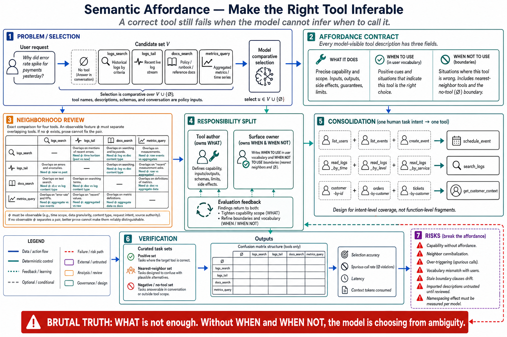

# Topic 4 — Semantic Affordance: Ensuring the Model Can Infer When and How to Call a Tool



## 1. Scope, prerequisites, terminology, boundaries, exclusions, outcomes

**Scope.** Affordance: the property that makes a tool's applicability *inferable* from the context the model actually has. Topic 3 made a chosen tool usable; this topic makes it choosable.

**Prerequisites.** Topics 1 and 3; Chapter 2, Topic 5 (selection under uncertainty).

**Terminology.** *Affordance*: agents "have distinct 'affordances' to traditional software—that is, they have different ways of perceiving the potential actions they can take with those tools" [WTA]. *Capability without affordance*: a tool that works and is never correctly called. *Trigger condition*: the stated circumstance under which a tool applies.

**Boundaries.** Inside: what makes selection inferable — trigger conditions, disambiguation against neighbors, vocabulary alignment, the negative case. Outside: how many tools are visible (Topic 6); the saturation effect of a crowded surface (Topic 15).

**Exclusions.** No general prompt engineering; this is about $d_u$ specifically.

**Outcomes.** The reader can write a description that states *when* to call, *when not to*, and *how this tool differs from its nearest neighbor* — and can detect a capability-without-affordance tool in their own system.

## 2. Problem, bottleneck, objective, assumptions, constraints, success criteria

**Problem.** A tool can be perfectly implemented, perfectly schematized, and never called — or called in the wrong circumstances. Topic 3's chain factor $\Pr(Z_a\mid Z_s)$ assumed $Z_s$; this topic is about $\Pr(Z_s)$ itself, and $\Pr(Z_s)$ is where the largest silent losses live.

**Bottleneck.** Descriptions are written by the tool's author, who knows what it is for. That knowledge is the thing that must be transmitted, and it is invisible to the person transmitting it. The author writes *what the tool does*; the model needs *when it applies*. These are different sentences.

**Objective.** Make $\Pr(Z_s)$ high by construction: the model should be able to derive applicability from the user's words plus $d_u$, without needing your priors.

**Assumptions.** The model reads all visible descriptions and conditions jointly on them; selection is a comparison, not a lookup.

**Constraints.** Description length is a per-turn tax (Topic 3, §7). Neighboring tools compete: improving one description can *worsen* selection for its neighbor.

**Success criteria.** Measured $\Pr(Z_s)$ above threshold, including on **negative tasks** — cases where the correct behavior is *not* to call the tool. A tool surface evaluated only on positive tasks has not been evaluated.

## 3. Intuition first, then formalization

### 3.1 Intuition: the model is choosing, not looking up

The model does not consult a tool the way code calls a function. It compares — across every visible tool, and against the option of not calling any — and picks. [WTA]'s weather example is the canonical statement of the choice set: the agent may "call the weather tool, answer from general knowledge, or even ask a clarifying question about location first."

So a description that describes the tool *in isolation* is answering the wrong question. "Searches the log store" tells the model what the tool does. It does not tell it that this is the tool for *"why was the customer charged three times,"* nor that it is **not** the tool for *"what is our refund policy"* (a docs question), nor how it differs from `logs_tail` sitting next to it.

Three things must be inferable, and only the first is usually written:

1. **What it does** — the function. Almost always present.
2. **When it applies** — the trigger, in the *user's* vocabulary, not the system's. Usually absent.
3. **When it does not** — the boundary against its neighbors and against not calling at all. Nearly always absent.

The third is the one that carries disproportionate weight, because selection is comparative. A tool that never says what it is *not* for is a tool that will be called for things it is not for.

### 3.2 Formalization: selection as a comparison

At step $t$, with visible tool set $\mathcal V_t\subseteq\mathcal U_c$, the model's selection is a draw

$$
\Pr\bigl(\text{select }u \mid c_t\bigr)
\;\propto\;
\exp\Bigl(\operatorname{score}\bigl(u ;\, c_t\bigr)\Bigr),
\qquad u\in\mathcal V_t\cup\{\varnothing\},
$$

where $\varnothing$ is "call nothing" and $\operatorname{score}$ is conditioned on $n_u$ and $d_u$. **[derived — a schematic, not a claim about model internals; its purpose is to make three consequences unavoidable.]**

**Consequence 1 — affordance is relative.** $\Pr(\text{select }u)$ depends on the *other* descriptions. Improving $d_u$ can degrade selection for a neighbor $u'$ by making $u$ attractive in $u'$'s cases. **Descriptions cannot be reviewed one at a time; they must be reviewed against their neighbors.** This is the single most-violated rule in tool engineering, and it is why a tool-surface change requires re-measuring the *whole* surface, not just the edited tool (Topic 13).

**Consequence 2 — $\varnothing$ is in the choice set.** The model can decline. Under-affordance means $\varnothing$ or a general-knowledge answer wins when the tool should have. This is the *silent* failure: no error, no tool call, a confident wrong answer from priors. It is invisible in tool-error metrics, which is why Topic 13 measures $\Pr(Z_s)$ on tasks where the ground truth is *"should have called this tool"*.

**Consequence 3 — the surface has a saturation term.** As $|\mathcal V_t|$ grows, probability mass spreads across confusable candidates and each individual $\Pr(\text{select }u)$ falls unless the descriptions grow more discriminative. This is Topic 15's mechanism, visible here in the denominator.

### 3.3 The discriminability requirement

For neighbors $u,u'$ with overlapping domains, affordance requires the descriptions to be **discriminative on the features the model can observe in the request**. Formally, there must exist an observable request feature $\varphi$ such that $d_u$ and $d_{u'}$ condition on it differently:

$$
\exists\,\varphi:\quad
\Pr(\text{select }u\mid \varphi)\ \gg\ \Pr(\text{select }u'\mid \varphi)
\quad\text{and conversely for }\neg\varphi .
$$

**[derived]** If no such $\varphi$ exists in the descriptions, the tools are **not distinguishable by the model**, and no amount of description polish will fix it — the tools should be *merged*, or one should be deleted. This is a concrete, checkable criterion, and it is the cleanest test available for "do these two tools both need to exist?"

## 4. Architecture

Affordance is a property of the **surface**, not of a tool, so it must be reviewed at surface scope:

```
   ┌─── the neighborhood review (the unit of affordance review) ──────────┐
   │                                                                       │
   │   logs_search ─┬─ overlapping domain ─┬─ logs_tail                    │
   │                │                       │                              │
   │      φ = "historical / by criteria"    φ = "live / recent / follow"   │
   │                                                                       │
   │   Each d_u must state: WHAT · WHEN · WHEN NOT (vs. its neighbor)      │
   └───────────────────────────────────────────────────────────────────────┘
                                 │
                                 ▼
                Assemble ─► context ─► π_M ─► selection over 𝒱_t ∪ {∅}
```

**Responsibilities.** The tool author writes *what*. The **surface owner** (Topic 1) writes *when* and *when not*, because only they can see the neighborhood. This is a real organizational claim: **affordance cannot be owned by the tool's author**, since the property is relational.

## 5. Grounding

- **The affordance framing itself** is [WTA]'s: agents "have different ways of perceiving the potential actions they can take with those tools," and may "call the weather tool, answer from general knowledge, or even ask a clarifying question."
- **Descriptions as steering.** "Prompt-engineering your tool descriptions and specs" is "one of the most effective methods for improving tools. Because these are loaded into your agents' context, they can collectively steer agents toward effective tool-calling behaviors" [WTA]. The word **collectively** is the source's own acknowledgment of §3.2's Consequence 1.
- **The mechanism of transmission.** The new-hire frame [WTA] (Topic 3, §3.1) is an affordance instruction as much as a schema one: what you would *implicitly bring* is exactly the trigger knowledge.
- **Namespacing as an affordance device.** "By selectively implementing tools whose names reflect natural subdivisions of tasks, you simultaneously reduce the number of tools and tool descriptions loaded into the agent's context and offload agentic computation from the agent's context back into the tool calls themselves" [WTA]. A name that reflects a *task subdivision* is a name that carries trigger information — affordance in $n_u$ rather than $d_u$, at zero marginal token cost.
- **Consolidation raises affordance.** [WTA]'s worked replacements — `schedule_event` instead of `list_users` + `list_events` + `create_event`; `search_logs` instead of `read_logs`; `get_customer_context` instead of three separate lookups — are affordance moves: each new tool maps onto a *task the user would name*, so the trigger is inferable from the request itself.
- **Model dependence is documented.** Namespacing effects are "non-trivial" and "vary by LLM," with the explicit instruction to "choose a naming scheme according to your own evaluations" [WTA]. **Affordance does not transfer across models. A surface tuned for one model is evidence, not a guarantee, for another** — which is why Chapter 4, Topic 13's Tier 3 re-qualification includes the tool surface.

**Evidence gap.** The literature offers no controlled measurement of description-structure effects (trigger clauses, negative cases, discriminative features) on $\Pr(Z_s)$. The mechanism is documented and the levers are named; the effect sizes are unmeasured. §8 is how you get them.

## 6. Implementation

**The three-part description**, with the parts that are usually missing marked:

```python
description = """
Search historical application logs by structured criteria.

WHEN TO USE:                                        # ← the trigger, usually missing
  User asks why something happened, needs evidence from past events, mentions
  errors/failures/incidents, or references a customer/order/request ID.
  Example requests: "why was customer 9182 charged three times",
  "find the errors from last Tuesday's deploy".

WHEN NOT TO USE:                                    # ← the boundary, nearly always missing
  - For live/streaming output, use `logs_tail` instead.
  - For questions about policy or documentation, use `docs_search`.
  - For metrics and aggregates (counts, rates, p99), use `metrics_query` —
    this tool returns individual log lines, not aggregates.

RETURNS: matching log lines with surrounding context, newest first, paginated.
"""
```

The `WHEN NOT TO USE` block is doing the work of §3.3: it supplies the discriminative feature $\varphi$ against each neighbor, explicitly, in the model's context. It costs roughly forty tokens and it is the difference between three confusable tools and three distinguishable ones.

**The neighborhood audit** — a mechanical test for §3.3's criterion:

```python
def audit_discriminability(tools: list[ToolContract]) -> list[str]:
    """Any tool pair with overlapping domains must be separated in BOTH descriptions."""
    problems = []
    for a, b in itertools.combinations(tools, 2):
        if not domains_overlap(a, b):
            continue
        a_names_b = b.name in a.description
        b_names_a = a.name in b.description
        if not (a_names_b and b_names_a):
            problems.append(
                f"{a.name} and {b.name} overlap but do not disambiguate each other "
                f"(mentions: {a.name}→{b.name}={a_names_b}, {b.name}→{a.name}={b_names_a}). "
                f"Either add a WHEN NOT TO USE clause to both, or merge them."
            )
    return problems
```

Crude, and it catches a real class of defect: **mutual reference is a cheap proxy for discriminability**, and its absence is a reliable smell. Run it in CI on the surface.

**Consolidation, per [WTA]** — the highest-leverage affordance move, because it changes the *shape* of the surface rather than its prose:

| Instead of | Ship | Why affordance improves |
|---|---|---|
| `list_users`, `list_events`, `create_event` | `schedule_event` | The user says "schedule a meeting"; the tool name *is* the request |
| `read_logs` | `search_logs` | The user has a question, not a file offset |
| `get_customer_by_id`, `list_transactions`, `list_notes` | `get_customer_context` | One call maps to one intent; no chaining to infer |

[WTA]'s principle behind all three: "Tools should enable agents to subdivide and solve tasks in much the same way that a human would."

## 7. Trade-offs

| Lever | Buys | Costs |
|---|---|---|
| Trigger clause (`WHEN TO USE`) | $\Pr(Z_s)\uparrow$ on positive tasks | ~30–60 tokens **per turn, per visible tool** |
| Boundary clause (`WHEN NOT`) | Fewer wrong-neighbor calls; fewer spurious calls | Tokens; must be updated when neighbors change — a **coupling** between tools |
| Consolidation | Best affordance per token; fewer tools; less chaining | Less flexible; a consolidated tool may do too much for some tasks |
| Namespacing | Affordance in $n_u$, ~free | Effects "vary by LLM" [WTA]; must be measured, not assumed |
| More discriminative prose | Better $\Pr(Z_s)$ | Direct conflict with Topic 6's context budget |

**The coupling cost is the one people miss.** Boundary clauses make descriptions *depend on each other*. Adding a tool now requires editing its neighbors' descriptions, and forgetting to do so degrades the neighbors. This is real maintenance debt, and it is the price of the surface being a system rather than a list.

## 8. Experiments

**The negative-task requirement.** An affordance eval that only contains tasks where a tool *should* be called cannot detect over-triggering, and over-triggering is half the failure. The task set must contain, in stated proportion:

- **Positive tasks** — tool $u$ is correct.
- **Neighbor tasks** — a *different* tool is correct (detects confusion).
- **Negative tasks** — *no* tool should be called (detects spurious invocation and the $\varnothing$ arm of §3.2).

**Metrics.** $\Pr(Z_s)$ on positives; **confusion matrix** across the neighborhood (not a scalar — the matrix is what tells you *which* neighbor is stealing calls); spurious-call rate on negatives; and token cost of the surface. [WTA]'s instrumentation list applies: accuracy, runtime, tool-call count, tokens, tool errors.

**Task construction.** Use agents to generate them — [WTA] does exactly this: "quickly explore your tools and create dozens of prompt and response pairs," with tasks "inspired by real-world uses and based on realistic data sources," avoiding "overly simplistic or superficial 'sandbox' environments," and noting that strong tasks "might require multiple tool calls—potentially dozens." The contrast the source draws is instructive: **"Schedule a meeting with jane@acme.corp next week"** (weak — the tool is named in the request) versus **"Schedule a meeting with Jane next week to discuss our latest Acme Corp project. Attach notes from our last project planning meeting and reserve a conference room"** (strong — the tool must be *inferred*). A weak task measures string matching; a strong task measures affordance.

**Ablations.** Description with/without trigger clause; with/without boundary clause; consolidated vs. decomposed tool set; prefix vs. suffix namespacing (per [WTA], **measure it, do not assume it**).

**Statistics.** Paired; McNemar per contrast; clustered bootstrap intervals; Holm across arms (Chapter 1, Topic 12).

**Instrumentation trick, from the source.** Have the agent "output reasoning and feedback blocks before tool calls" and use extended thinking to probe "why agents do or don't call certain tools" [WTA]. This turns a selection failure from a bare statistic into a diagnosable one. The caveat is [WTA]'s own, and it is a caveat this book takes seriously: **"What agents omit in their feedback and responses can often be more important than what they include. LLMs don't always say what they mean."** Stated reasoning is a *hypothesis about* the selection, not the selection's cause — Chapter 2's unverbalized-behavior findings [FSC §6.4.1.4] say precisely this. Use it to generate leads; confirm with the paired ablation.

## 9. Failure modes, edge cases, hazards, mitigations, open limitations

- **Capability without affordance.** The tool works; it is never called; the model answers from priors and is confidently wrong. **No error fires.** Mitigation: negative and positive tasks in the eval; measure $\Pr(Z_s)$ directly, never infer it from end-to-end accuracy.
- **Neighbor cannibalization.** A description improvement to $u$ silently degrades $u'$ (§3.2). Mitigation: measure the **whole surface** after any description change; the confusion matrix, not the scalar.
- **The indistinguishable pair.** No observable $\varphi$ separates two tools. Mitigation: merge or delete. Polish will not help, and iterating on the prose is wasted effort — this is the diagnosis §3.3 exists to enable.
- **Over-triggering.** A tool with an enthusiastic description gets called for everything. Mitigation: boundary clauses; negative tasks.
- **Vocabulary mismatch.** The description uses system nouns (`entity`, `record`, `resource`) while users say `customer`, `ticket`, `order`. The trigger never fires. Mitigation: write triggers in the *user's* words; harvest them from real transcripts.
- **Description drift.** Neighbors change; boundary clauses go stale; they now disambiguate against a tool that no longer exists. Mitigation: the §6 audit in CI.
- **Edge case — third-party (MCP) descriptions.** You did not write $d_u$ and it was not written against *your* neighborhood, so its affordance is accidental at best. Mitigation: rewrite imported descriptions before exposing them (you may — the import is yours), and treat the original as untrusted input (Topic 14).
- **Open limitation.** Affordance is model-dependent — [WTA] documents that even namespacing effects "vary by LLM." **A surface tuned for one model is not a surface tuned for the next one.** This makes affordance a *recurring* cost across model upgrades, and it belongs in Chapter 4, Topic 13's Tier 3 re-qualification.

## 10. Verified observations, decision rules, production implications, connections

**Verified observations.**
1. Agents have distinct affordances and perceive available actions differently from code [WTA].
2. Tool descriptions "collectively steer agents" — the effect is joint across the surface, not per-tool [WTA].
3. Names that reflect natural task subdivisions carry affordance and reduce context simultaneously [WTA].
4. Namespacing effects are non-trivial, vary by model, and must be measured locally [WTA].
5. Stated agent reasoning is an imperfect window into selection — "LLMs don't always say what they mean" [WTA], corroborated by unverbalized-behavior findings [FSC §6.4.1.4].

**Decision rules.**
- **If two tools' descriptions do not name each other and their domains overlap, one of them is going to be called wrong.** Merge, delete, or disambiguate.
- **If a tool has no `WHEN NOT TO USE`, it will be over-called.**
- **If your eval has no negative tasks, you cannot see over-triggering**, and half your affordance failures are invisible.
- **If a task names the tool, it is not testing affordance** — it is testing string matching [WTA's weak-task examples].

**Production implications.**
1. Review descriptions **in neighborhoods**, never individually. Make this the review unit.
2. Add trigger and boundary clauses to every tool; budget the tokens explicitly (Topic 6).
3. Prefer consolidation to prose: a tool named for the task the user names needs less description than two tools that need distinguishing.
4. Re-measure affordance on every model upgrade. It does not transfer.

**Connections.** Topic 3 supplied the schema this topic makes findable. Topic 6 is the budget this topic spends. Topic 15's saturation is §3.2's denominator, made empirical. Topic 13 measures $\Pr(Z_s)$ and the confusion matrix. Topic 14 attacks $d_u$ — an adversary who can write a description is an adversary who can steer selection, which is why affordance and security are the same surface. Chapter 2, Topic 5's selection analysis is the model-side account of what this topic engineers.

## Sources

[WTA] Anthropic, "Writing effective tools for agents — with agents" — affordances; the weather-tool choice set; "prompt-engineering your tool descriptions and specs" as "one of the most effective methods," descriptions that "collectively steer agents"; namespacing reflecting natural task subdivisions; namespacing effects "vary by LLM," "choose a naming scheme according to your own evaluations"; the consolidation examples (`schedule_event`, `search_logs`, `get_customer_context`); agent-generated evaluation tasks, strong vs. weak task examples, realistic data sources, multi-call tasks; reasoning-and-feedback blocks; "LLMs don't always say what they mean" — https://www.anthropic.com/engineering/writing-tools-for-agents
[FSC] Claude Fable 5 & Mythos 5 System Card §6.4.1.4 — unverbalized behavior; stated reasoning as an unreliable window — `Knowledge_source/`
[CAH] Code as Agent Harness, arXiv:2605.18747 (`Knowledge_source/2605.18747v1.pdf`) §3.5 — brittle tool interfaces as a non-model failure mechanism
