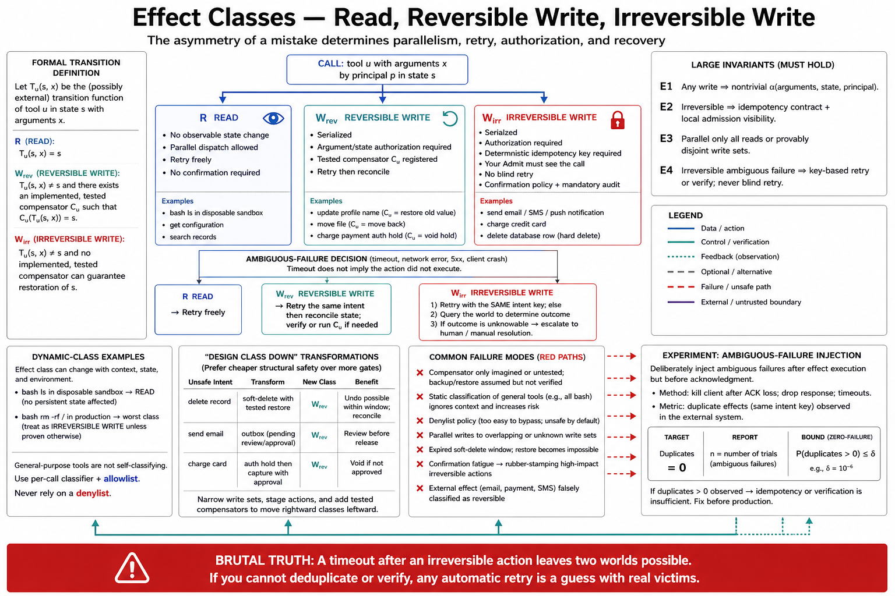

# Topic 5 — Read Tools versus Write Tools; Reversible versus Irreversible Actions



## 1. Scope, prerequisites, terminology, boundaries, exclusions, outcomes

**Scope.** The effect class $\chi_u$ — the field that determines every other safety field in the contract. Decided first (Topic 1, §4's dependency order), because it says whether $\alpha_u$, $\iota_u$, and a human gate are required at all.

**Prerequisites.** Topic 1 (the contract); Topic 2 (execution placement and the $g_{\mathrm{adm}}$ invariant); Chapter 3, Topic 7 (deterministic invariants); Chapter 3, Topic 10 (exception taxonomy).

**Terminology.** *Read*: no observable state change in the environment. *Write*: an observable state change. *Reversible*: a compensating action exists that restores the prior state, and you have implemented it. *Irreversible*: no such action, or the effect has left your authority domain (an email is sent; money has moved; a message is posted).

**Boundaries.** Inside: the classification, its invariants, and the gates it forces. Outside: the policy that decides *who* may perform a class (Chapter 12); idempotency mechanics (Topic 11).

**Exclusions.** No threat modeling; this topic classifies effects, it does not enumerate adversaries.

**Outcomes.** The reader can classify every tool in their system, and can state which of their tools currently violate the invariants of §3.

## 2. Problem, bottleneck, objective, assumptions, constraints, success criteria

**Problem.** Agent systems apply uniform machinery to non-uniform hazards. The same retry policy that is correct for a search is catastrophic for a payment. The same parallelism that is free for reads corrupts state for writes. The same "just re-run it" recovery that fixes a failed read *duplicates* a failed write. The classification is what lets the harness treat these differently, and most systems do not have one.

**Bottleneck.** Reversibility is *assumed* rather than *implemented*. Teams call a delete "reversible" because a backup exists somewhere, without a tested compensating path. Reversibility is not a property of the world; it is a property of code you wrote and tested.

**Objective.** A total classification $\chi:\mathcal U_c\to\{\textsf{R},\textsf{W}_{\mathrm{rev}},\textsf{W}_{\mathrm{irr}}\}$ with enforced consequences: parallelism, retry, authorization, confirmation, and audit all derive from it mechanically.

**Assumptions.** The model will, eventually, propose every action its tools permit — including the wrong one, at the wrong time, on the wrong resource. Chapter 2's propensity findings (beyond-intent actions [G56 §1]) are the evidentiary basis for treating this as certain rather than unlikely.

**Constraints.** Some tools are mixed (a `sync` that reads and writes). Some reversibility is partial (a soft-delete restorable for 30 days). Classification must handle both without lying.

**Success criteria.** Every tool classified; no $\textsf{W}_{\mathrm{irr}}$ tool without an authorization predicate, an idempotency key, and a confirmation policy; parallel dispatch enabled only where the class permits it.

## 3. Intuition first, then formalization

### 3.1 Intuition: the asymmetry of a mistake

A wrong read costs tokens and time. A wrong irreversible write costs *the thing that was written*. These are not points on a scale; they are different kinds of event, and the difference is that **one of them can be fixed by trying again and the other is made worse by trying again.**

That single sentence generates the entire topic. Retry is the harness's universal medicine (Chapter 3, Topic 10), and it is *poison* for irreversible writes. Parallelism is the harness's universal speedup, and it is *corruption* for concurrent writes to shared state. Every generic mechanism in the harness has an exception carved out by $\chi_u$, and a system without $\chi_u$ has no way to carve it.

The reversibility test is operational, not philosophical. **A tool is reversible if and only if you have written, tested, and can invoke the compensating action.** "We could restore from backup" is not reversibility; it is a recovery project. If the compensator does not exist as code, the tool is irreversible, and calling it "reversible" in a design doc is how a delete becomes permanent.

### 3.2 Formalization

Let $s_t$ be environment state. Tool $u$ with arguments $x$ induces a transition $s_{t+1}=T_u(s_t,x)$.

$$
\chi_u=
\begin{cases}
\textsf{R} & \text{if } T_u(s,x)=s \ \ \forall s,x \quad\text{(no observable state change)}\\[2pt]
\textsf{W}_{\mathrm{rev}} & \text{if } \exists\,\text{implemented } C_u:\ C_u\bigl(T_u(s,x),x\bigr)=s\\[2pt]
\textsf{W}_{\mathrm{irr}} & \text{otherwise.}
\end{cases}
$$

**[synthesis]** $C_u$ is the **compensator** (Topic 11). The existential quantifier ranges over *implemented and tested* code, not over conceivable actions. This is what makes the definition operational.

**Invariants** — each is enforceable in the registry, and each has a documented failure behind it:

$$
\textbf{E1:}\quad \chi_u\neq\textsf{R}\ \Longrightarrow\ \alpha_u\ \text{is a nontrivial predicate over arguments and state.}
$$
$$
\textbf{E2:}\quad \chi_u=\textsf{W}_{\mathrm{irr}}\ \Longrightarrow\ \iota_u\ \text{defines an idempotency key, and } g_{\mathrm{adm}}(u)=1 .
$$
$$
\textbf{E3:}\quad \text{Parallel dispatch of } \{u_i\} \text{ is admissible only if } \forall i:\ \chi_{u_i}=\textsf{R},\ \text{or the } u_i \text{ have provably disjoint write sets.}
$$
$$
\textbf{E4:}\quad \chi_u=\textsf{W}_{\mathrm{irr}}\ \Longrightarrow\ \text{retry is forbidden without an idempotency key; on ambiguous failure, } \textbf{verify, do not retry.}
$$

**[derived]** E3 is the formal statement of the read/write parallelism rule documented in the Claude Agent SDK: parallel execution for read-only tools, serialized execution for writes [CAL]. E4 is the rule that separates a competent harness from a dangerous one, and §3.3 is why.

### 3.3 The ambiguous-failure problem

The hardest case in this topic, and the one that motivates everything in Topic 11. A tool call times out. **You do not know whether the effect happened.** The request may have been lost before the server saw it, or executed and the response lost on the way back.

$$
\text{timeout} \;\not\Rightarrow\; \text{not executed}.
$$

For $\chi_u=\textsf{R}$: retry freely. Cost only.
For $\chi_u=\textsf{W}_{\mathrm{rev}}$: retry, then reconcile.
For $\chi_u=\textsf{W}_{\mathrm{irr}}$: **a blind retry is a coin flip between "no effect" and "double effect."** The only correct responses are (i) retry with an idempotency key that makes the double case a no-op (Topic 11), or (ii) *query the world* to determine what happened, then act.

A harness whose generic retry policy applies uniformly across $\chi$ will, on its first payment-endpoint timeout, charge a customer twice. This is not hypothetical; it is the standard failure of every naive agent that wraps a billing API. **[synthesis — the mechanism is elementary distributed systems; the agent-specific point is that the harness's retry loop is generic by default and must be made $\chi$-aware.]**

## 4. Architecture

```
                                ┌──── χ_u = R ────────────► parallel dispatch OK
                                │                           retry freely
                                │                           no confirmation
   Admit ─► classify(χ_u) ──────┤
                                ├──── χ_u = W_rev ────────► serialize
                                │                           retry + reconcile
                                │                           α_u required (E1)
                                │                           compensator C_u registered
                                │
                                └──── χ_u = W_irr ────────► serialize
                                                            α_u required (E1)
                                                            idempotency key required (E2)
                                                            NO blind retry (E4)
                                                            confirmation gate (policy: Ch.12)
                                                            audit record: mandatory
```

**Responsibilities.** The registry enforces E1–E2 at construction (unconstructible invalid states — Topic 1, §6). The dispatcher enforces E3 (parallelism) and E4 (retry). The policy layer (Chapter 12) decides *when* a confirmation gate fires; this chapter only insists that the gate *exist* for $\textsf{W}_{\mathrm{irr}}$.

**The mixed tool.** A tool that both reads and writes classifies as its **highest** hazard class. If `sync_and_report` writes, it is a write. The temptation to classify by "mostly reads" is how an irreversible effect ends up on the parallel path.

**The partially reversible tool.** A soft-delete restorable for 30 days is $\textsf{W}_{\mathrm{rev}}$ **only within the window and only if the restore path is implemented and tested**. Model this explicitly with an expiry on the compensator rather than pretending the class is static; a compensator with an expiry is honest, a class that silently degrades is not.

## 5. Grounding

- **Read/write parallelism.** The Claude Agent SDK documents parallel execution for read-only tools and serialized execution for writes [CAL] — E3, as shipped.
- **Effect class as an approval surface.** Codex exposes sandbox modes (`read-only`, `workspace-write`, `danger-full-access`) and approval policies (`untrusted`, `on-request`, `never`) [CDX]. The names are the classification: the platform's primary safety axis *is* the effect class, and `read-only` is a first-class mode precisely because reads are the safe class.
- **Argument-dependent hazard.** The survey states the requirement that makes tool-identity classification insufficient on its own: "The same command may be safe in a disposable sandbox but unsafe in a production repository, and the same network request may be benign during documentation retrieval but risky when it transmits local state. Therefore, permissions should depend not only on tool identity, but also on arguments, environment state, data sensitivity, and expected side effects" [CAH §5]. **This is the key refinement: $\chi$ is a function of the *call*, not only of the tool.** `bash("ls")` and `bash("rm -rf /")` are the same tool and different effect classes. A classification keyed on tool name alone is defeated by any general-purpose tool — which is exactly what shell, filesystem, and code-execution tools are (Topic 9).
- **Permission tiers with human gates.** The survey's three-tier permission model with a human-in-the-loop gate for high-risk operations, and the requirement that each tier "specify its allowed actions, constraints, audit logs, rollback mechanisms, and human-in-the-loop gates for high-risk operations" [CAH §3.4.4, §5]. Note "rollback mechanisms" — the compensator, named as a tier obligation.
- **The propensity that makes this mandatory.** Beyond-intent actions are a measured, regressing propensity across model versions [G56 §1]. The design cannot assume the model will refrain from proposing an irreversible action it has been given.
- **Open-problem status.** The survey lists "side-effect prediction," "reversible execution," and "measuring the tradeoff between autonomy and safety" as *open problems* [CAH §5]. **This chapter's classification is engineering discipline, not a solved research problem**, and no source offers an automated way to derive $\chi$ for an arbitrary call.

## 6. Implementation

**Classification must be per-call, not per-tool** (the [CAH §5] refinement):

```python
def classify_call(tool: ToolContract, args: dict, ctx) -> Effect:
    """χ is a function of the CALL. A general-purpose tool spans classes."""
    if tool.effect is not Effect.DYNAMIC:
        return tool.effect                       # fixed-class tools: settled at registration
    # Dynamic-class tools (shell, code exec, generic HTTP) must be classified per call.
    return tool.classify(args, ctx)              # e.g. parse the command, inspect the verb

def classify_shell(args, ctx) -> Effect:
    cmd = shlex.split(args["command"])[0]
    if cmd in READ_ONLY_COMMANDS:                # ls, cat, grep, git status, ...
        return Effect.READ
    if ctx.workspace.is_disposable:              # [CAH §5]: same command, different context
        return Effect.WRITE_REVERSIBLE           # sandbox is restorable from snapshot
    return Effect.WRITE_IRREVERSIBLE             # production workspace: assume the worst
```

The `is_disposable` branch is the survey's point in code: *"the same command may be safe in a disposable sandbox but unsafe in a production repository"* [CAH §5]. The classifier reads the environment, not just the argument.

**An allowlist is the only safe default for dynamic-class tools.** `READ_ONLY_COMMANDS` must be an allowlist, never a denylist of dangerous commands — a denylist loses to `sh -c`, to shell metacharacters, to a novel binary, and to the model's creativity. **The failure of a denylist is silent and total.**

**Dispatch enforcing E3 and E4:**

```python
async def dispatch(calls: list[Call], ctx) -> list[Result]:
    classified = [(c, classify_call(c.tool, c.args, ctx)) for c in calls]

    reads  = [c for c, e in classified if e is Effect.READ]
    writes = [c for c, e in classified if e is not Effect.READ]

    results = await asyncio.gather(*[execute(c) for c in reads])   # E3: reads parallel
    for c in writes:                                               # E3: writes serialized
        results.append(await execute_write(c, ctx))
    return results

async def execute_write(c: Call, ctx) -> Result:
    eff = classify_call(c.tool, c.args, ctx)
    try:
        return await execute(c, idempotency_key=c.tool.idempotency.key_for(c.args))
    except AmbiguousFailure:                                       # timeout, conn reset
        if eff is Effect.WRITE_IRREVERSIBLE and not c.tool.idempotency.key_fields:
            # E4: DO NOT RETRY. The effect may have landed. Ask the world.
            return await verify_or_escalate(c, ctx)
        return await retry_with_key(c, ctx)                        # safe: key makes it a no-op
```

`verify_or_escalate` is the honest path: query the target system for the effect's existence; if it cannot be determined, **stop the run and escalate to a human** rather than guessing. A harness that guesses here is a harness that will double-charge.

## 7. Trade-offs

| Class | Parallelism | Retry | Authorization | Confirmation | Audit | Cost of the discipline |
|---|---|---|---|---|---|---|
| $\textsf{R}$ | Free [CAL] | Free | Optional (rate limits, data scope) | No | Optional | None — this is why reads should be the *default* class you design toward |
| $\textsf{W}_{\mathrm{rev}}$ | Serialized | With reconcile | **Required** (E1) | Policy | **Required** | Compensator must be written *and tested* |
| $\textsf{W}_{\mathrm{irr}}$ | Serialized | **Key or verify** (E4) | **Required** (E1) | **Gate required** | **Required** | Highest: keys, gates, escalation paths, human latency |

**The design lever this table implies.** The cheapest way to make an agent safe is to **move tools down the hierarchy**, not to add controls at the top. A `delete` that soft-deletes is $\textsf{W}_{\mathrm{rev}}$ and costs nothing at runtime. A `send_email` that writes to an outbox reviewed by a human is $\textsf{W}_{\mathrm{rev}}$ until the human approves. **Design the effect class down; do not just gate it up.** This is the highest-leverage safety move in the chapter and it costs less than the alternative.

**The cost of the discipline, honestly.** Confirmation gates put a human in the latency path and destroy the autonomy that motivated the agent. Idempotency keys require the *target system* to support them, and many do not. `verify_or_escalate` requires a query path that may not exist. These are real costs, and a team that cannot pay them should not give the agent irreversible writes — which is itself the correct decision, more often than it is made.

## 8. Experiments

**The classification audit is not an experiment; it is a prerequisite.** Enumerate every tool; classify; find the violations of E1–E4. In most systems this audit alone finds shipped defects. Do it before measuring anything.

**Ablation — parallelism (E3).** Enable/disable parallel dispatch for reads. Metrics: latency (the benefit), and — critically — **write-corruption count under concurrent execution** (the hazard) on tasks that touch shared state. The failure this detects is not slow; it is silently wrong.

**Fault-injection experiment — ambiguous failure (E4).** This is the important one, and almost nobody runs it. Inject timeouts into a write tool at a controlled rate; measure **duplicate-effect count**.

- **Baseline:** generic retry policy (what most harnesses ship).
- **Arm A:** idempotency keys.
- **Arm B:** verify-or-escalate.

**Acceptance threshold: duplicate effects must be zero, and the appropriate statistical statement is the zero-failure bound.** With $n$ injected failures and zero duplicates observed, the one-sided upper bound on the duplicate rate at confidence $\gamma$ is $p_{\max}=1-(1-\gamma)^{1/n}$ (Chapter 1, Topic 12). To claim a duplicate rate under 1% at 95% confidence you need $n\approx 300$ injected failures with zero duplicates. **"We tested it and it didn't duplicate" is not a claim until it carries $n$.**

**Metrics for the confirmation gate.** Human-gate rate, human latency, and override rate. An override rate near 100% means the gate is theater and is training your reviewers to click approve — which is worse than no gate, because it manufactures the appearance of oversight.

## 9. Failure modes, edge cases, hazards, mitigations, open limitations

- **The generic retry on an irreversible write.** The canonical catastrophe (§3.3). Mitigation: E4; keys; verify-or-escalate.
- **Reversibility assumed, not implemented.** "We can restore from backup." Mitigation: the compensator must be *code that is tested in CI*, or the tool is $\textsf{W}_{\mathrm{irr}}$.
- **Class keyed on tool name for a general-purpose tool.** `bash` classified once, statically. Defeated by its own arguments. Mitigation: per-call classification (§6) [CAH §5].
- **Denylist for dangerous commands.** Loses to `sh -c`, to encoding, to a new binary. Mitigation: allowlist, always.
- **Parallel writes to shared state.** E3 violated; lost updates. Mitigation: serialize, or prove disjoint write sets.
- **The soft-delete that expires.** Classified reversible; the window closes; it is now irreversible and nothing noticed. Mitigation: expiry on the compensator.
- **Confirmation fatigue.** Gates fire so often that humans approve reflexively. Mitigation: gate on the *hazardous* subset (per-call classification makes this possible); measure override rate and treat a high one as a defect.
- **Edge case — effects outside your authority domain.** An email sent, a webhook fired, a message posted to Slack. No compensator exists *even in principle*: you can send a correction, but you cannot unsend. These are $\textsf{W}_{\mathrm{irr}}$ permanently, and they are the most common irreversible tools in real systems — which is why "the agent can email customers" deserves far more scrutiny than it usually gets.
- **Open limitation.** Deriving $\chi$ automatically for an arbitrary call is unsolved; the survey lists "side-effect prediction" and "reversible execution" as open problems [CAH §5]. Every classification in your system is a human judgment, and it can be wrong.

## 10. Verified observations, decision rules, production implications, connections

**Verified observations.**
1. Read-only tools may execute in parallel; writes must serialize [CAL].
2. Platforms treat the effect class as their primary safety axis (`read-only` / `workspace-write` / `danger-full-access`) [CDX].
3. Hazard depends on arguments and environment, not tool identity alone [CAH §5].
4. Permission tiers must specify allowed actions, constraints, audit logs, **rollback mechanisms**, and human gates for high-risk operations [CAH §3.4.4, §5].
5. Models exhibit measured beyond-intent action propensities that *regressed* across a version step [G56 §1] — the classification cannot rely on model restraint.

**Decision rules.**
- **Classify per call, not per tool**, for any tool whose arguments span classes (shell, code exec, generic HTTP, SQL).
- **A write tool without an authorization predicate does not ship** (E1).
- **An irreversible write without an idempotency key must never be blindly retried** (E4). On ambiguous failure: verify, or escalate. Never guess.
- **Prefer designing the class down** (soft-delete, outbox, staging) over gating the class up. It is cheaper and it fails safe.
- **If the compensator is not tested code, the tool is irreversible.** Say so in the contract.

**Production implications.**
1. Run the classification audit this week. It finds shipped defects in most systems.
2. Enforce E1–E2 in the registry so invalid contracts cannot be constructed (Topic 1, §6).
3. Run the fault-injection experiment (§8) and report the zero-failure bound with its $n$. Until then you do not know your duplicate rate; you have merely not observed one.
4. Track confirmation override rate. A gate everyone approves is a gate that has been decommissioned without anyone deciding to decommission it.

**Connections.** $\chi_u$ determines Topic 10's authorization requirement, Topic 11's idempotency and compensation machinery, and Topic 9's treatment of the general-purpose tool families where per-call classification is mandatory. Topic 2's $g_{\mathrm{adm}}$ invariant is E2's placement half. Chapter 3, Topic 10's exception taxonomy consumes the ambiguous-failure case. Chapter 12 supplies the policy behind the gates this topic requires to exist.

## Sources

[CAL] Claude Agent SDK — parallel execution for read-only tools, serialized execution for writes — https://code.claude.com/docs/en/agent-sdk/agent-loop
[CDX] OpenAI Codex documentation — sandbox modes (`read-only`, `workspace-write`, `danger-full-access`) and approval policies (`untrusted`, `on-request`, `never`) — https://learn.chatgpt.com/docs/agent-approvals-security
[CAH] Code as Agent Harness, arXiv:2605.18747 (`Knowledge_source/2605.18747v1.pdf`) §3.4.4 (permission tiers with human-in-the-loop gates), §5 ("the same command may be safe in a disposable sandbox but unsafe in a production repository… permissions should depend not only on tool identity, but also on arguments, environment state, data sensitivity, and expected side effects"; tiers specifying "allowed actions, constraints, audit logs, rollback mechanisms, and human-in-the-loop gates"; side-effect prediction and reversible execution as open problems)
[G56] GPT-5.6 Preview System Card §1 — beyond-intent action propensity, regressing across a version step — `Knowledge_source/gpt-5-6-preview.pdf`
[WTA] Anthropic, "Writing effective tools for agents" — MCP tool annotations disclosing "which tools require open-world access or make destructive changes" (advisory metadata, not enforcement) — https://www.anthropic.com/engineering/writing-tools-for-agents
