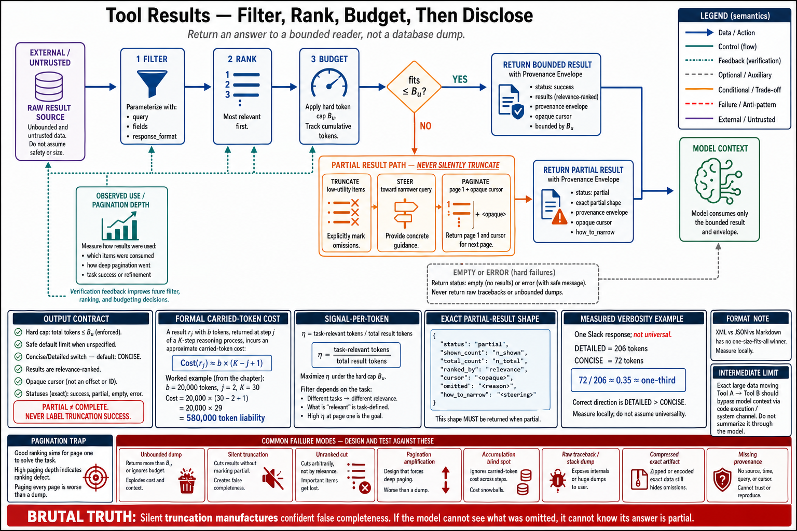

# Topic 7 — Tool-Result Compression, Filtering, Pagination, and Progressive Disclosure



## 1. Scope, prerequisites, terminology, boundaries, exclusions, outcomes

**Scope.** The output contract $\Sigma^{\mathrm{out}}_u$: what a tool returns, how much, in what shape, and what happens when the honest answer is too big. Topic 6 bounded what the model *sees before* acting; this topic bounds what it sees *after*.

**Prerequisites.** Topics 1, 3, 6; Chapter 6 (context engineering) is the downstream consumer of everything this topic lets through.

**Terminology.** *Result budget*: a hard token cap on a tool's return. *Progressive disclosure*: returning a summary plus a handle to fetch detail. *Signal*: content that changes the model's next action. *Filler*: content that does not.

**Boundaries.** Inside: shaping the bytes a tool returns. Outside: what the harness does with them afterwards — compaction, summarization, eviction (Chapter 6, Chapter 10).

**Exclusions.** No serialization-format tutorial.

**Outcomes.** The reader can give every tool a result budget, a truncation policy that steers rather than merely cuts, and a pagination contract the model can actually follow.

## 2. Problem, bottleneck, objective, assumptions, constraints, success criteria

**Problem.** Tool results are the largest and least-governed consumer of context in an agent system. Definitions (Topic 6) are bounded by $N$ and known in advance. Results are unbounded, arrive at runtime, and *accumulate*: a result returned at step 3 is still in context at step 30, having been re-processed 27 times.

**Bottleneck.** The default implementation returns whatever the underlying system returns. A `list_contacts` returns all contacts. A `read_logs` returns the file. The tool is *correct* and it has just spent your context budget on data the model will read "token-by-token… wasting its limited context space on irrelevant information (imagine searching for a contact in your address book by reading each page from top-to-bottom—that is, via brute-force search)" [WTA].

**Objective.** An output contract with a budget, a filter, a pagination scheme, and a truncation policy that *instructs* — for every tool whose result can be large.

**Assumptions.** Context is the binding constraint. The model re-reads everything in context each turn. A large result crowds out the reasoning it was meant to support.

**Constraints.** You cannot always know the size in advance. Truncation loses information that may have mattered. The model cannot request "the part I need" unless the contract lets it.

**Success criteria.** Every tool has a declared budget; no tool can exceed it; truncation is accompanied by steering text; result tokens per run are measured and bounded.

## 3. Intuition first, then formalization

### 3.1 Intuition: return an answer, not a database

The reframe: **a tool result is not a data dump; it is a message to a reader with a limited attention span who will pay to read every word, on every subsequent turn.**

[WTA] states the target: "Tool implementations should take care to return only high signal information back to agents. They should prioritize contextual relevance over flexibility, and eschew low-level technical identifiers."

Note "prioritize contextual relevance over **flexibility**." This is the API instinct being explicitly overruled. A good API returns everything and lets the caller pick — flexibility is a virtue, and the caller pays nothing for the fields it ignores. **A good tool returns what is needed, because the caller pays for every field it ignores, repeatedly.** The two design philosophies are in direct opposition, and this is the sentence that resolves the conflict.

The design move that follows is the same one from Topic 4: change the tool, not the truncation. Instead of `read_logs` (returns the file) plus truncation, ship `search_logs`, "returning only relevant lines with context" [WTA]. The filter belongs *in the tool*, where the full data is, not in the context, where it is expensive.

### 3.2 Formalization: the signal-per-token objective

Let a result $r$ decompose into content units $r=\{\upsilon_1,\ldots,\upsilon_n\}$ with token costs $\mathrm{tok}(\upsilon_i)$. Let $\mathrm{sig}(\upsilon_i)=1$ if $\upsilon_i$ changes the model's next action and $0$ otherwise. Define **result efficiency**

$$
\eta(r)\;=\;\frac{\sum_i \mathrm{sig}(\upsilon_i)\,\mathrm{tok}(\upsilon_i)}{\sum_i \mathrm{tok}(\upsilon_i)} \;\in\;[0,1].
$$

**[derived]** The design objective is to maximize $\eta$ subject to a budget $B_u$:

$$
\max_{\Sigma^{\mathrm{out}}_u}\ \eta(r)
\qquad\text{s.t.}\qquad
\sum_i\mathrm{tok}(\upsilon_i)\le B_u .
$$

Two facts make this more than notation. **First, the accumulation.** A result of size $b$ returned at step $j$ of a $K$-step run is carried for $K-j$ further turns, so its true cost is

$$
\text{cost}(r_j)\;\approx\;b\cdot(K-j+1)
$$

turns' worth of tokens — **not $b$.** A 20k-token result at step 2 of a 30-step run is a 580k-token liability. This is the number nobody computes, and it is why "it's only 20k tokens" is wrong by a factor of thirty.

**Second, $\eta$ is not an intrinsic property of the data.** It depends on the *task*. The same log line is signal for a debugging task and filler for a summarization task. Therefore **the filter must be parameterized by the call, not hard-coded in the tool** — which is precisely why `search_logs(query)` beats `read_logs()` truncated: the query is the model telling you its $\mathrm{sig}$ function.

### 3.3 The verbosity control

[WTA] documents a response-format parameter letting the agent choose:

```
enum ResponseFormat { DETAILED = "detailed", CONCISE = "concise" }
```

with a measured instance: a Slack thread response at **206 tokens detailed** versus **72 tokens concise** — "we use ~⅓ of the tokens with `"concise"` tool responses" [WTA].

This is the cleanest available demonstration that $\eta$ is *controllable at the interface* rather than fixed by the data. It also relocates the decision correctly: **the model knows what it needs; give it the switch.** The caveat [WTA] attaches is important and this book repeats it rather than smoothing it over: response *structure* — "XML, JSON, or Markdown" — "can have an impact on evaluation performance: there is no one-size-fits-all solution." Measure the format. Do not inherit one.

## 4. Architecture

```
   raw result (unbounded, from the underlying system)
        │
        ▼
   ┌── FILTER ────────── parameterized by the CALL (query, fields, response_format)
   │      │              ← the filter lives HERE, where the full data is
   │      ▼
   ├── RANK ──────────── most relevant first: truncation should cut the tail, not the head
   │      │
   │      ▼
   ├── BUDGET ────────── hard cap B_u (Claude Code default: 25,000 tokens [WTA])
   │      │
   │      ├── fits ─────────────────► return
   │      │
   │      └── exceeds ──────────────► TRUNCATE + STEER + PAGINATE
   │                                   ├─ what was cut, and how much
   │                                   ├─ how to get the rest (cursor)
   │                                   └─ how to have asked better (steering) [WTA]
   ▼
   provenance envelope φ_u (Topic 12) ─────► tool_result → context
```

**The ranking step is what makes truncation survivable.** Truncating an *unranked* result cuts arbitrary content. Truncating a *ranked* result cuts the least relevant tail, and the loss is bounded by the ranker's quality rather than by file order. A tool that truncates without ranking is a tool that returns a random sample.

## 5. Grounding

- **Return high-signal information; prioritize relevance over flexibility; eschew low-level technical identifiers** [WTA].
- **The brute-force-search anti-pattern:** an agent reading `list_contacts` token-by-token, "wasting its limited context space on irrelevant information" [WTA].
- **The hard budget:** "For Claude Code, we restrict tool responses to 25,000 tokens by default" [WTA]. **Scope: one product's default. Not a derived optimum, and this book does not present it as one — it is evidence that a serious agent product found a hard cap necessary, and 25k is where they put it.**
- **The mechanisms:** "some combination of pagination, range selection, filtering, and/or truncation with sensible default parameter values for any tool responses that could use up lots of context" [WTA].
- **Truncation must steer:** "steer agents with helpful instructions. You can directly encourage agents to pursue more token-efficient strategies, like making many small and targeted searches instead of a single, broad search for a knowledge retrieval task" [WTA].
- **Verbosity control and its measured effect:** 206 → 72 tokens, "~⅓ of the tokens" [WTA]. **Scope: one worked example on one Slack response. It is an existence proof of controllability, not a general compression ratio.**
- **Format matters and is not universal:** XML vs JSON vs Markdown "can have an impact on evaluation performance: there is no one-size-fits-all solution" [WTA].
- **The result is for the model:** "Remember that the LLM, not a piece of code, needs to understand the result" [ADK-T]; return dicts with a `status` key ("success", "error", "pending") and "strive to make your return values as descriptive as possible" [ADK-T].
- **The intermediate-result problem** — the deeper cost this topic can only mitigate: chaining tools forces large intermediates *through* the context twice. [CXM]'s worked case: a meeting transcript fetched from one system and written to another passes through the model both ways — "For a 2-hour sales meeting, that could mean processing an additional 50,000 tokens." **No amount of result shaping fixes this**; only moving the data flow out of context does (Topic 8).

## 6. Implementation

**The output contract as an enforced object:**

```python
@dataclass(frozen=True)
class OutputContract:
    budget_tokens: int = 25_000          # [WTA]'s Claude Code default as a starting point
    paginate: bool = True
    default_limit: int = 20              # "sensible default parameter values" [WTA]
    response_format: bool = True         # expose the DETAILED/CONCISE switch [WTA]
    rank: bool = True                    # truncate the TAIL, not an arbitrary slice

def finalize(raw, contract, model, call) -> dict:
    units = rank_by_relevance(raw, call.args) if contract.rank else list(raw)

    kept, used = [], 0
    for unit in units:
        t = count_tokens(unit, model)     # provider tokenizer, never an estimator [ANT-API]
        if used + t > contract.budget_tokens:
            break
        kept.append(unit); used += t

    out = {"status": "success", "results": kept}          # status key [ADK-T]

    if len(kept) < len(units):
        dropped = len(units) - len(kept)
        out["truncated"] = True
        out["status"] = "partial"                          # honest terminal, not "success"
        out["cursor"] = cursor_for(units[len(kept)])
        # Steering, not just notification [WTA]:
        out["note"] = (
            f"Showing {len(kept)} of {len(units)} results ({dropped} omitted, ranked by "
            f"relevance). To see more, re-call with cursor={out['cursor']!r}. "
            f"If you are looking for something specific, a narrower query will be far "
            f"cheaper than paging through all results."
        )
    return out
```

Three details are load-bearing and usually absent. **`status: "partial"`** — truncation is not success, and reporting it as success is the same terminal-collapse error as Chapter 4's `model_stop`-as-`success`. **The ranked cut** — the tail goes, not a random slice. **The steering note** — it tells the model both *how to get the rest* and *how to have asked better*, which is [WTA]'s explicit instruction and the difference between a truncation that trains and one that merely frustrates.

**The response-format switch** ([WTA]'s enum), which belongs in $\Sigma^{\mathrm{in}}_u$:

```python
"response_format": {
    "type": "string", "enum": ["concise", "detailed"], "default": "concise",
    "description": "Use 'concise' (default) for scanning many items. Use 'detailed' "
                   "only when you need full field values for a specific item.",
}
```

Default to `concise`. The description tells the model *when* to spend the tokens — an affordance instruction (Topic 4) applied to cost.

## 7. Trade-offs

| Lever | Buys | Costs |
|---|---|---|
| Hard budget $B_u$ | Bounded worst case; no single call can blow the window | Information loss; a badly-ranked truncation loses the answer |
| Ranking before truncation | Loss is bounded by ranker quality | A ranker to build, tune, and measure |
| Pagination | Model can get the rest | **Round trips**; a model that pages through everything has spent more than the dump would have |
| Filtering in-tool | Highest $\eta$; the win | The tool must know the task — hence query parameters |
| `concise`/`detailed` | ~⅓ tokens on one measured case [WTA] | The model must choose correctly; a wrong `concise` costs a retry |
| Rich descriptive returns [ADK-T] | Model interprets correctly | Directly opposed to compression — **this is a real conflict, not a synergy** |

**The conflict worth naming.** [ADK-T] says "strive to make your return values as descriptive as possible." [WTA] says return "only high signal information." **These pull against each other**, and the resolution is not to average them: be *descriptive about the units you return* (field names the model can interpret, a status, semantic identifiers) and *ruthless about which units you return*. Descriptiveness is about the *shape*; compression is about the *set*. Conflating the two axes is how tools end up either cryptic or bloated.

**The pagination trap.** Pagination looks free and is not. A model that pages through 10 pages has made 10 round trips and put all 10 pages in context — strictly worse than one dump, plus latency. Pagination is only a win **if the model usually stops after page one**, which is a property of your ranking, not of your pagination. If your ranker is bad, pagination *amplifies* the cost it was meant to control.

## 8. Experiments

**Instrument first.** Per run: total result tokens; the accumulation-weighted cost $\sum_j b_j(K-j+1)$ from §3.2; per-tool result-size distribution (p50, p95, **max** — the max is what blows the window); truncation rate; pagination depth distribution.

**Ablation A — budget.** Vary $B_u$ (e.g. 5k / 25k / unbounded). Metrics: completion $G$, total tokens, latency, and **truncation-induced failures** (tasks where the answer was in the cut tail). The last requires labeled tasks and is the only way to see the *cost* of the budget rather than just its benefit.

**Ablation B — `concise` default.** [WTA]'s ~⅓ figure is a single case; measure your own ratio and, more importantly, the completion delta. **Acceptance rule: adopt `concise` as default only if $G$ is non-inferior within the clustered-bootstrap interval** — a non-inferiority test, not a superiority test (Chapter 1, Topic 12). Compression that quietly costs a point of accuracy is not a win.

**Ablation C — format.** JSON vs XML vs Markdown, per [WTA]'s explicit warning that there is "no one-size-fits-all solution." This is cheap to run and frequently surprising.

**Ablation D — ranking.** Ranked vs unranked truncation at fixed $B_u$. The hypothesis is that ranking recovers most of the loss; if it does not, your ranker is the problem, not your budget.

**Statistics.** Paired; clustered bootstrap; Holm across arms; non-inferiority margins predeclared.

## 9. Failure modes, edge cases, hazards, mitigations, open limitations

- **The unbounded result.** One `read_file` on a 2 MB log ends the run. Mitigation: a budget on *every* tool that can return variable-size data. The absence of a budget is the bug, not the large file.
- **Silent truncation.** Result cut with no marker; the model reasons over a partial set believing it is complete, and confidently reports a wrong answer. **This is the worst failure in the topic** because it produces a confident, unflagged error. Mitigation: `status: "partial"`, explicit counts, a cursor.
- **Truncation without ranking.** The answer was in the tail. Mitigation: rank first.
- **Pagination amplification.** The model pages through everything; cost and latency exceed the dump. Mitigation: rank well; steer toward narrower queries [WTA]; cap pages.
- **The accumulation blindspot.** A 20k result at step 2 costs 30× that over the run (§3.2). Teams optimize the *call* and ignore the *carry*. Mitigation: report the accumulation-weighted metric.
- **Descriptive-vs-compressed confusion** (§7). Mitigation: descriptive shape, compressed set.
- **Format cargo-culting.** JSON because it is familiar; [WTA] says measure it.
- **Edge case — the intermediate that must not be summarized.** A patch, a transcript, a config file that must pass through *exactly*. Compression corrupts it. Mitigation: **do not route it through the context at all** — this is exactly the [CXM] case (§5), and Topic 8 is the answer.
- **Open limitation.** $\mathrm{sig}(\cdot)$ is not computable in advance. Every filter is a heuristic guess at what the model will need, and a wrong guess is invisible: the model does not know what it was not shown. This is the fundamental limit of the topic, and it is why the model-controlled switches (query, `response_format`, cursor) matter more than any filter you can write.

## 10. Verified observations, decision rules, production implications, connections

**Verified observations.**
1. Tools should return "only high signal information," prioritizing "contextual relevance over flexibility" [WTA].
2. A serious agent product caps tool responses at 25,000 tokens by default [WTA].
3. Verbosity control produced a measured 206 → 72 token reduction on one case (~⅓) [WTA].
4. Response format affects evaluation performance and has no universal answer [WTA].
5. Results are for the model to understand, not for code [ADK-T].
6. Chaining tools forces intermediates through context twice; a 2-hour transcript adds ~50,000 tokens [CXM] — **unfixable at this layer.**

**Decision rules.**
- **Every tool that can return variable-size data gets a budget.** No exceptions.
- **Truncation must be flagged (`partial`), ranked, paginated, and steered.** Silent truncation is the chapter's worst failure.
- **Put the filter in the tool, parameterized by the call.** `search_logs(query)`, never `read_logs()` + truncate.
- **Default to `concise`; let the model ask for `detailed`.**
- **If a large intermediate must move between two tools without being read, stop shaping it and go to Topic 8.**

**Production implications.**
1. Add per-tool result budgets and the accumulation-weighted cost metric to your dashboards.
2. Audit every tool for the silent-truncation bug — it is common and it produces confidently wrong answers.
3. Run the format ablation; it is cheap and [WTA] says the answer is not universal.
4. Treat a high pagination depth as a ranking defect, not a pagination success.

**Connections.** Topic 6 bounded definitions; this topic bounds results; **Topic 8 removes the intermediates from context entirely** and is the only real answer to §5's 50,000-token chaining problem. Topic 12 wraps these results in a provenance envelope — and note that everything returned here is *untrusted data*, which is why shaping and trust are the same pipeline. Chapter 6 owns what happens to results once they are in context; Chapter 10's compaction is the last resort when this topic's discipline has already failed.

## Sources

[WTA] Anthropic, "Writing effective tools for agents" — "return only high signal information"; "prioritize contextual relevance over flexibility, and eschew low-level technical identifiers"; the `list_contacts` brute-force-search anti-pattern; "For Claude Code, we restrict tool responses to 25,000 tokens by default"; "pagination, range selection, filtering, and/or truncation with sensible default parameter values"; steering on truncation toward "many small and targeted searches instead of a single, broad search"; the `ResponseFormat` enum with 206 → 72 tokens ("~⅓ of the tokens"); "there is no one-size-fits-all solution" on XML/JSON/Markdown; `search_logs` vs `read_logs` — https://www.anthropic.com/engineering/writing-tools-for-agents
[ADK-T] Google ADK custom tools — "Strive to make your return values as descriptive as possible"; the `status` key convention ("success", "error", "pending"); non-dict returns wrapped as `{"result": value}`; "Remember that the LLM, not a piece of code, needs to understand the result" — https://adk.dev/tools-custom/function-tools/
[CXM] Anthropic, "Code execution with MCP" — intermediate results passing through context twice; "For a 2-hour sales meeting, that could mean processing an additional 50,000 tokens"; filtering 10,000 rows to 5 in the execution environment — https://www.anthropic.com/engineering/code-execution-with-mcp
[ANT-API] Anthropic Claude API reference — `count_tokens`; third-party tokenizer undercounting — platform.claude.com docs (cache 2026-06)
