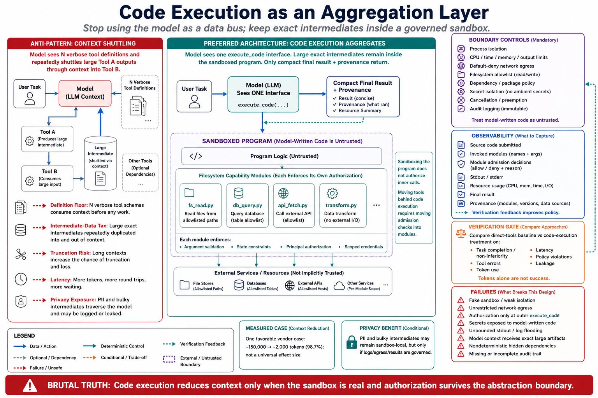

# Topic 8 — Code Execution as an Aggregation Layer over Large Tool Surfaces



## 1. Scope, prerequisites, terminology, boundaries, exclusions, outcomes

**Scope.** The regime change: instead of exposing $N$ tools to the model, expose **one** tool — a code executor — and present the $N$ tools as a code API the model *writes against*. This is Topics 6 and 7 taken to their conclusion, and it is the only approach with a published order-of-magnitude result.

**Prerequisites.** Topic 6 (the $K\cdot N\cdot\bar d$ residual that deferral cannot remove); Topic 7 (the intermediate-result problem that result shaping cannot fix); Topic 5 (effect classes — a code executor is the archetypal dynamic-class tool); Chapter 3, Topic 13 (sandboxing).

**Terminology.** *Aggregation layer*: a single tool through which many capabilities are reached. *Tool module*: a tool presented as a callable function in a code namespace. *Skill*: a reusable function the agent writes and persists [CXM].

**Boundaries.** Inside: the pattern, its measured benefit, and its costs. Outside: sandbox construction (Chapter 3, Topic 13; Chapter 12); the code-agent domain (Chapter 11).

**Exclusions.** No language runtime comparison.

**Outcomes.** The reader can state when the pattern pays, what it costs in infrastructure and risk, and why the token number is real but not free.

## 2. Problem, bottleneck, objective, assumptions, constraints, success criteria

**Problem.** Two costs survive everything in Topics 6–7. **(i) The definition floor:** deferral still pays $K\cdot N\cdot\bar d$ per run; with thousands of tools even the index saturates context [CXM]. **(ii) The intermediate tax:** data flowing from tool A to tool B passes *through* the model twice — "For a 2-hour sales meeting, that could mean processing an additional 50,000 tokens" [CXM] — and no result-shaping fixes it, because the data must arrive intact.

**Bottleneck.** Both costs come from the same root: **the model is the data bus.** Every byte between tools traverses the context. That is an architectural choice, not a law, and it is the choice this topic reverses.

**Objective.** Move the data path out of the context and leave only the *control* path in it. The model writes code; the code moves the data; the model sees what the code chose to show it.

**Assumptions.** The model can write correct code against a typed API — the assumption on which the whole pattern rests, and the one that fails first for weak models.

**Constraints.** Running model-written code requires a sandbox, and that is a real security and operations burden [CXM].

**Success criteria.** Token cost per task drops materially; completion does not regress; no sandbox escape; the code path is auditable.

## 3. Intuition first, then formalization

### 3.1 Intuition: stop making the model the data bus

Direct tool calling forces this shape:

```
model ──call──► gdrive.getDocument ──► [50k-token transcript INTO CONTEXT] ──► model
model ──call──► salesforce.updateRecord(notes=<the 50k transcript, re-emitted>) ──► done
```

The transcript crosses the model boundary **twice**: once inbound as a tool result, once outbound as an argument. The model read 50k tokens and wrote 50k tokens to accomplish a copy.

Code execution forces this shape instead [CXM]:

```typescript
const transcript = (await gdrive.getDocument({ documentId: 'abc123' })).content;
await salesforce.updateRecord({ ...data: { Notes: transcript } });
```

The transcript never enters the context. It lives in a variable. The model emitted ~30 tokens of code and the data moved through the execution environment, where moving data is free.

**This is the entire idea, and it generalizes.** Loops, conditionals, filtering, and error handling all become code rather than round trips: "Loops, conditionals, and error handling can be done with familiar code patterns rather than chaining individual tool calls" [CXM] — which "reduces latency by avoiding alternating model evaluation and tool execution." A ten-item loop that would be ten model turns becomes one.

And discovery collapses too. Tools become files: `servers/google-drive/getDocument.ts`, `servers/salesforce/updateRecord.ts`. The model *navigates* rather than *ingests* — "Models are great at navigating filesystems. Presenting tools as code on a filesystem allows models to read tool definitions on-demand, rather than reading them all up-front" [CXM]. Topic 6's $K\cdot N\cdot\bar d$ floor becomes a handful of `ls` and `cat` calls, paid once.

### 3.2 Formalization: the cost model, continued

Extending Topic 6's model. Let $\mathcal I$ be the set of intermediate values, with $\mathrm{tok}(\iota)$ tokens each, and $\lambda_\iota\in\{1,2\}$ the number of context crossings (2 when a value is both read and re-emitted).

**Direct tool calling:**
$$
C_{\text{direct}} \;=\; \underbrace{K\cdot N\cdot(\bar d+\bar\sigma)}_{\text{definitions (Topic 6)}} \;+\; \underbrace{\sum_{\iota\in\mathcal I}\lambda_\iota\,\mathrm{tok}(\iota)}_{\text{intermediates (Topic 7)}} .
$$

**Code execution:**
$$
C_{\text{code}} \;=\; \underbrace{c_{\text{explore}}}_{\text{a few reads of the module tree}} \;+\; \underbrace{c_{\text{code}}}_{\text{tokens of emitted code}} \;+\; \underbrace{\sum_{\iota\in\mathcal I}\mathbb 1[\iota\ \text{logged}]\cdot\mathrm{tok}(\iota)}_{\text{only what the code CHOOSES to surface}} .
$$

**[derived]** Both dominant terms of $C_{\text{direct}}$ collapse. Definitions are read on demand, not per turn; intermediates cross the boundary **only if logged**. The indicator $\mathbb 1[\iota\ \text{logged}]$ is the pattern's central mechanism, and it is a *privacy* mechanism as much as a cost one: "Intermediate results stay in the execution environment by default. This way, the agent only sees what you explicitly log or return" [CXM].

**The measured instance.** [CXM]'s case study: **"This reduces the token usage from 150,000 tokens to 2,000 tokens—a time and cost saving of 98.7%."**

**Scope discipline, stated firmly.** This is **one worked case study on one workflow with a large intermediate and a large tool surface** — the configuration in which the pattern is *maximally* favorable, since both dominant terms of $C_{\text{direct}}$ are large. It is a legitimate existence proof that the mechanism produces order-of-magnitude effects. **It is not a general compression ratio, and this book will not quote it as one.** A task with three tools and small results will see nothing like 98.7%, and may well see a *regression* once sandbox startup is priced in. §7 gives the honest boundary.

### 3.3 The capability that falls out: privacy and persistence

Two consequences that are not cost savings and are arguably worth more:

**Privacy by data-path control.** Because intermediates stay in the sandbox, sensitive data can flow through a workflow *without entering the model's context at all* — PII can be tokenized automatically, so it "never enters the model context while still flowing through the workflow correctly" [CXM]. **This is a structurally stronger guarantee than prompting a model not to look at something**, and it is the only mechanism in this chapter that provides one. For regulated data, this alone can justify the pattern.

**State and skills.** Agents can write intermediates to files for resumption, and can persist reusable functions as `./skills/` modules for later runs [CXM]. The agent accretes capability *in code* rather than in context — which is Chapter 7's memory problem, solved in the filesystem instead of the prompt.

## 4. Architecture

```
   ┌─────────────── MODEL CONTEXT (small) ────────────────┐
   │  one tool: execute_code(source)                       │
   │  + whatever the code logs                             │
   └───────────────────────┬───────────────────────────────┘
                           │  code (tens of tokens)
                           ▼
   ┌──────────────── SANDBOX (the data plane) ─────────────────────────┐
   │   servers/                                                        │
   │     google-drive/getDocument.ts      ◄── read on demand (ls, cat) │
   │     salesforce/updateRecord.ts                                    │
   │     ...  (N tools as typed modules — never all in context)        │
   │                                                                   │
   │   const t = await gdrive.getDocument(...)   ← 50k tokens, IN HERE │
   │   await salesforce.updateRecord({ Notes: t })                     │
   │   console.log("done")               ← the only thing the model sees│
   │                                                                   │
   │   ./skills/     ← agent-authored reusable functions [CXM]         │
   │   ./state/      ← intermediates persisted for resumption          │
   └───────────────────────────────────────────────────────────────────┘
        ▲
        │  REQUIRED: sandboxing, resource limits, monitoring [CXM]
        │  REQUIRED: per-call effect classification (Topic 5, §6)
```

**The control-plane consequence, and it is the serious one.** In direct tool calling, every action passes through $\operatorname{Admit}$ and your $\alpha_u$ runs on each (Topic 10). **In the code-execution regime, the model emits one action — "run this code" — and the individual tool calls happen *inside* the sandbox.** Your admission gate now sees a *program*, not a call.

In Topic 2's control-retention vector, $g_{\mathrm{adm}}$ degrades from 1 to `~`: you gate the sandbox, not each inner call. This is not fatal, but it **relocates enforcement**, and a team that adopts the pattern without moving its enforcement has silently disabled it. The two workable answers:

1. **Enforce at the module boundary.** The generated tool modules are *your* code. Put $\alpha_u$ inside `salesforce/updateRecord.ts` — every call, from any code path, passes the check. This is the right answer, and it is why presenting tools as modules (rather than as raw network access) matters.
2. **Constrain the sandbox's authority.** The sandbox holds scoped credentials; the blast radius is the sandbox's permissions, whatever the code says.

Both are needed. Neither is optional. And note that the irreversible-write invariant from Topic 5 (E2: $g_{\mathrm{adm}}=1$) is only satisfied here by answer 1 — **an irreversible write reachable from agent-written code with no in-module check violates it.**

## 5. Grounding

- **The problem:** "Tool descriptions occupy more context window space, increasing response time and costs. In cases where agents are connected to thousands of tools, they'll need to process hundreds of thousands of tokens before reading a request" [CXM].
- **The intermediate tax:** the Drive→Salesforce transcript example; "For a 2-hour sales meeting, that could mean processing an additional 50,000 tokens" [CXM].
- **The pattern:** MCP servers presented as a filesystem of code modules (`servers/google-drive/getDocument.ts`); the agent writes TypeScript calling them [CXM].
- **The measured result:** "This reduces the token usage from 150,000 tokens to 2,000 tokens—a time and cost saving of 98.7%" [CXM]. **One case study.**
- **The five enumerated benefits** [CXM]: progressive disclosure (filesystem navigation, on-demand definitions); context-efficient results (10,000 spreadsheet rows filtered to 5 before the model sees them); control flow (loops/conditionals/error handling as code, reducing latency by avoiding alternation); privacy-preserving operations (intermediates stay in the environment; "the agent only sees what you explicitly log or return"; PII tokenization); state persistence and skills (files for resumption; `./skills/` modules).
- **The stated cost, quoted in full because it is the honest half:** "Code execution introduces its own complexity. Running agent-generated code requires a secure execution environment with appropriate sandboxing, resource limits, and monitoring. These infrastructure requirements add operational overhead and security considerations that direct tool calls avoid" [CXM].
- **Corroboration that code is the right action representation:** the survey documents code-defined environments in which "code generates the environment, code is the agent's action, and code adjudicates the result" [CAH §3.3], and treats sandboxed execution with lifecycle hooks as the direction of travel for tool use.
- **Sandbox reproducibility** — required if you want replay: "replay the same patch, command, seed, dependency lockfile" [CAH §3.4.3].

**Evidence gaps, named.** (i) The 98.7% figure is **one workflow, uncontrolled, vendor-reported**, in the maximally favorable configuration. (ii) **No source measures the accuracy cost of the pattern** — the model must now write correct code, a strictly harder task than emitting a JSON tool call, and nobody has published the completion delta. This is the pattern's central unmeasured risk. (iii) No source reports sandbox startup latency or cost, which is what determines the crossover for small tasks.

## 6. Implementation

**Generate the module tree from your existing contracts** — the modules are code you own, which is what makes §4's enforcement possible:

```python
def emit_module(t: ToolContract) -> str:
    """One tool → one typed module. The α_u check goes INSIDE, not at the sandbox edge."""
    return f'''
// {t.namespace}/{t.short_name}.ts
{docstring(t.description)}
export async function {t.short_name}(args: {typescript_type(t.input_schema)}) {{
  await authorize("{t.name}", args);   // ← α_u runs HERE (Topic 10). Every path. No bypass.
  return await __rpc("{t.name}", args);
}}
'''
```

`authorize()` inside the module is the load-bearing line of this topic's implementation. It restores $g_{\mathrm{adm}}=1$ for calls made from agent-written code, and it is what makes Topic 5's E2 invariant satisfiable in this regime.

**The executor tool, classified per call** (Topic 5, §6 — a code executor is the archetypal dynamic-class tool):

```python
execute_code = ToolContract(
    name="execute_code",
    description=(
        "Run TypeScript in the workspace sandbox. Tool APIs are modules under ./servers/. "
        "Explore with `ls ./servers/` and read a module before calling it. "
        "Keep large intermediates in variables — only console.log what you need to see."
        # ^ this last sentence is the steering that makes the pattern actually pay
    ),
    input_schema={"type": "object", "properties": {"source": {"type": "string"}},
                  "required": ["source"], "additionalProperties": False},
    effect=Effect.DYNAMIC,               # classified per call, not once
    executor="sandbox",
    trust=Trust.UNTRUSTED,               # its output is data (Topic 12)
    output=OutputContract(budget_tokens=25_000),   # logs are still results (Topic 7)
    ...
)
```

The description's final sentence is not decoration. **The pattern's entire benefit depends on the model choosing not to log the transcript**, and the only channel you have for that instruction is $d_u$ (Topic 4). A code-execution tool whose description does not say this will produce agents that `console.log(transcript)` and reintroduce every token you set out to save.

**Non-negotiable sandbox requirements** [CXM]: isolation, resource limits (CPU, memory, wall clock, disk), network egress control (an unrestricted sandbox is an exfiltration channel for everything it can read), scoped credentials, and monitoring. Chapter 3, Topic 13 and Chapter 12 own the details; this topic owns the requirement that they exist before the pattern ships.

## 7. Trade-offs

| Dimension | Direct tool calling | Code execution |
|---|---|---|
| Definition tokens | $K\cdot N\cdot(\bar d+\bar\sigma)$ | ~0 (explored on demand) |
| Intermediate tokens | Every value crosses context, sometimes twice | **Only what is logged** |
| Latency | One turn per call | One turn per *program*; **plus sandbox startup** |
| Selection accuracy | JSON call — easy | **Model must write correct code — harder** |
| Enforcement | $\alpha_u$ per call, naturally | **Must be relocated into the modules** |
| Security | Tool-shaped blast radius | **Arbitrary code execution** — sandbox is load-bearing |
| Infrastructure | None | Sandbox, limits, monitoring [CXM] |
| Debuggability | Clean tool-call trace | A program to read; failures are *inside* the code |
| Privacy | Everything the tool returns enters context | **PII can bypass context entirely** [CXM] |

**When it does *not* pay** — the honest boundary, and it is a wide one:

- **Small surfaces.** $N\lesssim 20$ with small results: the sandbox costs more than it saves. §3.2's savings terms are small; the startup cost is not.
- **Weak models.** Writing correct code against an unfamiliar API is harder than emitting a JSON call. **This is the pattern's biggest unmeasured risk** — the token saving is documented; the accuracy cost is not, and it is plausibly nonzero.
- **Teams without sandbox capability.** [CXM] is unambiguous that this is the entry fee, and an inadequate sandbox converts a token optimization into a remote-code-execution surface. **A team that cannot build a good sandbox should not adopt this pattern**, and no token number should tempt them.
- **Strict per-action audit requirements.** A regulator asking "which actions did the agent take, and who approved each?" is easier to answer with a tool-call trace than with a program trace — unless your module-level `authorize()` emits an audit event per call, which it should (§6).

## 8. Experiments

**Ablation — regime.** Direct tool calling vs. code execution, paired, same tasks, same model. Metrics (the vector, all of it):

- **Tokens** — total, and separated into definitions / intermediates / logged output. This is where the 98.7%-class effect appears *if your workload has the shape*.
- **Completion $G$** — **the decisive metric.** The token saving is worthless if $G$ falls, and §7 predicts it may.
- **Latency** — end-to-end, *including sandbox startup*. Fewer turns but heavier ones; the sign is not obvious a priori.
- **Cost** — tokens plus sandbox compute. The second term is why token savings ≠ cost savings.
- $\kappa$ distribution — code-execution failures show up as `execution_error`, a different terminal than a tool error (Chapter 1, Topic 12).

**Acceptance rule.** Adopt only if $G$ is **non-inferior** within the clustered-bootstrap interval *and* the token/cost saving clears your threshold. Predeclare the non-inferiority margin. **A 98.7% token saving that costs 5 points of completion is a bad trade and most teams would take it by accident**, because they instrumented tokens and not accuracy.

**Ablation — logging discipline.** With and without the "only log what you need" steering (§6). This isolates how much of the benefit is the *architecture* and how much is the *instruction*. My expectation, stated as a hypothesis to be falsified: the instruction carries more of it than people assume, because an agent that logs its intermediates has code execution with none of its benefits.

**Security testing.** Sandbox escape attempts; egress attempts; credential-scope violations. Report the zero-failure bound with its $n$ (Chapter 1, Topic 12) — "we didn't observe an escape" is not a claim until it carries a sample size.

**Statistics.** Paired; McNemar on completion; clustered bootstrap; Holm across arms.

## 9. Failure modes, edge cases, hazards, mitigations, open limitations

- **Sandbox escape.** The catastrophic case. Model-written code is *untrusted code by definition*. Mitigation: real isolation, egress control, scoped credentials, monitoring [CXM]. This is not a checkbox; it is the precondition.
- **The agent logs the transcript.** `console.log(transcript)` and the 50k tokens are back. **The pattern's benefit is not automatic; it is a behavior.** Mitigation: steering in $d_u$ (§6); measure logged-token volume.
- **Enforcement lost in the migration.** $\alpha_u$ was at the call boundary; now calls happen inside code. Mitigation: `authorize()` in the module (§6). **Check this explicitly when migrating** — it is the silent regression.
- **Resource exhaustion.** An infinite loop; a fork bomb; a 10 GB write. Mitigation: hard limits on CPU, memory, wall clock, and disk.
- **Egress as exfiltration.** A sandbox with network access and access to sensitive data is an exfiltration channel — and if any tool result is attacker-controlled (Topic 12), the attacker can *write the code*. This is the highest-severity composition in the chapter: prompt injection plus code execution plus egress. Mitigation: default-deny egress; allowlist.
- **Debuggability collapse.** A failure is now inside a program the model wrote. Mitigation: capture source, stdout, stderr, and per-module audit events in $\hat\tau$.
- **Non-determinism amplified.** The model writes *different code* each run for the same task. Replay requires the sandbox's reproducibility discipline — "replay the same patch, command, seed, dependency lockfile" [CAH §3.4.3].
- **Edge case — skills that rot.** Agent-authored `./skills/` modules [CXM] accumulate, go stale against changing APIs, and become an unreviewed second codebase. Mitigation: skills need ownership, review, and expiry, exactly like tools (Topic 1). An agent-written skill is *code in production*.
- **Open limitation.** **No published measurement of the accuracy cost.** The token benefit is documented once, in the maximally favorable case; the completion delta is unmeasured everywhere. Anyone adopting this pattern on the strength of 98.7% and without running §8's completion arm is doing exactly what this book's grounding rule forbids.

## 10. Verified observations, decision rules, production implications, connections

**Verified observations.**
1. Large tool surfaces cost hundreds of thousands of tokens before the request is read [CXM].
2. Chained tools push intermediates through context twice; a 2-hour transcript adds ~50,000 tokens [CXM].
3. Presenting tools as filesystem modules enables on-demand definition reading [CXM].
4. One worked case study reports 150,000 → 2,000 tokens (98.7%) [CXM] — **one case, vendor-reported, maximally favorable configuration.**
5. Intermediates stay in the environment; "the agent only sees what you explicitly log or return," enabling PII tokenization [CXM] — **a structural privacy guarantee, not a prompted one.**
6. The pattern requires "a secure execution environment with appropriate sandboxing, resource limits, and monitoring," adding "operational overhead and security considerations that direct tool calls avoid" [CXM].

**Decision rules.**
- **Adopt when:** $N$ is large (hundreds+), intermediates are large, workflows chain, **and** you can build a real sandbox.
- **Do not adopt when:** the surface is small, the model is weak, or the sandbox would be inadequate. **An inadequate sandbox turns a token optimization into an RCE surface**, and no token figure justifies that.
- **When you adopt: move $\alpha_u$ into the modules.** Otherwise you have disabled your authorization layer and not noticed.
- **Instrument completion, not just tokens.** The saving is documented; the accuracy cost is not.
- **Treat agent-authored skills as production code.** They are.

**Production implications.**
1. Generate tool modules from your contracts, with `authorize()` inside each. This is the single most important implementation decision in the topic.
2. Default-deny network egress from the sandbox. Prompt injection + code execution + egress is the chapter's worst composition.
3. Put the "only log what you need" steering in $d_u$ and measure logged-token volume — the benefit is a behavior, not an architecture.
4. Capture source, stdout, stderr, and per-call audit events into $\hat\tau$, or you have traded observability for tokens.

**Connections.** This topic dissolves Topic 6's definition floor and Topic 7's intermediate tax — the two costs neither could remove. It **relocates** Topic 10's enforcement into the modules and inherits Topic 5's per-call classification problem in its hardest form. Topic 12's untrusted content becomes maximally dangerous here (injected content can now write code). Chapter 3, Topic 13's sandbox architecture and Chapter 12's threat model are prerequisites, not follow-ups. Chapter 7's memory returns as `./state/` and `./skills/`.

## Sources

[CXM] Anthropic, "Code execution with MCP: building more efficient agents" — tool-definition context cost ("thousands of tools… hundreds of thousands of tokens"); the intermediate-result duplication problem and the 2-hour-transcript/50,000-token example; MCP servers as a filesystem of code modules (`servers/google-drive/getDocument.ts`); the TypeScript Drive→Salesforce example; **"This reduces the token usage from 150,000 tokens to 2,000 tokens—a time and cost saving of 98.7%"**; progressive disclosure ("Models are great at navigating filesystems"); context-efficient results (10,000 rows filtered to 5); control flow ("Loops, conditionals, and error handling can be done with familiar code patterns"); privacy ("Intermediate results stay in the execution environment by default… the agent only sees what you explicitly log or return"; PII tokenization); state persistence and `./skills/`; and the cost: "Running agent-generated code requires a secure execution environment with appropriate sandboxing, resource limits, and monitoring. These infrastructure requirements add operational overhead and security considerations that direct tool calls avoid" — https://www.anthropic.com/engineering/code-execution-with-mcp
[CAH] Code as Agent Harness, arXiv:2605.18747 (`Knowledge_source/2605.18747v1.pdf`) §3.3 (code-defined environments: "code generates the environment, code is the agent's action, and code adjudicates the result"; sandboxed execution and lifecycle hooks as the direction of travel), §3.4.3 (sandbox reproducibility: "replay the same patch, command, seed, dependency lockfile")
[WTA] Anthropic, "Writing effective tools for agents" — the 25,000-token response cap that still applies to logged output — https://www.anthropic.com/engineering/writing-tools-for-agents
