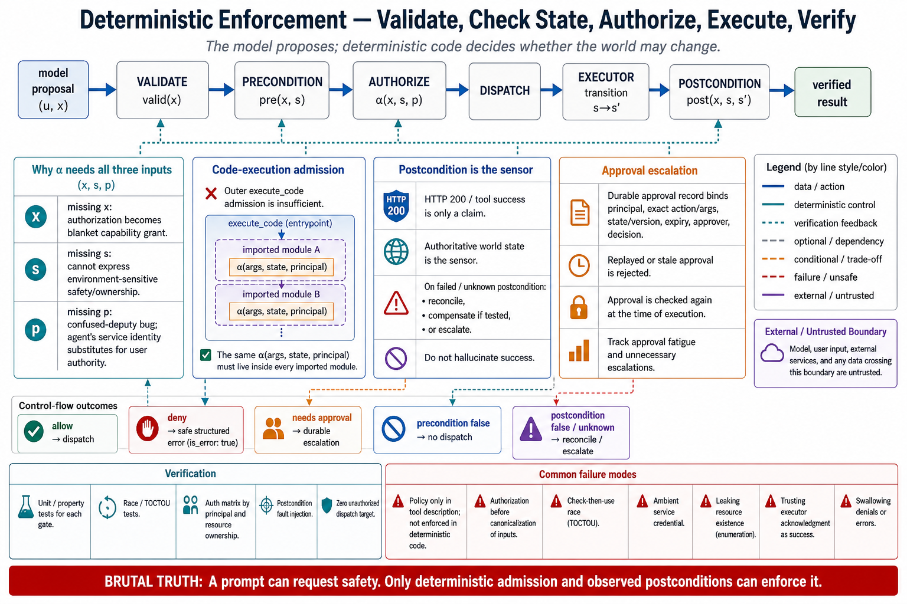

# Topic 10 — Deterministic Preconditions, Postconditions, Authorization, and Resource Ownership



## 1. Scope, prerequisites, terminology, boundaries, exclusions, outcomes

**Scope.** The enforcement fields: $\alpha_u$ (authorization) plus the pre- and postcondition contracts. This is where Chapter 3's deterministic-invariant floor meets the tool boundary.

**Prerequisites.** Chapter 3, Topic 7 (deterministic invariants around probabilistic behavior); Topic 5 (effect classes — E1 says every write needs an $\alpha_u$); Topic 2 ($g_{\mathrm{adm}}$ — the gate only exists if the call traverses your code).

**Terminology.** *Precondition* $\mathrm{pre}_u(x,s)$: a predicate over arguments and state that must hold before dispatch. *Postcondition* $\mathrm{post}_u(x,s,s')$: a predicate over the resulting state that must hold after. *Authorization* $\alpha_u(x,s,\text{principal})$: whether *this* principal may make *this* call *now*. *Resource ownership*: the binding between a principal and the resources it may touch.

**Boundaries.** Inside: the enforcement mechanism and its placement. Outside: the policy content (Chapter 12); idempotency and compensation (Topic 11).

**Exclusions.** No IAM system design.

**Outcomes.** The reader can place the three checks correctly, write an authorization predicate that takes arguments (not just tool names), and detect the confused-deputy structure that agent systems produce by default.

## 2. Problem, bottleneck, objective, assumptions, constraints, success criteria

**Problem.** The model is a stochastic proposal generator that will eventually propose an action outside intent — a measured, *regressing* propensity across a model version step [G56 §1]. No amount of prompting converts a propensity into a guarantee (Chapter 2, Topic 1). Guarantees come from code that runs on every call and cannot be talked out of it.

**Bottleneck.** Authorization in agent systems is routinely implemented as a *tool-level* allowlist: "this agent may call `db_execute`." That is not authorization; it is capability granting. Real authorization is over the *call*: this principal, this statement, this row, right now. [CAH §5] states exactly this and it is the topic's foundational requirement.

**The structural hazard.** Agent systems are **confused deputies by default.** The agent holds *its own* credentials and acts on behalf of a user whose authority is narrower. Unless the user's authority is threaded through to the check, every tool call executes with the agent's permissions — and an injected instruction (Topic 12) can therefore reach anything the *agent* can reach, not merely what the *user* can.

**Objective.** Deterministic checks, evaluated over arguments and state, at $\operatorname{Admit}$, on every call, with the acting principal's authority — not the agent's.

**Assumptions.** The model may be manipulated. The harness may not.

**Constraints.** Checks add latency to every call. Some state is expensive to query. Postconditions require a sensor.

**Success criteria.** No write executes without $\alpha_u$ evaluating true against the *user's* authority; every $\textsf{W}_{\mathrm{irr}}$ has a postcondition or a verification path; denial is a `tool_result`, not a crash.

## 3. Intuition first, then formalization

### 3.1 Intuition: the gate the model cannot argue with

Chapter 3, Topic 7's thesis: properties that must be guarantees are enforced by deterministic mechanisms, not by asking the model nicely. This topic is that thesis at the tool boundary, and it has one sentence: **the check must be code that runs whether or not the model wants it to.**

Everything else follows from placement. A check written in $d_u$ ("only call this for authorized users") runs *inside the model* — it is a suggestion to a manipulable stochastic process, and it is a CP-1 violation (data in the control plane). A check written in `Admit` runs in code. The first is a wish; the second is an invariant.

The confused-deputy point deserves its own sentence because it is the failure that turns a prompt injection into a breach. **The agent's credentials are not the user's credentials.** If your tool executes with a service account that can read every customer's records, then a successful injection reads every customer's records — even though the user who started the run could only see one. The fix is not a better prompt. It is threading the *user's* principal into $\alpha_u$ so the blast radius is the user's authority, not the service's.

### 3.2 Formalization

For call $(u,x)$ in state $s$ with principal $p$, admission is the conjunction:

$$
\operatorname{Admit}(u,x,s,p)=
\begin{cases}
\widetilde a & \text{if}\ \ \mathrm{valid}_u(x)\ \wedge\ \mathrm{pre}_u(x,s)\ \wedge\ \alpha_u(x,s,p)\\[2pt]
\bot_{\text{reject}} & \text{otherwise,}
\end{cases}
$$

and after execution yielding $s'$:

$$
\mathrm{post}_u(x,s,s')\ \text{must hold, else}\ \kappa\leftarrow\mathrm{execution\_error}\ \text{and compensate (Topic 11).}
$$

**Ordering is not arbitrary** — it is forced by three separate concerns **[derived]**:

1. **$\mathrm{valid}_u$ first** (structural, state-free, cheap — Topic 3). No point authorizing a malformed call.
2. **$\mathrm{pre}_u$ second** (semantic, state-dependent: does the resource exist, is the invoice unpaid).
3. **$\alpha_u$ last** (authorization). Last because a denial must not leak: if $\alpha_u$ ran before $\mathrm{pre}_u$, the distinct error messages "not authorized" versus "does not exist" would let an unauthorized caller enumerate resources by probing. **Denial messages must be indistinguishable across the existence boundary**, and running the checks in this order — then collapsing "unauthorized" and "not found" into a single response for resources the principal cannot see — is how you get that.

**The authorization signature is the topic's core claim:**

$$
\alpha_u:\ (\underbrace{x}_{\text{arguments}},\ \underbrace{s}_{\text{environment state}},\ \underbrace{p}_{\text{principal}})\ \longrightarrow\ \{\text{allow},\text{deny},\text{escalate}\}.
$$

An $\alpha_u$ that ignores $x$ is a capability grant. An $\alpha_u$ that ignores $p$ is a confused deputy. An $\alpha_u$ that ignores $s$ cannot express [CAH §5]'s central case — "the same command may be safe in a disposable sandbox but unsafe in a production repository." **All three arguments are load-bearing, and dropping any one produces a named, documented failure.**

The third outcome, **escalate**, is not a failure branch; it is the human gate (Chapter 3's HITL) as a first-class return value.

### 3.3 Postconditions: the difference between "the tool returned" and "the thing happened"

A tool returning `200 OK` is a claim by the tool. A postcondition is a *sensor* (Chapter 3, Topic 7): an independent check that the intended state change is real.

$$
\mathrm{post}_{\texttt{transfer}}(x,s,s')\ :\quad \mathrm{balance}(s',x.\text{dest})=\mathrm{balance}(s,x.\text{dest})+x.\text{amount}.
$$

This is the tool-level instance of the book's recurring principle: **the model's claim of completion is not evidence of completion** (Chapter 3, Topic 8) — and neither is the tool's. Postconditions are what turn $\kappa=\mathrm{success}$ from an assertion into a measurement, and they are the only defense against the false-completion propensity [FSC §6.3.5] when the tool itself is the thing lying.

## 4. Architecture

```
   ξ_t (candidate call)
     │
     ▼
   ┌─ valid_u(x) ────────── structural (JSON Schema)      cheap, state-free   [Topic 3]
   │     fail ⇒ tool_result(is_error) + REPAIR TEXT
   ▼
   ┌─ pre_u(x, s) ───────── semantic: resource exists, state permits
   │     fail ⇒ tool_result(is_error) + what the world actually contains
   ▼
   ┌─ α_u(x, s, p) ──────── AUTHORIZATION.  p = the USER's principal, not the agent's
   │     deny     ⇒ tool_result(is_error), message indistinguishable from not-found
   │     escalate ⇒ HUMAN GATE (Chapter 3 HITL) — run pauses, does not fail
   ▼
   Dispatch (ι_u — Topic 11)
     │
     ▼
   ┌─ post_u(x, s, s') ──── SENSOR: did it actually happen?
   │     fail ⇒ κ ← execution_error; compensate (Topic 11); DO NOT report success
   ▼
   tool_result (+ provenance φ_u — Topic 12)
```

**Where these must not live.** Not in $d_u$ (a wish). Not in the model's system prompt (a wish with better formatting). Not only in the underlying service (which may be reachable by paths that bypass your harness — and *is*, in the code-execution regime, which is why Topic 8 pushes `authorize()` into the tool modules).

**Every failure returns a `tool_result` with `is_error: true`, never an exception.** Chapter 4's invariant I3 requires that every `tool_use` gets a result; an admission denial that throws leaves a hole in the transcript, and the model then reasons over an absence. **A policy denial is an observation the model must receive** — and the message should tell it what to do instead, exactly as a validation error does (Topic 3, §6).

## 5. Grounding

- **The authorization signature.** "Permissions should depend not only on tool identity, but also on arguments, environment state, data sensitivity, and expected side effects" [CAH §5]. This is $\alpha_u(x,s,p)$, stated in the source's own words, and it is the sentence that makes tool-level allowlists insufficient.
- **Permission tiers and their obligations.** Each tier "should specify its allowed actions, constraints, audit logs, rollback mechanisms, and human-in-the-loop gates for high-risk operations" [CAH §3.4.4, §5]. Note the four artifacts: allowed actions, audit, rollback (Topic 11), and gates (the `escalate` branch).
- **Pre-use hooks as the shipped mechanism.** "Pre-use hooks can validate arguments, enforce permission policies, or block risky commands, while post-use hooks can sanitize outputs, compact logs, update memory, or trigger follow-up verification" [CAH §3.3.4]. **This is $\mathrm{pre}_u$/$\alpha_u$ and $\mathrm{post}_u$, documented as existing agent-SDK architecture** — the checks in §4 are not an invention, they are a documented harness capability that most teams leave empty.
- **Approvals as durable state, not prompts.** "Human-in-the-loop control should not appear only as an occasional prompt interruption; it should become durable harness state. Each approval, rejection, policy exception, or reviewer correction should update the harness's permission rules, escalation policy, verification criteria, and future memory retrieval" [CAH §5]. And: "high-stakes approvals should be auditable state transitions: what action was proposed, what evidence was shown, what risks were surfaced, who approved or rejected it, and what responsibility boundary changed afterward" [CAH §5]. **The `escalate` branch must therefore write to a durable record, not merely block a call.**
- **Platform approval surfaces.** Codex's `untrusted` / `on-request` / `never` approval policies and its sandbox modes [CDX] are the shipped form of the tier model.
- **Why deterministic checks and not prompts.** Beyond-intent action propensities are measured and *regressed* across a version step [G56 §1]; unsupported completion claims are measured [FSC §6.3.5]. The model cannot be the enforcement point, and this is evidence, not opinion.
- **Annotations are not enforcement.** MCP tool annotations disclose "which tools require open-world access or make destructive changes" [WTA] — **advisory metadata from the server**, which a hostile or buggy server can misstate. Never substitute an annotation for $\alpha_u$ (Topic 2).

**Evidence gap.** The survey lists "policy specification," "side-effect prediction," and "secure tool schemas" as **open problems** [CAH §5]. There is no measured evaluation of agent authorization mechanisms in any source available to this chapter. The architecture here is sound engineering practice grounded in documented harness capabilities; it is not a validated solution, and no one has published the failure rate of any approach.

## 6. Implementation

**Authorization with all three arguments, and the user's principal:**

```python
def authorize(tool: str, args: dict, ctx: Context) -> Decision:
    # p is the USER's principal — NOT the agent's service identity.
    # Threading this through is what prevents the confused deputy (§3.1).
    p = ctx.acting_principal

    resources = resources_touched(tool, args)          # arguments determine the resources
    for r in resources:
        if not p.may(ACTION_OF[tool], r):
            # Indistinguishable from not-found for resources p cannot see (§3.2).
            return Decision.deny(f"No {r.type} named {r.name!r} is available to you.")

    eff = classify_call(TOOLS[tool], args, ctx)        # per-call class (Topic 5)
    if eff is Effect.WRITE_IRREVERSIBLE and not ctx.workspace.is_disposable:
        return Decision.escalate(                      # the human gate — a RETURN VALUE
            action=f"{tool}({redact(args)})",
            resources=[r.name for r in resources],
            risk="irreversible; leaves authority domain",
        )
    return Decision.allow()
```

Three things are doing work. **`ctx.acting_principal`** — the user's authority, not the agent's; without it, injection reaches everything the service account can reach. **`resources_touched(tool, args)`** — authorization over *arguments*, per [CAH §5]. **`Decision.escalate`** — a first-class outcome that pauses the run, not an exception that kills it.

**Escalation as durable state**, per [CAH §5]'s requirement that approvals become harness state rather than transient prompts:

```python
def escalate(decision, ctx) -> Decision:
    record = ApprovalRecord(                # auditable state transition [CAH §5]
        proposed_action=decision.action,
        evidence_shown=decision.resources,
        risks_surfaced=decision.risk,
        run_id=ctx.run_id, principal=ctx.acting_principal.id,
    )
    outcome = ctx.approvals.request(record)             # blocks; run checkpoints (Ch. 3, T9)
    record.decided_by, record.decision = outcome.reviewer, outcome.verdict
    ctx.approvals.persist(record)                       # DURABLE — feeds future policy
    return Decision.allow() if outcome.approved else Decision.deny("Rejected by reviewer.")
```

**Postconditions as sensors:**

```python
async def dispatch_checked(call, ctx) -> Result:
    s_before = await snapshot(call.tool.observes, ctx)
    result   = await execute(call, ctx)
    s_after  = await snapshot(call.tool.observes, ctx)

    if not call.tool.postcondition(call.args, s_before, s_after):
        # The tool said 200. The world disagrees. Believe the world.
        await compensate(call, ctx)                     # Topic 11
        return Result.error(
            "Action did not take effect: the expected state change was not observed. "
            "Do not assume it succeeded; re-check before retrying."   # steer the model
        ), "execution_error"
    return result, "continue"
```

The comment is the point. **A tool's success code is a claim; the postcondition is the evidence.** Where they disagree, the postcondition wins — and the model must be *told*, or it will proceed believing the action landed.

## 7. Trade-offs

| Check | Cost | Buys | When it can be skipped |
|---|---|---|---|
| $\mathrm{valid}_u$ | ~0 (schema) | Malformed calls never reach code | Never |
| $\mathrm{pre}_u$ | A state query per call | Coherent failures with repair text | When state is unobservable — then the postcondition must carry the load |
| $\alpha_u$ | A policy evaluation per call | The only real security boundary | **Never, for writes (E1)** |
| $\mathrm{post}_u$ | A second state snapshot | Success becomes measured, not claimed | Reads; and writes whose sensor genuinely does not exist — say so in the contract |
| `escalate` | **Human latency** — seconds to hours | Irreversible actions get a decision-maker | When the effect class is genuinely reversible (design it down — Topic 5, §7) |

**The two costs that decide adoption.**

**Latency.** Pre/post checks double the state queries around a write. For a hot path this is real. The mitigation is scope, not omission: check what the effect class demands, not everything uniformly. A read needs neither.

**The human gate is the expensive one, and it is expensive in a way that corrodes.** It destroys the autonomy that motivated the agent, and — worse — **a gate that fires too often trains reviewers to approve reflexively**, at which point you have the latency cost and none of the safety benefit, plus a false record of oversight. Measure override rate (Topic 5, §8); a rate near 100% means the gate has been decommissioned by human behavior without anyone deciding to decommission it. **The right response is not to remove the gate but to narrow it** — per-call classification (Topic 5) exists precisely so the gate fires on the hazardous subset rather than the whole tool.

## 8. Experiments

**Enforcement coverage audit** (not an experiment — a prerequisite). For every tool: is $\alpha_u$ non-trivial? Does it read $x$? Does it read $p$? Does it read $s$? **Count the tools failing each.** In most systems the $p$ column is empty across the board, which means the system is a confused deputy end to end.

**Red-team evaluation — the decisive one.** Construct tasks whose *correct* behavior is refusal: the user asks for an action their principal does not permit; an injected instruction (Topic 12) requests an out-of-scope action; a task tempts an unbounded `UPDATE`. Metrics:

- **Enforcement failure rate** — an unauthorized action executed. **Target: zero.** Report the zero-failure bound $p_{\max}=1-(1-\gamma)^{1/n}$ with its $n$ (Chapter 1, Topic 12). To claim under 1% at 95% confidence: $n\approx300$ attempts, zero failures.
- **Over-denial rate** — legitimate actions blocked. Costs usability. Tolerate more of it than you want to.
- **Escalation precision** — of escalated actions, the fraction a reviewer *rejects*. A precision near zero means the gate is noise and reviewers are being trained to rubber-stamp.

**Postcondition-sensor evaluation.** Inject partial failures (the tool returns 200; the effect did not land). Measure detection rate. **An undetected partial failure is a false success**, and it propagates into every downstream claim the agent makes.

**Statistics.** Wilson intervals on all rates; zero-failure bounds where the target is zero; clustered bootstrap for task-level contrasts (Chapter 1, Topic 12).

## 9. Failure modes, edge cases, hazards, mitigations, open limitations

- **The confused deputy.** The tool runs with the agent's credentials; injection reaches everything the *service* can reach. **The single most consequential failure in this chapter.** Mitigation: thread `acting_principal` into $\alpha_u$; scope credentials to the user, not the agent.
- **Tool-level allowlist as "authorization."** A capability grant wearing authorization's name. Mitigation: $\alpha_u(x,s,p)$ [CAH §5].
- **Policy in the prompt.** A CP-1 violation; a suggestion, not a control. Mitigation: code at $\operatorname{Admit}$.
- **Enumeration via error messages.** "Not authorized" vs "not found" leaks existence. Mitigation: check ordering (§3.2) and indistinguishable denials.
- **Denial as exception.** Crashes the loop, leaves a transcript hole (Chapter 4, I3), model hallucinates the missing result. Mitigation: `tool_result` with `is_error: true` and a steering message.
- **Missing postcondition.** The tool returned 200; nothing happened; the agent reports success. Mitigation: sensors on $\textsf{W}_{\mathrm{irr}}$.
- **Approval fatigue.** Gates fire constantly; reviewers approve reflexively; **oversight becomes theatre with an audit trail**, which is worse than no gate because it manufactures assurance. Mitigation: narrow the gate via per-call classification; monitor escalation precision.
- **Approvals as transient prompts.** [CAH §5] is explicit that they should be durable harness state. A gate that produces no record teaches the system nothing and satisfies no auditor.
- **Enforcement bypassed by the code-execution regime.** Topic 8's sandbox executes tool calls *inside* code, past your gate. Mitigation: `authorize()` in the generated module (Topic 8, §6). **Check this explicitly on migration** — it is the silent regression.
- **Edge case — the unobservable postcondition.** Some effects (an email delivered, a message read) cannot be sensed. Say so in the contract; do not fabricate a sensor. An honest "we cannot verify this" is worth more than a check that always passes.
- **Open limitation.** Policy specification, side-effect prediction, and secure tool schemas are **open problems** [CAH §5], and no source measures any authorization approach's failure rate. This topic is disciplined engineering on an unsolved problem, and it should be read that way.

## 10. Verified observations, decision rules, production implications, connections

**Verified observations.**
1. Permissions must depend on arguments, environment state, data sensitivity, and expected side effects — not tool identity [CAH §5].
2. Pre-use hooks validating arguments and enforcing policy, and post-use hooks sanitizing and verifying, are documented agent-SDK architecture [CAH §3.3.4] — the mechanism exists; most systems leave it empty.
3. Permission tiers must carry allowed actions, constraints, **audit logs, rollback mechanisms**, and human gates [CAH §3.4.4].
4. Approvals should be **durable, auditable state transitions**, not transient prompts [CAH §5].
5. MCP annotations are advisory disclosure, not enforcement [WTA].
6. Beyond-intent action propensity is measured and regressed across a version step [G56 §1] — the model cannot be the enforcement point.

**Decision rules.**
- **$\alpha_u$ takes $(x,s,p)$ or it is not authorization.** Drop $x$ → capability grant. Drop $p$ → confused deputy. Drop $s$ → cannot express [CAH §5]'s core case.
- **Every write has a non-trivial $\alpha_u$** (E1). No exceptions.
- **Every irreversible write has a postcondition or an explicit "unverifiable" declaration.**
- **Denials are `tool_result`s with steering text, never exceptions.**
- **Escalations write durable records** [CAH §5].
- **If your escalation precision is near zero, narrow the gate — do not remove it.**

**Production implications.**
1. Run the enforcement-coverage audit. The $p$ column is empty in most systems, and that is a live confused-deputy vulnerability, not a gap in documentation.
2. Thread the user's principal into every tool call. This is the highest-severity fix in the chapter.
3. Run the red-team evaluation and report enforcement failure with its zero-failure bound and $n$.
4. Make approvals durable state that updates policy [CAH §5], not a modal dialog that disappears.
5. Re-verify enforcement after any migration to code execution (Topic 8).

**Connections.** Topic 5's E1/E2 are what this topic enforces; Topic 11 owns what happens when a check passes and the action still half-happens; Topic 12's untrusted content is what makes the confused deputy exploitable rather than merely untidy; Topic 8 relocates these checks and is the migration where they get lost. Chapter 3, Topic 7 is the general principle; Chapter 3, Topic 9's checkpointing is what makes `escalate` a pause rather than a failure; Chapter 12 supplies the policy this topic mechanizes.

## Sources

[CAH] Code as Agent Harness, arXiv:2605.18747 (`Knowledge_source/2605.18747v1.pdf`) §3.3.4 (pre-use hooks validating arguments, enforcing permission policies, blocking risky commands; post-use hooks sanitizing outputs and triggering follow-up verification), §3.4.4 (permission tiers with human-in-the-loop gates), §5 ("permissions should depend not only on tool identity, but also on arguments, environment state, data sensitivity, and expected side effects"; tiers specifying "allowed actions, constraints, audit logs, rollback mechanisms, and human-in-the-loop gates"; "Human-in-the-loop control should not appear only as an occasional prompt interruption; it should become durable harness state"; "high-stakes approvals should be auditable state transitions: what action was proposed, what evidence was shown, what risks were surfaced, who approved or rejected it, and what responsibility boundary changed afterward"; policy specification, side-effect prediction, and secure tool schemas as open problems)
[CDX] OpenAI Codex documentation — approval policies (`untrusted`, `on-request`, `never`); sandbox modes — https://learn.chatgpt.com/docs/agent-approvals-security
[WTA] Anthropic, "Writing effective tools for agents" — MCP tool annotations as disclosure of open-world access and destructive changes (advisory, not enforcement) — https://www.anthropic.com/engineering/writing-tools-for-agents
[G56] GPT-5.6 Preview System Card §1 — beyond-intent action propensity, regressing across a version step — `Knowledge_source/gpt-5-6-preview.pdf`
[FSC] Claude Fable 5 & Mythos 5 System Card §6.3.5 — unsupported completion claims — `Knowledge_source/`
