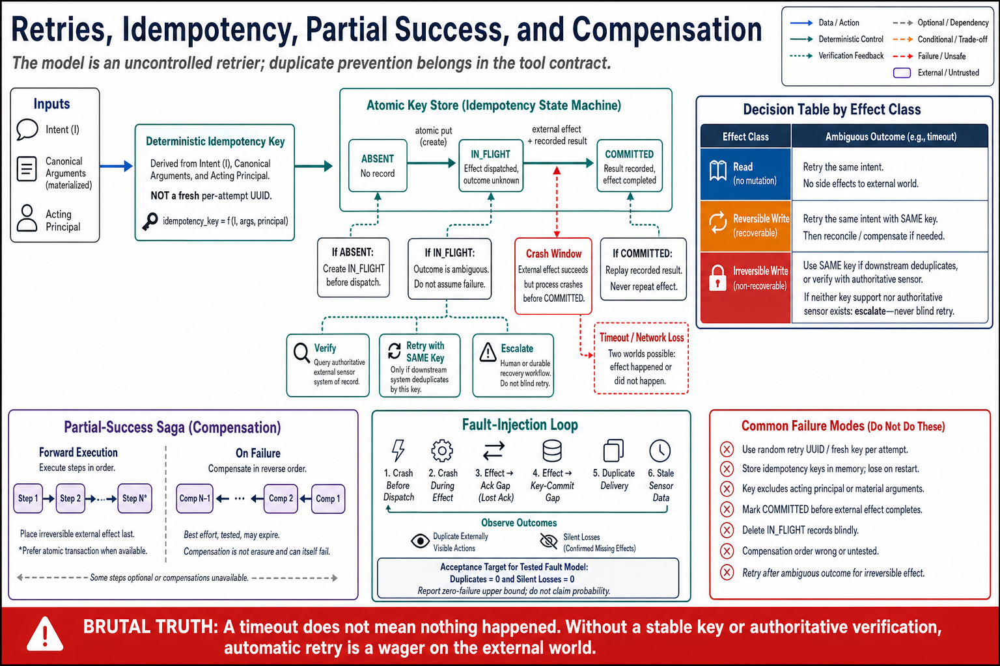

# Topic 11 — Retry Semantics, Idempotency Keys, Duplicate Actions, Partial Success, and Compensation



## 1. Scope, prerequisites, terminology, boundaries, exclusions, outcomes

**Scope.** $\iota_u$ — the idempotency and retry contract — and the compensator $C_u$ that Topic 5 required $\textsf{W}_{\mathrm{rev}}$ to possess. This is where classical distributed-systems discipline meets a caller that retries *on its own initiative*.

**Prerequisites.** Topic 5 (effect classes; E4: no blind retry on irreversible writes; the ambiguous-failure problem); Topic 10 (postconditions as sensors); Chapter 3, Topic 10 (the exception taxonomy).

**Terminology.** *Ambiguous failure*: a failure that does not tell you whether the effect occurred. *Idempotency key*: a client-supplied token making a repeated request a no-op. *Partial success*: a multi-effect operation where some effects landed. *Compensation*: an action restoring the prior state; not a rollback (nothing is transactional here).

**Boundaries.** Inside: the retry contract at the tool boundary. Outside: harness-level cancellation and replay (Chapter 3, Topic 9); saga orchestration across many tools (Chapter 8).

**Exclusions.** No transaction-theory survey.

**Outcomes.** The reader can make every write tool safely retryable, or can state exactly why it is not and what happens instead.

## 2. Problem, bottleneck, objective, assumptions, constraints, success criteria

**Problem.** Retry is the harness's default medicine (Chapter 3, Topic 10), and it is administered by *two independent parties*: the harness (on transport failure) and **the model** (which, seeing an error or an unclear result, will simply call the tool again). Nobody authorized the second retrier, and nobody can prevent it — it is a policy, not a component.

**Bottleneck.** The generic retry loop is $\chi$-blind (Topic 5, E4). Applied to an irreversible write after an ambiguous failure, it is a coin flip between "no effect" and "double effect." **The first timeout on a payment endpoint double-charges the customer.**

**The agent-specific twist, and it is the whole reason this topic exists as more than a restatement of standard practice.** In ordinary systems the retrier is your code, and you can make it $\chi$-aware. **In an agent system the model is also a retrier, and it is not your code.** It sees `is_error: true`, concludes "that didn't work," and calls the tool again — with no memory that the effect may have landed. Therefore **idempotency cannot be a property of your retry loop; it must be a property of the tool contract itself**, so that a *model-initiated* repeat is also a no-op.

**Objective.** Every write tool is safe to call twice — because it will be.

**Assumptions.** Ambiguous failures happen. The model retries. Target systems may or may not support idempotency keys.

**Constraints.** Many target APIs do not accept an idempotency key. Compensation is not always possible.

**Success criteria.** Zero duplicate effects under injected ambiguous failure, reported with a zero-failure bound (Chapter 1, Topic 12).

## 3. Intuition first, then formalization

### 3.1 Intuition: assume every call happens twice

Design each write tool so that calling it twice with the same arguments produces the same world as calling it once. Then retry — by anyone, for any reason — is safe, and the entire class of duplicate-effect failures disappears without needing to be reasoned about at every call site.

The reason this framing beats "be careful with retries" is that carefulness does not compose. Your harness can be careful; the model cannot be made careful, because its retry is a *sampled behavior*, not a code path. **The only defense that survives an untrusted retrier is idempotency at the contract.**

### 3.2 Formalization

Tool $u$ is **idempotent** iff for all states $s$ and arguments $x$:

$$
T_u\bigl(T_u(s,x),\,x\bigr)\;=\;T_u(s,x).
$$

Reads are trivially idempotent. Most writes are not: `append_row`, `send_email`, `charge_card`, `create_ticket` all violate it by construction.

**The key construction.** Introduce an idempotency key $k=\mathcal K_u(x)$ and a durable store $D$ of executed keys. Define the wrapped transition:

$$
T^{\star}_u(s,x)=
\begin{cases}
s & \text{if } k\in D \quad\text{(already executed — return the recorded result)}\\
T_u(s,x)\ \text{with } D\leftarrow D\cup\{k\} & \text{otherwise.}
\end{cases}
$$

$T^\star_u$ is idempotent by construction. **[derived]** Two conditions make it real rather than notional, and both are where implementations fail:

1. **$\mathcal K_u$ must be a deterministic function of the *intent*, not of the attempt.** A key generated fresh per attempt (a UUID minted at call time) makes every retry a new key and provides *no protection whatsoever*. This is the most common broken implementation of idempotency in existence: it looks correct, it is a no-op. The key must derive from the semantic content of the request — `hash(run_id, tool, canonical(args))` — so that a retry of the same intent produces the same key.
2. **The commit of $D$ and the effect must not be separable by a crash.** If the effect lands and the key is not recorded, a retry duplicates. If the key is recorded and the effect does not land, a retry is *suppressed* and the action is silently lost. **The second failure is worse and nobody tests for it.** The correct order is: record the key as `in_flight` → execute → mark `committed`. A key found `in_flight` on retry is *ambiguous* and must trigger verification (§3.3), not blind suppression and not blind re-execution.

### 3.3 The ambiguous-failure decision procedure

On a failure that does not determine whether the effect landed:

$$
\text{ambiguous failure} \;\Longrightarrow\;
\begin{cases}
\text{retry with key} & \text{if } \iota_u \text{ has a key and the target honors it}\\
\text{query the world} & \text{if a sensor exists (Topic 10's } \mathrm{post}_u)\\
\textbf{escalate} & \text{otherwise.}
\end{cases}
$$

**[derived — the third branch is the honest one and the one that gets skipped.]** If you have neither a key nor a sensor, **you cannot know what happened, and any automatic action is a guess.** Retrying risks duplication; not retrying risks silent loss. The only defensible move is to stop the run and tell a human, with $\kappa\leftarrow\mathrm{execution\_error}$ and the ambiguity recorded in $\hat\tau$.

A harness that guesses here will be wrong at a rate set by your infrastructure's failure modes, and it will be wrong *silently*, in the direction of duplicate financial effects.

### 3.4 Partial success and compensation

A multi-effect operation (create a ticket, assign it, notify) that fails midway leaves the world **in neither the before state nor the after state.** There is no rollback: these are separate systems with no shared transaction.

Two disciplines, in preference order:

1. **Make it one effect.** If the target supports an atomic operation, use it. The best compensation is the one you never need — and "we split this into three calls for cleanliness" is how a system acquires a partial-failure mode it did not have to have.
2. **Compensate.** For each effect $i$ with compensator $C_i$, on failure at step $j$, apply $C_{j-1},\ldots,C_1$ in reverse. This is a saga, and its honest properties must be stated: compensation is **best-effort** (a compensator can itself fail), **not atomic** (there is a window in which the world is inconsistent), and **not always possible** (you cannot unsend the notification you already sent).

Topic 5's definition bites here: **a compensator that is not implemented and tested does not exist**, and a tool whose compensator does not exist is $\textsf{W}_{\mathrm{irr}}$ regardless of what the design document says.

## 4. Architecture

```
   Admit (Topic 10) ──► Dispatch
                          │
                          ▼
              k = K_u(canonical(args), run_id)      ← deterministic in the INTENT
                          │
                 ┌────────┴────────┐
                 │ D.lookup(k)     │
                 └────────┬────────┘
          committed ──────┤────────── in_flight ──────────── absent
              │           │                │                    │
              ▼           │                ▼                    ▼
     return recorded      │        ┌───────────────┐    D.put(k, in_flight)
     result (no-op)       │        │  AMBIGUOUS    │           │
                          │        │  → verify     │           ▼
                          │        │  → escalate   │      execute(args, key=k)
                          │        └───────────────┘           │
                          │                                    ▼
                          │                          post_u? (Topic 10's sensor)
                          │                                    │
                          │                    fail ───────────┤─────── ok
                          │                      │             │         │
                          │                      ▼             │         ▼
                          │                 compensate         │   D.put(k, committed)
                          │                 κ ← execution_error│   + record result
                          └────────────────────────────────────┘
```

**The `in_flight` state is the one everybody omits**, and its omission is what makes idempotency stores lie. Without it, a crash between "effect landed" and "key committed" is indistinguishable from "effect never landed," and the retry does the wrong thing either way. With it, the retry *knows it does not know*, and can take the honest branch.

## 5. Grounding

- **Retry policy as a documented failure mechanism.** The survey names "poor retry policies" among the recurring non-model failure mechanisms [CAH §3.5] — retry is not an implementation detail, it is a harness component with its own failure surface.
- **Rollback as a permission-tier obligation.** Each tier must specify "allowed actions, constraints, audit logs, **rollback mechanisms**, and human-in-the-loop gates" [CAH §3.4.4, §5]. The compensator is a *governance* requirement, not merely an engineering nicety — a tier without a rollback mechanism is an incomplete tier.
- **Reversible execution is an open problem.** [CAH §5] lists "reversible execution" and "side-effect prediction" among the open problems in agent safety. **This chapter's compensation discipline is engineering practice on an unsolved problem**, and no source offers a general solution.
- **The harness must decide, not merely forward.** The cybernetic-governor definition includes the harness deciding "whether to continue execution, revise a patch, request more context, route the task to another module, reduce permissions, or escalate to a human reviewer" [CAH §3.4.1]. §3.3's escalate branch is that list's last item, invoked for exactly the reason it exists.
- **The model retries.** Chapter 2's documented propensities — the model treats an error as a signal to try again — plus Chapter 4's protocol, in which an `is_error: true` result is simply another observation the model conditions on. **No source measures model-initiated retry rates**, which is a real gap: the frequency of the failure this topic prevents is undocumented.
- **Idempotency keys as a platform primitive** are standard in payment and messaging APIs generally; no agent-specific source in this chapter's ledger documents them. The mechanism is imported from ordinary distributed systems, and it is imported *because* §2's agent-specific twist makes it mandatory rather than optional.

**Evidence gaps, named plainly.** No source in this chapter's ledger measures duplicate-effect rates in agent systems, model-initiated retry frequency, or compensator success rates. The mechanisms here are classical and correct; their *incidence* in agent deployments is unmeasured. §8 is how you get your own number, and it is a number no one else has.

## 6. Implementation

**The key must be a function of intent:**

```python
def idempotency_key(run_id: str, tool: str, args: dict, fields: list[str]) -> str:
    """Deterministic in the INTENT. A UUID minted per attempt protects NOTHING —
    every retry gets a new key and the store never matches. This is the classic
    broken implementation: it looks right and is a no-op."""
    material = {k: args[k] for k in fields}          # only semantically-identifying fields
    canonical = json.dumps(material, sort_keys=True, separators=(",", ":"))
    return hashlib.sha256(f"{run_id}|{tool}|{canonical}".encode()).hexdigest()
```

Scoping the key to `run_id` means the same intent within one run is deduplicated, while a *deliberate* repeat in a later run is allowed. If the effect must be globally unique regardless of run, drop `run_id` — but then a legitimate second charge next month is suppressed, so choose deliberately and write down which you chose.

**The three-state store and the honest ambiguous branch:**

```python
async def execute_idempotent(call, ctx) -> tuple[Result, str]:
    k = idempotency_key(ctx.run_id, call.tool.name, call.args,
                        call.tool.idempotency.key_fields)

    state = await ctx.keys.get(k)
    if state and state.status == "committed":
        return state.result, "continue"                 # true no-op; replay the result

    if state and state.status == "in_flight":
        # We crashed mid-flight. We DO NOT KNOW if the effect landed.
        if call.tool.postcondition:
            landed = await call.tool.postcondition_holds(call.args, ctx)
            if landed:
                await ctx.keys.commit(k, result=Result.ok("verified: effect already applied"))
                return Result.ok("Already applied (verified)."), "continue"
        # No sensor, or sensor says no but we cannot be sure it ran. Do not guess.
        return Result.error(
            "Previous attempt of this action was interrupted and its outcome cannot be "
            "determined. Escalating to a human. Do not retry."
        ), "execution_error"

    await ctx.keys.put(k, status="in_flight")           # BEFORE the effect
    try:
        result = await call.tool.execute(call.args, idempotency_key=k)
    except AmbiguousFailure:
        return await resolve_ambiguous(call, k, ctx)    # §3.3's decision procedure
    await ctx.keys.commit(k, result=result)             # AFTER the effect
    return result, "continue"
```

**Compensation, honestly typed:**

```python
@dataclass
class Compensator:
    fn: Callable                    # the code that undoes it
    tested: bool                    # if False, Topic 5 says the tool is IRREVERSIBLE
    best_effort: bool = True        # compensators can fail. Say so.
    expires_after: timedelta | None = None      # soft-delete windows close (Topic 5)

async def compensate(applied: list[Call], ctx) -> list[str]:
    """Reverse order, best-effort, and REPORT what could not be undone."""
    failures = []
    for call in reversed(applied):
        c = call.tool.compensator
        if c is None or not c.tested:
            failures.append(f"{call.tool.name}: NO TESTED COMPENSATOR — effect stands")
            continue
        try:
            await c.fn(call.args, ctx)
        except Exception as e:
            failures.append(f"{call.tool.name}: compensation FAILED: {e}")
    if failures:
        await ctx.escalate("Partial failure with incomplete compensation", failures)
    return failures
```

`tested: bool` is not defensive programming; it is Topic 5's definition made executable. An untested compensator is a *belief*, and this field forces the belief to be declared.

## 7. Trade-offs

| Mechanism | Cost | Buys | Fails when |
|---|---|---|---|
| Idempotency key | Durable store; the target must honor the key | Retry-safety against **any** retrier, including the model | The target API does not accept keys — common, and then you need §3.3's other branches |
| Three-state store (`in_flight`) | An extra write per call | Crash-window correctness | Never — omit it and the store lies |
| Postcondition sensor | A state query per write | Verification instead of guessing | The effect is unobservable (email delivery) |
| Compensation | A compensator per effect, **tested** | Recovery from partial success | The compensator fails; the effect left your domain; the window expired |
| Atomic single call | Nothing — it is *cheaper* | No partial-failure mode at all | The target has no atomic operation |
| Escalate | Human latency; run pauses | **Correctness when nothing else can provide it** | Nothing — this is the branch that is always available and always skipped |

**The trade this topic actually forces.** You are choosing between *possible duplicate effects*, *possible silent loss*, and *guaranteed human latency*. There is no fourth option when you have neither a key nor a sensor. Systems that appear to have a fourth option are choosing one of the first two without admitting it — usually duplicates, silently, at a rate nobody measures.

## 8. Experiments

**Fault injection is the whole experiment**, and it is the one experiment in this chapter that most teams have never run.

**Design.** Inject ambiguous failures (timeout after the request is sent; connection reset mid-response; process kill between effect and key commit) into write tools at a controlled rate. Include the **crash-window** case explicitly — kill the process *between* effect and commit — because that is the case the three-state store exists for and the case a naive store gets wrong.

**Arms.**
- **Baseline:** generic retry (what most harnesses ship).
- **A:** idempotency key, two-state store (no `in_flight`).
- **B:** idempotency key, three-state store + verification.
- **C:** no key, sensor-based verification.
- **D:** escalate.

**Primary metric: duplicate-effect count. Target: zero.**

**Secondary: silent-loss count** — an action suppressed by a key that was recorded but whose effect never landed. **Arm A will exhibit this and Arm B will not**, and this is the single most valuable finding the experiment produces, because silent loss is invisible in production and nobody looks for it.

**Statistical statement.** With $n$ injected ambiguous failures and zero duplicates, the one-sided upper bound at confidence $\gamma$ is

$$
p_{\max}=1-(1-\gamma)^{1/n} \qquad\text{(Chapter 1, Topic 12).}
$$

To claim a duplicate rate below 1% at 95% confidence: $n\approx 300$ with zero duplicates. **"We tested it and it didn't duplicate" is not a claim until it carries $n$**, and a team quoting a duplicate-safety property without one has an opinion, not a measurement.

**Model-initiated retry measurement.** Separately, on normal traces: how often does the model call the same tool with the same arguments after an error? **No source publishes this number.** It is the incidence of the failure this topic prevents, and it is cheap to measure from $\hat\tau$.

**Compensator testing.** Every compensator runs in CI against a real (staging) effect. An untested compensator sets `tested=False`, and Topic 5 then reclassifies the tool as irreversible — automatically, without a human deciding to be honest.

## 9. Failure modes, edge cases, hazards, mitigations, open limitations

- **Generic retry on an irreversible write.** The canonical catastrophe (Topic 5, E4). Mitigation: keys.
- **Per-attempt UUID as the key.** Idempotency that protects nothing, and *looks correct in code review*. Mitigation: derive from intent (§6).
- **Two-state store.** Crash between effect and commit ⇒ duplicate (if re-executed) or silent loss (if suppressed). Mitigation: `in_flight` + verification.
- **Silent loss.** The worst outcome in this topic because it is *invisible*: the key says done, the effect never landed, nothing errors, and the agent reports success. Mitigation: three-state store; postcondition on commit.
- **The model as retrier.** It calls again after an error. **You cannot prevent this** — it is a sampled behavior, not a code path. Mitigation: idempotency at the *contract*, not in your loop.
- **Compensator that was never tested.** It fails when finally invoked, during an incident. Mitigation: `tested: bool`; CI.
- **Compensator that expired.** The soft-delete window closed. Mitigation: `expires_after`; re-classify to $\textsf{W}_{\mathrm{irr}}$ when it lapses.
- **Compensation of an effect outside your domain.** The email is sent. You can apologize; you cannot unsend. Mitigation: **do not create the partial-failure mode** — put irreversible external effects *last* in a sequence, so everything reversible has already succeeded before you cross the line you cannot uncross.
- **Edge case — non-deterministic effects.** A tool whose result differs per call (allocating an ID, taking a timestamp). Replaying the recorded result on a key hit is correct; *re-executing* is not. This is why the store records the **result**, not just the key.
- **Open limitation.** Reversible execution is an **open problem** [CAH §5]. Sagas are best-effort, not transactional. There is a window in every multi-effect operation where the world is inconsistent, and this chapter cannot close it — only make it short, visible, and escalated.

## 10. Verified observations, decision rules, production implications, connections

**Verified observations.**
1. Poor retry policies are a documented non-model failure mechanism [CAH §3.5].
2. Rollback mechanisms are a stated obligation of every permission tier [CAH §3.4.4, §5].
3. Reversible execution is an open research problem [CAH §5].
4. The harness — not the model — must decide between continuing, revising, reducing permissions, and escalating [CAH §3.4.1].
5. **In an agent system the model is an uncontrolled retrier**, which is why idempotency must live in the contract rather than the loop **[derived from Chapter 4's protocol: an `is_error` result is just another observation the model conditions on]**.

**Decision rules.**
- **Assume every write is called twice.** Design for it.
- **The key is a function of intent, not of the attempt.** A per-attempt UUID is a no-op wearing a safety label.
- **Three-state store, always.** Two states lie in the crash window.
- **No key and no sensor ⇒ escalate.** Do not guess. This branch is always available and it is the one teams skip.
- **An untested compensator does not exist**, and the tool is therefore irreversible.
- **Put irreversible external effects last** in any sequence.

**Production implications.**
1. Run the fault-injection experiment (§8) and report duplicate effects with the zero-failure bound and its $n$. Until then you do not know your duplicate rate.
2. Look specifically for **silent loss** — the failure nobody instruments and Arm A produces.
3. Measure model-initiated retries from your traces. It is a number no one has published and it prices this entire topic for your system.
4. Put every compensator in CI, and let `tested=False` automatically reclassify the tool as irreversible (Topic 5). Honesty by construction beats honesty by discipline.

**Connections.** Topic 5's E4 is what this topic implements; Topic 10's postcondition is the sensor §3.3 depends on; Topic 12's provenance records *what actually happened* for the audit. Chapter 3, Topic 9 (cancellation, resumption, replay) is the harness-level version of the same crash-window problem, and Chapter 3, Topic 10's exception taxonomy classifies the ambiguous failure this topic resolves. Chapter 8 composes these into multi-tool sagas, where the partial-success window becomes the dominant design concern.

## Sources

[CAH] Code as Agent Harness, arXiv:2605.18747 (`Knowledge_source/2605.18747v1.pdf`) §3.4.1 (the harness decides whether to continue, revise, request context, route, reduce permissions, or escalate), §3.4.4 (permission tiers specifying rollback mechanisms), §3.5 ("poor retry policies" among recurring non-model failure mechanisms), §5 (tiers specifying "audit logs, rollback mechanisms, and human-in-the-loop gates"; **"reversible execution"** and "side-effect prediction" as open problems)
[CAL] Claude Agent SDK — serialized execution for write tools; error results as observations the model conditions on — https://code.claude.com/docs/en/agent-sdk/agent-loop
[ANT-API] Anthropic Claude API reference — `is_error: true` tool results as ordinary observations in the transcript (platform.claude.com docs, cache 2026-06)
