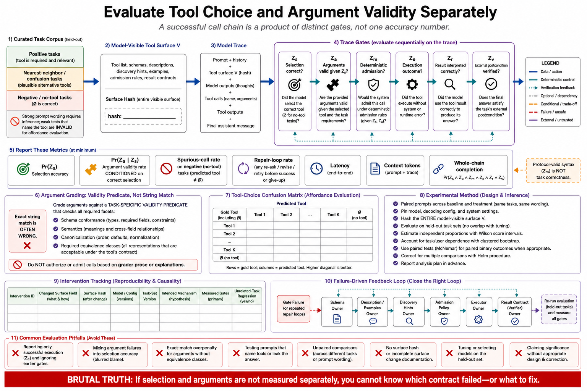

# Topic 13 — Tool-Choice Accuracy and Argument-Validity Evaluation



## 1. Scope, prerequisites, terminology, boundaries, exclusions, outcomes

**Scope.** Measuring the tool surface. Specifically: measuring $\Pr(Z_s)$ and $\Pr(Z_a\mid Z_s)$ **separately**, because an end-to-end accuracy number cannot tell you which one is failing, and they have opposite fixes.

**Prerequisites.** Chapter 1, Topic 12 (the statistics contract — binding here); Topic 1 (the chain rule); Topics 3–4 (the two factors' respective levers); Chapter 3, Topic 14 (ablation methodology).

**Terminology.** *Tool-choice accuracy* $\Pr(Z_s)$: the right tool was selected. *Argument validity* $\Pr(Z_a\mid Z_s)$: given the right tool, the arguments were correct. *Negative task*: one where no tool should be called. *Repair loop*: a call preceded by a failed call to the same tool.

**Boundaries.** Inside: the evaluation design for the tool surface. Outside: adversarial testing (Topic 14); end-to-end agent evaluation (Chapter 13).

**Exclusions.** No benchmark survey.

**Outcomes.** The reader can build an eval that localizes tool failures to a specific factor, with intervals, and that would survive methodological review.

## 2. Problem, bottleneck, objective, assumptions, constraints, success criteria

**Problem.** Teams measure end-to-end task success and then argue about causes. A task failed: was the wrong tool chosen, were the arguments malformed, did admission block it, did the tool break, did the model misread the result, or was the outcome simply not verified? Topic 1's chain has six factors and an aggregate number collapses all six.

**Bottleneck.** The two factors this chapter can actually fix — selection and arguments — have **opposite remedies**. Low $\Pr(Z_s)$ says the description or the surface shape is wrong (Topics 4, 6, 15). Low $\Pr(Z_a\mid Z_s)$ says the schema is wrong (Topic 3). Fixing the wrong one is worse than doing nothing: adding a richer description to fix an argument problem *costs context and does not help*, and the team concludes tool engineering "doesn't work."

**Objective.** An evaluation that reports the factors separately, with confidence intervals, on a task set that can detect over-triggering as well as under-triggering.

**Assumptions.** Tasks have a ground-truth correct tool (or correctly, *no tool*). The surface is versioned (Topic 1's hash).

**Constraints.** Real evals cost model calls. Ground-truth labeling costs human time. The two together bound how many arms you can run.

**Success criteria.** Every tool-surface change is accepted or rejected on measured evidence with a predeclared primary endpoint — not on a reviewer's aesthetic preference for the new description.

## 3. Intuition first, then formalization

### 3.1 Intuition: an accuracy number is a diagnosis-free zone

"Our agent is 72% accurate" tells you nothing you can act on. The number is the product of six factors and every intervention you might make targets one of them. **Measurement must localize or it cannot direct work.**

The decomposition is cheap to obtain — you already have the traces — and it turns tool engineering from taste into engineering. It is, concretely, the difference between "the descriptions feel unclear, let's rewrite them" and "$\Pr(Z_s)=0.94$ but $\Pr(Z_a\mid Z_s)=0.71$, so the descriptions are fine and the schema is the problem."

### 3.2 Formalization: the estimators

From Topic 1's chain, for a task set $\mathcal T$ with ground-truth tool $u^\star_\tau$ (possibly $\varnothing$):

$$
\widehat{\Pr}(Z_s)=\frac{1}{|\mathcal T^{+}|}\sum_{\tau\in\mathcal T^{+}}\mathbb 1\bigl[\hat u_\tau=u^\star_\tau\bigr],
\qquad
\widehat{\Pr}(Z_a\mid Z_s)=\frac{\sum_{\tau}\mathbb 1\bigl[\hat u_\tau=u^\star_\tau\ \wedge\ \hat x_\tau\in A^\star_\tau\bigr]}{\sum_{\tau}\mathbb 1\bigl[\hat u_\tau=u^\star_\tau\bigr]},
$$

where $\mathcal T^{+}$ are positive tasks. The conditioning in the second estimator is essential: **argument validity is measured only on calls where the tool was right.** An unconditional "argument error rate" mixes in every wrong-tool call and is uninterpretable.

Three further quantities, each catching a failure the two above miss:

$$
\text{spurious-call rate}=\frac{1}{|\mathcal T^{0}|}\sum_{\tau\in\mathcal T^{0}}\mathbb 1[\hat u_\tau\neq\varnothing]
\qquad (\mathcal T^{0}=\text{negative tasks}),
$$

$$
\text{repair-loop rate}=\frac{\#\{\text{calls preceded by a failed call to the same tool}\}}{\#\text{calls}},
$$

$$
\text{confusion matrix } M_{ij}=\Pr(\hat u=u_j\mid u^\star=u_i) \quad\text{— which tool is stealing calls from which.}
$$

**[derived — the estimators follow directly from Topic 1's chain; the metric set matches [WTA]'s instrumentation.]**

The **confusion matrix is the object that directs work**, and the scalar $\Pr(Z_s)$ is only its summary. A 6-point drop in selection accuracy spread evenly across the surface means the surface is too crowded (Topic 15). The same 6 points concentrated in one off-diagonal cell means two specific tools are confusable and need a boundary clause (Topic 4, §3.3). **These are different problems with different fixes, and the scalar cannot distinguish them.**

### 3.3 The statistics contract, applied

Chapter 1, Topic 12 binds this topic. Four requirements, each of which is routinely violated in tool-surface evaluation:

1. **Wilson intervals on every rate.** A point estimate from 50 tasks is not a measurement. Wald intervals are wrong near 0 and 1 — which is exactly where safety-relevant rates live.
2. **Task-clustered bootstrap** when tasks contribute multiple calls. Calls within a task are correlated; treating them as independent narrows intervals to fiction.
3. **Paired designs and McNemar** for surface-change contrasts. Same tasks, same model, only $\mathcal U_c$ varies (Chapter 3, Topic 14).
4. **Holm correction across arms.** A five-arm description study is five comparisons on one task set; uncorrected, one will look significant by construction.

And the reproducibility control specific to *this* chapter: **record the surface hash** (Topic 1, §6) with every result. A tool-surface eval whose surface version is unrecorded is not reproducible, and its numbers cannot be compared to next month's.

## 4. Architecture

```
   TASK SET
   ├── positive  𝒯⁺  — tool u* is correct           → Pr(Z_s), Pr(Z_a | Z_s)
   ├── neighbor       — a DIFFERENT tool is correct  → confusion matrix
   └── negative  𝒯⁰  — NO tool should be called      → spurious-call rate
              │
              ▼
   RUN under configuration c (model pinned, surface hash recorded)
              │
              ▼
   TRACE  τ̂  ── per call: proposed tool, arguments, admission, result, κ
              │
              ▼
   ┌─── GRADERS ────────────────────────────────────────────┐
   │  Z_s : selected tool == u*            (exact match)     │
   │  Z_a : arguments ∈ A*                 (schema + semantic)│
   │  repair loops, spurious calls, token cost, latency      │
   └────────────────────────────────────────────────────────┘
              │
              ▼
   REPORT: per-factor rates + Wilson intervals + confusion matrix
           (never a single scalar)
```

**$Z_a$ grading is the part that is harder than it looks.** Exact-match on arguments is too strict (many argument sets are equally valid: `limit=20` vs `limit=25`). The correct grader is a **validity predicate**, not an equality check: does the argument set satisfy the schema *and* the semantic preconditions *and* retrieve the intended resource? Write $A^\star_\tau$ as a predicate per task, not as a golden string — otherwise you will be tuning your surface against a grader that punishes correct behavior.

## 5. Grounding

- **The metric set.** [WTA] instruments exactly: "top-level accuracy," "total runtime of individual tool calls and tasks," "total number of tool calls," "total token consumption," and "tool errors." This chapter's decomposition adds $\Pr(Z_s)$ / $\Pr(Z_a\mid Z_s)$ / spurious-call rate on top, because [WTA]'s list is a *cost* instrument and does not localize *selection* failures.
- **Task construction.** Generate with agents: "quickly explore your tools and create dozens of prompt and response pairs"; ground in "real-world uses and… realistic data sources"; avoid "overly simplistic or superficial 'sandbox' environments"; strong tasks "might require multiple tool calls—potentially dozens" [WTA].
- **The weak-vs-strong task distinction, which is the methodological core.** Weak: "Search the payment logs for `purchase_complete` and `customer_id=9182`." Strong: "Customer ID 9182 reported that they were charged three times for a single purchase attempt. Find all relevant log entries and determine if any other customers were affected" [WTA]. **A weak task names the tool and the query; it measures string matching, not selection.** An eval built from weak tasks will report high $\Pr(Z_s)$ and tell you nothing.
- **Held-out sets.** [WTA] used "held-out test sets to ensure we did not overfit to our 'training' evaluations." A surface tuned against its own eval has memorized it.
- **Agent-driven improvement.** "You can even let agents analyze your results and improve your tools for you. Simply concatenate the transcripts from your evaluation agents and paste them into Claude Code" — and the disclosure that "most of the advice in this post came from repeatedly optimizing our internal tool implementations with Claude Code" [WTA]. **The tool surface is a legitimate target of automated optimization**, and this is the strongest available evidence that the loop works.
- **The interpretive caution, which this book weights heavily.** "What agents omit in their feedback and responses can often be more important than what they include. LLMs don't always say what they mean" [WTA]. Stated agent reasoning is a *lead*, not a cause — corroborated by measured unverbalized behavior [FSC §6.4.1.4]. **Confirm every hypothesis from agent self-report with a paired ablation.**
- **The reported results and their honest scope.** [WTA] shows held-out accuracy improvements for Claude-optimized Slack and Asana tools over human-written ones, and attributes a SWE-bench Verified SOTA result to tool-description refinement. **These are uncontrolled, vendor-reported, and published without effect sizes or intervals.** They establish that the lever moves. They do not size it, and this chapter will not pretend they do.

**Evidence gap.** No published evaluation reports $\Pr(Z_s)$ and $\Pr(Z_a\mid Z_s)$ separately with intervals for any agent tool surface. The decomposition is this book's, derived from the chain rule; the *practice* of it is not yet standard, which is precisely why the chapter argues for it.

## 6. Implementation

**Task schema — the negative and neighbor tasks are the ones that get skipped:**

```python
@dataclass
class ToolTask:
    prompt: str
    expected_tool: str | None          # None ⇒ NEGATIVE task: no tool should be called
    args_valid: Callable[[dict], bool] # a PREDICATE, not a golden string (§4)
    kind: Literal["positive", "neighbor", "negative"]

TASKS = [
    # STRONG positive: the tool must be INFERRED, not named. [WTA]
    ToolTask(prompt="Customer 9182 says they were charged three times for one purchase. "
                    "Find the relevant log entries and check whether other customers "
                    "were affected.",
             expected_tool="logs_search",
             args_valid=lambda a: "9182" in json.dumps(a) and a.get("since") is not None,
             kind="positive"),

    # NEIGHBOR: a sibling tool is correct — detects confusion.
    ToolTask(prompt="Is the checkout service throwing errors right now?",
             expected_tool="logs_tail", args_valid=lambda a: True, kind="neighbor"),

    # NEGATIVE: no tool. Detects over-triggering — the half most evals cannot see.
    ToolTask(prompt="What's our policy on refunds after 30 days?",
             expected_tool=None, args_valid=lambda a: False, kind="negative"),
]
```

**Grading, factored:**

```python
def grade(trace, task) -> dict:
    calls = trace.tool_calls
    if task.kind == "negative":
        return {"spurious": len(calls) > 0}

    first = next((c for c in calls if c.tool in TOOL_NAMES), None)
    z_s = first is not None and first.tool == task.expected_tool
    # Z_a is measured ONLY where Z_s holds. Unconditional argument error is uninterpretable.
    z_a = task.args_valid(first.args) if z_s else None
    return {
        "z_s": z_s,
        "z_a": z_a,                                   # None ⇒ excluded from the denominator
        "chosen": first.tool if first else None,      # for the confusion matrix
        "repair_loop": had_repair_loop(calls),
        "tokens": trace.total_tokens,
    }
```

**Reporting — intervals, never bare points:**

```python
def report(results, n_repeats) -> dict:
    pos = [r for r in results if r["z_s"] is not None]
    z_s_hits = sum(r["z_s"] for r in pos)
    z_a_pool = [r for r in pos if r["z_a"] is not None]

    return {
        "surface_hash": SURFACE_HASH,                 # reproducibility (Topic 1, §6)
        "model": PINNED_MODEL,
        "Pr(Z_s)":       wilson(z_s_hits, len(pos)),                        # (est, lo, hi)
        "Pr(Z_a | Z_s)": wilson(sum(r["z_a"] for r in z_a_pool), len(z_a_pool)),
        "spurious_rate": wilson(*negatives(results)),
        "confusion":     confusion_matrix(results),   # the object that directs work
        "repair_loops":  wilson(*repairs(results)),
        "tokens_p50_p95": quantiles([r["tokens"] for r in results]),
        # Task-clustered bootstrap for any CONTRAST between surfaces (Ch.1, T12).
    }
```

## 7. Trade-offs

| Choice | Buys | Costs |
|---|---|---|
| Factored metrics | **Localized diagnosis** — the whole point | Ground-truth labels per task |
| Negative tasks | Detects over-triggering (half the failure) | More tasks to build; they feel "unproductive" |
| Strong (inferential) tasks [WTA] | Measures affordance | Harder to author and to grade |
| Weak tasks | Cheap | **Measure string matching. Actively misleading** |
| Agent-generated tasks [WTA] | Scale; dozens quickly | Distribution reflects the agent's priors, not users' |
| Held-out sets [WTA] | Prevents overfitting the surface | Fewer tasks for tuning |
| Many repeats $N_R$ | Tighter intervals | Linear cost |
| Agent self-report analysis [WTA] | Fast hypotheses | **"LLMs don't always say what they mean"** — leads only |

**The cost that stops teams, and the answer to it.** A factored eval with negatives, neighbors, held-out sets, and $N_R\ge5$ repeats is genuinely more expensive than "run 30 tasks and look at accuracy." The minimum viable version that still supports a claim: **a paired design, the same tasks before and after, $\Pr(Z_s)$ and $\Pr(Z_a\mid Z_s)$ reported with Wilson intervals, and the result labeled exploratory** (Chapter 3, Topic 14 §8's minimum line). That is affordable and honest. What is *not* acceptable is a single accuracy scalar presented as evidence that a description change helped.

## 8. Experiments

**The standing evaluation** — run on every surface change, gated by the surface hash:

| Arm | Change | Predicted signature |
|---|---|---|
| Baseline | Current surface | — |
| Description rewrite (Topic 4) | Trigger + boundary clauses | $\Pr(Z_s)\uparrow$; **tokens $\uparrow$** |
| Schema tightening (Topic 3) | Enums, defaults, fewer params | $\Pr(Z_a\mid Z_s)\uparrow$; repair loops $\downarrow$ |
| Consolidation (Topic 4) | Three tools → one | $\Pr(Z_s)\uparrow$; tool count $\downarrow$ |
| Tool addition (Topic 15) | +1 tool | **$\Pr(Z_s)$ on *unrelated* tasks — the saturation test** |

**The signature table is the diagnostic instrument.** If a description rewrite moves $\Pr(Z_a\mid Z_s)$ and not $\Pr(Z_s)$, your causal story is wrong and you should find out why before shipping it. Predicted signatures that fail to appear are information.

**Statistics.** Paired, same tasks; **McNemar** for each binary contrast; **task-clustered bootstrap** for intervals; **Holm** across arms; predeclare the primary endpoint (Chapter 1, Topic 12). Predeclaring matters more here than almost anywhere else in the book, because a surface change moves a dozen metrics and the temptation to select the one that improved is overwhelming.

**Reproducibility controls.** Pin the model ID; record the surface hash; fix decoding parameters; hold out a test set [WTA]; report $N_R$.

**The agent-driven loop, used correctly** [WTA]: concatenate eval transcripts, have an agent propose surface improvements, then **measure the proposals against the held-out set**. The agent is a *hypothesis generator*, and the paired ablation is the *test*. Skipping the test — shipping the agent's suggested descriptions because they read well — is how a surface overfits to its own eval and regresses in production.

## 9. Failure modes, edge cases, hazards, mitigations, open limitations

- **The scalar accuracy report.** Six factors collapsed into one number; no action follows. Mitigation: factor it (§3.2).
- **No negative tasks.** Over-triggering is invisible; the eval reports high accuracy on a surface that calls tools constantly and wrongly. Mitigation: $\mathcal T^0$.
- **Weak tasks.** The prompt names the tool. Measures string matching [WTA]. Mitigation: strong, inferential tasks.
- **Unconditional argument-error rate.** Mixes wrong-tool calls into the denominator; uninterpretable. Mitigation: condition on $Z_s$.
- **Golden-string argument grading.** Punishes correct-but-different arguments; you then "fix" a surface that was fine. Mitigation: validity predicates (§4).
- **Uncorrected multiplicity.** Five arms, one significant, ship it. Mitigation: Holm.
- **Overfitting the surface to the eval.** Especially acute with agent-driven optimization. Mitigation: held-out sets [WTA].
- **Unrecorded surface version.** Results not comparable across time; the eval silently measures a different system than the one you deployed. Mitigation: surface hash in every result.
- **Trusting agent self-report.** "LLMs don't always say what they mean" [WTA]; unverbalized behavior is measured [FSC §6.4.1.4]. Mitigation: self-report generates hypotheses; paired ablations test them.
- **Edge case — multi-tool tasks.** With dozens of calls per task [WTA], "the right tool" is a *sequence*. $\Pr(Z_s)$ becomes per-step and calls within a task are correlated — which is precisely why the bootstrap must be **task-clustered**, not call-level.
- **Open limitation.** No published baseline reports these factored metrics, so you have **nothing external to compare against.** Your numbers are only interpretable *relative to your own baseline*, which makes the paired design not merely good practice but the only available method.

## 10. Verified observations, decision rules, production implications, connections

**Verified observations.**
1. The documented instrumentation set is accuracy, runtime, tool-call count, tokens, and tool errors [WTA].
2. Strong tasks require inferring the tool; weak tasks name it and measure nothing [WTA].
3. Held-out test sets are necessary to avoid overfitting the surface [WTA].
4. Agents can analyze eval transcripts and propose surface improvements — and most of [WTA]'s own advice came from that loop.
5. Agent self-report is an unreliable causal window [WTA; FSC §6.4.1.4].
6. **No published work reports $\Pr(Z_s)$ and $\Pr(Z_a\mid Z_s)$ separately with intervals** — the decomposition is this book's.

**Decision rules.**
- **Never report a single accuracy number for a tool surface.** It is a diagnosis-free zone.
- **No negative tasks ⇒ no eval.** You are measuring half the failure.
- **If the prompt names the tool, the task is worthless** for selection measurement.
- **Condition $Z_a$ on $Z_s$.** Always.
- **Agent-proposed improvements must clear a held-out paired test** before shipping.
- **Record the surface hash or the result is not reproducible.**

**Production implications.**
1. Build the factored eval before the next description rewrite; otherwise you cannot tell whether the rewrite helped.
2. Put the **confusion matrix**, not the scalar, in front of whoever owns the surface. It is the object that says what to do.
3. Add repair-loop rate to production telemetry — it is the schema-defect detector that runs for free on live traffic.
4. Adopt the agent-driven improvement loop [WTA], with the held-out test as the non-negotiable gate.

**Connections.** This topic measures what Topics 3–4 build and what Topic 6 constrains. Topic 14 attacks the same surface adversarially — this topic asks "does it work," Topic 14 asks "can it be broken." **Topic 15's central claim is only testable with this topic's instrument**, which is why it comes last. Chapter 3, Topic 14 supplies the ablation protocol; Chapter 1, Topic 12 supplies the statistics; Chapter 13 embeds all of it in agent evaluation science.

## Sources

[WTA] Anthropic, "Writing effective tools for agents — with agents" — the evaluation metric set (accuracy, runtime, tool-call count, token consumption, tool errors); agent-generated evaluation tasks ("dozens of prompt and response pairs"); realistic data sources; "avoid overly simplistic or superficial 'sandbox' environments"; strong tasks requiring "multiple tool calls—potentially dozens"; the strong-vs-weak task examples (customer 9182 charged three times vs. "search the payment logs for `purchase_complete`"); simple agentic `while`-loop harnesses; reasoning-and-feedback blocks; "held-out test sets to ensure we did not overfit to our 'training' evaluations"; agent-driven tool improvement ("concatenate the transcripts… paste them into Claude Code"; "most of the advice in this post came from repeatedly optimizing our internal tool implementations with Claude Code"); Slack and Asana held-out accuracy comparisons; SWE-bench Verified attribution; "What agents omit in their feedback and responses can often be more important than what they include. LLMs don't always say what they mean" — https://www.anthropic.com/engineering/writing-tools-for-agents
[FSC] Claude Fable 5 & Mythos 5 System Card §6.4.1.4 — unverbalized behavior; stated reasoning as an unreliable window onto the cause — `Knowledge_source/`
[CAH] Code as Agent Harness, arXiv:2605.18747 (`Knowledge_source/2605.18747v1.pdf`) §3.5.1 — deep telemetry linking model decisions, harness actions, environment states, and outcomes; the trace substrate this evaluation consumes
